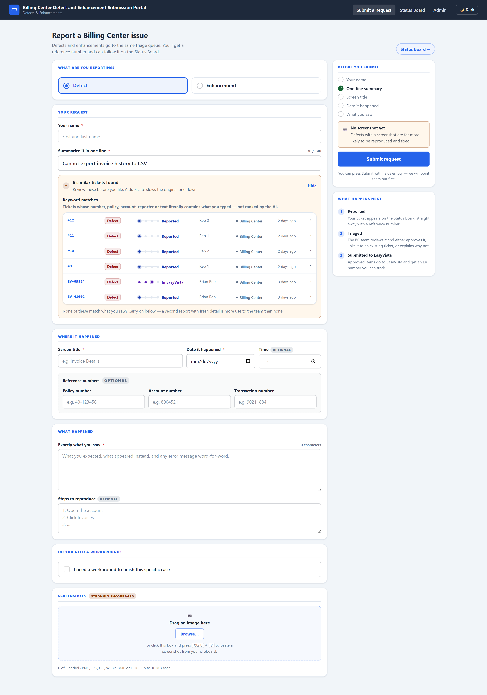
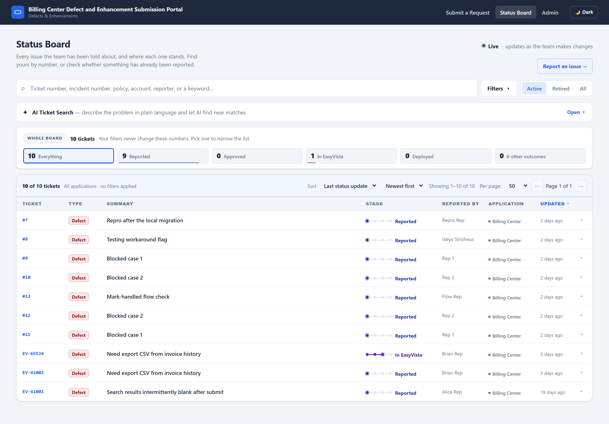
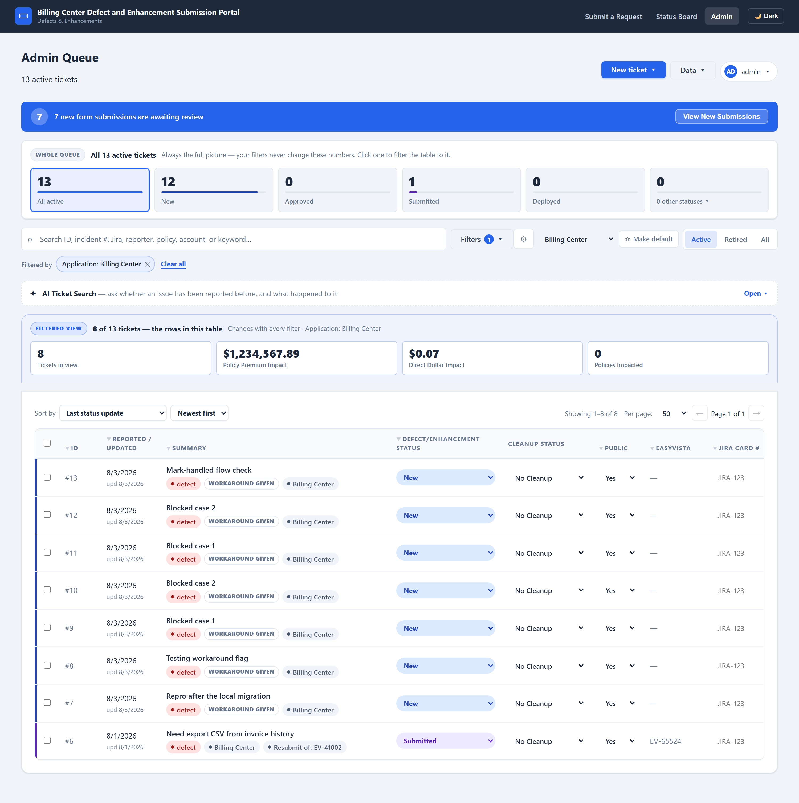
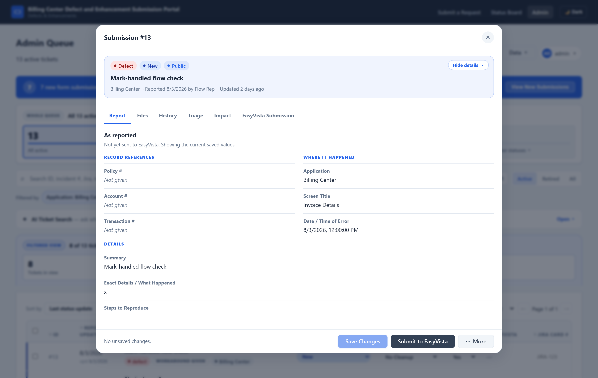
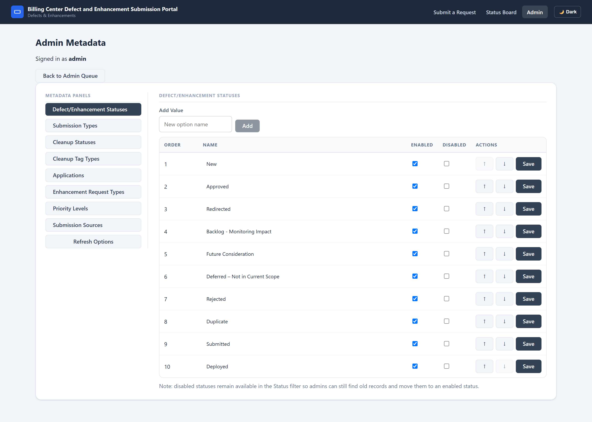
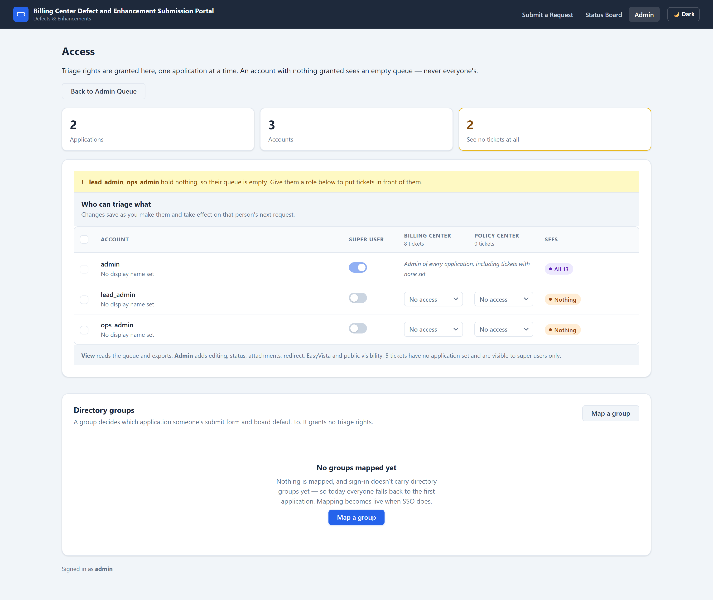

# BC Defects & Enhancements Portal

A submission and triage portal for Billing Center defects and enhancement
requests. Field representatives file reports; Product Owners triage them; approved
items are escalated to Tier 2 GTS in EasyVista. Everything is visible to the
person who reported it on a live public status board.

**Status: working prototype.** It runs, it holds real data, and it is the
reference for a rebuild on the organisation's own stack — not the thing that
ships long-term.

---

## Two documents, two jobs

| Document | For | Contains |
|---|---|---|
| **This README** | Anyone opening the repo | What it does, all functionality, architecture, how to run it, **how it is deployed**, API, data model, config |
| **[Developer Rebuild Handoff](docs/handoff/README.md)** | The team recreating the app | The *reasoning* behind every decision, 41 annotated screenshots, known traps, and a rebuild acceptance checklist |

If you are rebuilding this, read both — this one for *what and how*, the handoff
for *why*. The handoff document also carries the screenshots of every screen and
state.

---

## Contents

- [Quick start](#quick-start)
- [The problem](#the-problem)
- [What it does](#what-it-does)
- [Application pages](#application-pages)
- [Core functionality](#core-functionality)
- [Architecture](#architecture)
- [Tech stack](#tech-stack)
- [Project structure](#project-structure)
- [Data model](#data-model)
- [API reference](#api-reference)
- [Security model](#security-model)
- [Real-time updates](#real-time-updates)
- [AI semantic search](#ai-semantic-search)
- [EasyVista integration](#easyvista-integration)
- [**Deployment**](#deployment)
- [Configuration reference](#configuration-reference)
- [Local development](#local-development)
- [Known gaps](#known-gaps)

---

## Quick start

```bash
# Server
cd server
npm install
cp .env.example .env          # edit it — see Configuration reference
npm run migrate               # create tables + seed lookup data
npm run seed:admin            # create the admin account(s)
npm run seed:sample           # optional sample submissions
npm run dev                   # http://localhost:4000

# Client (separate terminal)
cd client
npm install
npm run dev                   # http://localhost:5173
```

> ### ⚠️ Check `server/.env` before you run anything
>
> The database is selected by `DB_PROVIDER` / `DB_MODE`. With
> `DB_PROVIDER=postgres` you are connected to the **live Supabase production
> database**, and several maintenance scripts write to whatever the environment
> points at.
>
> To force a sandboxed local run without editing the file — `dotenv` does not
> override real environment variables, so these win:
>
> ```bash
> DB_MODE=local DB_PROVIDER=sqljs DATABASE_URL= npm run dev
> ```
>
> `[keepAlive] Supabase heartbeat OK` in the log does **not** mean you are on
> Supabase data. That ping runs regardless of provider.

---

## The problem

The Product Owners team fields a constant stream of Billing Center defect reports
and enhancement requests from field reps. They triage, prioritise, and decide
what gets escalated to Tier 2 GTS, who work the tickets in EasyVista.

Before this portal there was no system of record:

- Defect reports lived in email threads, chat and spreadsheets — no audit trail,
  and duplicates were near-impossible to spot.
- Enhancement requests had no structured intake, so details arrived incomplete.
- Product Owners had no single queue to triage from.
- Historical records sat in Excel files that could not be searched.
- Escalating to EasyVista meant manual copy-paste.
- **Reps had no visibility.** They could not see whether an issue was already
  known, or what happened to something they filed — so they filed it again.
  Duplicate intake was the largest single source of wasted triage effort.
- Nobody knew when new work arrived without checking.

**Most non-obvious decisions in this codebase trace back to two goals: reduce
duplicate intake, and make ticket state legible to the person who reported it.**
When a design choice looks fussy, that is usually why.

---

## What it does

### For field representatives

- File a defect or enhancement through a guided form with a live readiness
  checklist.
- **Check whether the issue was already reported before filing** — an AI search
  over public tickets, run against the one-line summary they just typed.
- Paste a screenshot straight from the clipboard.
- Flag that they are blocked and need a workaround for a live case.
- Follow every reported issue on a public status board that updates live, and
  filter it down to their own reports.

### For Product Owners (admins)

- Work a filterable, sortable queue scoped to the applications they administer.
- Triage in a six-tab detail modal: status, priority, duplicates, decision notes,
  impact figures, attachments, full history.
- **AI semantic search** over the queue — describe an issue in plain language and
  see whether it has been reported and what happened to it.
- Hand a ticket to another application's queue, with an internal note and a
  custody ledger.
- Escalate to EasyVista, with a preview of exactly what will be transmitted.
- Re-submit a changed ticket, keeping a linkage chain to the original.
- Import historical records from Excel with column mapping and a dry run; export
  the current filtered view.
- Manage every dropdown in the app from a metadata page.
- Personalise the queue — which columns and filters appear, column order, and a
  pinned default queue — saved per admin, server-side.
- Bulk-change public visibility or retire across a whole filtered set.
- Control public visibility per ticket.
- See live notifications when new submissions arrive, and who else has a ticket
  open.

### For super users

- Grant and revoke per-application triage rights for everyone, individually or
  in bulk, from an Access page.

---

## Application pages

Six routes. Client-side gates are signposting only — every endpoint re-checks
server-side.

| Route | Page | Access |
|---|---|---|
| `/` | Submit a Request | Public |
| `/public` | Status Board | Public |
| `/admin/login` | Admin Sign In | Public |
| `/admin` | Admin Queue | Admin session |
| `/admin/metadata` | Metadata Manager | Admin session |
| `/admin/access` | Access Management | Admin session **+ super user** |

### `/` — Submit a Request


Guided form with a "Before you submit" rail that ticks requirements off as the
rep types and owns the primary action. Required fields differ by type — a defect
needs screen title, date and what happened; an enhancement needs its request and
a desired completion date.

Validation appears only **after** a submit attempt, and focus moves to the first
field that needs attention.

The pre-submit duplicate check is the highest-value feature on the page:



### `/public` — Status Board



Every issue the team has been told about, and where each one stands. Status is
rendered as **position on a four-stop track** — Reported → Approved → In
EasyVista → Deployed — because a reporter reads "where is this" off a track more
easily than by decoding a badge.

Two count scopes are kept deliberately distinct: the tiles describe the **whole
board** and say so in words; the band above the list describes **the rows below**
and carries its own denominator.

### `/admin` — Admin Queue



The main working surface: whole-queue scope strip, command bar, filter chips,
filtered-view band with impact totals, and an inline-editable, multi-select table.

### The detail modal



Six tabs — Report, Files, History, Triage, Impact, EasyVista Submission. Identity,
alerts and the action bar sit **outside** the tab strip, so nothing needing
attention can hide behind an inactive tab.

### `/admin/metadata` and `/admin/access`

| Metadata Manager | Access Management |
|---|---|
|  |  |

**All 41 screenshots**, including every modal, both themes and 390px, are in
[`docs/handoff/screenshots/`](docs/handoff/screenshots/) and annotated in the
[handoff document](docs/handoff/README.md#6-screen-by-screen).

---

## Core functionality

### Vocabulary

These words are not interchangeable. Getting them wrong produces a subtly wrong
system.

| Term | Means |
|---|---|
| **Submission** | One report. A row in `submissions`. Also "ticket". |
| **Type** | `defect` or `enhancement`. Drives required fields and the EasyVista payload. |
| **Application** | A product queue — `Billing Center`, `Policy Center`. Owns triage rights. |
| **Cleanup task** | Internal work item (`is_cleanup`). Tagged `defect`, `enhancement`, or `cleanup_only`. A `cleanup_only` task has **no** defect/enhancement type yet. |
| **Retire** | Soft archive. **Nothing in this app hard-deletes a submission.** |
| **Public** | Appears on the status board and in public AI search. |
| **Workaround request** | A rep is blocked on a live case now. Two columns: `needs_workaround` (the ask), `workaround_provided` (the team closing it). |
| **Redirect** | Hand a ticket to another application's queue. The ticket **moves**. |
| **Resubmission** | Re-send to EasyVista after changes. Creates a **new** submission and a **new** EasyVista ticket; the original is untouched. |

**Redirect moves, resubmission forks.** A redirect changes `application_id` on the
existing row and writes a ledger entry. A resubmission inserts a new row.
Conflating them yields either two tickets for one problem, or one ticket two
teams each think the other owns.

### Statuses

Eleven, seeded but **editable at runtime** — so nothing may hardcode the full
list:

`New` · `Approved` · `Redirected` · `Backlog - Monitoring Impact` ·
`Future Consideration` · `Deferred – Not in Current Scope` · `Rejected` ·
`Duplicate` · `Submitted` · `Deployed` · `Retired`

The public board's four-stop position is driven by the **current status, never the
furthest timestamp**. A redirect resets a ticket to `New` for the receiving team
while the sending team's `Approved` timestamp stays in history — a
"furthest-timestamp-wins" reading credited the previous team's progress to the
new team.

A **retired status must not hide a live ticket**: when every selectable status is
chosen (the default and reset state), the status whitelist is dropped entirely
rather than applied.

### Creation paths

| Source | Who | Public by default? |
|---|---|---|
| `rep_form` | Rep, via `/` | Yes |
| `admin_manual` | Admin, in-queue create | Yes |
| `admin_backdated` | Admin, for pre-portal reports | Yes |
| `admin_cleanup` | Admin, internal cleanup task | No, if `cleanup_only` |
| `admin_excel_import` | Bulk historical load | Yes, unless cleanup-only |
| `admin_easyvista_resubmission` | The fork of a resubmit | Inherits |

**Public by default** is the rule; internal cleanup-only tasks stay private. An
explicit choice from the caller always wins.

### Per-admin view preferences

Each admin chooses which table columns show, in what order, which filters show,
and which application queue they land on. Saved **server-side** (`columns_json`,
`filters_json`, `pinned_application`) so it follows them across devices;
localStorage is only a cache to avoid a flash before the server answers.

The server allow-lists column and filter keys and **drops unknown ones**, so
client/server drift fails safe.

A **pin is a decision, not a memory of the last selection** — switching scope to
glance at another team's queue must not silently rewrite where you land tomorrow.

Hidden filters have their **values reset**, so a filter you cannot see can never
silently constrain the table.

### Bulk actions

Selecting rows raises a bar pinned to the viewport bottom. The scope is stated in
words because it is the dangerous part: the master checkbox acts on the **entire
filtered set across every page**.

Three guards: changing filters clears the selection; the confirmed id set is
snapshotted at click time; and at apply time it is re-intersected with the
current rows. Server-side, the bulk loop reuses the per-row update path so
history logging, socket emits and embedding refresh match single-ticket edits
exactly.

### Excel import and export

**Import** is two-phase — `analyze` parses the workbook, proposes column mappings
and reports valid/invalid counts **without writing anything**; the admin confirms,
then the insert runs. Every run is recorded in `excel_import_runs` with row
counts and errors.

**Export** reads through the **same access scope as the queue**, so what an admin
can download is exactly what they can see on screen.

### Attachments

Images only — PNG, JPG, GIF, WEBP, BMP, HEIC, 10 MB each, 3 per submission from
the rep form. Extension **and** MIME type are both checked, deliberately: it
stops arbitrary HTML/SVG being stored and later served same-origin from
`/uploads`.

Storage has two modes (`server/src/helpers/storage.js`):

- **Supabase Storage** when `SUPABASE_URL` + `SUPABASE_SERVICE_ROLE_KEY` +
  bucket are all set. Files are uploaded to a **public** bucket and the row stores
  the public URL.
- **Local filesystem** (`server/uploads/<submissionId>/`) otherwise.

See [Deployment](#deployment) — this choice has real consequences on Render.

---

## Architecture

```
┌──────────────────────┐   REST via Vercel   ┌────────────────────────┐
│   React SPA          │────── rewrite ─────►│   Express API          │
│   Vite + React 19    │                     │   Node + Express 5     │
│   Vercel             │◄─ WebSocket ────────►│   Render               │
└──────────────────────┘  (DIRECT, bypasses  └───────────┬────────────┘
                           the Vercel proxy)             │
                  ┌──────────────────┬───────────────────┴────────┐
          ┌───────▼────────┐ ┌───────▼─────────┐ ┌───────────────▼──────┐
          │ Supabase       │ │ Supabase        │ │  EasyVista REST      │
          │ PostgreSQL     │ │ Storage         │ │  (external, gated)   │
          │ (or SQLite     │ │ (or local disk) │ └──────────────────────┘
          │  locally)      │ └─────────────────┘
          └────────────────┘        ┌──────────────────────────────┐
                                    │ AI: Claude / OpenAI summary  │
                                    │ + embeddings (local/OpenAI)  │
                                    └──────────────────────────────┘
```

> The host names in this diagram are the **prototype's** hosting. The internal
> deployment will be on company servers and a company database — see
> [Deployment](#deployment). The application structure above does not change.

**Why the WebSocket bypasses the Vercel proxy.** Vercel rewrites cannot carry
WebSocket upgrades, so a same-origin socket degrades to perpetual HTTP
long-polling — billing a flood of Vercel requests. Connecting directly to Render
gives a real WebSocket: one persistent connection, ~zero ongoing requests.

That creates an auth problem, because the session cookie is not sent
cross-origin. The client therefore fetches a **short-lived HMAC-signed token**
from a same-origin, session-authenticated endpoint and passes it in the socket
handshake. This whole mechanism exists for one hosting constraint — if your
platform carries WebSocket upgrades end to end, delete it and use the session.

---

## Tech stack

| Layer | Technology | Version |
|---|---|---|
| Frontend | React | 19.2 |
| Routing | React Router | 7.13 |
| Build | Vite | 5.4 |
| UI | **BitsizeUI (custom)** + vanilla CSS | — |
| Backend | Express | 5.2 |
| ORM | Sequelize | 6.37 |
| Database | PostgreSQL (`pg` 8.16) / SQLite (`sql.js` 1.13) | — |
| Real-time | Socket.IO | 4.8 |
| Auth | `express-session` + `bcrypt` | 1.19 / 6.0 |
| Uploads | `multer` | 2.0 |
| Excel | `xlsx` (SheetJS) | 0.18 |
| AI summary | `@anthropic-ai/sdk` **or** OpenAI via `fetch` | 0.112 |
| AI embeddings | `@huggingface/transformers` (in-process) / OpenAI / Voyage | 4.2 |
| Client host | Vercel | — |
| Server host | Render | — |

**No third-party UI framework.** No Material UI, no Tailwind, no Bootstrap. The
entire UI is a custom design system in
`client/src/components/bite-size/BitsizeUI.jsx` (243 lines) plus vanilla CSS with
a `bs-` prefix. Custom dialogs and notices throughout — no native `alert()` or
`confirm()`.

---

## Project structure

```
client/src/
  pages/            6 route components
  components/
    admin/          queue, command bar, modals, detail/ (13 sub-components)
    public/         status board, submit form pieces
    bite-size/      BitsizeUI design system + AppShell
    common/         AiSearchPanel, PaginationControls
  hooks/            13 hooks, one per feature area
  lib/              api.js (shared request helper), socket.js
  utils/            filter/sort/format helpers shared admin↔public
  constants/        column, filter and sort registries

server/src/
  routes/           13 thin route modules; validation at the boundary
  services/         8 services; all business logic
  helpers/          mappers (public allow-list), easyVistaPayload, lookups, storage
  middleware/       cors, session, csrf, upload, rateLimit, errorHandler
  constants.js      role ladder, allow-lists, sentinels
server/db/
  models/index.js   whole schema + migration logic
  sequelize.js      provider selection
server/scripts/     migrate, backfills, grantSuperUser
docs/handoff/       rebuild handoff + 41 screenshots
```

---

## Data model

20 tables. `submissions` is the aggregate root; everything else is lookups,
ledgers, or access control.

### `submissions` — 56 columns

| Group | Columns |
|---|---|
| Identity | `id`, `created_at`, `updated_at`, `created_via_id` |
| Reporter | `created_by`, `created_by_email`, **`reporter_user_id`** |
| Classification | `type_id`, `application_id`, `status_id`, `priority_level_id`, `enhancement_request_type_id` |
| The report | `summary_of_issue`, `what_happened_exact_details`, `steps_to_reproduce`, `request`, `screen_title`, `date_time_of_error` |
| References | `policy_num`, `account_num`, `transaction_num`, `jira_number` |
| Triage | `reviewer`, `decision_notes`, `duplicate_reference`, `duplicate_of`, `fingerprint` |
| Impact | `impact_details`, `impact_notes`, `policy_premium_impact`, `direct_dollar_impact`, `policies_affected_count`, `occurrence_*` |
| Workaround | `needs_workaround`, `workaround_provided` |
| Cleanup | `is_cleanup`, `cleanup_status_id`, `cleanup_tag_type_id` |
| EasyVista | `easyvista_ticket_id`, `easyvista_submitted_by`, `easyvista_application_id` |
| Resubmission | `is_resubmission`, `resubmission_of_*`, `has_resubmission`, `latest_resubmission_*` |
| Flags | `is_retired`, `is_public`, `logged_defect` |
| Release | `release_number`, `release_notes`, `desired_completion_date` |

**Lookups are FK-only.** The legacy text columns were dropped; rows store only
`*_id` and names are hydrated at read time by `helpers/lookups.js`. Anything
reading `row.status` directly gets `undefined` — this caused a real bug where
every hand-off was recorded as `New`.

**`reporter_user_id`, not `created_by`, answers "is this mine".** A rename or a
typo would silently unlink someone's whole history, and two people share a name.

**`easyvista_application_id` is a snapshot** taken at send time, not derived, so a
later redirect cannot rewrite what was transmitted.

### Lookup tables

All share `{ id, name, sort_order, is_active }`. Runtime-editable; deactivated,
never deleted.

`submission_types` · `defect_enhancement_statuses` · `cleanup_statuses` ·
`cleanup_tag_types` · `applications` · `enhancement_request_types` ·
`priority_levels` · `submission_sources` · `occurrence_timeframes`

### Ledgers, children and access

| Table | Purpose |
|---|---|
| `submission_status_events` | Every status change. Append-only. |
| `submission_routings` | Custody chain — one row per hand-off. `from_application_id` null marks the original filing. `status_at_handoff` preserves what it was when it left. `note` is immutable and **internal**. |
| `attachments` | `filename`, `mime_type`, `file_path` (local path or Supabase public URL), `uploaded_by_role` |
| `excel_import_runs` | Import audit trail |
| `submission_embeddings` | One row per `(submission_id, scope)`; vector stored as JSON in TEXT |
| `users` | `username`, `password_hash`, `role`, `is_super_user`, `external_id` (the IdP's stable key), `display_name`, `email` |
| `user_application_roles` | **A grant.** `(user_id, application_id, role)`, audited by `granted_by`. **No row is no access.** |
| `application_ad_groups` | Maps an AD group to an application. Sets a default. **Grants nothing.** |
| `admin_view_preferences` | Per-admin columns, filters, pinned queue |

Full column-by-column detail and the reasons behind each shape:
[handoff §15](docs/handoff/README.md#15-data-model).

---

## API reference

All under `/api`. Admin routes require a session; `/api/admin/*` mutations also
require the CSRF header.

### Auth, identity, health

| Method | Path | Notes |
|---|---|---|
| `POST` | `/api/auth/login` | |
| `POST` | `/api/auth/logout` | |
| `GET` | `/api/auth/me` | |
| `GET` | `/api/viewer` | **The identity envelope.** Always 200; anonymous shape when unauthenticated. |
| `GET` | `/api/realtime/token` | Short-lived socket token. 401 for non-admins. |
| `GET` | `/api/health`, `/health` | |

### Metadata

| Method | Path |
|---|---|
| `GET` | `/api/meta/options` (public) |
| `GET` | `/api/admin/meta/options` |
| `POST` | `/api/admin/meta/:category` |
| `PUT` | `/api/admin/meta/:category/:id` |
| `POST` | `/api/admin/meta/:category/reorder` |

### Submissions — public / rep

| Method | Path | Notes |
|---|---|---|
| `POST` | `/api/submissions` | Rep filing. Reporter resolved server-side. |
| `GET` | `/api/public/submissions` | Field-allow-listed, `is_public` gated |
| `GET` | `/api/public/submissions/:id` | Same |

### Submissions — admin

| Method | Path | Notes |
|---|---|---|
| `GET` | `/api/admin/submissions` | Access-scoped |
| `GET` | `/api/admin/submissions/:id` | Out of scope → **404, not 403** |
| `POST` | `/api/admin/submissions` | |
| `PUT` | `/api/admin/submissions/:id` | Optimistic concurrency → 409 |
| `POST` | `/api/admin/submissions/bulk-visibility` | |
| `POST` | `/api/admin/submissions/bulk-retire` | |
| `POST` | `/api/admin/submissions/:id/redirect` | Moves the ticket |
| `POST` | `/api/admin/submissions/:id/easyvista-preview` | Dry run; writes nothing |
| `POST` | `/api/admin/submissions/:id/submit-easyvista` | |
| `POST` | `/api/admin/submissions/ai-search` | |
| `GET` | `/api/admin/submissions/export-fields` | |
| `GET` | `/api/admin/submissions/export-xlsx` | Same scope as the queue |
| `POST` | `/api/admin/submissions/import-xlsx/analyze` | |
| `POST` | `/api/admin/submissions/import-xlsx` | |
| `GET` | `/api/admin/submissions/import-xlsx/history` | |

### Attachments, access, preferences, AI

| Method | Path | Notes |
|---|---|---|
| `DELETE` | `/api/admin/attachments/:id` | Authorised against the **parent ticket**, not the attachment id |
| `GET` | `/api/admin/access` | Super user |
| `PUT` | `/api/admin/access/users/:id/grants` | Super user; whole set replaced |
| `POST` | `/api/admin/access/bulk` | Super user; all-or-nothing |
| `PUT` | `/api/admin/access/users/:id/super-user` | Super user; refuses to remove the last one |
| `POST` / `DELETE` | `/api/admin/access/ad-groups[/:id]` | Super user |
| `GET` / `PUT` / `DELETE` | `/api/admin/view-preferences` | `PUT` replaces the whole row |
| `GET` | `/api/ai-search/status`, `/api/admin/ai-search/status` | `{ enabled, summaryEnabled }` |
| `POST` | `/api/ai-search` | Public; **rate-limited per IP** |

### Dev only — never in production

`/api/dev/impersonate*` — triple-gated; the route is **not registered** unless
`AUTH_MODE=local` **and** `NODE_ENV != production` **and**
`DEV_IMPERSONATION=true`, so it 404s rather than existing-and-refusing.

### Error contract

4xx may surface their message; **5xx stay generic in production**, so DB and
internal details never reach a client.

---

## Security model

### Authentication

Session cookie `bc_sid`, httpOnly, 8-hour `maxAge`, `bcrypt`-hashed passwords.

In production the cookie is `secure: true` and `sameSite: none` (overridable via
`SESSION_COOKIE_SAME_SITE` / `_SECURE` / `_DOMAIN`).

**The server refuses to start in production** if `SESSION_SECRET` is the
development default or shorter than 32 characters.

### Authorisation — per application, fail closed

Triage rights come from `user_application_roles` and **nowhere else**. The role
ladder is ordered weakest first, and the order is load-bearing: a role confers
everything before it.

- **`viewer`** — read the queue and its tickets; export. Changes nothing.
- **`admin`** — everything in that application.

**No row is no access.** An admin with no grants sees **no tickets**, never all
of them — enforced by construction, not by a conditional: no grants yields
`{ application_id: [] }`, which renders as SQL `IN (NULL)` and matches nothing. A
super user yields `{}`, the single bypass.

Access scoping runs **first and unconditionally**; no query parameter can widen
what a caller may see.

**Read scope is wider than write scope.** A team that redirects a ticket keeps
reading it (via the routing ledger) and loses the ability to change it
immediately (write asks only about the ticket's *current* application).

**AD groups grant nothing.** An AD group says which application a person *works
in* — it prefills their form and scopes their board. Triage is granted
deliberately, by a super user, one application at a time, so nobody acquires the
ability to change other teams' tickets by being added to a distribution group.

`ensureSuperUser` re-reads `is_super_user` from the users row rather than the
session, so a demotion takes effect on the demoted person's very next request.

### Public data boundary

Public responses are field-allow-listed through one function,
`mapPublicSubmission`. Never exposed publicly: `created_by_email`, `reviewer`,
`decision_notes`, `impact_details`, `impact_notes`, the dollar-impact figures,
`fingerprint`, `reporter_user_id`, `easyvista_submitted_by`, and the routing
`note`.

The allow-list must hold in **five** places — public REST, **socket broadcasts**
to unauthenticated watchers, **public AI summary input**, **the text embedded for
public semantic search**, and **the literal keyword/identifier lookup doc**. The
last three are the ones a rebuild will most easily miss: if the *embedding* is
built from internal text, a public search can surface a ticket *because of* a
decision note.

### CSRF

Double-submit cookie, no external dependency. A non-httpOnly `bc_csrf` cookie is
issued to every client; state-changing requests to `/api/admin/*` must echo it in
`X-CSRF-Token`. The client does this centrally in `lib/api.js`'s shared
`request()` helper — keep it centralised.

### Other

- `helmet` sets security headers. CSP is off on the API (the SPA host owns its
  own); `crossOriginResourcePolicy: 'cross-origin'` so the frontend origin can
  load `/uploads` images.
- `/uploads` is served with `X-Content-Type-Options: nosniff`.
- Uploads: a generic temp handler for trusted, separately-validated files (the
  admin Excel import) and an **image-only** handler for attachments.
- CORS is an explicit allow-list from `CLIENT_ORIGIN` (comma-separated) with
  `credentials: true`.
- Rate limiting is in-memory — single instance only.
- Optimistic concurrency is enforced **twice**: at save time against the loaded
  version, and again inside the `UPDATE`'s `WHERE`, so two admins who both passed
  the read-time check cannot both write. The second one gets a 409 and a
  field-by-field three-way diff to resolve.

---

## Real-time updates

Socket.IO, connecting **directly to the API host** rather than same-origin (see
[Architecture](#architecture)).

| Event | Direction | Audience |
|---|---|---|
| `admin:notification` | server → client | admins room |
| `public:update` | server → client | everyone — **allow-listed fields only** |
| `ticket:presence` | server → client | admins viewing a ticket |
| `ticket:enter` / `ticket:leave` / `ticket:activity` | client → server | presence |

A redirect emits to **both** queues — the ticket leaves one board and appears on
the other, and neither admin should have to refresh.

**Ticket presence** is an advisory soft lock: `submissionId → Map<socketId, {...}>`,
where the holder is the earliest opener still connected. In-memory and ephemeral,
so it auto-clears on disconnect. The client re-announces on every reconnect,
because a network blip would otherwise silently drop the lock while the modal is
still open.

The client calls `resetSocket()` after login and logout, because the server
assigns rooms and presence handlers **at connect time only**.

---

## AI semantic search

**Optional and self-disabling.** With no summary key set,
`/api/ai-search/status` reports `enabled: false` and every AI surface renders
nothing. Full details: [`server/docs/ai-search.md`](server/docs/ai-search.md).

`AI_PROVIDER` is a master switch driving both the summary and the embeddings
vendor, so one line picks the whole stack and never a mix:

| `AI_PROVIDER` | Summary | Embeddings | Third parties |
|---|---|---|---|
| `openai` | OpenAI Chat Completions | OpenAI embeddings | 1 |
| `anthropic` | Claude | **local**, in-process | **0** |

The `local` provider runs a small model in-process via `transformers.js` — no
vendor, no key, no per-call cost, and ticket text never leaves the server.

### Pipeline

```
1. Cheap DB pre-filter → candidates (application, time window, scope)
2. Ensure candidate embeddings exist (bounded self-heal)
3. Embed query, rank by cosine similarity
4. LLM ranks the candidates and writes a grounded summary
5. Return the summary + the REAL hydrated DB rows, in TWO sections
```

**Ticket data always comes from the database row, never from the model's text.**
The model may only reference tickets it was given.

Results come back in two labelled sections because they answer different
questions: **AI matches** (semantically endorsed) and **Keyword matches** (literal
hits on ID, incident number, Jira number, policy, account, reporter, or ticket
text). A pasted incident number is a *lookup*, which cosine similarity is
structurally bad at.

**Identifiers are matched literally and are deliberately never embedded** —
embedding `I250101_0001` adds no meaning and dilutes the topical signal, and any
change to an embedded document changes its `content_hash`, which would re-embed
the entire corpus.

Two vectors per ticket: `admin` (full internal text) and `public` (public-safe
text only, and only when `is_public = 1`). Unpublishing deletes the public
vector. Stored as JSON float arrays in a TEXT column with cosine ranking done **in
application memory**, so it works identically on SQLite and Postgres with **no
pgvector dependency**.

That choice exists only to keep the local SQLite path working, and it is why the
candidate set loaded for ranking is capped. A rebuild on **PostgreSQL should use
`pgvector`** and rank in the database, which removes the cap. On an engine without
a vector type, keep the current approach or move AI search to a separate service —
see [handoff §19](docs/handoff/README.md#decision-1-the-database-engine).

```bash
npm run backfill:embeddings    # index existing tickets; idempotent
```

---

## EasyVista integration

**Two independent switches:**

| Variable | Default | Meaning |
|---|---|---|
| `EASYVISTA_ENABLED` | **off** | Whether a send actually leaves the app |
| `EASYVISTA_DEMO_MODE` | **on** | Whether an un-wired send is presented as though real |

Credentials alone are **not** enough to start transmitting. The payload shape,
endpoint path and response parsing are all still unconfirmed, so turning
`EASYVISTA_ENABLED` on is the conscious act of saying the integration is ready.

### The repurposed-fields problem

EasyVista's Billing Center catalog **does not have fields named after what we
send**. Existing fields are repurposed — `E_KCL_CHECK_VOID_REASON` carries the
summary, `E_KCL_MKT_AUDIENCE` carries what happened, and so on. That mapping
lives in exactly one place (`server/src/helpers/easyVistaPayload.js`) and the
admin modal shows both names side by side so the repurposing is visible rather
than folklore.

Everything is **also** rendered into `Description` as an HTML table, because the
repurposed fields are not surfaced anywhere readable in the EasyVista UI.

> ⚠️ **Known issue, EasyVista side:** EV overwrites `Description` with its own
> form-question results, which come through empty. Making it stick is an EV-side
> fix. Raise this before rebuilding.

### Preview cannot lie

The preview and the real request are built by the **same function**, and the
dry-run endpoint runs the real submit path and returns immediately before the API
call. A preview built from a second, hand-maintained copy of the format drifts
silently and the admin trusts it anyway.

EasyVista accepts a defect **or** an enhancement and nothing else, so a
`Cleanup Only` task must have a type chosen before it can be sent. Which fields
*block* a send follows the **chosen** type, not the ticket's type.

Attachments: at most **four**. ⚠️ **Transmission is the one genuinely
unimplemented feature** — the picker, cap, validation and confirm dialog are all
built and tested; the outbound request awaits the contract. See
[handoff §12](docs/handoff/README.md#12-easyvista-integration).

---

## Deployment

> **The internal deployment target is company servers and a company database** —
> not Vercel, Render or Supabase. The prototype's hosting is documented below as
> *context*, because four things in this codebase exist only because of it and
> should be **deleted** rather than reproduced.
>
> **Vite stays** — it is the build tool, not a host. `npm run build` still
> produces `client/dist/`; you serve that from your own web server.
>
> The database engine and the hosting shape are **not yet decided**. See
> [What the internal deployment needs](#what-the-internal-deployment-needs) and
> [handoff §19](docs/handoff/README.md#19-deployment-topology-and-what-it-costs-you),
> which carries the full dialect-sensitivity inventory and reverse-proxy
> requirements.

### What the internal deployment needs

| # | Requirement | Why |
|---|---|---|
| 1 | **Persistent, backed-up attachment storage behind authorisation** | Attachments are screenshots that may contain customer policy and account data |
| 2 | **A shared session store** (DB or Redis), or SSO with stateless tokens | `express-session` currently has no store — see gotcha 2 |
| 3 | **A reverse proxy that carries WebSocket upgrades** | Lets the socket stay same-origin and use the session cookie |
| 4 | **TLS in front, with `trust proxy` matching** | `secure: true` cookies need HTTPS; rate limiting needs the real client IP |
| 5 | **A secret store** for the session secret, DB credentials and AI keys | They currently live in a gitignored `.env` |
| 6 | **A reviewable migration step** in the deploy pipeline | Production currently self-syncs on boot |
| 7 | **Outbound HTTPS** to the AI vendor and EasyVista | Verify this works **through the corporate proxy** early |

### What the reverse proxy must do

| Requirement | Notes |
|---|---|
| Serve `client/dist` as the document root | — |
| **SPA fallback** — unmatched paths return `/index.html` | Without it, refreshing `/admin/metadata` 404s. IIS: URL Rewrite. nginx: `try_files $uri /index.html`. |
| Reverse-proxy `/api/*` to the Node process | Keeps the API same-origin, so the session cookie just works |
| Reverse-proxy `/socket.io/*` **with WebSocket upgrade** | IIS: enable the WebSocket Protocol feature + ARR. nginx: `proxy_set_header Upgrade $http_upgrade; proxy_set_header Connection "upgrade";`. Getting this right lets you delete the realtime-token mechanism. |
| Terminate TLS and forward the real client IP | `X-Forwarded-For` / `X-Forwarded-Proto` |
| Preserve `X-Content-Type-Options: nosniff` on file-serving paths | The app sets it on `/uploads` |

### What to delete on your own infrastructure

Four things exist **only** because of the prototype's hosting:

1. **The direct WebSocket connection and the entire realtime-token mechanism** —
   `server/src/helpers/realtimeToken.js`, `GET /api/realtime/token`, and the token
   fetch in `client/src/lib/socket.js`. Vercel could not carry WebSocket upgrades,
   so the socket connects cross-origin to the API host, which broke cookie auth,
   which required a signed handshake token. On your own proxy, keep the socket
   same-origin and use the session. **This removes an entire auth path.**
2. **`sameSite: 'none'`** → `lax`. Same-origin serving makes `none` unnecessary.
3. **`keepAlive.js`** — a daily `SELECT 1` so a free-tier Supabase project is not
   paused. Meaningless on your own database.
4. **The Supabase Storage backend** — replace it with a file share or object store
   behind an authorising endpoint, which fixes the public-URL problem in the
   process.

Also delete once SSO lands: the dev impersonation route, and the
browser-remembered "my reports" ids in `useViewer`.

### Data-type defects

**Money — fixed.** `policy_premium_impact` and `direct_dollar_impact` are now
`DECIMAL(14,2)`. They were `REAL`, which Sequelize maps to single-precision
`float4` on Postgres, so the **stored** value was wrong — `1234567.89` became
`1234567.875` (displaying a cent adrift, and landing wrong in Excel exports) and
`0.07` became `0.07000000029802322`. SQLite's `REAL` is a double, so this only ever
damaged hosted data and never reproduced locally.

Run the migration against any existing database **before** the boot sync gets to it:

```bash
cd server
npm run migrate:money-columns              # dry run: reports types + damaged rows
npm run migrate:money-columns -- --apply   # perform the ALTER
```

It cannot recover precision `float4` already destroyed — the dry run reports how
many rows carry the damage signature.

**Timestamps — not fixed, specified instead.** Every timestamp is an ISO string in
a `TEXT` column (`timestamps: false` on every model). This is deliberately left for
the rebuild because it is not just a type change: **`updated_at` doubles as the
optimistic-concurrency token and is compared as a string**, so converting it
naively makes every save return a spurious 409. Malformed legacy values also
already exist — the AI search window filter runs in JavaScript specifically to
tolerate them. Full conversion notes:
[handoff §19](docs/handoff/README.md#timestamps-what-a-conversion-has-to-handle).

### The prototype's hosting — for reference only

| Component | Host | Notes |
|---|---|---|
| Client (React SPA) | Vercel | Static build, SPA fallback rewrite |
| Server (Express API) | Render | Node web service, no build step |
| Database | Supabase PostgreSQL | `DATABASE_URL`, SSL required |
| File storage | Supabase Storage (**public** bucket) | Falls back to local disk if unset |
| EasyVista | External | Off unless explicitly enabled |

#### Client — Vercel

```bash
cd client && npm run build      # output: client/dist/
```

`client/vercel.json`:

```json
{
  "rewrites": [
    { "source": "/api/(.*)", "destination": "https://<api-host>/api/$1" },
    { "source": "/(.*)",     "destination": "/index.html" }
  ]
}
```

Two things to note:

1. **There is no `/socket.io` rewrite, and that is deliberate.** Vercel rewrites
   cannot carry WebSocket upgrades. The socket connects straight to the API host
   instead — see [Architecture](#architecture).
2. **The API host is hardcoded in two places.** `client/vercel.json` (the rewrite
   destination) and `client/src/lib/socket.js` (the production fallback). Both
   must change per environment.

Client build-time variables:

| Variable | Default | Purpose |
|---|---|---|
| `VITE_API_BASE` | `''` (same-origin, i.e. use the Vercel rewrite) | Point the REST client at an explicit API origin |
| `VITE_SOCKET_URL` | the hardcoded Render URL in production, same-origin in dev | Socket target |

#### Server — Render

```bash
cd server && node src/index.js     # or: npm start
```

No build step. Set `NODE_ENV=production`, which turns on:

- `trust proxy 1` (Render terminates TLS upstream)
- **schema self-sync on boot** — `sync({ alter: true })` plus `findOrCreate`
  lookup seeds, so a deploy adding a column needs no manual migrate step. It is
  non-fatal: the server starts anyway and logs the failure.
- generic 5xx error bodies
- `secure: true`, `sameSite: none` session cookies

Required server variables in production: `SESSION_SECRET` (≥32 chars, or the
server **refuses to start**), `DATABASE_URL`, `CLIENT_ORIGIN` (the Vercel
origin — comma-separated for several).

### Deployment gotchas — most of these carry over

Found on the prototype's hosting. All but #5 are still live concerns on internal
infrastructure.

1. **Attachments are lost on every restart unless durable storage is
   configured.** Render's filesystem is ephemeral; without `SUPABASE_URL` +
   `SUPABASE_SERVICE_ROLE_KEY` + a bucket, uploads land in `server/uploads/` and
   vanish, leaving `attachments` rows pointing at files that no longer exist.
   **Carries over to any container or non-persistent disk.**

2. **Sessions are lost on every restart, and cannot scale past one instance.**
   `express-session` is configured with **no store**, so it uses the default
   in-memory `MemoryStore`. Every deploy signs every admin out, and a second
   instance would not share sessions. **The rebuild needs a real session store**
   (Postgres or Redis) — or, better, SSO with stateless tokens.

3. **Ticket presence and rate limiting are also in-memory** — same single-instance
   constraint.

4. **Attachment URLs are public.** Supabase uploads go to a **public** bucket, so
   an attachment URL is reachable by anyone who has it — unguessable, but not
   behind authorisation. Since attachments are screenshots that may contain
   customer policy data, **the rebuild should serve them through an authorising
   endpoint or signed, expiring URLs.**

5. **Render free tier spins down when idle.** `GET /health` exists for external
   ping services to keep it warm. Expect cold-start latency otherwise.

6. **Supabase free-tier projects pause after ~7 days idle.** `keepAlive.js` runs
   a daily `SELECT 1` to prevent it. Delete it on paid infrastructure. Note that
   its log line appears **regardless of database provider** and does not mean you
   are connected to Supabase.

7. **`sameSite: 'none'` is more permissive than the current setup needs.**
   Because Vercel proxies `/api/*` server-side, the browser sees the API as
   same-origin. `lax` would be sufficient. Tighten it in the rebuild.

8. **Boot-time `sync({ alter: true })` is a prototype convenience.** Convenient
   for a fast-moving prototype; for production, prefer explicit versioned
   migrations run as a deploy step, so schema changes are reviewable and
   reversible.

9. **Dev impersonation must stay unreachable.** It is triple-gated and the route
   is not registered in production, but confirm `DEV_IMPERSONATION` is unset and
   `NODE_ENV=production` in every deployed environment.

### Go-live checklist — internal deployment

**Configuration**
- [ ] `NODE_ENV=production`
- [ ] `SESSION_SECRET` ≥32 chars, from the secret store (the server refuses to start otherwise)
- [ ] Database connection configured for the chosen engine; `DB_PROVIDER` set explicitly
- [ ] `CLIENT_ORIGIN` lists exactly the real portal origin(s)
- [ ] AI provider key from the secret store, and **the key currently in `server/.env` rotated**
- [ ] `EASYVISTA_ENABLED` set deliberately (off until the contract is confirmed)
- [ ] `DEV_IMPERSONATION` unset

**Infrastructure**
- [ ] Persistent, backed-up attachment storage, behind authorisation
- [ ] A shared session store, or SSO with stateless tokens
- [ ] Reverse proxy: static root, SPA fallback, `/api` proxy, `/socket.io` **with WebSocket upgrade**
- [ ] TLS in front, `trust proxy` matching the hop count
- [ ] Outbound HTTPS to the AI vendor verified **through the corporate proxy**
- [ ] Process supervision with restart-on-failure
- [ ] Backup and restore tested for the database **and** attachments

**Data**
- [ ] Migrations run as a reviewable deploy step, not on boot
- [ ] `npm run seed:admin` run; seeded password rotated
- [ ] At least one super user granted (`npm run grant:super-user <user> --apply`)
- [ ] `npm run backfill:embeddings` if AI search is configured
- [ ] `npm run migrate:money-columns -- --apply` run against the target database, **before** the boot sync reaches it
- [ ] Timestamps converted to native types, existing ISO strings parsed and validated

**Deleted before go-live**
- [ ] `realtimeToken.js`, `GET /api/realtime/token`, and the socket token fetch
- [ ] `keepAlive.js`
- [ ] `sameSite: 'none'` → `lax`
- [ ] The Supabase Storage backend (replaced, not merely unconfigured)
- [ ] SQLite portability workarounds and the `sqljs` provider path
- [ ] Dev impersonation route

---

## Configuration reference

`server/.env`. See [`server/.env.example`](server/.env.example).

### Core

| Variable | Required | Default | Description |
|---|---|---|---|
| `PORT` | No | `4000` | Listening port |
| `NODE_ENV` | No | `development` | `production` enables proxy trust, boot self-sync, secure cookies, generic 5xx |
| `CLIENT_ORIGIN` | No | `http://localhost:5173` | Comma-separated CORS allow-list |
| `SESSION_SECRET` | **Yes (prod)** | dev default | **≥32 chars in production or the server refuses to start** |
| `SESSION_COOKIE_SAME_SITE` | No | `none` (prod) / `lax` (dev) | Cookie SameSite |
| `SESSION_COOKIE_SECURE` | No | `true` (prod) / `false` (dev) | Cookie Secure flag |
| `SESSION_COOKIE_DOMAIN` | No | — | Cookie domain for cross-origin setups |

### Database

| Variable | Required | Default | Description |
|---|---|---|---|
| `DB_MODE` | No | `local` | `local` (SQLite) or `hosted` (PostgreSQL) |
| `DB_PROVIDER` | No | from `DB_MODE` | `sqljs` or `postgres` (explicit override) |
| `DATABASE_URL` | If postgres | — | Connection string; the app **throws** without it |
| `SQLJS_PATH` / `SQLITE_PATH` | No | `./data/dev.sqlite` | Local database file |

Resolution: `DB_PROVIDER || (DB_MODE === 'hosted' ? 'postgres' : 'sqljs')`.

### File storage

| Variable | Required | Default | Description |
|---|---|---|---|
| `SUPABASE_URL` | No | — | Enables Supabase Storage when set with the key below |
| `SUPABASE_SERVICE_ROLE_KEY` | No | — | Service role key |
| `SUPABASE_STORAGE_BUCKET` | No | `attachments` | Bucket name |

All three present → Supabase Storage. Otherwise local disk. **See gotcha 1 above.**

### Identity

| Variable | Required | Default | Description |
|---|---|---|---|
| `AUTH_MODE` | No | `local` | `local` or `sso` |
| `SUBMIT_REQUIRES_AUTH` | No | `true` when `AUTH_MODE=sso` | Whether filing needs a signed-in person |
| `ADMIN_LOGINS` | No | `admin` | Comma-separated usernames to seed |
| `SEED_ADMIN_USERNAME` / `SEED_ADMIN_PASSWORD` | No | `admin` / `admin123` | Seeding only. **Never real credentials.** |
| `DEV_IMPERSONATION` | No | `false` | Dev only; one of three required gates |

### EasyVista

| Variable | Required | Default | Description |
|---|---|---|---|
| `EASYVISTA_ENABLED` | No | **off** | Master switch for real transmission |
| `EASYVISTA_DEMO_MODE` | No | **on** | Present a stub send as real |
| `EASYVISTA_BASE_URL` / `EASYVISTA_API_KEY` | No | — | Not sufficient to enable |
| `EASYVISTA_REQUESTS_PATH` | No | `/requests` | Override the unconfirmed endpoint path without a code change |
| `EASYVISTA_ADMIN_MAILS` | No | — | `username:mail,...` — stopgap until `users.email` is populated |

### AI semantic search — all optional

| Variable | Default | Description |
|---|---|---|
| `AI_PROVIDER` | — | **Master switch:** `openai` or `anthropic` |
| `ANTHROPIC_API_KEY` | — | Claude key |
| `OPENAI_API_KEY` | — | OpenAI key (summary and/or embeddings) |
| `VOYAGE_API_KEY` | — | Only if `EMBEDDINGS_PROVIDER=voyage` |
| `AI_MODEL` | `claude-haiku-4-5` | Anthropic summary model |
| `OPENAI_SUMMARY_MODEL` | `gpt-4o-mini` | OpenAI summary model |
| `AI_SUMMARY_PROVIDER` | from `AI_PROVIDER` | Granular override |
| `EMBEDDINGS_PROVIDER` | `openai` if provider is openai, else `local` | `local` / `openai` / `voyage` |
| `EMBEDDINGS_MODEL` | per provider | Model pin |
| `AI_SEARCH_ENABLED` | `true` | Master on/off |
| `AI_SEARCH_PUBLIC_ENABLED` | `true` | Public and rep-form surfaces |
| `AI_SEARCH_TOP_K` | `20` | Candidates sent to the summary model |
| `AI_SEARCH_MIN_SIMILARITY` | `0.25` | Raw-cosine floor; `0` disables |
| `AI_SEARCH_RECENCY_WEIGHT` | `0.15` | Recency boost; `0` = pure match |
| `AI_SEARCH_RECENCY_HALFLIFE_DAYS` | `180` | Recency decay |
| `AI_SEARCH_MAX_QUERY_LENGTH` | `500` | |
| `AI_SEARCH_MAX_INLINE_EMBED` | `25` | Inline self-heal cap per search |
| `AI_SEARCH_PUBLIC_RATE_LIMIT` | `20` | Per-IP requests |
| `AI_SEARCH_PUBLIC_RATE_WINDOW_MS` | `60000` | Rate-limit window |

### Client

| Variable | Default | Description |
|---|---|---|
| `VITE_API_BASE` | `''` | REST base; empty means same-origin |
| `VITE_SOCKET_URL` | hardcoded API host in prod | Socket target |

---

## Local development

```bash
cd client && npm run dev     # :5173, proxies /api /uploads /socket.io to :4000
cd server && npm run dev     # :4000 (nodemon)
```

### Verification gates

```bash
cd client && npm run lint    # ESLint incl. react-compiler rules — must stay green
cd server && npm test        # node:test
```

### Scripts

| Command | Purpose |
|---|---|
| `npm run migrate` | Sync schema + seed lookups |
| `npm run seed:admin` | Create admin users |
| `npm run seed:sample` | Sample submissions (skips a non-empty table) |
| `npm run backfill:embeddings` | Index existing tickets for AI search; idempotent |
| `npm run backfill:public-visibility` | Make existing non-cleanup tickets public. **Dry run by default**; `-- --apply` to write |
| `npm run migrate:money-columns` | Convert the money columns `REAL` → `DECIMAL(14,2)`. **Dry run by default**; `-- --apply` to write. No-ops on SQLite. |
| `npm run grant:super-user` | Grant/revoke super user. **Dry run by default**; `--apply` to write |

Every destructive maintenance script is **dry-run by default** and reports what it
would do. `backfillPublicVisibility` persists the exact set of ids it flipped so
the change can be reverted precisely.

> All of these target **whatever `server/.env` points at**. With
> `DB_PROVIDER=postgres` that is the live Supabase database.

---

## Known gaps

| Gap | Detail |
|---|---|
| **EasyVista attachment transmission** | The only genuinely unimplemented feature. Contract unknown. |
| **`Description` overwritten by EasyVista** | EV-side bug; needs raising with their team. |
| **No true snapshots** | `reported_snapshot` / `easyvista_snapshot` do not exist, so the Report tab shows current saved values and says so. |
| **SSO not wired** | `AUTH_MODE=local`. Every seam is in place; nothing is connected. Anonymous filing stays open because the local login is admin-only. |
| **No session store** | In-memory; sign-out on every restart, single instance only. |
| **Public attachment URLs** | Unguessable but unauthenticated. |
| **`users` has no populated email** | EasyVista requestor mail comes from an env map as a stopgap. |
| **AD group names unknown** | `application_ad_groups` is empty; the app works without it. |
| **In-memory rate limiting and presence** | Single instance only. |
| **In-memory cosine ranking** | Capped candidate set; use `pgvector` if the rebuild lands on PostgreSQL. |
| ~~Currency stored as floating point~~ | **Fixed** — now `DECIMAL(14,2)`, with an explicit migration. See [Data-type defects](#data-type-defects). |
| **Timestamps stored as ISO strings in `TEXT`** | Not fixed, specified for the rebuild. `updated_at` doubles as the concurrency token compared as a string, so a naive conversion 409s every save. Malformed legacy values exist. |
| **Public board sorts client-side** | The list endpoint returns the whole board. Fine at prototype volume. |
| **Admin queue at 390px** | Usable but cramped — the weakest surface. |

There is also a set of **SQLite/Postgres portability workarounds** that exist only
because the prototype supports both — notably that composite unique indexes must
be created as raw SQL, because SQLite's `sync({ alter: true })` mis-derives them
into per-column `UNIQUE` constraints (which on `user_application_roles` would
silently cap every admin at one application forever). A Postgres-only rebuild can
delete all of them; they are catalogued with reasons in
[handoff §14](docs/handoff/README.md#portability-traps-you-can-probably-delete)
and in `server/db/models/index.js`.

---

## Further reading

| Document | Contents |
|---|---|
| [`docs/handoff/README.md`](docs/handoff/README.md) | **Rebuild handoff** — every decision and why, 41 screenshots, acceptance checklist |
| [`server/docs/ai-search.md`](server/docs/ai-search.md) | AI search presets, cost, tuning, full variable list |
| [`server/docs/easyvista-description-format.md`](server/docs/easyvista-description-format.md) | The EasyVista description payload format |
| [`CLAUDE.md`](CLAUDE.md) | Conventions and skills for AI-assisted work in this repo |
| [`plan.md`](plan.md) | Running project plan |

The prototype's inline comments are unusually dense with *why*. When this README
is not specific enough, read the comment above the code rather than inferring
intent from the code.

---

## License

Proprietary internal tooling. All rights reserved.
