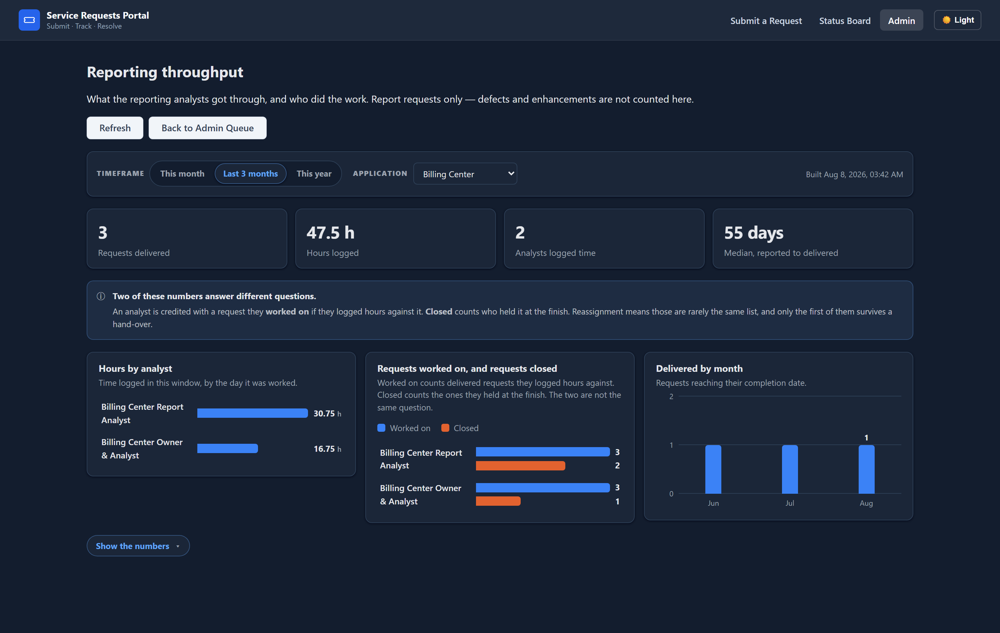

# Service Requests Portal — Developer Handoff

**One document.** It carries both halves: **how the thing works**,
and **why it works that way**. The code is disposable; the decisions are not.

**Audience:** the engineering team who will rebuild this application on the
organization's own stack and standards. Also useful to anyone opening the repo.

**Status: working prototype.** It runs, it holds test data, and it is the reference
for a rebuild — not the thing that ships long-term. See [`NEXT_STEPS.md`](NEXT_STEPS.md)
for the program decision (it is a **Rebuild**).

**How to read it.** Every section answers *what it does* and *why*. Where a
decision was forced by a constraint you may not share — a SQLite quirk, a hosting
proxy, an unfinished vendor contract — it says so explicitly, so you can **delete
the workaround instead of faithfully reproducing it**. [Part IX](#part-ix--decision-record)
is the chronological record of decisions made while building, kept in full because
several of them were corrected once and the reasoning is the only thing that stops
them being un-corrected.

**What is authoritative.**

| Question | Authority |
|---|---|
| What the product does | this document + [`USER_MANUAL.md`](USER_MANUAL.md) + the screenshots |
| Exact field and API shapes | the prototype source, cited by path throughout |
| What EasyVista accepts | **nobody yet** — see [Known gaps](#part-x--known-gaps-traps-and-open-questions) |
| Current data | the live database, *not* this document |

> **Screenshots** in [`handoff/screenshots/`](handoff/screenshots/) were captured
> on **2026-08-08** by `client/scripts/capture-screenshots.mjs` against the hosted
> database, which holds a purpose-built demonstration set. It is entirely test
> data.
> `handoff/screenshot-manifest.json` is written **by** that script, so it cannot
> describe a shot the script did not take. See [Part VII](#part-vii--running-and-verifying).

---

## Contents

**Part I — Orientation**
[1. The problem](#1-the-problem) ·
[2. Who uses it](#2-who-uses-it) ·
[3. Architecture](#3-architecture) ·
[4. Tech stack and layout](#4-tech-stack-and-layout)

**Part II — The product**
[5. Domain vocabulary](#5-domain-vocabulary--read-this-first) ·
[6. The four kinds of work](#6-the-four-kinds-of-work) ·
[7. Statuses and the lifecycle](#7-statuses-and-the-lifecycle) ·
[8. Screen by screen](#8-screen-by-screen)

**Part III — Mechanisms**
[9. Identity and the viewer envelope](#9-identity-and-the-viewer-envelope) ·
[10. Access control](#10-access-control) ·
[11. Public data boundary](#11-public-data-boundary) ·
[12. Real-time, presence and concurrency](#12-real-time-presence-and-concurrency) ·
[13. AI semantic search](#13-ai-semantic-search) ·
[14. Service Desk / EasyVista](#14-service-desk--easyvista) ·
[15. Excel round-trip and file storage](#15-excel-round-trip-and-file-storage) ·
[16. Reporting throughput](#16-reporting-throughput)

**Part IV — Reference**
[17. Data model](#17-data-model) ·
[18. API surface](#18-api-surface) ·
[19. Configuration](#19-configuration)

**Part V — Operating**
[20. Running and verifying](#part-vii--running-and-verifying) ·
[21. Deployment and the rebuild decisions](#part-viii--deployment-and-the-rebuild-decisions)

**Part VI — The record**
[22. Decision record](#part-ix--decision-record) ·
[23. Known gaps](#part-x--known-gaps-traps-and-open-questions) ·
[24. Acceptance checklist](#part-xi--rebuild-acceptance-checklist)

**Part XII — Wanted next** — asked for, not built
[25. More applications, Claims first](#25-more-applications-starting-with-claims) ·
[26. Report requests in more than one flavour](#26-report-requests-in-more-than-one-flavour) ·
[27. Approval signed inside the app](#27-approval-signed-inside-the-app) ·
[28. Email out of the app](#28-email-out-of-the-app-prefilled-from-the-request)

[Test accounts](#test-accounts) · [Where to look in the prototype](#where-to-look-in-the-prototype)

---

# Part I — Orientation

## 1. The problem

The **Customer Interactions / Product Owners** team fields a constant stream of
work from **field representatives**: Billing Center and Policy Center defect
reports, enhancement requests, and — added later — **requests for reports and
dashboards**. They triage it, prioritize it, and decide what is escalated to
**Tier 2 GTS**, who work tickets in **EasyVista** (surfaced throughout the app as
"Service Desk", see [§14](#14-service-desk--easyvista)).

Before this portal there was no system of record:

- Defect reports lived in email threads, chats and spreadsheets — no audit trail,
  and duplicates were near-impossible to spot.
- Enhancement requests had no structured intake, so details arrived incomplete.
- Product Owners had no single queue to triage from.
- Historical records sat in Excel files that could not be searched by reps.
- Escalating to EasyVista meant manual copy-paste.
- **Reps had no visibility.** They could not see whether an issue was already
  known, or what happened to something they filed — so they filed it again.
  Duplicate intake was the largest single source of wasted triage effort.
- **The Product Owners could not see each other's work.** Nothing said whether a
  report had already been picked up, or by which Product Owner — you found out only
  if the person who handled it happened to tell you. Two people working the same
  request, or nobody working it at all, both looked identical from the outside.
- Report and dashboard requests arrived through the same informal channels and had
  the same problems, plus one of their own: nobody could say how much analyst time
  went into them.

**Almost every non-obvious decision in this codebase traces back to two goals:
reduce duplicate intake, and make state legible to the person who reported it.**
When a design choice looks fussy, that is usually why. A third joined them when
report requests landed: **make analyst effort visible**, which is why hours are a
child table and not a column.

## 2. Who uses it

| Role | Signs in? | Can do |
|---|---|---|
| **Field representative** (`users.role = 'rep'`) | **Yes — required.** | File any request; check for duplicates before filing; follow the status board and the requests they filed. Holds **no grants**, so `ensureAdmin` refuses them like a stranger and the header shows them no Admin link. |
| **Product Owner / admin** (`role = 'admin'`) | Yes | Everything in the queues they are **granted**: triage, edit, status, attachments, redirect, Service Desk send, public visibility, retire, bulk actions, Excel round-trip, and the read half of metadata. |
| **Reporting analyst** | Yes | An **admin whose grant is narrowed to `report`**. There is no fourth role — see [§10](#10-access-control). |
| **Manager** | Yes | A rank above admin, per application. Gates exactly one thing: seeing **other people's** throughput numbers. |
| **Viewer** | Yes | Read one application's queue and export it. Changes nothing. |
| **Super user** (`is_super_user`) | Yes | Everything above across **every** application, plus the Access page and the metadata **writes**. The single privilege bypass in the system. |

Roles are **per application**. "Admin" is not a global role — someone can
administer Billing Center and have no access at all to Policy Center.

**`users.role` is the door; the grants are the rooms.** Two values may sign in
(`ACCOUNT_ROLES_THAT_MAY_SIGN_IN` in `server/src/constants.js`): `admin` and
`rep`. Anything else is refused at the login endpoint regardless of grants.

## 3. Architecture

```
┌──────────────────────┐   REST via host    ┌────────────────────────┐
│   React SPA          │────── rewrite ────►│   Express API          │
│   Vite + React 19    │                    │   Node + Express 5     │
│   (Vercel today)     │◄─ WebSocket ──────►│   (Render today)       │
└──────────────────────┘  (DIRECT, bypasses └───────────┬────────────┘
                           the host proxy)              │
                  ┌──────────────────┬──────────────────┴─────────┐
          ┌───────▼────────┐ ┌───────▼─────────┐ ┌───────────────▼──────┐
          │ PostgreSQL     │ │ File storage    │ │  EasyVista REST      │
          │ (Supabase) or  │ │ Supabase bucket │ │  (external, gated)   │
          │ SQLite (sql.js)│ │ or local disk   │ └──────────────────────┘
          └────────────────┘ └─────────────────┘
                                    ┌──────────────────────────────┐
                                    │ AI: Claude / OpenAI summary  │
                                    │ + embeddings (local/OpenAI)  │
                                    └──────────────────────────────┘
```

> The host names are the **prototype's** hosting. The internal deployment will be
> company servers and a company database. The application structure does not
> change. **Four things in this codebase exist only because of that hosting and
> should be deleted** — see [§21](#what-you-can-delete-on-your-own-infrastructure).

**Why the WebSocket bypasses the host proxy.** Vercel rewrites cannot carry
WebSocket upgrades, so a same-origin socket degrades to perpetual HTTP
long-polling — billing a flood of requests. Connecting directly to the API host
gives a real WebSocket: one persistent connection, ~zero ongoing requests.

That creates an auth problem, because the session cookie is not sent
cross-origin. The client therefore fetches a **short-lived HMAC-signed token**
from a same-origin, session-authenticated endpoint and passes it in the socket
handshake. **This whole mechanism exists for one hosting constraint.** If your
platform carries WebSocket upgrades end to end, delete it and use the session.

## 4. Tech stack and layout

| Layer | Technology | Notes for the rebuild |
|---|---|---|
| Frontend | React 19.2, React Router 7.13, Vite 5.4 | Vite is the **build tool**, not a host. It stays. |
| UI system | **Custom** — `client/src/components/bite-size/BitsizeUI.jsx` + vanilla CSS, `bs-` prefix | No MUI, Tailwind or Bootstrap. Replace with your design system; the **behaviors** documented here are what must survive, not the CSS. Custom dialogs and notices throughout — **no native `alert()`/`confirm()`**. |
| Backend | Express 5.2, Sequelize 6.37 | Thin routes → services. |
| Database | PostgreSQL (`pg` 8.16) **or** SQLite (`sql.js` 1.13) | Dual-provider was a prototype convenience. See [portability traps](#portability-traps-you-can-probably-delete). |
| Real-time | Socket.IO 4.8 | |
| Sessions | `express-session` + `connect-pg-simple` | Postgres-backed store; falls back to MemoryStore on sql.js. See [§12](#session-persistence). |
| Auth | `bcrypt` | Placeholder. Target is SSO / Active Directory. |
| Uploads | `multer` 2.0 | Image-only for attachments, deliberately. |
| Excel | `xlsx` (SheetJS) 0.18 | |
| AI summary | `@anthropic-ai/sdk` 0.112 **or** OpenAI via `fetch` | One env var switches the whole stack. |
| AI embeddings | `@huggingface/transformers` 4.2 in-process / OpenAI / Voyage | Local option: no vendor, no key, no per-call cost, text never leaves the server. |

```
client/src/
  pages/            7 route components
  components/
    admin/          queue, command bar, modals, detail/ (13 sub-components)
    public/         status board, submit form pieces
    bite-size/      BitsizeUI design system + Layout/AppShell
    common/         AiSearchPanel, PaginationControls
  hooks/            one per feature area
  lib/              api.js (the single request helper), socket.js
  utils/            filter/sort/format helpers shared admin↔public
  constants/        column, filter, sort and status registries
client/scripts/     the verification + screenshot harness (see Part VII)

server/src/
  routes/           13 thin route modules; validation at the boundary
  services/         9 services; all business logic
  helpers/          mappers (public allow-list), easyVistaPayload, lookups,
                    storage, reportVisibility, submissionInsert, timeline
  middleware/       cors, session, csrf, upload, rateLimit, errorHandler
  constants.js      role ladder, status registries, allow-lists, sentinels
server/db/
  models/index.js   the whole schema + migration logic + portability traps
  sequelize.js      provider selection
server/scripts/     migrations, backfills, seeds, purge — all dry-run by default
docs/               this document, USER_MANUAL.md, NEXT_STEPS.md, screenshots
```

---

# Part II — The product

## 5. Domain vocabulary — read this first

Getting these words wrong produces a subtly wrong system. They are not
interchangeable.

| Term | Means |
|---|---|
| **Submission** | One request. A row in `submissions`. Also "ticket". |
| **Type** | `defect`, `enhancement` or `report`. A **lookup value**, not an enum — the Metadata page manages the list. Drives required fields, the status vocabulary, and what the Service Desk is told. |
| **Application** | A product queue — `Billing Center`, `Policy Center`, `Other`. Owns triage rights. |
| **`Other`** | The catch-all **working list**, covering two cases: a system with no configured application to submit to the Service Desk directly, and a system nobody has identified yet. Either way the work is still tracked — reports get built from here, and a defect or enhancement is raised on the Service Desk **by hand** with its incident number typed back in. Not a waiting room; the owner's phrase is *"almost like a task list"*. |
| **Reports-only application** | An application a reporting analyst created by typing its name in (`applications.reports_only = 1`). It takes **report requests and nothing else**, and is granted to everybody who works report requests. |
| **Soft association** | `submissions.working_application_id` — a queue an `Other` ticket **also appears in**, without leaving `Other`. The only place two columns answer "whose queue is this", and it never decides who may edit. |
| **Cleanup task** | Internal work item (`is_cleanup`). Tagged `defect`, `enhancement` or `cleanup_only`. **A flag on a defect or an enhancement, never a type of its own.** |
| **Retire** | Soft archive. **Nothing in this app hard-deletes a submission.** |
| **Public** | Appears on the status board and in public AI search. |
| **Workaround request** | A rep is blocked on a live case *now*. Two columns: `needs_workaround` (the ask), `workaround_provided` (the team closing it). |
| **Redirect** | Hand a ticket to another application's queue. The ticket **moves**. |
| **Resubmission** | Re-send to the Service Desk after changes. Creates a **new** submission and a **new** incident; the original is untouched. |
| **Viewer envelope** | The single server answer to "who is this caller and what may they see". `GET /api/viewer`. |
| **Home application** | The application a person most likely wants preselected. A **prefill**, never a lock. |
| **Pinned application** | The queue an admin *decided* to land on. Distinct from "the last one I looked at". |
| **Level of effort** | An analyst's size estimate for a report request. A lookup (`S`/`M`/`L`/`XL`). |
| **Hours** | Analyst time, one row per sitting in `request_time_entries`. Never a column. |

### Five distinctions that are easy to collapse and must not be

**1. Redirect moves; resubmission forks.**
A redirect changes `submissions.application_id` on the existing row and writes a
ledger entry. A resubmission inserts a *new* row. Conflating them yields either
two tickets for one problem, or one ticket two teams each think the other owns.

> *"The ticket MOVES. It is not copied and not mirrored: a copy would give the
> reporter two tickets for one problem and leave two teams each assuming the
> other owned it."* — `server/src/services/redirectService.js`

**2. Read scope is wider than write scope.**
A team that hands a ticket on **keeps reading it** and **stops writing it**, the
instant it moves. Read comes from the routing ledger; write asks only about the
ticket's *current* application. The sending team needs to see where their ticket
went.

**3. `needs_workaround` and `workaround_provided` are two columns, not one flag.**
Handling the request must not erase the fact that it was made. "Open request"
means the first without the second. A single tri-state column would lose the
timing, and the pair is what lets history show how long the rep waited.

**4. A cleanup task is a flag, not a type.**
`is_cleanup` plus `cleanup_tag_type` on a defect or an enhancement. This is why an
"application admin for defects and enhancements" needs no cleanup grant — cleanups
ride along with the type they are tagged as. `cleanup_only` means it was never
anybody's bug report.

**5. `submissions.assigned_to` is the current holder; `request_assignments` is the
trail.** The first is cheap to query and index for "my queue". The second cannot
be reconstructed after the fact, which is why it shipped **with** the feature —
without it, reassignment silently erases everyone who held a request before the
last person.

<a id="6-application_id-owns-the-ticket-working_application_id-only-shows-it"></a>
**6. `application_id` owns the ticket; `working_application_id` only shows it.**
The soft association is the one place two columns answer "whose queue is this",
and it is safe only because the second one answers strictly less:

| | `application_id` | `working_application_id` |
|---|---|---|
| Who may **edit** | decides it (`canMutateApplication`) | **never consulted** |
| Who may **read** | decides it | widens, but only into a queue the caller already holds |
| Which queue lists it | yes | yes (`OR` on the scope filter) |
| Set on | every ticket | only a ticket in `Other` |
| Changed by | a redirect | the analyst working it |

Collapse the two and you get one of two failures: either an admin gains write
access to a ticket nobody granted them, or an analyst's own list stops showing
work they are doing. The rule that keeps it honest is that the soft column is
**read-only in every sense that matters** — see `server/src/helpers/softAssignment.js`.

## 6. The four kinds of work

| Kind | Stored as | Asked for | Ends at |
|---|---|---|---|
| **Defect** | `type = defect` | Screen, date/time, what you saw, steps | Service Desk (`Deployed`) |
| **Enhancement** | `type = enhancement` | The request and what it would save | Service Desk (`Deployed`) |
| **Cleanup task** | `is_cleanup` flag on either of the above | An internal description | `Cleanup Status: Completed` |
| **Report request** | `type = report` | Which application's DATA, what it is for, measures and sources **or** which report and what should change | **Delivered** — built in the portal's own team, never handed to the Service Desk |

### Report requests are the second half of the product

They arrived after the defect/enhancement portal was working, and they are not a
fourth flavour of the same thing. What is different:

- **Two branches.** `is_new_dashboard` decides which half of the form is asked and
  which half is stored. A **new** dashboard states its measures and their sources;
  a **change** names the report and what should change about it. Only the chosen
  branch's answers are stored, so a hand-rolled request that sends both cannot
  leave the other branch's answer contradicting the one that was asked.
- **The application is the DATA's, not the requester's.** Asked on the form and
  refused at the endpoint if blank, because it decides which analysts ever see the
  request. A defect still derives it — a bug happened where the person was.
- **`Other` is a real application row**, for when the honest answer to "whose data
  is this?" is "both" or "I do not know".
- **They are private.** Only the person who filed one may see it on the board.
- **They have their own status vocabulary** — nine words, three of them exclusive.
- **They carry an analyst's half**: level of effort, hours, an approval, an
  assignment trail, and delivery notes.
- **Nothing ships.** No release number, no release notes, no Service Desk send —
  the Service Desk send **refuses a report request outright**, because it would
  set `Submitted`, a word outside the nine.

## 7. Statuses and the lifecycle

### One table, scoped per type

`submissions.status_id` points at `defect_enhancement_statuses`. **Sixteen rows**,
seeded but editable at runtime, so **nothing may hardcode the full list**.

`New` · `Approved` · `Redirected` · `Backlog - Monitoring Impact` ·
`Future Consideration` · `Deferred – Not in Current Scope` · `Rejected` ·
`Duplicate` · `Submitted` · `Deployed` · `Retired` ·
`Requires Additional Review` · `Pending Management Approval` ·
**`In progress`** · **`Delivered`** · **`On hold`**

The last three belong to **report requests alone**.
`statusesForRequestType(type, statuses)` in `server/src/constants.js` decides
which words each type may hold: a report request gets its nine in *registry*
order, every other type gets the table minus those three. Mirrored in
`client/src/constants/statusConstants.js` — **change both.**

**Why one table and not two.** Two options were on the table and neither was
taken:

- *A second status column* is two columns for one fact — the same defect the
  source field list has with Complete / Completed / Complete Date — and something
  every read and every write would have to branch on.
- *A resolver that picks the table by type* makes `status_id` an id whose MEANING
  depends on another column. It cannot be joined or foreign-keyed, and two tables
  would both hold a row called `Retired`.

Six of a report request's nine statuses are already rows in that table and mean
the same thing on both types — "Approved" is "Approved". So the table keeps one
vocabulary, three rows were added, and a code registry scopes them. **What a
requester sees is identical to a separate table. What a maintainer sees is one
column, one FK, one join.** A status an admin adds on the Metadata page still
reaches defects exactly as it does today.

Enforced on **create, update and backdated history**, offered per type in the
queue's inline select, the detail modal's status select, and the Add-a-ticket
dialog. The Metadata page marks the three with `Report requests only`, because one
list otherwise gives an admin no way to know which dropdown a value appears in.

### The public board turns status into position

Two tracks, chosen per type, agreeing on what each POSITION means — so one
`STATUS_STAGE` map and one set of pip colors cover both:

```
defect / enhancement   Reported ── Approved ── With Service Desk ── Deployed
report request         Reported ── Approved ── In progress ────────── Delivered
```

Rules (`client/src/components/public/StatusBoardRow.jsx`):

- **Position derives from the CURRENT status, never the furthest timestamp.** A
  redirect resets a ticket to `New` for the receiving team while the sending
  team's `Approved` timestamp stays in history. A "furthest-timestamp-wins"
  reading credited the previous team's progress to the new team. **This was a real
  bug; do not reintroduce it.**
- A later stop being reached implies the earlier ones were. `Approved` is the only
  stop a ticket can skip.
- **Closed outcomes** (`Rejected`, `Duplicate`, `Retired`, …) get an outcome pill
  and a one-line explanation **instead of a track** — drawing a track would be a
  lie, because nothing further is coming.
- **Parked** statuses (`Backlog`, `Future Consideration`, `Deferred`, **`On
  hold`**) say so rather than drawing a stalled track.
- An unrecognised status renders as a neutral "holding" badge, never unstyled.

The stage tiles name **both** vocabularies at the two positions where the words
differ — "With Service Desk / In progress" and "Deployed / Delivered" — because a
tile counts both types while a row track names only the one that ticket travels.

### A retired status must not hide a live ticket

When every selectable status is chosen — the default and reset state — the status
whitelist is **dropped entirely** rather than applied. Both the admin queue and
the public board do this, for the same reason.

### Creation paths

Six, recorded in `submission_sources` and visible as "Created via":

| Source | Who | Public by default? |
|---|---|---|
| `rep_form` | A signed-in requester, via `/` | **Yes** |
| `admin_manual` | Admin, in-queue create | **Yes** |
| `admin_backdated` | Admin, for something reported before the portal existed | **Yes** |
| `admin_cleanup` | Admin, internal cleanup task | **No** if `cleanup_only` |
| `admin_excel_import` | Bulk historical load | **Yes** unless cleanup-only |
| `admin_easyvista_resubmission` | The fork of a resubmit | inherits |

**Public by default** is the rule; internal cleanup-only tasks stay private. An
explicit choice from the caller always wins.

> **An admin-created report request has no reporter.** `reporter_user_id` is
> written only by the public submit route, so an admin recording somebody else's
> request cannot claim it for them. Coherent — but it means the Add-a-ticket
> dialog cannot put a report request in front of the person who asked for it, and
> such a request is on the admin queue and on nobody's board.

## 8. Screen by screen

Seven routes (`client/src/App.jsx`):

| Route | Page | Gate |
|---|---|---|
| `/` | Submit a service request | **signed in** |
| `/public` | Status Board | none |
| `/admin/login` | Sign In | none |
| `/admin` | Admin Queue | admin session |
| `/admin/metadata` | Manage metadata | admin session (writes: **super user**) |
| `/admin/throughput` | Reporting throughput | admin session |
| `/admin/access` | Access Management | admin session **+ super user** |

Client-side gates are **signposting only**. Every endpoint re-checks server-side.
`RequireSuperUser` waits for the real `GET /api/viewer` answer rather than
guessing from the session — it exists so a non-super-user does not land on a page
that could only show them errors.

Detailed, screenshot-by-screenshot walkthroughs of each screen are in
[`USER_MANUAL.md`](USER_MANUAL.md). What follows is the **design reasoning** a
rebuild needs, not a tour.

### 8.1 Submit a service request (`/`)


**Filing requires a signed-in person, for every request type.** Not a disabled
form — the form is not rendered at all, and the endpoint refuses the POST
regardless. See [§9](#who-may-file) for the history of that switch and why it
defaults on in code rather than in an environment variable.


One column of form, one rail of guidance. Sections: **what are you reporting** →
**your request** → (per type) → **do you need a workaround** → **screenshots**.

- **Required fields differ by type.** The client mirrors the server's per-type
  checks — and says so in a comment naming the exact server lines to keep in step,
  because anything the server rejects that the client does not catch reaches the
  requester as a bare 400 instead of an inline prompt.
- **The heading names the service, not an application.** It was `Submit a
  {application} request`, derived from the viewer, so it read "Submit a Billing
  Center request" to somebody filing against Policy Center. It is `Submit a
  service request`. The ticket still records the application and the confirmation
  still says which one it went to.
- **Who, then what, one field per row, in both branches.** The summary carries the
  whole request; it used to share a ~814px row with a 250px name box whose
  140-character counter was squeezed against the label.
- **Validation appears only after a submit attempt**, and focus moves to the first
  field that needs attention. The copy under the button is a promise the form
  keeps: *"You can press Submit with fields empty — we will point them out
  first."*

**The pre-submit duplicate check** is the highest-value feature on the page and the
direct answer to the duplicate-intake problem
(`client/src/components/public/DuplicateCheck.jsx`):

- **Deliberately not the `AiSearchPanel` component.** That one is a search *tool*
  — it owns a query box, a scope and a time window. Here there is nothing to
  configure: the query *is* the summary already typed, and the window is **all
  time**, because a defect reported two years ago and since deployed is exactly
  the answer this requester needs. Both go through the same `api.aiSearch`.
- Disabled until the summary is long enough to be searchable.
- It remembers the exact text that produced the result, so editing the summary
  afterwards offers a **re-check** rather than silently showing matches for the old
  wording.
- **It searches only the kind of request being filed.** A report request is only
  ever a duplicate of another report request — "the unapplied cash dashboard needs
  a write-off column" has nothing to do with a broken invoice screen. Both
  directions are **hard filters in the query** (`loadCandidates`), not a
  post-filter, so a wrong-kind ticket never takes a top-K slot from a right-kind
  one. A defect and an enhancement stay eligible for each other, because which of
  the two a sentence describes is a triage decision; the same kind gets a **0.05
  preference on the display blend only** (`AI_SEARCH_SAME_TYPE_WEIGHT`, smaller
  than the 0.15 recency weight), never on `match` — so it settles ties and cannot
  lift a ticket past the similarity floor.
- The panel **says what it searched**, and the response carries
  `meta.searchedOnlyType` / `meta.excludedType` so it cannot claim more than it
  looked at. *A narrowed search reporting "nothing like this" without naming its
  scope is a bigger claim than it can support.*
- `Op.ne` alone would have dropped every row with a NULL `type_id` — SQL says NULL
  is neither equal nor unequal to anything, and historical rows exist with no
  type. **Excluding one kind of ticket must not also exclude the untyped ones.**

**Screenshot attachment** has three ways in, because reps get screenshots three
ways: drag, Browse, and — the common one — **PrintScreen then Ctrl+V**. The paste
path has real subtleties (`ScreenshotDropZone.jsx`):

- The paste listener is **window-level**, so a paste lands wherever the requester
  happens to be — they have just come back from another window.
- Clicking the zone **focuses** it rather than opening the file picker, because
  Chrome does not dispatch paste events while an `input[type=file]` is focused.
  The input is a **sibling** of the zone, not a child, so its synthetic click
  cannot bubble back in.
- A clipboard screenshot usually arrives **with no filename**, which would fail
  the extension check — so one is derived from its MIME type.
- The client mirrors the server's allow-list, so a file the API would reject is
  refused here with a reason.
- **The native file input is kept and only its button redrawn.** The native control
  carries the accept filter, multi-select and drag-and-drop; replacing it means
  rebuilding all three.

Cap: 3 files, PNG/JPG/GIF/WEBP/BMP/HEIC, 10 MB each.

**Who the ticket is from: the server decides, not the form.** A signed-in
reporter's own name is used and the submitted one **discarded**, so nobody can
file under someone else's name. The form stops asking — a name box whose value is
thrown away on arrival is worse than no box. See
`server/src/services/reporterService.js`.


### 8.2 Status Board (`/public`)


*"Every issue the team has been told about, and where each one stands."* Updates
over WebSocket as the team works, with no refresh.

**Two count scopes, kept deliberately apart** — a pattern repeated on the admin
queue and worth preserving:

- **`WHOLE BOARD`** — the tiles. Badged, and captioned *"Your filters never change
  these numbers."*
- **The list band** — `10 of 10 tickets`, carrying its own denominator and the
  filters currently applied.

Two identical-looking rows of numbers meaning different things is a readability
trap. Three things keep them apart: a badge naming each scope, a line stating
whether filters affect it, and separate visual treatment with the filtered band
joined to the table it describes. Tiles are also **toggles** — clicking the one
you are on clears back to everything, so a tile is never a one-way trip.

**Rows expand in place.** A row is one scannable line — ref, type, summary, four
track pips, reporter, application, updated. Expanding reveals the description, the
dated track, and (when it happened) **"Moved between teams"**. The reference shown
is the **incident number when there is one, otherwise `#id`** — kept in step with
the reference the AI search cites, so a reporter can match an AI result to a row
without expanding it.

**Filters** are drawn closed, with a count badge and individually removable chips.
Two controls are promoted into the command row: **`search`** (the most-used) and
**`retiredFilter`** (Active / Retired / All) — because it is a **scope, not a
filter**: it changes the meaning of every count on the page.

The chips, the `Filters` badge, the band's summary line and the no-matches state
are all derived from **one** `getActivePublicFilters` call — deriving it in more
than one place is exactly how those four drift apart. **`Stage` is not state of
its own**: the Stage select and the tiles are two ways of writing
`filters.statuses`, the same way column headers and the sort control are two ways
of writing `filters.sort`.

**All four data-surface states** are implemented on both list surfaces (skeleton /
empty / error / data). The skeleton is **shaped like the real rows at the real row
height**, so nothing jumps when data lands, and it is hidden from assistive tech.

> The admin queue's loading state has a history worth repeating: it used to be a
> `Loading…` line above the **stale** rows, leaving out-of-date tickets on screen
> presenting themselves as current — *"the worst of the loading failure modes"*.

**"My reports"** appears only when there is a "mine" to show. A toggle that can
only ever return nothing is worse than no toggle. Ownership has two sources and
one decider (`useViewer.js`): the server's `is_mine` for a signed-in reporter
**always wins**; otherwise, ticket ids this browser remembers filing
(localStorage). **The browser list is the one acknowledged throwaway in the
identity design — delete it once SSO lands.**


**Only `New` wears the queue's left stripe.** Every status had its own color, so
every row carried one and the stripe distinguished nothing — a wall of color
reads as decoration. The status is already stated in words, in its own column,
with its own badge; the stripe now marks the one thing that column cannot say at a
glance: *nobody has looked at this yet*. The `row-status--*` class is still written
for every row — it is the row's state in the DOM, and what the browser check reads
— but only the `new` rule paints.

### 8.3 Ticket search (both surfaces)


One reusable component (`client/src/components/common/AiSearchPanel.jsx`) on both
the public board and the admin queue. The time-frame control encodes **both the
dimension and the window** — "reported in the last 90 days" vs "resolved in the
last 30 days" — because those are different questions.

**Results come back in two labeled sections, and this is the important part:**

- **Closest matches** — tickets the model endorsed, by relevance tier.
- **Keyword matches** — *"Tickets whose ID, incident or Jira number, policy,
  account, reporter, or text literally contains what you typed — not ranked by the
  AI."*

They answer different questions. Semantic search answers *"has anyone reported
this problem before"*. A pasted incident number is a **lookup**, which cosine
similarity is structurally bad at. Merging them destroys the distinction between
*"the AI thinks this is relevant"* and *"this literally contains the number you
pasted"*. A ticket appears in one section, never both.

**The panel describes; it does not rule.** The prompt already banned "Yes, this has
been reported" and the model still produced rulings, because *"do not say X"
leaves every other way of saying X available*. The **shape** is prescribed now —
sentence one must be the closest match, its ref, what it is about, its status —
and the ban is stated as a class. The panel is titled "Closest matches", not "AI
summary".

On the admin queue the panel starts **collapsed**, so the ticket table stays above
the fold; on the public and requester surfaces — where searching *is* the task —
it stays open.

### 8.4 Admin Queue (`/admin`)


The main working surface. Top to bottom: header and three menus → alert banners →
`WHOLE QUEUE` scope strip → command bar → applied filter chips → collapsed ticket
search → `FILTERED VIEW` band with impact totals → the table.

**Actions live behind three menus, not a flat row:** `Add a ticket…` (primary),
`Data` (import/export), and the account menu (Manage metadata · Reporting
throughput · Manage access · Sign out). This replaced a flat six-button row. Every
action is still reachable, one level down. *Manage access* is **hidden** rather
than shown-and-refused for non-super-users — and the route and every endpoint
behind it check again server-side. Menus close on outside click and Escape and
**return focus to the trigger**.

**Two count scopes again.** `WHOLE QUEUE` is filter-independent and says so;
`FILTERED VIEW` describes the rows below and carries the impact totals. One
subtlety: cleanup-only items display under a `Cleanup Only` pseudo-status rather
than their underlying status, and are counted separately — without that, `total`
would not equal the sum of the cards. The "other statuses" card is deliberately
**not** a quick filter: no existing filter expresses "cleanup-only" exactly, so it
reports the count rather than pretending to filter by it.

**Two queues, two column sets.** The report queue draws ID · Reported/Updated ·
Summary · Status · Assigned To · Public, keeps its own saved layout, and calls the
status column plain "Status". Both layouts live in the one `columns_json` as
`{ default, report }`; a row still holding a bare array reads as the default set
with no report set, which is right for anyone who saved a view before this.


**A one-click switch between the two kinds of work** in the command row: All kinds
· Defects & enhancements · Report requests. It writes `filters.types` — the same
value the filter panel's multi-select writes — so the segments, the chips and the
table cannot disagree, and a hand-picked combination in the panel simply presses
no segment. Labels come from the **live type list**, not hardcoded, so renaming the
lookup value cannot silently stop matching.

**A way back from the new-submissions view.** The banner replaces the whole filter
set, and for a while the only way back was Clear all, which also threw away the
application an admin was scoped to: answering "what's new?" cost them their place.
`filtersBeforeJump` remembers what was on screen and offers it back as one chip
("Back to Billing Center"), withdrawn once taken or once Clear all says start from
nothing. **Held in state, not localStorage** — "where I just came from" stops
meaning anything after a reload.

**Filters: a grouped panel, two promoted.** Fourteen flat labels forced an admin to
read all of them to find one; named groups let them jump. `search` and
`retiredFilter` are promoted for the same reasons as on the public board;
`application` joins them when the caller can see more than one — for that person
it is a **scope**, not a filter. Both promoted controls still honour the admin's
visible-filter set, because the page **resets the value of any hidden filter**:
rendering a hidden control would show a value being cleared behind the scenes, and
leaving a hidden filter's value in place would let it silently constrain the table.
The workaround filter has **three** states, not two — a ticket nobody flagged is
neither open nor handled.

**Application scope and the pin.** The scope select is a look; **pinning is a
decision**. Separate clicks on purpose. Which queue an admin lands on resolves once
per session: the application they **pinned** (an explicit decision, so it always
wins) → their **home application** (AD group, else most-filed) → **every**
application. Two notes that cost real debugging time: seeding waits for **both**
the saved preferences *and* the viewer envelope (waiting only on preferences ran
the seed while the envelope was still the anonymous placeholder, spending the one
chance to seed on landing at `All`); and a pin on an application since renamed
resolves to nothing and falls through rather than to an empty queue. The select is
hidden entirely for someone who administers exactly one application.

**Sorting is independent of visible columns.** Two paths write the **same**
`filters.sort` value. They are decoupled because hiding a column used to hide its
sort. Direction wording follows the field's **type** — "Newest first" is
meaningless for Summary — and mirrors the comparator the server uses.


**Customize View** is saved **server-side** per admin so it follows them across
devices; localStorage is only a cache to avoid a flash. Two rules that matter: the
server allow-lists column and filter keys and **drops unknown ones**, so
client/server drift fails safe; and sanitisation runs against the **full**
registries, not the default visible sets — narrowing to defaults would silently
strip an admin's kept columns on every load.

**Inline editing.** Four fields are editable in the table. Editable cells
**remount when the row value changes**, so live updates from other admins actually
appear — `defaultValue` only applies on mount.


**Bulk actions.** The bar is pinned to the viewport bottom so it stays reachable
while scrolling a long selection. The dangerous part is the **scope**, and it is
stated in words: the master checkbox acts on the **entire filtered set across
every page**. Three guards:

1. Changing filters/search **clears** the selection — a selection must never
   straddle two different filtered sets. Keyed on `filters`, *not* on `rows`, so
   benign live refreshes leave it intact.
2. Opening the confirm modal takes a **snapshot** of the ids, so a background
   reload cannot empty the selection between opening and confirming.
3. On apply, the snapshot is **re-intersected with the current rows** — the hard
   guarantee that a bulk change never touches a ticket outside the current view.

Server side: capped ids per request, and the loop reuses the **per-row** update
path so socket emits, status-history logging and embedding refresh match the
single-ticket action exactly. A single failing id lands in `failed` and never
aborts the batch. The viewer rides along, so a batch cannot reach tickets the same
admin would be refused one at a time.

**Add a ticket** has two modes (New / Historical) across four type segments
(Defect · Enhancement · Cleanup · Report request), the report segment carrying its
own two sub-branches. The type is one segmented control plus a computed
`data-branch`, which is why a fourth type was a segment and a branch rather than a
rewrite.

| | |
|---|---|
|  |  |

### 8.5 The detail modal


Where triage happens. **Six tabs**, and the structural rule is: identity, alerts
and the action bar live **outside** the tab strip, so nothing needing attention can
hide behind an inactive tab — and a tab that *is* hiding something required says so
on its label. Tab order follows the ticket's life: *what came in → its evidence →
what has happened to it → the internal call → the outbound hand-off last.*

The sixth slot is **per type**: `Delivery` on a report request, `Service Desk
Submission` on everything else.

**Identity band.** `Defect` · `New` · `Public`, the summary, then `Billing Center ·
Reported 8/6/2026 by … · Updated 2 days ago`. Collapsible to one line. Badges read
from the **edit draft**, not the saved record, so they track the dropdowns live. A
`Cleanup Only` task's **type badge is withheld** — showing "Defect" next to a
"choose a type" prompt reads as a contradiction. Its collapsed state is
deliberately **not** keyed to the open ticket: an admin who wants the compact
header wants it on every ticket.

**Tab 1 — Report.** The form **as it came in**, read-only, because *this is a
record, not a working copy*. It reads from `detail`, not the `edit` draft. Values
render as text under a rule, never in an input box, so they cannot be mistaken for
something typeable. (The rule sits *underneath* the value — a rule between label
and value reads as separating the value from the label above, making every value
look like a heading.)

A **report request has its own Report layout**: what it is for, who to ask or which
report, and what they need. Before that it asked a defect's questions — policy
number, screen, time it happened — and showed the summary alone, so **an analyst
could open a report request and not read what had been asked for.** The eight
requester fields were stored, exported and imported and drawn **nowhere**.


> **Honest caveat, shown in the UI:** *"Not yet sent to the Service Desk. Showing
> the current saved values."* True snapshots do not exist. See
> [Known gaps](#part-x--known-gaps-traps-and-open-questions).

**Tab 2 — Files.** The per-file remove action is a **quiet text button**, not a red
danger button — five attachments used to mean five red buttons competing with the
one real destructive action in the footer. The grid caps its own height.

**Tab 3 — History.** The status trail, newest first, in one list with its own
scroll boundary, plus provenance, external identifiers and release metadata.
Previously the latest event was always expanded with older ones behind a second
nested disclosure, so a long-lived ticket buried everything below it.

**Tab 4 — Triage.** The tab you land on: status, priority, duplicate reference,
decision notes, Jira number, public visibility, retire. **Reviewer fills itself in
on SAVE**, not on open — prefilling would mark every ticket edited the moment
somebody looked at one.

**Tab 5 — Impact.** One judgement, one section: policy premium impact, direct
dollar impact, policies affected, frequency, impact notes. Previously split across
four boundaries for a single decision.

**A report request's Impact tab is impact notes and nothing else.** Dollar impact,
policies affected and an occurrence rate are defect measures — a dashboard that
does not exist yet affects no policies and recurs no number of times a month. Its
SIZE lives on Delivery.

**Tab 6a — Service Desk Submission** (defects, enhancements, cleanups). The most
consequential tab, and it exists because **two things were invisible before it**:
re-submitting does not update the existing incident (it forks), and **most of the
modal's fields never reach the Service Desk at all**. It shows exactly what will be
sent, editable in place, what sending will do, and what is stopping it.
[§14](#14-service-desk--easyvista) has the mechanics.

Release # and Release Notes and the Triage tab's Workaround are **gone from a
report request** — nothing ships, and nothing is broken. The **Service Desk number
is editable behind an unlock**: an application with no catalog has its tickets
raised by hand and the number had nowhere to go, but for every ticket the portal
DID send, that number is the server's own record of the hand-off.

**Tab 6b — Delivery** (report requests). The analyst's half:


- **Go-ahead** — an approver's typed **name** and a date, plus
  `approval_recorded_by`, which is an id the server fills in. Both the name and
  the date are needed for `is_approved`: *a name with no date is half-typed, not an
  approval.* The approver is a name rather than an id because they are often not a
  portal user — a manager who replied to an email — so there is no id to hold.
- **What it is approving:** a manager or supervisor okaying the **resources** to
  build the report. So it is a gate **before** work starts, which is how it is
  built. It is genuinely a **second gate**, not a restatement of the `Approved`
  status: triage accepting a request as valid and a manager authorizing the spend
  are different people saying yes to different questions. Keep them separate, and
  keep the group labeled "Go-ahead".
- **Level of effort** — a lookup, so the Metadata page can rename or retire values.
- **Hours** — one row per sitting, per person, per day worked.
- **The assignment trail** — who has held it and who moved it.
- **Delivery notes** — what was actually delivered, in the analyst's words. The
  report-request counterpart to `release_notes`, which is deploy language a report
  request never uses.

**Action bar.** Pinned. **One primary** (`Save Changes`), the outbound action beside
it, and the rarely-used actions behind a `⋯ More` overflow. These four used to sit
inside the scroll region in one flat row — primary Save eight pixels from a red
Retire, with the irreversible hand-off styled more quietly than either. Expanding
any section pushed all of them out of view, which is why Save had to be duplicated
into the header. Retiring asks first. The overflow menu is a **DOM descendant of
the modal, never a portal** — a portal's clicks would land on the backdrop, whose
close handler discards staged attachments. `Redirect` is hidden when there is
nowhere to send it.

**Alerts.** Every warning in **one region ordered by severity**, capped and
scrollable past two. Previously twelve independent slots stacked ahead of the first
field, so a retired + resubmitted + remotely-changed ticket opened on nothing but
banners.

**Two locks, deliberately not merged:**

| Lock | Overridable? | Why |
|---|---|---|
| **Presence** — another admin has this ticket open | **Yes** — "edit anyway" | Advisory. They may have walked away. |
| **Foreign application** — the ticket lives in a queue you do not administer | **No** | The server refuses the write. An override would only produce a 403. |

The workaround alert is keyed off the **saved** record, not the draft, so ticking
"Handled" does not make the alert vanish before the change is saved — it changes
tone instead. **`Mark handled` writes immediately** rather than staging: *"Mark
handled" reads as a verb*, so requiring a second trip to Save Changes meant admins
ticked it, closed the ticket, and the request stayed open. It is built from the
**saved** record so this one-click action never quietly commits unrelated staged
edits.

### 8.6 Manage metadata (`/admin/metadata`)


Every dropdown in the app is data: submission types, statuses, cleanup statuses,
cleanup tag types, applications, enhancement request types, priority levels,
submission sources, occurrence timeframes, **levels of effort**.

- **Deactivate, never delete.** Existing tickets keep pointing at retired lookups.
- `sort_order` drives display order everywhere.
- The `Retired` status is **protected** from deletion and reorder.
- A **retired status must not hide a live ticket** (see [§7](#a-retired-status-must-not-hide-a-live-ticket)).
- The page states the **consequence** of an edit before it happens, and locks the
  name of a value that is in use.

**Managing metadata is super-user only — the three WRITES, not the read.** Editing
a lookup renames or withdraws a value on every ticket that holds it, on the public
board and in every export — and it is **not scoped by the per-application grants**
the rest of the admin side runs on, so an admin for one application was editing
every application's vocabulary.

**The READ stays open to every admin, and must.** `GET /api/admin/meta/options` is
where the queue's filters and the detail modal's dropdowns come from. Narrowing it
too would take every other admin's dropdowns away to protect values they can
already read off any ticket.

That asymmetry reads like an inconsistency, which is what a later tidy-up would
"fix", so `test/metaRouteGuards.test.js` pins it **from the router's own stack** —
including a sweep over every mutating `/api/admin/meta` route, so one added later
without the guard fails too. All four tests were confirmed to fail against a
deliberately weakened route before being kept.

### 8.7 Access Management (`/admin/access`) — super users only


A grid of people × applications, each cell a **role and a scope**. Plus
per-application ticket counts, so revoking someone is a decision made **with the
size of the queue in view** rather than blind.

**Grants carry their type scope end to end.** Each cell offers Every type ·
Defects & enhancements · Report requests only — the three shapes that exist in
practice. A combination those cannot express reads as **Mixed** rather than being
rounded to the nearest one, which would rewrite it on the next save. Bulk grants
clear only the types they name, except an every-type grant, which supersedes the
narrower ones. The page also offers **Manager**, which the server always accepted
and the page never listed — so the only way to hand it out was a database write.

> **This page could not make an analyst, and unmade the ones that existed.** It
> read and wrote only `(user, application, role)`, and `setUserGrants` deleted every
> row for a user then re-inserted **without `request_type`**, which defaults to `''`
> — **every type**. So saving anybody's row promoted a report-only analyst to a
> full admin on that application, from a dropdown, with no screen that would show
> it. Two accounts were one save away from it. 12 tests now pin the scope.

Other design notes:

- Cells are **tinted by state** — a wall of untinted dropdowns all reads alike, and
  finding who is missing access would mean reading each one.
- `no access` is an **option**, not the absence of one, so every cell answers the
  same question the same way.
- Rows are sorted deterministically, so *a diff of two screenshots means
  something*.
- Editing one person sends their **whole grant set as a replacement**, because the
  page edits a set — sending the whole set means two super users editing the same
  person cannot interleave into a state neither chose.
- Bulk grant/revoke is **all-or-nothing, validated in full before anything is
  written**: a batch naming one bad application changes nobody, *because a
  partially applied access change is the hardest kind to notice*.
- Each mutation **applies the server response** rather than guessing.
- **The portal refuses to remove its last super user.** Without one, nobody can
  reach this page to grant anything, and fail-closed scoping means every queue
  would be empty for everyone — a state no one could undo from inside the app.

It also lists **AD group → application** mappings. These set a **default
application**, not an entitlement.

> **The EasyVista catalogs card was removed from this page.** A catalog GUID is an
> identifier *inside* EasyVista, so the team that runs EasyVista owns the value and
> nobody using this portal has it. The card asked super users for an answer they
> were never going to have, and showed three applications as misconfigured when
> nothing was wrong. **Removing it was not enough on its own** — it was the only
> way to set a catalog, so deleting it alone would have left two of three
> applications permanently unable to get one, and the refusal message pointed at
> the page being deleted. The configuration moved to the environment; see
> [§14](#the-catalog-is-per-application-and-lives-in-the-environment).

### 8.8 Reporting throughput (`/admin/throughput`)


How much report-request work is being delivered, and by whom.

**The server picks the view.** `scope` comes back on the response (`'team'` or
`'self'`) and the page draws the composition it names. The analyst's view is a
**different composition**, not the manager's with rows hidden: four tiles about
them, two column charts, and **no `.tp-bars` at all**, so there is no
per-colleague mark anywhere on it. The narrowing is in the **query**
(`onlyUserId`), not in the browser — *filtering in the browser would ship the whole
team to it and call that privacy*.


"All applications" is offered only to someone who **manages every application they
can read** — the same rule the endpoint applies when it chooses between the two
answers. Otherwise the page would have to be two shapes at once.

Everything is **computed**; there is no stored total anywhere, so the page can
never disagree with the tickets it describes. (`Created Month` in the source field
list was exactly this mistake: a stored month that can drift from its own date.)

Two subtleties in the numbers:

- **Hours are windowed by the day WORKED**, not the day typed in — an analyst
  catching up on Friday for Tuesday's work belongs in Tuesday.
- **"Who worked a delivered request" is deliberately NOT windowed.** A request
  delivered in August was often worked in July, and crediting only the hours inside
  the window would erase that.

Deliberately **not live-updating**, and it says when it was built.

### 8.9 Theme and responsiveness

Light and dark, toggled in the header, stored in `localStorage['bc-theme']`,
applied as `data-theme` on `<html>`. Initial value follows `prefers-color-scheme`.

| | |
|---|---|
|  |  |

Every surface works at 390px.

| | |
|---|---|
|  |  |

On narrow screens the submit form hides the rail's copy of the primary button and
shows a sticky bar instead. The detail modal's tab strip swaps for a labeled
`<select>` carrying the same badges as text — **CSS decides which is visible, so
both are always in the DOM and always in step**.

> The admin queue at 390px is the weakest surface in the prototype — the table
> degrades to stacked rows and is usable but cramped. Treat it as a known shortfall
> to design properly rather than a pattern to copy.

---

# Part III — Mechanisms

## 9. Identity and the viewer envelope

**The single most important architectural idea in this app.**

There is **one** server answer to *"who is this caller and what may they see"*, and
every surface reads it:

```
GET /api/viewer  →  {
  authenticated, user, isSuperUser,
  applicationRoles: { [appId]: 'viewer'|'admin'|'manager' },
  applicationGrants: [{ applicationId, role, requestType }],
  memberApplicationIds, readableApplicationIds, homeApplicationId,
  submitRequiresAuth, reportRequiresAuth, impersonating, ...
}
```

No page reads the session, a cookie, or localStorage to decide what a person may
see. They all read this, through one hook, `useViewer`.

Deliberately **not** behind `ensureAdmin`: the status board must work for a caller
with no session, and this is how the client learns there isn't one. The anonymous
envelope carries no user and no rights, so being unauthenticated is a **shape**,
not an error. **It always returns 200.**

### The SSO seam

`viewerService.resolveSessionIdentity` is the *one function* that reads the
session. Today it reads what the local login wrote. Under SSO it reads what the
provider asserted — including `groups`, which is **already honoured everywhere
downstream**. Group-driven home applications start working the moment the
assertion carries them, with no other change. `reporterService` mirrors the same
seam for submissions.

> This is the pattern to keep. Whatever your identity provider is, funnel it
> through one resolver and one envelope endpoint.

### Who may file

**Filing requires a signed-in person, for every request type.**
`config.SUBMIT_REQUIRES_AUTH` defaults **on**, in code rather than in an
environment variable, because a deploy takes the code and not one machine's
`.env`. `SUBMIT_REQUIRES_AUTH=false` re-opens the anonymous path for an
environment that has to have it.

**This flipped on 2026-08-07, and the history matters** because the old comment
asserted a constraint that no longer holds:

- It used to default to `AUTH_MODE === 'sso'`. The reason was real at the time:
  SSO was going to be the only way a **rep** could sign in, the local login was
  admin-only, and arming this while `AUTH_MODE=local` would have left the submit
  form reachable by nobody and taken the portal's whole purpose offline.
- **That constraint is gone.** `users.role` now has a second value that may sign in
  — `rep` — so a requester signs in through the local login today, with no identity
  provider involved.
- The **report** branch had required a session since the eleventh pass for a
  different and stronger reason (below). There was never an argument for the other
  two types being different; only the missing login.

`filingRequiresSignIn(requestType, submitRequiresAuth)` in
`server/src/constants.js` holds both clauses as one pure function, and the second
is the one that is easy to lose:

```js
if (submitRequiresAuth) return true;             // covers every type
return requestType === 'report';                 // survives the switch being OFF
```

**A report request requires a session even if the global switch is turned off**,
because it follows from the visibility rule rather than from a preference: a report
request is visible only to the person who filed it, so an anonymous one belongs to
nobody — unfindable by its own requester and hidden from everyone else. Filing it
would be writing a row nobody can ever read.
`test/submitRequiresAuth.test.js` pins the whole matrix.

The client's copy of `submitRequiresAuth` defaults to `false` so a failed
`/api/viewer` never locks the form: the server refuses an unsigned submission on
its own, and guessing "locked" would take the form offline over a transient fetch
error. When filing *is* locked and there is no session, the page shows **an honest
wall instead of the form** — a form that cannot be submitted is worse than a clear
message — with a sign-in link and a note that the status board is still readable.

**The gate is on FILING, not on reading.** `verify-submit-form.mjs` asserts that
the board still renders with no session, because "everything needs a login" is easy
to over-implement into locking the board, which carries no private data for a
stranger (a report request is already withheld from one).

### Two honest failures, told apart

`express-session` mints a fresh empty session for an id it does not know, so
`req.session` alone cannot distinguish "never signed in" from "signed in, and it is
gone". **The cookie the browser sent can.**

| Case | Answer |
|---|---|
| A dead `bc_sid` and no typed name | **401 `sessionExpired: true`** — "Your session has expired" |
| No cookie and no name | **400** "Requester Name is required" (the right words for a form that IS asking) |
| Sign-in required for this type | **401 `authRequired: true`** — a different way in, not a failure to recover from |

Five cases are pinned in `test/reporter.test.js`, including that a CSRF cookie
alone is not a session and that a dead cookie **with** a typed name still files
anonymously (when the anonymous path is open at all).

This distinction was written for a real report: the owner, signed in as `admin`,
saw "Filing as admin" on the form and got *"That did not send — Requester Name is
required"* for a field the form deliberately stops showing. The cause was sessions
living in MemoryStore and being dropped by a deploy; the **form now recovers**
instead of scolding — it says what happened, keeps every answer, and re-reads the
viewer, so the name field comes back and the request can be sent without signing in
again if that is quicker.

### Dev impersonation

Per-application roles cannot be tested before SSO exists without a way to become
another user. `POST /api/dev/impersonate` is that way, and it is a **password-free
login by design** — so it is gated on **three independent conditions**, and the
route is **not even registered** unless all three hold: `AUTH_MODE=local`,
`NODE_ENV != production`, `DEV_IMPERSONATION=true`.

Any one being false makes the path **404 rather than exist-and-refuse**, so a
single mis-set variable cannot open it. Every handler re-checks the flag anyway, so
requiring the module directly from a script cannot bypass the gate. It can only
assume an **existing** `users` row, so it cannot invent rights.

**Do not carry this into production.** Delete it once SSO lands, or reproduce the
three-gate pattern exactly.

## 10. Access control

### The model

| Mechanism | Grants | Where |
|---|---|---|
| `users.role` | Whether you can sign in at all, and as what kind of account | `admin` and `rep` may sign in; anything else is refused |
| `user_application_roles` | **Queue rights, per application, per request type** | the only source of triage rights |
| `users.is_super_user` | Every application's queue, the Access page, the metadata writes | one column, one bypass |
| `application_ad_groups` | **A default application. No rights whatsoever.** | prefill only |

### The role ladder

Ordered weakest first, and **the order is load-bearing** — a role confers
everything the roles before it do, so "at least viewer" is an index comparison
rather than a list of exceptions.

- **`viewer`** — read the application's queue and its tickets; export. Changes nothing.
- **`admin`** — everything in that application.
- **`manager`** — everything an admin can do, plus **seeing other people's
  throughput numbers**. That is the only thing it gates.

Deliberately a **code-level catalog, not a lookup table** — unlike statuses, a role
means nothing without the code paths that honour it, so a row someone added by hand
could only ever be a role that does nothing. Unknown roles **fail closed**.

> **Nobody was seeded with `manager`.** It is a privacy decision, and handing it out
> because an account sounds senior is how one gets made by accident. Add it
> deliberately if a product owner should see their team's figures rather than only
> their own.

### The type scope

`user_application_roles` is `(user_id, application_id, role, request_type)`.

- An **application admin for defects and enhancements** is **two rows**, one per
  type — not one row with two values. Cleanups ride along with them.
- An **analyst** is **one row narrowed to `report`**. That is the whole of what
  "analysts are admins configured to certain types of requests" means. **There is
  no fourth role.**
- Somebody who does both is **three rows**. Grants add up; they do not conflict.

**`request_type` stores `''`, not NULL, for "covers every type".** Both SQLite and
Postgres treat NULLs in a unique index as distinct from each other, so a nullable
column would let the same person hold two conflicting all-types grants on one
application and silently lose the guarantee the index exists for. The unique index
is `(user_id, application_id, request_type)` and the old two-column one is dropped
(`replaces:` in `RAW_UNIQUE_INDEXES` — leaving it in place would keep rejecting the
second row, and `CREATE INDEX IF NOT EXISTS` cannot notice that). **Probed with
real inserts, not reasoned about.**

That table is synced **without `alter`** (SQLite would corrupt its composite
uniqueness), so a new column on it never arrives via the boot sync. `ensureColumn`
in `db/models/index.js` adds it explicitly. **Any future column on that table needs
the same treatment.**

### `canMutateApplication(viewer, applicationId, requestType)`

**The third argument is load-bearing.** Omitting it asks the weaker question "may
they work in this queue at all", which is right for a queue-level check and **wrong
for a write**. All six call sites pass it: `can_edit`, both attachment routes,
redirect, create, update. **A new write path MUST pass it too.**
`test/typeScopedAccess.test.js` is the regression net — 13 tests.

### The two rules that must survive the rebuild

**1. No row is no access.** An admin with no grants sees **no tickets**, never all
of them — enforced *by construction*, not by a conditional:

```js
// viewerService.buildApplicationScopeWhere
// no grants  →  { application_id: [] }  →  SQL "IN (NULL)"  →  matches nothing
// super user →  {}                      →  the only bypass
```

> *"There is no code path where 'no roles' silently becomes 'no filter'."*

The service layer reinforces it: `scope` is a **required** parameter, and omitting
it returns nothing rather than everything, so a new caller that forgets to resolve
one fails closed instead of leaking another team's queue.

**2. Access scoping runs first and unconditionally.** Everything after it is
presentation filtering driven by the query string, and **no query parameter may
widen what a caller can see**. Choosing an application you do not hold simply
returns nothing.

### Read scope vs write scope

| | Source | Includes |
|---|---|---|
| **Read** (`resolveAdminReadScope`) | grants **+** the routing ledger, **both scoped by request type** | applications you hold *for that type*, the soft association, **plus** tickets your queue handed on |
| **Write** (`canMutateApplication`) | grants only, against the ticket's **current** application, **for its type** | `admin` and above |

A ticket outside the caller's read scope reads as **absent (404), not forbidden
(403)**, so the queue cannot be walked by id to learn what other teams handle.
Legacy tickets with **no** application stay visible to super users only.

> **Read ignored the request type until 2026-08-08, and that was a leak.**
> `readableApplicationIds` collapses a caller's grants down to the applications they
> touch, losing the type each grant was narrowed to — and read scope was built from
> that list alone. A reporting analyst granted `report` on Policy Center could read
> **every Policy Center defect and enhancement**: in the queue, through the detail
> endpoint, and in the Excel export.
>
> The owner found it: *"I signed in as pc_report_analyst and should only have access
> to view report requests on the admin side, and yet I can see all the defects and
> enhancements."* This document claimed the opposite — §8.4 said "No defect is on
> this screen … it is what the server sends" — and that was true only because the
> queue's kind switch happens to **open on a filter that hides them**. A filter is
> not a permission.
>
> `resolveAdminReadScope` now carries `typeIdsByApplication` (application → allowed
> type ids, `null` for an all-types grant) and `canReadSubmissionRow` checks it on
> all three paths: the application, the soft association, and the hand-off ledger.
> **By type ID, not name** — the list path scopes RAW rows before hydration, where
> `row.type` is undefined and only `type_id` exists.
>
> Two deliberate asymmetries: an envelope with **no** per-type detail keeps the old
> all-types behavior, so a stale envelope cannot blank somebody's queue; and a row
> with **no** type is admitted only by an all-types grant, so it fails closed.

### Being told is the same permission as being able to see

`emitAdminNotification` broadcast to **every admin**, unscoped — so the same analyst
had a banner announcing every new defect and every workaround request. The owner
found that one in the same sitting: *"since I don't work those, I shouldn't see
anything related to defects, enhancements or cleanups if I don't have that role."*

`resolveAdminAudienceForRow` answers the same question as `canReadSubmissionRow`
from the other end — *who may see this row* rather than *may this caller see it* —
and reads the same three things, so the two cannot drift. Each admin socket joins a
room of its own (`admin-user:<id>`) and the event goes to the entitled ones.

Two rules worth keeping:

- **`null` means "cannot tell", and goes to everybody.** An import summary carries
  no submission; silencing it would break a working notification to close a gap it
  does not have.
- **An exception fails closed and emits nothing.** `null` is a known shape; a throw
  means the scoping did not run, and broadcasting then is the leak this exists to
  close.

### Middleware division of labour

- `ensureAdmin` — *whether* the caller is an admin at all.
- `resolveViewer` → `req.viewer` — *what* they administer, resolved **once per
  request** so every handler in a chain scopes off the same answer. Resolution
  failure is an error, never an empty-but-successful viewer.
- `ensureSuperUser` — re-reads `is_super_user` **from the users row, not the
  session**, so a demotion takes effect on the demoted person's very next request,
  including one already in flight against the Access page.

### AD groups grant nothing

Worth stating loudly because it is the natural mistake:

> *"An AD group says which applications a person **works in**, not what they may
> triage. Triage is granted deliberately, by a super user, one application at a
> time — so nobody acquires the ability to change other teams' tickets by being
> added to a distribution group."*

`resolveApplicationRoles` deliberately does **not** read AD groups.
`resolveMemberApplicationIds` and `resolveHomeApplicationId` do.

### Super user is granted out-of-band

By script (`npm run grant:super-user <user> --apply`) or from the Access page —
**deliberately not by migration**. If a deploy-time migration promoted every
`role='admin'` user, demoting someone from the Access page would be silently undone
by the next deploy: the schema would keep overruling an administrator's decision.

## 11. Public data boundary

Public API responses are **field-allow-listed** through one function:
`mapPublicSubmission` (`server/src/helpers/mappers.js`).

**Never leaves the server on a public surface:**

`created_by_email` · `reviewer` · `decision_notes` · `impact_details` ·
`impact_notes` · `policy_premium_impact` · `direct_dollar_impact` ·
`policies_affected_count` · `fingerprint` · `reporter_user_id` ·
`easyvista_submitted_by` · `delivery_notes` · `approved_by_name` ·
the report-request requester fields · routing `note`

The allow-list is enforced in **five** places, and all five must hold:

1. Public REST list and detail endpoints.
2. **Socket broadcasts** to `public:update` — watchers include unauthenticated sockets.
3. **Public AI search results** — mapped through the same function.
4. **The text embedded for public semantic search** — a separate public-scope
   vector built from public-safe text only.
5. **The literal keyword/identifier lookup doc** for public scope.

**Points 3–5 are the ones a rebuild will most easily miss.** It is not enough to
filter the response — if the *embedding* or the *keyword doc* is built from
internal text, a public search can surface a ticket **because of** a decision
note, which leaks the fact of its content even when the note itself is not
returned.

Two fields are attached **after** mapping rather than inside it, because they are
facts about the *viewer*, not the row:

- `is_mine` — compared server-side against `reporter_user_id`, returned as a bare
  boolean. The socket broadcast reaches every watcher at once and so cannot carry it.
- `routings` — the hand-off trail, stripped by `mapPublicRouting`. The reporter sees
  **that** their ticket moved, when, and between which teams — never the note, which
  *"is triage talk between admins and can name colleagues or judge their work."*

A ticket that never moved carries **no `routings` key at all**, rather than an empty
array.

### A report request is private

Signed out, the board listed everybody's. **It names an internal dataset, a
department, and often what somebody is trying to measure.** Now: only the person who
filed it.

The rule is **ONE function** (`server/src/helpers/reportVisibility.js`) because
**four surfaces enforce it** — the board list, the board's by-id route, the public
semantic search, and the live socket broadcast. Three agreeing and one not is the
shape of a leak, **and that is exactly what happened while building it**: the by-id
route went on answering 200 because `getSubmissionByIdWithLookups` hydrates the
type as `model_type_name` while the list path writes `type`, so the check read
`undefined` and let the row through. **Found by a browser check, not by reading the
code.** The rule knows both spellings now.

The socket needed a **THIRD audience**, not a second: `{}` is the whole board and
`{ nobody: true }` is nobody. Collapsing them would broadcast a private row to
every watcher.

Reading it by its own number must fail the same way a number that does not exist
fails — **404, not 403** — or guessing ids confirms which ones are out there.

> **Consequence worth knowing:** the duplicate check on the report branch now only
> finds the requester's **own** report requests. Two people asking for the same
> dashboard will not be warned about each other. That follows directly from the
> rule. A count without content ("2 similar requests exist") would close the gap
> without breaking it; nobody has asked for it.

## 12. Real-time, presence and concurrency

### Events

| Event | Direction | Audience |
|---|---|---|
| `admin:notification` | server → client | admins room |
| `public:update` | server → client | everyone — **allow-listed fields only**, and report requests to their reporter alone |
| `ticket:presence` | server → client | admins viewing a ticket |
| `submission:new` / `submission:updated` / `submission:redirected` | internal emit | fan out to the above |
| `attachment:added` / `attachment:removed` | internal emit | ” |
| `ticket:enter` / `ticket:leave` / `ticket:activity` | client → server | presence |

A redirect emits to **both** queues: the ticket leaves one board and appears on the
other, and neither admin should have to refresh. The reporter follows their own
ticket across the hand-off — **and the note is not part of that payload and must
never become part of it.**

New-submission alerts fire only for tickets from the **public form**, not
admin-created entries.

The client calls `resetSocket()` after login and logout, because the server assigns
rooms and presence handlers **at connect time only** — without a fresh handshake an
anonymous socket keeps missing admin events after login, and a signed-out admin
keeps receiving them.

### Presence — an advisory soft lock

`submissionId → Map<socketId, { username, openedAt, lastActivityAt }>`. The
**holder** is the earliest opener still connected (`Map` preserves insertion order).
State is **in-memory and ephemeral**: it auto-clears on disconnect, which is exactly
right for "they closed the tab / walked away".

The client re-announces on **every (re)connect**, because presence is tracked per
socket connection and wiped on disconnect — otherwise a network blip silently drops
the soft lock while the modal is still open. A throttled activity ping keeps "last
active" fresh.

It is **advisory**. The real protection is optimistic concurrency.

### Optimistic concurrency

Two independent checks, and you need both:

1. **At save time**, the caller sends the row version (`updated_at`) it loaded. If
   the row has changed since → **409**.
2. **Inside the `UPDATE`'s `WHERE` clause**, repeated. Two admins who both passed
   the read-time check cannot both write: whichever update lands second matches **0
   rows** and gets the same 409.

**Check 1 alone is a race. Check 2 is what actually makes it safe.** The
authorization check runs **before** the conflict check, so an unauthorised caller
learns nothing about the row's edit history.

### Conflict resolution UI

On a 409 the modal does not just complain. `ConflictReviewPanel` performs a
**three-way diff**: the base snapshot taken when the modal opened, the user's draft,
and the now-current server version. It lists only fields where the draft differs
from current, classifies each as *your change / their change / both*, and lets the
user take the current value or keep theirs.

Live-update handling is nuanced and worth copying:

- A `submission:updated` for the open ticket by **another** admin raises a banner
  **only if this viewer has unsaved edits to lose**.
- A **pure viewer** (no unsaved edits) gets a silent live refresh and the fresh
  version adopted as the new edit base. Keeping the stale snapshot would make the
  form show outdated values, and a follow-up Save would silently revert the other
  admin's change.
- In-progress drafts are persisted to localStorage (debounced), and persistence is
  **paused** while a recovered draft is being offered, so it is not wiped before the
  user decides.

### Session persistence

**`connect-pg-simple` against the same Postgres, into a `user_sessions` table.** One
dependency, one additive table, no change to any route. Sessions used to live in
`express-session`'s default MemoryStore, so **every restart dropped all of them** —
including every deploy, which is how a requester came to see "Requester Name is
required" for a field the form was not showing.

**Conditional, because it has to be.** `SESSION_STORE=auto` (the default, and what
deploys run) uses the store when the app is already on Postgres and MemoryStore
otherwise — local development runs on sql.js, where a Postgres store cannot work.
`pg` and `memory` force either one; `memory` is the escape hatch if the store ever
misbehaves in production, flippable as an env var without a code change.

**`pg` with no `DATABASE_URL` throws rather than falling back**: falling back there
would quietly reinstate the exact bug in the one environment whose operator
explicitly asked for the opposite. Nine tests in `test/sessionStore.test.js` pin the
fallback as hard as the happy path.

**The store announces itself on boot** — `[sessionStore] Postgres, table
"user_sessions" (DB_PROVIDER=postgres)` or `[sessionStore] MemoryStore (…)`, with
the reason. That line is the only honest way to confirm which branch an environment
took, short of an endpoint that reports configuration.

**The honest expired path is kept, not replaced.** It should stop firing on deploys,
and that is all: an 8-hour expiry, a pruned row, and a local sql.js box all still
reach it.

Its own two-connection pool, sharing Sequelize's SSL treatment via a
`normalizeDatabaseUrl` helper exported from `db/sequelize.js` — the Supabase URL's
`sslmode=require` makes `pg` verify a chain the pooler's certificate fails. Expired
rows are swept every 15 minutes, not the store's default 60 seconds.

> **The fallback is load-bearing, not a nicety.** Anything that touches
> `middleware/session.js` has to keep the MemoryStore branch working, and
> `test/sessionStore.test.js` is what says so.

## 13. AI semantic search

**Optional and self-disabling.** With no summary key set, `/api/ai-search/status`
reports `enabled: false` and every AI surface renders nothing. The app is fully
functional without it. Docs: `server/docs/ai-search.md`.

### Provider configuration

`AI_PROVIDER` is a **master switch** driving both the summary vendor and the
embeddings vendor, so one line picks the whole stack and never a mix:

| `AI_PROVIDER` | Summary | Embeddings | Third parties |
|---|---|---|---|
| `openai` | OpenAI Chat Completions | OpenAI embeddings | 1 |
| `anthropic` | Claude (`@anthropic-ai/sdk`) | **local**, in-process | **0** |

Claude has no embeddings API, hence the split. The `local` provider runs a small
open-source model in-process via `transformers.js` — no vendor, no key, no per-call
cost, and **ticket text never leaves the server**. First use downloads ~90MB of
weights, then runs on CPU. Granular `AI_SUMMARY_PROVIDER` / `EMBEDDINGS_PROVIDER`
overrides still win if set.

### The pipeline

```
1. Cheap DB pre-filter        → candidates (application, time window, scope, TYPE)
2. Ensure candidate embeddings exist  (bounded self-heal)
3. Embed query, rank by cosine
4. LLM ranks + writes a grounded summary over the candidates
5. Return the summary + the REAL hydrated DB rows, in TWO sections
```

**Step 5 is a hard rule: ticket data always comes from the database row, never from
the model's text.** The model may only reference the tickets it was given — it never
invents a ticket, status, or date.

Two grounding guards in `aiSummary.js`:

- OpenAI **strict structured output**, so the model cannot emit a shape outside the
  schema.
- A **self-consistency check**: an explicit `has_relevant_match === false` forces
  `matches = []` no matter what the model listed — *it must not affirm tickets it
  just called irrelevant.*

A provider or parse failure **never breaks the request**. The route still returns
the similarity-ranked tickets; the summary is just empty.

### Ranking, and a bug worth not repeating

- **Top-K selection is by RAW cosine similarity** (after a similarity floor).
- The **recency-blended score only tiebreaks display order.**

`final = match + weight * recency`, where recency halves every
`AI_SEARCH_RECENCY_HALFLIFE_DAYS`.

They are separated because letting the blended score drive *selection* was
**evicting the best semantic match from the top-K**. The floor is applied to the raw
match too — recency must not rescue an irrelevant ticket past it. The same-type
preference (`AI_SEARCH_SAME_TYPE_WEIGHT`, 0.05) rides on the display blend only, for
the same reason.

### The literal-match safety net

Identifiers are matched **literally, and are deliberately never embedded**. Two
reasons:

1. **Identifier strings are semantic noise.** Embedding `I250101_0001` adds no
   meaning and dilutes the topical signal cosine ranking depends on.
2. **Any change to an embedded doc changes its `content_hash`**, which would
   re-embed the entire corpus — a CPU pass locally, a billable re-index hosted — and
   leave search degraded until the backfill finishes.

So there is a third, non-embedded, never-hashed **keyword doc** per ticket. Matching
is careful about false positives:

- Query terms: lowercased, punctuation stripped, stopwords and <3-char terms
  dropped, plus a trailing-`s`-trimmed variant so "invoices" hits "invoice".
- Identifier-shaped tokens (anything containing a digit) **skip** the stopword and
  length rules — a ticket really can be `#42` — because they match against identifier
  **fields**, not free text.
- A term may match *inside* an identifier only when distinctive enough not to
  collide: **5+ characters, or 3+ mixing letters and digits**. So a bare year like
  `2026` can only match a field that *is* `2026`, never a policy number that happens
  to contain it.
- The numeric ticket id is **equality-only**, so `42` finds `#42` and not `#1420`.

Literal matching runs over **every** window-surviving row, not just vectorised ones,
so a ticket created minutes ago is findable by its incident number before the
backfill reaches it.

### Storage and scoping

`submission_embeddings`: **one row per (submission, scope)**.

- `admin` — always; embedded from full internal text.
- `public` — only when `is_public = 1`; embedded from **public-safe text only**.

Vectors are stored as a **JSON float array in a TEXT column**, so this works
identically on SQLite and Postgres with **no pgvector dependency**.

> For a Postgres-only rebuild, use `pgvector`. The JSON-in-TEXT choice exists solely
> to keep the local SQLite path working, and it does the cosine ranking in
> application memory with a safety cap on candidate rows.

`content_hash` skips re-embedding when source text is unchanged, so steady-state
searches do zero embedding work. Unpublishing a ticket **deletes its public
vector** — no stale public embedding may survive.

**Public scope fails closed at every step**: `is_public = 1` is hard-forced,
retrieval uses the public vectors, the LLM cards are built from public-safe fields
only, keyword and identifier matching run against public-safe fields only, the
report-visibility rule applies, and every result is mapped through
`mapPublicSubmission`. The public endpoint is **rate-limited per IP**.

Backfill: `npm run backfill:embeddings` — idempotent, batched.

## 14. Service Desk / EasyVista

Where the portal hands off to Tier 2 GTS. **The least finished part of the system**,
and the part most needing attention.

**One display label.** `TRACKER_LABEL = 'Service Desk'` in **two** places that must
change together: `client/src/constants/tracker.js` and `server/src/constants.js`.
Deliberately a **display name only** — `easyvista_ticket_id`, the
`easyvista-preview` route, `EASYVISTA_*` env vars and `server/src/easyvista.js` keep
the vendor name, because renaming them is a migration with no user-facing gain.

### Two independent switches

| Variable | Default | Meaning |
|---|---|---|
| `EASYVISTA_ENABLED` | **off** | Whether a send actually leaves the app |
| `EASYVISTA_DEMO_MODE` | **on** | Whether an un-wired send is presented as though real |

**Credentials alone are not enough:**

> *"The payload shape, the endpoint path and the response parsing are all still
> unconfirmed, so an environment that happens to have a base URL and a key
> configured must not start transmitting on its own. Turning this on is the
> conscious act of saying the integration is ready."*

Demo mode is only ever consulted when the integration is **not** live, so it can
never quiet a warning about a real transmission. It exists so stakeholders can be
walked through the flow end to end before EasyVista is switched on.

### The repurposed-fields problem

**Read this before designing the real integration.** EasyVista's Billing Center
catalog **does not have fields named after the things we send**. Existing fields are
**repurposed** — `E_KCL_CHECK_VOID_REASON` carries the summary,
`E_KCL_MKT_AUDIENCE` carries what happened, and so on.

This mapping lives in **exactly one place**
(`server/src/helpers/easyVistaPayload.js`), and the admin modal shows both names
side by side *"so the repurposing is visible rather than folklore."* Because the
repurposed fields are not surfaced anywhere readable in the EasyVista UI,
**everything is also rendered into `Description` as an HTML table**.

> ⚠️ **Known issue, EasyVista side:** EV **overwrites `Description`** with its own
> form-question results, which come through empty. Sending the table is what can be
> done from here; making it stick is an EV-side fix. **Raise this with the EasyVista
> team before rebuilding.**

`Urgency_ID` is derived from our priority level's leading digit (`"1 - Urgent"` →
`1`), falling back to Medium (3) when a ticket has no priority — the normal case for
defects. The requestor EasyVista sees is **the admin who pressed send**, mapped
through `EASYVISTA_ADMIN_MAILS` until `users.email` is populated (and it prefers a
real `user.email` the moment one exists). **Field order in the map is the wire
format** for the HTML table; reordering it changes every future ticket.

### The catalog is per application, and lives in the environment

Which EasyVista catalog a ticket is raised in is **per application, not global**,
because the outbound payload's repurposed field names belong to one specific
catalog. With a single global catalog, adding an application through Manage Metadata
gave it a queue, access and a board lane while its tickets would have posted
silently into the first application's catalog. **Absent means NOT CONFIGURED, and
the send is refused rather than misrouted.**

The value comes from `EASYVISTA_CATALOG_GUIDS` / `_CODES` — a catalog per named
application in the same `Name:value,Name:value` shape as `EASYVISTA_ADMIN_MAILS`,
beside the API key where GTS already works. Resolution order: the application column
(nothing writes it now, but a direct fix is still honoured) → the map → the
single-catalog form for the one application `EASYVISTA_DEFAULT_APPLICATION` names.
**Nothing inherits another application's catalog at any step** — that was the
original bug.

### An application with no catalog: the button says so, and says what to do

The catalog check used to run **only on the live path**: with `EASYVISTA_ENABLED`
off nothing is transmitted, so there was no catalog to land in and an unconfigured
application demonstrated a send exactly like a configured one. That made the portal
unable to show the case it actually has — an application the Service Desk is not
wired up to, where the admin raises the ticket by hand — and it meant **Submit**
cheerfully invented an incident number for a hand-off that never happened.

So the refusal now applies on **both** paths, and it surfaces three ways from one
call to `easyVistaCatalogStatus`:

| Where | What it does |
|---|---|
| `GET /api/admin/submissions/:id` | returns `easyvista_catalog: { configured, demoOnly, reason }` — `null` for a report request, which has no button |
| The detail modal footer | disables **Submit**, and prints the reason on its own line under the actions (`.dm-foot-blocked`) |
| `POST …/easyvista` | refuses with the same `reason` as a 400 |

One call, so a greyed-out button and a refused POST can never disagree.

**The reason is the whole procedure, not a diagnosis** — every step of it already
exists, so naming them turns a dead end into an instruction:

> *"Other is not wired up to Service Desk, so this cannot be sent from the portal.
> Raise it in Service Desk by hand, then come back, unlock the Service Desk ticket
> number on this tab and enter the number it gave you, and set the status to
> Submitted."*

The number is editable behind the unlock on that same tab (§8.5), and `Submitted`
is in the status dropdown.

#### `DEMO-` catalogs, and why the placeholder announces itself

The demo site has to show **both halves**: Billing Center and Policy Center
pretend-sending end to end, and `Other` refusing. That needs the two to count as
configured — and writing a plausible-looking GUID into their rows would mean that
on the day the integration is switched on, a real send posts into a catalog that
does not exist.

So the placeholder says what it is, and `easyVistaCatalogStatus` **stops honouring
it the moment `easyVistaIsLive()` is true**:

| Catalog value | Demo path | Live path |
|---|---|---|
| a real GUID/code | configured | configured |
| `DEMO-…` | configured (`demoOnly: true`) | **refused** — "set up with a demonstration catalog rather than a real one" |
| nothing | **refused** — raise it by hand | **refused** |

Fail closed, out loud. `npm run set:demo-catalogs` writes them (dry-run by default,
`--clear` to undo) and **never overwrites a real value**. Before go-live, clear them
and put the real IDs in `EASYVISTA_CATALOG_GUIDS` — an application's own column wins
over the environment, so a leftover placeholder would keep winning.

> `easyVistaIsLive` and `easyVistaDemoMode` moved to `src/helpers/easyVistaMode.js`
> so the payload helper could ask the question. `src/easyvista.js` requires the
> payload helper at its top, so requiring back the other way returned a half-built
> module and `easyVistaIsLive` came out **undefined** — which reads as `false`, and
> would have made a demonstration catalog look real on a live server. Failing open,
> in the one place the guard exists to fail closed. `src/easyvista.js` re-exports
> both, so every existing importer is untouched.

### One payload builder, shared by preview and send

The preview and the real request are built by the **same function**, and the dry-run
endpoint **runs the real submit path and returns just before the API call**:

> *"So the preview cannot disagree with the request."*

A preview built from a second, hand-maintained copy of the format drifts silently
and the admin trusts it anyway. **This is the single most reusable idea in the
integration — keep it.**

`POST` rather than `GET` for the preview, because it carries the admin's unsaved
draft. It writes nothing. A real first-time send ignores the draft (the client saves
the row first, then submits); a dry run happens *before* that save, so it merges the
draft itself — otherwise the preview would show stale values for exactly the case
the admin is checking. The preview is debounced and only runs while the tab is
mounted.

### Send-as type, and what it refuses

EasyVista accepts a defect **or** an enhancement and nothing else. For an ordinary
ticket the choice is pre-filled with its own type. A **`Cleanup Only` task has no
sensible default**, so it must be chosen — which is also how a cleanup task reaches
EasyVista at all, without being reclassified first.

Which fields **block** a send follows the **chosen** type, not the ticket's type. A
blocked send **pulls the admin to the Service Desk tab**, where the offending fields
are editable. The action bar can send outright only when the send is unambiguous;
three cases route to the tab first, because each needs a decision made there: a
**resubmit** (it forks the record), a **missing required field**, and a **`Cleanup
Only` task** with no type chosen.

**A report request is refused outright.** It would have set `Submitted`, a word
outside its nine — *and a vocabulary enforced on one path and not another is not
enforced.*

### Attachments

At most **four** per submission — a genuine choice, not a list. Files added on the
tab go through the normal attachment upload, so they land on the ticket too; there
is no second EasyVista-only pile. `null` selection means "all of them, up to the
cap", so an older client keeps working. Selection is filtered against **the ticket's
own rows**, which is what stops an id from another submission being attached.

> ⚠️ **This is the one piece still waiting on EasyVista.** Everything deciding
> *which* files go — the picker, the cap, validation, the confirm dialog — is built
> and tested. What remains, once the contract is known: the endpoint (same call, or
> a follow-up against the new ticket id?), multipart vs base64-in-JSON, the field
> name, whether several go per request, and the per-file size cap.
>
> The attachment send **deliberately never throws**: the ticket already exists by
> the time it runs, so failing must not turn a successful submission into an error.
> It warns and reports what it did.

### Resubmission

Creates a **new** submission, already set to `Submitted`, and a new EasyVista ticket,
copying attachments across. The original is **otherwise untouched**. Bookkeeping
columns link them both ways.

Every lookup is resolved and validated **before** inserting, so a missing lookup can
never leave an orphaned resubmission row with a null status. Likewise on first send,
the type lookup is resolved **before** the outbound call — a missing lookup must not
leave an EasyVista ticket created against a record we then failed to tag.

`easyvista_application_id` snapshots what the incident was raised under at send
time. Deliberately **not** derived from `application_id`, because a redirect after
the send would then silently rewrite what was transmitted.

## 15. Excel round-trip and file storage

### Import


**Three steps and two phases.** `POST .../import-xlsx/analyze` parses the workbook,
proposes column mappings and reports valid/invalid counts **without writing
anything**; the admin confirms; then `POST .../import-xlsx` commits. Every run is
recorded in `excel_import_runs` — bulk historical loads are exactly the operation
you want an audit trail for.

> Note for a rebuild: the client's step 3 sends **no** `dryRun` flag, so pressing
> Import writes. The endpoint supports `dryRun=true`; the UI does not use it,
> because step 2 already reports the counts without writing.

**The mode is the type, and it forces every row.** `importMode` accepts
`defect | enhancement | cleanup | report`. A report sheet could not be imported at
all before the fourth entry existed: it came in as defects and its report columns
were never read. With it:

- **A report request is never a cleanup task** whatever a stray Cleanup column says.
- **Statuses are scoped by mode**, on the analyze step as well as the import: a
  report sheet carrying `Deployed` comes back as an unknown value needing a
  decision, and the "map it to" list offers the nine rather than the fourteen.
- **The Policy/Account requirement is lifted for a report sheet.** It refused every
  file with no policy column — which is every report-request file, because nothing
  about a dashboard involves a policy number.
- **`Assigned To` arrives as a name and is stored as a user id, or not at all.**
  `resolveImportedAssignee` matches a display name, username or email, and refuses
  three ways: unknown, **AMBIGUOUS** (two people, one spelling), or somebody with no
  grant on the row's application. Each refusal imports the row unassigned and says
  why. **Never stored as text, never guessed** — `test/importAssignee.test.js` is the
  net.
- **`Duration` becomes ONE time entry**, credited to that assignee on the day the
  request completed, because hours have to belong to a person and a day. With nobody
  to credit, the number stays out of the ledger and the row says so: *throughput
  reporting that invents an owner is worse than throughput reporting with a gap.*
  One number in one cell cannot be split across people or days; a request two
  analysts shared has to be corrected on the Delivery pane afterwards.
- **`Level of Effort` resolves against the offered values**; anything else leaves the
  request unsized and is reported.
- **A `warnings` array on the response**, rendered under its own quieter banner.
  *Rows that landed minus a field are not rows that were skipped, and one list for
  both would make the difference invisible.*
- **`approval_recorded_by` is not importable, deliberately.** That column is the id
  of whoever entered an approval **in this portal**. Nobody did for an imported row,
  so it stays null rather than borrowing the importer's name; `approved_by_name` and
  `approved_at` carry what the sheet actually knows.

Visibility mirrors the create path: honour an explicitly mapped `is_public` column,
but when unmapped or blank **default to public** — unless the row is a cleanup-only
task. Imported tickets are indexed for AI search in the **background, batched and
non-blocking** (lookup maps built once, not per row), and it is a no-op when AI
search is not configured.

### Export


A grouped field picker, then `GET /api/admin/submissions/export-xlsx`.

**The export reads through the same access scope as the queue**, so what an admin
can download is exactly what they can see on screen. This is the kind of thing that
quietly becomes a data-leak path in a rebuild if the export takes its own query
path. The picker's groups come from the **server's own field list**
(`ADMIN_EXPORT_FIELDS`), which is what makes the server-side grouping safe — and an
export field with no `group` fails `test/exportFields.test.js`, which is the point.

**Hours export as `Hours Logged`** — `SUM(hours)` from one grouped query per list
(`sumHoursBySubmission`), never a stored column and never a query per row. Blank
rather than 0 when nobody has logged anything.

**`delivery_notes` exports and imports.** The first reasoning for leaving it out — "a
delivery note is written after the work, and an import loads history from elsewhere"
— was exactly backwards: **a backdated migration is the case where delivery notes
ALREADY EXIST**, and dropping the column that says what was handed over loses the
point of the record. Report-sheet only on import: a defect has no Delivery pane, so
mapping it there would store a value nothing ever displays.

### The round trip is verified end to end

`client/scripts/verify-report-import-export.mjs` exports a fully-filled report
request, **imports the file the portal itself wrote**, and compares every column on
the copy against the original. **That is the only test that can catch a header which
does not round-trip** — the two that never did ("Reported Date", "Request Details")
are why the pattern exists. The same run asserts all three assignee refusal paths
and the `Deployed` rejection.

### File storage

Attachments are **images only** — PNG, JPG, GIF, WEBP, BMP, HEIC, 10 MB each, 3 per
submission from the form. **Extension and MIME type are both checked**, so arbitrary
HTML/SVG cannot be stored and later served same-origin from `/uploads`.

Two backends, chosen at runtime (`server/src/helpers/storage.js`):

| Condition | Backend | `attachments.file_path` holds |
|---|---|---|
| `SUPABASE_URL` + `SUPABASE_SERVICE_ROLE_KEY` + bucket all set | Supabase Storage | the **public URL** |
| otherwise | local filesystem, `server/uploads/<submissionId>/` | a path relative to `server/` |

> That relative base is `server/`, **not** the repo root — `helpers/storage.js`
> computes it from `server/src/helpers`. Getting it wrong makes every local file
> look already-missing, which is exactly what the purge script did on its first run.

Filenames are sanitised to `[a-zA-Z0-9._-]` and prefixed with a timestamp (plus a
random segment on the Supabase path) so two uploads of `screenshot.png` cannot
collide. The temp file is removed in a `finally` block whichever backend runs.

`attachments.purpose` is null for a screenshot and `'approval'` for the evidence
behind a report request's go-ahead — **one nullable column on the table screenshots
already use**, rather than a second attachments table: one upload path, one delete
path, one storage helper. An `'approval'` file must **not** be readable from the
unauthenticated `/uploads` path; it is served only by
`GET /api/admin/attachments/:id/file`.

**Two consequences the rebuild must address:**

1. **On an ephemeral filesystem, the local backend loses every attachment on
   restart** — and leaves `attachments` rows pointing at files that no longer exist.
2. **The Supabase bucket is public.** An attachment URL is reachable by anyone who
   has it — unguessable, but **not behind authorization**. Since these are
   screenshots that may contain customer policy and account data, this is the
   weakest point in the app's data boundary. **Serve attachments through an
   authorizing endpoint, or use signed expiring URLs.** Everything else on the
   public surface is carefully allow-listed; this route around it was not intended
   as a design, it is a prototype shortcut.

Deleting an attachment is authorized **against the parent ticket**, not the
attachment id — the file carries no application of its own, and a missing parent is
refused rather than treated as unowned.

**One attachment row can share another's stored object.** A resubmission copies the
row and keeps the same `file_path`, so anything that deletes files must dedupe by
target or it will report a second success for a file already gone.

## 16. Reporting throughput

The numbers behind `/admin/throughput`, in `server/src/services/deliveryService.js`.

**Hours are a child table, and that is the whole design.** `request_time_entries` is
one row per sitting: `(submission_id, user_id, hours, worked_on, note)`. Not a column
on `submissions`, because hours accumulate **across sittings AND across people** —
a single number would be overwritten by whoever saved last, and "who actually did
the work" would be unanswerable. `Duration` on a request is `SUM(hours)` computed on
read; **it cannot drift from these rows because it IS these rows.**

No unique constraint: many rows per submission is the point, and one person can
legitimately log twice on the same day.

`hours` is `DECIMAL(6,2)` for the same reason money is — this project has already
had single-precision float silently corrupt stored values, and these numbers get
summed.

**Three counts that are deliberately different things:**

| Number | Means |
|---|---|
| `delivered` | Report requests whose `completed_at` falls in the window |
| `hours` per analyst | Hours whose **`worked_on`** falls in the window |
| `worked` per analyst | Delivered-in-window requests they logged **any** hours against, whenever they logged them |

The third is not windowed on purpose: a request delivered in August was often worked
in July, and crediting only the hours inside the window would erase that.

`median_days` is the median of `completed_at − created_at` over the delivered set.

**`is_complete` and `is_approved` are DERIVED, never stored.** The source field list
had `Complete`, `Completed` and `Complete Date` — three fields for one fact, which is
three chances for them to disagree. There is **one** timestamp (`completed_at`) and
one pair (`approved_at` + `approved_by_name`), and the booleans read off them in
`mapSubmission`. Marking a report request `Delivered` fills `completed_at`, because
the throughput page counts by that column and the board's own word for the end state
must not leave it empty.

**The two chart colors** (`--chart-1` / `--chart-2`) have one pair per theme and
both were run through a contrast validator: light `#2563eb,#eb6834` on `#ffffff` and
dark `#3b82f6,#e2622f` on `#1b2638`, all six checks passing.
`client/scripts/lib/chart-scale-probe.mjs` additionally asserts every bar sits where
its own axis says — it exists because a chart drew 27 above the line marked 30 while
passing every other check.

---

# Part IV — Reference

## 17. Data model

**23 tables** (22 Sequelize models plus `user_sessions`, which the session store
owns). `submissions` is the aggregate root; everything else is lookups, ledgers,
children or access control.

### `submissions` — 71 columns

| Group | Columns |
|---|---|
| Identity | `id`, `created_at`, `updated_at`, `created_via_id` |
| Reporter | `created_by`, `created_by_email`, **`reporter_user_id`** |
| Classification | `type_id`, `application_id`, **`working_application_id`**, `status_id`, `priority_level_id`, `enhancement_request_type_id` |
| The report | `summary_of_issue`, `what_happened_exact_details`, `steps_to_reproduce`, `request`, `screen_title`, `date_time_of_error` |
| References | `policy_num`, `account_num`, `transaction_num`, `jira_number` |
| Triage | `reviewer`, `decision_notes`, `duplicate_reference`, `duplicate_of`, `fingerprint` |
| Impact | `impact_details`, `impact_notes`, `policy_premium_impact`, `direct_dollar_impact`, `policies_affected_count`, `occurrence_count`, `occurrence_timeframe_count`, `occurrence_timeframe_id`, `occurrence_rate` |
| Workaround | **`needs_workaround`**, **`workaround_provided`** |
| Cleanup | `is_cleanup`, `cleanup_status_id`, `cleanup_tag_type_id` |
| Service Desk | `easyvista_ticket_id`, `easyvista_submitted_by`, **`easyvista_application_id`** |
| Resubmission | `is_resubmission`, `resubmission_of_submission_id`, `resubmission_of_easyvista_ticket_id`, `has_resubmission`, `latest_resubmission_submission_id`, `latest_resubmission_easyvista_ticket_id` |
| Flags | `is_retired`, `is_public`, `logged_defect` |
| Release | `release_number`, `release_notes`, `desired_completion_date` |
| **Report request — requester** | `is_new_dashboard`, `needed_data`, `measures_and_sources`, `primary_contact`, `existing_report_link`, `changes_requested`, `report_usage_frequency`, `department` |
| **Report request — analyst** | `assigned_to`, `level_of_effort_id`, `completed_at`, `approved_at`, `approved_by_name`, `approval_recorded_by`, `delivery_notes` |

**Lookups are FK-only.** The eight legacy text columns were dropped
(`scripts/dropLegacyTextColumns.js`); rows store only `*_id`, and text names are
hydrated at read time by `helpers/lookups.js`. **No redundant text columns** —
which means anything reading `row.status` directly gets `undefined`. This caused a
real bug: `redirectService` recorded every hand-off as `New` until it resolved from
`status_id` instead.

Column choices with reasons worth carrying:

- **`reporter_user_id`, not `created_by`, answers "is this mine".** A rename or a
  typo would silently unlink someone's whole history, and two people share a name.
  Null on historic rows and anything filed without a session — *"those tickets
  belong to nobody, which is the truth rather than a guess."*
- **`easyvista_application_id` is a snapshot**, not derived, so a later redirect
  cannot rewrite what was transmitted.
- **`working_application_id` is the soft association**, and it is nullable, null on
  every row that predates it, and **only ever set on a ticket in `Other`**. It
  widens which queues LIST a ticket and nothing else — never who may edit it, and
  never read access beyond a queue the caller already holds. Cleared automatically
  if the ticket is redirected out of `Other`, because the queue that was watching it
  has its answer now. Indexed (`idx_submissions_working_application_id`): the scope
  filter reads it in the same `OR` as `application_id` on every admin queue query,
  so an unindexed column there would put a scan on the admin side's hot path.
  The rule lives in `server/src/helpers/softAssignment.js` and is unit-tested
  (`test/softAssignment.test.js`, 14 tests) — the resolver takes `isUnknownQueue`
  as a **value** rather than looking it up, precisely so a rule that decides whose
  list a ticket lands on can be pinned without a database.
- **`applications.reports_only`** marks an application a reporting analyst created.
  `NOT NULL DEFAULT 0`, so every application that predates it takes every type.
- **`assigned_to` is a user id, never a name** — a rename must not silently unlink
  someone's work.
- **`approved_by_name` IS a name**, because the approver is usually not a portal
  user. The accountability is `approval_recorded_by`, which is an id the server
  fills in: *a typed name with nobody behind it is a claim, not a record.*
- **`is_new_dashboard` stays TRI-STATE** in the mapper. `Boolean()` would turn "not
  a report request" into "a change to an existing report", which is a different
  answer, so null survives as null.
- The report-request columns are **plain columns, not a JSON blob and not an EAV
  table**: the confirmed field list is a SAMPLE and will move, so adding a field has
  to stay a one-line migration plus a form control. An EAV design buys flexibility
  nobody asked for and makes every read worse.
- **Three of the requester's fields are NOT here because they already have a
  column**: Title is `summary_of_issue`, Description is
  `what_happened_exact_details`, "what's not working" is `request`, and Requested
  Implementation Date is `desired_completion_date`. A second column for any of them
  would be the same defect the source list has.

### `SUBMISSION_INSERT_COLUMNS` is a positional contract

`server/src/helpers/submissionInsert.js` holds the column list shared by the admin
create path and the Excel import per-row insert, and **three parallel values arrays
are zipped against it**.

> **The trap, paid in full.** `delivery_notes` was first slotted in beside
> `release_notes`. Shifting the list by one broke the Excel import completely — 0
> rows in, "Cannot read properties of undefined". The existing test pinned only the
> report-request **tail**, which a mid-list insert leaves untouched, so it passed
> while the import was broken and a **browser** check found it instead. The test now
> pins the whole list in order. **A new column goes on the END.**

### Lookups

All share `{ id, name, sort_order, is_active }`. Runtime-editable, deactivated
rather than deleted.

`submission_types` · `defect_enhancement_statuses` (+`is_retired`) ·
`cleanup_statuses` · `cleanup_tag_types` · `applications`
(+`easyvista_catalog_guid`/`_code`) · `enhancement_request_types` ·
`priority_levels` · `submission_sources` · `occurrence_timeframes`
(+`days_equivalent`) · **`levels_of_effort`**

### Ledgers and children

| Table | Purpose |
|---|---|
| `submission_status_events` | Every status change: `submission_id`, `status`, `changed_at`, `changed_by`. Append-only. A status change is written as `Defect/Enhancement Status: <name>` for **every** type; the public board strips that prefix back off (`normalizeEventStatus`). |
| `submission_routings` | **The custody chain.** One row per hand-off. `from_application_id` **null marks the original filing** rather than a hand-off, so the ledger reads as a complete chain instead of starting mid-story. `status_at_handoff` preserves what it was when it left, because the move resets the live status. `note` is **immutable and internal**. No unique constraint — many rows per submission is the point, and a ticket may legitimately come back (A → B → A). |
| **`request_time_entries`** | Analyst hours, one row per sitting. `DECIMAL(6,2)`. `worked_on` is the day the work happened, not the day it was typed in. |
| **`request_assignments`** | Who has held a request, and who moved it. `assigned_to` **null records an UNASSIGNMENT** — someone taking a request off a person without giving it to another, which is a real event and not the absence of one. |
| `attachments` | `submission_id`, `filename`, `mime_type`, `file_path`, `uploaded_by_role`, **`purpose`** |
| `excel_import_runs` | Import audit trail. **Not a child of a submission** — no FK — and it stays true after the rows it inserted are gone. |
| `submission_embeddings` | One row per `(submission_id, scope)`; `model`, `content_hash`, `vector` (JSON in TEXT) |

### Access, preferences and sessions

| Table | Purpose |
|---|---|
| `users` | `username`, `password_hash`, `role`, `is_super_user`, `external_id` (the IdP's stable key — objectGUID or UPN, so a person keeps their history through a name change), `display_name`, `email` |
| `user_application_roles` | **A grant.** `(user_id, application_id, role, request_type)`, `granted_at`, `granted_by` — audited. **No row is no access.** |
| `application_ad_groups` | `(application_id, group_name, role)`. Sets a default application. **Grants nothing.** The stored role is fixed rather than accepted from the caller, so a mapping cannot be created that looks like it grants something. |
| `admin_view_preferences` | Per admin: `columns_json` (now `{ default, report }`), `filters_json`, `pinned_application` |
| `user_sessions` | Owned by `connect-pg-simple`. Named constraint and index rather than inheriting the bundled file's `session_pkey` on a table that is not called `session`. |

A **hard delete** is used for AD-group mappings, deliberately: an unmapped group is
*the absence of a default*, not a state worth keeping history of, and inactive rows
would make the list read as though the mapping still meant something.

### Indexes worth keeping

`submissions` carries indexes on `status_id`, `type_id`, `is_public`,
`application_id`, `reporter_user_id`, **`assigned_to`** and **`completed_at`**. The
last two exist for the throughput page, which groups by assignee and windows by
completion date — neither is a column the queue ever filtered on.

## 18. API surface

All under `/api`. Admin routes require a session; `/api/admin/*` mutations also
require the CSRF header.

### Auth, identity, health

| Method | Path | Notes |
|---|---|---|
| `POST` | `/api/auth/login` | 10 attempts / 15 min / IP, in-memory |
| `POST` | `/api/auth/logout` | |
| `GET` | `/api/auth/me` | |
| `GET` | `/api/viewer` | **The envelope.** Always 200; anonymous shape when unauthenticated. |
| `GET` | `/api/realtime/token` | Short-lived socket token. 401 for non-admins. |
| `GET` | `/api/health`, `/health` | |

### Metadata

| Method | Path | Guard |
|---|---|---|
| `GET` | `/api/meta/options` | public |
| `GET` | `/api/admin/meta/options` | `ensureAdmin` — **stays open to every admin** |
| `POST` | `/api/admin/meta/:category` | **`ensureSuperUser`** |
| `PUT` | `/api/admin/meta/:category/:id` | **`ensureSuperUser`** |
| `POST` | `/api/admin/meta/:category/reorder` | **`ensureSuperUser`** |

**`POST /api/admin/applications` is deliberately NOT on this router.** A reporting
analyst adds an application by typing its name in, and every write above is
super-user-only because editing a lookup renames or withdraws a value on *every
ticket that holds it*, across every application, unscoped by the per-application
grants the rest of the admin side runs on — and `test/metaRouteGuards.test.js`
sweeps this router's stack so a route added here later without the guard fails too.

**Creating is not editing: it touches no existing ticket.** So it gets its own door
with its own narrower rule — CREATE only, and what it creates is always
reports-only — rather than a hole in a guard a test polices on purpose. Renaming or
retiring an application is still a super user's job on the Metadata page.

| Method | Path | Guard |
|---|---|---|
| `POST` | `/api/admin/applications` | `ensureAdmin` + **a report grant anywhere** (`canCreateReportApplication`) |

Body `{ name }`; returns `{ id, name, reportsOnly, grantedTo }`. It validates the
name, refuses a duplicate **case-insensitively including against a switched-off
application** (whose row nobody can currently see, so the message says a super user
must switch it back on), and creates the row **and its grants in one transaction** —
an application is a queue, and a new one with no grants is visible to nobody but a
super user, which is the exact failure `Other` exists to avoid.

### Submissions — public / requester

| Method | Path | Notes |
|---|---|---|
| `POST` | `/api/submissions` | Filing. Reporter resolved server-side; **requires a session**. |
| `GET` | `/api/public/submissions` | Allow-listed, `is_public` gated, report-visibility filtered |
| `GET` | `/api/public/submissions/:id` | ” — **404, not 403**, for one you may not see |

### Submissions — admin

| Method | Path | Notes |
|---|---|---|
| `GET` | `/api/admin/submissions` | Scoped |
| `GET` | `/api/admin/submissions/:id` | Out-of-scope → **404, not 403**. Carries `easyvista_catalog: { configured, demoOnly, reason }` (null for a report request) so the hand-off button can be disabled before any click |
| `POST` | `/api/admin/submissions` | |
| `PUT` | `/api/admin/submissions/:id` | Optimistic concurrency → 409. Also owns `working_application_id` — the soft association (§5) |
| `POST` | `/api/admin/submissions/bulk-visibility` | |
| `POST` | `/api/admin/submissions/bulk-retire` | |
| `POST` | `/api/admin/submissions/:id/redirect` | Moves the ticket. **Refuses a non-report type into a reports-only application** — it is the fifth path that sets `application_id`, and the one `helpers/applicationScope.js` originally missed |
| `POST` | `/api/admin/submissions/:id/easyvista-preview` | Dry run; writes nothing |
| `POST` | `/api/admin/submissions/:id/submit-easyvista` | Refuses a report request |
| `POST` | `/api/admin/submissions/ai-search` | |
| `GET` | `/api/admin/submissions/export-fields` | |
| `GET` | `/api/admin/submissions/export-xlsx` | Same scope as the queue |
| `POST` | `/api/admin/submissions/import-xlsx/analyze` | |
| `POST` | `/api/admin/submissions/import-xlsx` | `dryRun=true` supported |
| `GET` | `/api/admin/submissions/import-xlsx/history` | |

> Static paths (`bulk-visibility`, `export-xlsx`, …) are registered **before** the
> `PUT /:id` param route. Different methods, so they cannot be captured either way,
> but the ordering is intentional and commented.

### Delivery, hours and throughput

| Method | Path | Notes |
|---|---|---|
| `GET` | `/api/admin/submissions/:id/hours` | |
| `POST` | `/api/admin/submissions/:id/hours` | Quarter-hour granularity; a typo of 80 for 8 is refused |
| `DELETE` | `/api/admin/hours/:id` | |
| `GET` | `/api/admin/submissions/:id/assignments` | The hand-over trail |
| `GET` | `/api/admin/throughput` | `from`, `to`, optional `application_id`. **The response's `scope` says which shape it is.** |

### Attachments, access, preferences, AI

| Method | Path | Notes |
|---|---|---|
| `POST` | `/api/admin/submissions/:id/attachments` | Image-only |
| `GET` | `/api/admin/attachments/:id/file` | The only way to read an `approval` file |
| `DELETE` | `/api/admin/attachments/:id` | Authorized against the **parent ticket**, not the attachment id |
| `GET` | `/api/admin/access` | **Super user** |
| `PUT` | `/api/admin/access/users/:id/grants` | ” Whole set replaced, **with scopes** |
| `POST` | `/api/admin/access/bulk` | ” All-or-nothing |
| `PUT` | `/api/admin/access/users/:id/super-user` | ” Refuses to remove the last |
| `POST` / `DELETE` | `/api/admin/access/ad-groups[/:id]` | ” |
| `GET` / `PUT` / `DELETE` | `/api/admin/view-preferences` | `PUT` replaces the whole row |
| `GET` | `/api/ai-search/status`, `/api/admin/ai-search/status` | `{ enabled, summaryEnabled }` |
| `POST` | `/api/ai-search` | Public. **Rate-limited per IP.** |

### Dev only — never in production

`GET /api/dev/impersonate/users` · `POST /api/dev/impersonate` ·
`POST /api/dev/impersonate/stop` — triple-gated; the route is **not registered**
unless all three conditions hold.

### Error contract

4xx may surface their message; **5xx stay generic in production** so DB and
internal details never reach a client.

### Security headers and CSRF

- `helmet` — with `contentSecurityPolicy: false` (this is an API server; the SPA
  host owns its own CSP) and `crossOriginResourcePolicy: 'cross-origin'` so the
  separate frontend origin can load `/uploads` images.
- **CSRF: double-submit cookie**, no external dependency. A non-httpOnly `bc_csrf`
  cookie is issued to every client; state-changing requests to `/api/admin/*` must
  echo it in `X-CSRF-Token`. The client does this centrally in `lib/api.js`'s shared
  `request()` helper — **keep it centralised.**
- `/uploads` is served with `X-Content-Type-Options: nosniff`.
- **Two upload configurations, deliberately:** a generic temp upload for trusted,
  separately-validated files (the admin Excel import), and an **image-only** upload
  for attachments, *"so that arbitrary (e.g. HTML/SVG) content cannot be stored and
  later served same-origin from `/uploads`."*
- CORS is an explicit allow-list from `CLIENT_ORIGIN` (comma-separated) with
  `credentials: true`.

## 19. Configuration

`server/.env`. **No secret values appear in this document** — names only. See
`server/.env.example`.

### Core

| Variable | Default | Notes |
|---|---|---|
| `PORT` | `4000` | |
| `NODE_ENV` | `development` | `production` enables proxy trust, boot self-sync, secure cookies, generic 5xx |
| `CLIENT_ORIGIN` | `http://localhost:5173` | Comma-separated CORS allow-list |
| `SESSION_SECRET` | dev default | **≥32 chars in production or the server refuses to start** |
| `SESSION_COOKIE_SAME_SITE` | `none` (prod) / `lax` (dev) | `none` is more permissive than needed — see Part VIII |
| `SESSION_COOKIE_SECURE` | `true` (prod) / `false` (dev) | |
| `SESSION_COOKIE_DOMAIN` | — | For cross-origin cookie setups |
| `SESSION_STORE` | `auto` | `auto` \| `pg` \| `memory`. `pg` without `DATABASE_URL` **throws**. |

### Database

| Variable | Default | Notes |
|---|---|---|
| `DB_MODE` | `local` | `local` (sql.js file) \| `hosted` (Postgres) |
| `DB_PROVIDER` | from `DB_MODE` | `sqljs` \| `postgres` (explicit override) |
| `DATABASE_URL` | — | **Required** when provider is `postgres`; the app **throws** without it |
| `SQLJS_PATH` / `SQLITE_PATH` | `./data/dev.sqlite` | Local file |

Resolution: `DB_PROVIDER || (DB_MODE === 'hosted' ? 'postgres' : 'sqljs')`.

### Identity

| Variable | Default | Notes |
|---|---|---|
| `AUTH_MODE` | `local` | `local` \| `sso` |
| **`SUBMIT_REQUIRES_AUTH`** | **`true`** | Filing needs a signed-in person. `false` re-opens the anonymous path — a report request still refuses it. |
| `ADMIN_LOGINS` | `admin` | Comma-separated usernames to seed |
| `SEED_ADMIN_USERNAME` / `SEED_ADMIN_PASSWORD` | `admin` / `admin123` | Seeding only. **Never real credentials.** |
| `DEV_IMPERSONATION` | `false` | Dev only; one of three required gates |

### File storage

| Variable | Default | Notes |
|---|---|---|
| `SUPABASE_URL` | — | All three present → Supabase Storage; otherwise local disk |
| `SUPABASE_SERVICE_ROLE_KEY` | — | ” |
| `SUPABASE_STORAGE_BUCKET` | `attachments` | **The bucket is public** |

### Service Desk / EasyVista

| Variable | Default | Notes |
|---|---|---|
| `EASYVISTA_ENABLED` | **off** | Master switch for real transmission |
| `EASYVISTA_DEMO_MODE` | **on** | Present a stub send as real |
| `EASYVISTA_BASE_URL` / `EASYVISTA_API_KEY` | — | **Not sufficient to enable** |
| `EASYVISTA_REQUESTS_PATH` | `/requests` | Override the unconfirmed endpoint path without a code change |
| `EASYVISTA_ADMIN_MAILS` | — | `username:mail,…` stopgap until `users.email` is populated |
| **`EASYVISTA_CATALOG_GUIDS` / `_CODES`** | — | `Name:value,Name:value` — a catalog **per application** |
| **`EASYVISTA_DEFAULT_APPLICATION`** | — | Which application the single-catalog form applies to |

### AI search — all optional

| Variable | Default | Notes |
|---|---|---|
| `AI_PROVIDER` | — | **Master switch:** `openai` \| `anthropic` |
| `ANTHROPIC_API_KEY` / `OPENAI_API_KEY` / `VOYAGE_API_KEY` | — | Whichever the provider needs |
| `AI_SUMMARY_PROVIDER` / `EMBEDDINGS_PROVIDER` | from `AI_PROVIDER` | Granular overrides; win if set |
| `AI_MODEL` | `claude-haiku-4-5` | Anthropic summary model |
| `OPENAI_SUMMARY_MODEL` | `gpt-4o-mini` | |
| `EMBEDDINGS_MODEL` | per provider | |
| `AI_SEARCH_ENABLED` / `AI_SEARCH_PUBLIC_ENABLED` | `true` | |
| `AI_SEARCH_TOP_K` | `20` | Candidates sent to the summary model |
| `AI_SEARCH_MIN_SIMILARITY` | `0.25` | Raw-cosine floor; `0` disables |
| `AI_SEARCH_RECENCY_WEIGHT` | `0.15` | Display blend only |
| `AI_SEARCH_RECENCY_HALFLIFE_DAYS` | `180` | |
| `AI_SEARCH_SAME_TYPE_WEIGHT` | `0.05` | Display blend only, smaller than recency |
| `AI_SEARCH_MAX_QUERY_LENGTH` | `500` | |
| `AI_SEARCH_MAX_INLINE_EMBED` | `25` | Inline self-heal cap per search |
| `AI_SEARCH_PUBLIC_RATE_LIMIT` / `_WINDOW_MS` | `20` / `60000` | Per-IP bound on the anonymous surface |

### Client (build time)

| Variable | Default | Notes |
|---|---|---|
| `VITE_API_BASE` | `''` | REST base; empty means same-origin |
| `VITE_SOCKET_URL` | hardcoded API host in prod | Socket target |

---

# Part VII — Running and verifying

## Running the prototype

```bash
# Server
cd server && npm install
cp .env.example .env        # then edit — see §19
npm run migrate             # creates tables + seeds lookups
npm run seed:admin          # creates the admin account(s)
npm run seed:team-accounts -- --apply   # the eight working accounts + grants
npm run seed:other-application -- --apply
npm run backfill:embeddings # optional, only if AI search is configured
npm run dev                 # :4000

# Client
cd client && npm install
npm run dev                 # :5173, proxies /api /uploads /socket.io to :4000
```

> ### ⚠️ Check `server/.env` before you run anything
>
> The database is selected by `DB_PROVIDER` / `DB_MODE`. With
> `DB_PROVIDER=postgres` you are connected to the **live shared database**, and
> every maintenance script targets whatever the environment points at.
>
> To force a sandboxed local run without editing the file — `dotenv` does not
> override real environment variables, so these win:
>
> ```bash
> DB_MODE=local DB_PROVIDER=sqljs DATABASE_URL= npm run dev
> ```
>
> `[keepAlive] Supabase heartbeat OK` in the log does **not** mean you are on
> hosted data. That ping runs regardless of provider, and it has misled people.

## Test accounts

All seeded with `SEED_ADMIN_PASSWORD` (see `server/.env`; the prototype's value is
`admin123`). **Rotate before anything real runs.** Created by
`npm run seed:team-accounts -- --apply`, which is their single source of truth —
including their display names, which are deliberately descriptive rather than
personal.

| Username | `users.role` | Grants | What it demonstrates |
|---|---|---|---|
| `admin` | admin | **super user** | Everything, every application, plus Access and the metadata writes |
| `lead_admin` | admin | Billing Center (every type), Other (report) | An admin who is not a super user |
| `ops_admin` | admin | Policy Center (every type), Other (report) | The same, on the other application |
| `pc_app_admin` | admin | Policy Center: defect, enhancement | An application admin with **no** report access |
| `bc_app_admin` | admin | Billing Center: defect, enhancement | ” |
| `pc_report_analyst` | admin | Policy Center: report | An **analyst** — the type-scoped grant, and no defects on screen |
| `bc_report_analyst` | admin | Billing Center: report, Other: report | ” |
| `pc_owner_analyst` | admin | Policy Center: every type; BC + Other: report | Somebody who does both |
| `bc_owner_analyst` | admin | Billing Center + Policy Center: every type; Other: report | ” |
| `pc_rep` | **rep** | **none** | A requester. Refused by `ensureAdmin`, no Admin link, sees only what they filed. |
| `bc_rep` | **rep** | **none** | ” — and the owner of most of the seeded report requests |

`is_super_user` is 0 on all ten non-`admin` accounts. **Nobody holds `manager`**, so
every one of them sees the *personal* throughput view; `admin` sees the team view.

## The demonstration data

`server/scripts/seedRealisticSubmissions.js` writes **39 requests** designed to make
every surface draw something real: all four kinds of work, three applications, 15 of
the 16 statuses as a live value, both report-request branches, 24 hours entries by
four analysts across three months, nine approvals, a duplicate pointing at its
original, a retired ticket, and one report request routed `Other → Billing Center`
with its ledger row.

```bash
node scripts/purgeSubmissions.js                       # dry run — the whole plan
node scripts/purgeSubmissions.js --apply --confirm=<n>  # n must match the live count
node scripts/seedRealisticSubmissions.js               # dry run
node scripts/seedRealisticSubmissions.js --apply       # refuses a non-empty table
```

Two guards worth copying: `--apply` on the purge **also** requires
`--confirm=<count>` matching the live table, so *the plan you read is the plan that
executes*; and the seed **refuses a non-empty table** unless `--allow-existing`,
because seeding twice would double every ticket indistinguishably.

**No attachments are seeded**, deliberately: a file needs bytes, and neither a local
box nor the deployed instance can be given a file the other can read. A row pointing
at bytes that are not there is worse than an empty Files tab.

## Verification gates

```bash
cd server && npm test        # node:test — 378 tests
cd client && npm run lint    # ESLint incl. react-compiler rules — must stay green
cd client && npm run build   # production build
```

## The browser harness

`client/scripts/` holds **seven verification scripts** and two shared probes. They
are the record of what has been checked by eye and by measurement, and they run
against the real app. All except `verify-session-store.mjs` need the server on
:4000 and Vite on :5173 already running, and all take an optional `--shots <dir>`.

| Script | What it proves | Writes? |
|---|---|---|
| `verify-admin-data-entry.mjs` | The three data-entry dialogs, the redirect dialog, and the report-request Delivery pane | One report request, removed |
| `verify-metadata-page.mjs` | The metadata page. Makes ONE reversible write and **proves it undid it** | Yes, restored |
| `verify-submit-form.mjs` | The form's field/height/control counts, the duplicate check's type narrowing, and **the session-less wall** | One report request, removed |
| `verify-throughput-page.mjs` | Both views, in two real sessions (`admin` is a manager, `lead_admin` is not) | Two delivered requests + hours, removed |
| `verify-public-board.mjs` | The per-type track, the parked state, the type chip, the stage tiles, **and that a report request is invisible to a stranger** | One public report request, removed |
| `verify-report-import-export.mjs` | The spreadsheet round trip: export, re-import the portal's own file, compare every column, and all three refusal paths | Four report requests, removed |
| `verify-session-store.mjs` | Sessions outlive a restart. **Brings its own servers** on :4100 — spawn, sign in, kill, spawn again, present the same cookie | Session rows only |
| `lib/overflow-probe.mjs` | Per-container overflow. **Read its header before changing it** — each exclusion is there because a false positive buried a real finding. |
| `lib/chart-scale-probe.mjs` | Does every bar sit where its own axis says? It exists because a chart drew 27 above the line marked 30 while passing every other check. |

**The control is the half that makes `verify-session-store` mean anything.** The same
sequence runs again with `SESSION_STORE=memory`, where the session MUST be lost.
Without it, a pass only shows the cookie was accepted, not that Postgres is what
accepted it.

**A script that writes ends by proving it put the data back**, printing the
submission count from `server/scripts/removeVerificationSubmissions.js`. That script
refuses any id whose summary does not begin with `VERIFY` — **there is no submission
DELETE endpoint, on purpose**, so this is the only way a fixture leaves. Ticket ids
advance permanently; **the COUNT returning to where it started is the invariant, not
the ids.**

## The screenshot harness

`client/scripts/capture-screenshots.mjs` — **62 shots**, four sessions, both themes,
two viewports, one command.

```bash
node scripts/capture-screenshots.mjs               # all of them + the manifest
node scripts/capture-screenshots.mjs --list        # names only, no browser
node scripts/capture-screenshots.mjs --only submit # substring filter
node scripts/capture-screenshots.mjs --no-import   # skip the one shot that writes
```

**The manifest is an OUTPUT, not an input.** `handoff/screenshot-manifest.json` is
written from the script's `SHOTS` registry at the end of a full run, so it cannot
list a shot the script could not take. A manifest read as *input* can, and then the
two disagree silently in the direction that makes the documentation wrong.

Design points a rebuild's own harness should keep:

- **Sign in once per account and reuse `storageState`** across every (theme,
  viewport) context. `/api/auth/login` allows 10 attempts per 15 minutes per IP; the
  first version logged in six times, so two runs back to back started answering 429.
  A 429 mid-run looks exactly like a broken check, so the script says so explicitly.
- **`document.fonts.ready`, all images complete, two animation frames** before every
  shutter. Without it a shot can catch the fallback font, and every width in the
  picture is a width the app never renders.
- **Every shot is size-checked.** A screenshot call that "worked" and wrote 0 bytes
  is what produces a manifest describing pictures nobody can open.
- **A failed shot photographs its own failure state** to `_failed-<name>.png`. A
  timed-out selector tells you what was *not* there; the picture tells you what
  **was**, which is the half that says whether the probe or the product is wrong.
- **Stale files are pruned** on a fully-green run, and each deletion is named. The
  41 orphans left by hand-shooting are what made this harness necessary.
- **It writes exactly once** — two rows through the Excel import, because the
  client's step 3 is a real import — and removes them through the same
  `removeVerificationSubmissions.js`, printing the count.

## The PDFs

The three documents also ship as PDFs in `docs/pdf/` — `DEVELOPER_HANDOFF.pdf`,
`USER_MANUAL.pdf`, `NEXT_STEPS.pdf` — for anyone who wants to read or send one without
the repo.

**They are exported by hand with the VS Code extension "Markdown PDF"
(`yzane.markdown-pdf`):** open the document, then *Markdown PDF: Export (pdf)*. It
drives headless Chromium's print path, so the contents list and every in-document
cross-reference stay clickable. **Re-export all three after changing any of them** —
nothing regenerates them automatically and nothing checks that they are current.

Three limits of that route, measured rather than assumed, so nobody has to rediscover
them:

- **No outline sidebar.** The export produces **zero** PDF bookmarks, so a reader has
  no navigation tree for a 92-page document. The contents list at the front is the
  only way around.
- **Links between the three documents do not travel.** They come out as absolute
  `file:///c:/Users/…/docs/USER_MANUAL.md` paths — pointing at the *markdown*, on the
  machine that did the export. Within one document every link works; between them,
  they only work for the person who produced them. **Send the markdown, or the whole
  set, if a cross-document jump matters.**
- **Nothing validates the anchors.** A link to a heading that no longer exists becomes
  a dead link in a PDF a reader already has, and the export will not complain.
  Checking the contents list after a heading is renamed is a manual step.

An earlier pass built these from a script (`marked` → Playwright Chromium print) with
GitHub-compatible slugs, `#nameddest=` cross-document targeting, bookmarks, and a
verifier that asserted every link against the produced bytes. It was **removed on
2026-08-11** in favor of the extension: its print CSS forced a page break at every
heading, which left the manual's median page barely a third full, and a fixed-height
flex cover fragmented so badly that Chromium painted the entire cover a second time on
page 2, on top of the real text. The history is in `plan.md` if the trade is ever worth
revisiting — the gaps above are what it bought.

## The four traps this harness was built around

Each cost real time. They are properties of *any* browser harness, not of this one.

1. **Do not pipe a verify script through `head`.** SIGPIPE kills the run before its
   cleanup and leaves fixtures in the shared database. **Redirect to a file and read
   the file.**
2. **`/api/auth/login` allows 10 attempts per 15 minutes per IP.** A burst of
   re-runs starts answering 429, and a 429 mid-run looks exactly like a broken check.
   Restarting the server resets the limiter (it is in-memory per process, which is
   why `verify-session-store.mjs` — every boot a fresh process — is exempt).
3. **Read the submission count from the removal script, never from a number written
   in a document.** It moves.
4. **A browser probe is wrong more often than the code is.** Ten checks have now
   failed against working code, and every one was the same mistake in different
   clothes:

   | The probe did | The truth |
   |---|---|
   | Slept a fixed number of ms after changing a filter | It read the previous filter's rows |
   | Waited for "a `/api/admin/submissions` response" | Resolved on the request already in flight for the previous filter |
   | Used a `.dm-pane` class | It does not exist |
   | Read `.submission` on a detail response | The response is flat |
   | Used `\s` as a word boundary against a sortable header | The caret is glued to the label (`▼Status`) |
   | Matched `button:has-text("Save")` | The real button is "Save Changes", and it renders in the header **and** the footer |
   | Pressed Escape and slept to close a modal | `.bs-modal-backdrop` stayed and swallowed every later click, surfacing hundreds of lines away as an unrelated failure |
   | Read `process.env.DB_PROVIDER` from its own process | A script in `client/` sees none of `server/.env` |
   | Waited for `.xl-maps` to be visible | It is inside a **collapsed** `<details>`, and `waitForSelector` defaults to `visible` |
   | Matched `#(\d+)` on a table **row**'s textContent | Cells run together, so `#222` + `8/6/2026` captured **2228** |

   **Click and wait for the RESPONSE whose URL carries the expected query — or
   better, for the rendered DOM. Prove a modal closed. Read the real DOM before
   writing the selector.**

**And one lesson worth carrying beyond the harness:** the SIGNED-IN branch is not
the branch a requester sees. Two of the owner's five submit-form complaints were
only ever visible to a viewer with no session — which was, at the time, everybody
who filed a request. `verify-submit-form.mjs` opens a second, session-less context
for exactly that reason, and still does now that the branch it checks is a wall.

## Scripts

Every destructive maintenance script is **dry-run by default** and reports what it
would do.

| Command | Purpose |
|---|---|
| `npm run migrate` | Sync schema + seed lookups |
| `npm run seed:admin` | Create admin users |
| `npm run seed:team-accounts` | The eight working accounts and their scoped grants |
| `npm run seed:other-application` | The `Other` application, granted from the grants that exist |
| `npm run seed:realistic` | The 39-request demonstration set |
| `npm run seed:unwired-work` | The three things that set could not show: a defect **and** an enhancement in `Other` (one with a hand-typed incident number), an analyst-created reports-only application with two report requests, and a soft association. Refuses to seed twice. Nothing it adds is Delivered and no hours are logged — that is the modeling rule `verify-throughput-page.mjs` depends on. |
| `npm run purge:submissions` | **Every** submission and its children. Needs `--confirm=<count>`. |
| `npm run remove:verification-tickets` | Remove `VERIFY`-prefixed fixtures by id |
| `npm run remove:verification-applications` | Remove `VERIFY`-prefixed **applications** by name, with their grants. Refuses any application a submission still points at — a row with tickets in it is not a fixture, and destroying it would orphan them. Exists because `POST /api/admin/applications` has no DELETE to match, and the browser check that proves that control works has to use it. |
| `npm run backfill:embeddings` | Index existing tickets for AI search; idempotent |
| `npm run backfill:public-visibility` | Make existing non-cleanup tickets public; persists the exact id set so it can be reverted precisely |
| `npm run backfill:tracker-history` | Relabel historical status events |
| `npm run migrate:money-columns` | `REAL` → `DECIMAL(14,2)`. No-ops on SQLite. |
| `npm run migrate:report-requests` | The report-request schema |
| `npm run migrate:report-statuses` | The three report-only statuses |
| `npm run migrate:session-store` | The `user_sessions` table |
| `npm run migrate:delivery-notes` | `submissions.delivery_notes` |
| `npm run migrate:easyvista-catalog-columns` | The per-application catalog columns |
| `npm run migrate:reports-only-applications` | `applications.reports_only`. **The script existed with no npm entry for a pass**, while three code comments told you to run it by that exact name. |
| `npm run migrate:working-application` | `submissions.working_application_id` + its index — the soft association |
| `npm run set:demo-catalogs` | Give the walkthrough applications a `DEMO-` catalog so they keep pretend-sending, leaving `Other` with none. `--clear` undoes it. **Never overwrites a real value.** |
| `npm run grant:super-user` | Grant/revoke super user |

> **`dotenv` resolves `server/.env` relative to the CWD**, so run these **from
> `server/`**. Running one from the repo root silently targets the local sql.js file
> and then reports a confident wrong count. Every script prints its dialect first
> for exactly this reason — **read that line before believing the rest.**
>
> `node -e "…"` does **not** load `.env` at all. Use `node -r dotenv/config -e` for
> any throwaway check that touches the database.

---

# Part VIII — Deployment and the rebuild decisions

> **The internal deployment will be on company servers and a company database —
> not Vercel, Render or Supabase.** Read this part as *"here is what the prototype's
> hosting forced, and here is what you can therefore delete"*, not as a topology to
> reproduce.
>
> **Vite stays** — it is the build tool, not a host. `npm run build` still produces
> `client/dist/`; you serve that from your own web server.
>
> Two things are **not yet decided** and are called out as explicit decisions
> below: the [database engine](#decision-1-the-database-engine) and the
> [hosting shape](#decision-2-hosting-shape-and-the-reverse-proxy).

## How the prototype is deployed today — context, not the target

| Component | Host | Notes |
|---|---|---|
| Client (React SPA) | **Vercel** | Static build, SPA fallback rewrite |
| Server (Express API) | **Render** | Node web service, **no build step** |
| Database | **Supabase PostgreSQL** | `DATABASE_URL`, SSL required |
| File storage | **Supabase Storage** (public bucket) | Falls back to local disk when unset |
| EasyVista | External | Off unless explicitly enabled |

`client/vercel.json` rewrites `/api/(.*)` to the API host and `/(.*)` to
`/index.html`. **There is no `/socket.io` rewrite, and its absence is
load-bearing** — see [§3](#3-architecture). **The API host is hardcoded in two
places**: `client/vercel.json` and `client/src/lib/socket.js`'s production fallback.
In a rebuild, drive both from configuration.

`NODE_ENV=production` turns on four behaviors at once, which is worth knowing
because production and local differ in more than logging:

1. `trust proxy 1` — TLS terminates upstream.
2. **Schema self-sync on boot** — `sync({ alter: true })` plus `findOrCreate` lookup
   seeds, so a deploy that adds a column needs no manual migrate step. Non-fatal: the
   server starts anyway and logs the failure. Deliberately gated to production so a
   local run — which may be pointed at the live DB — never auto-alters it.
3. Generic 5xx bodies.
4. `secure: true`, `sameSite: none` session cookies.

> **Pushing to `main` deploys, and the deploy migrates the shared database.**
> Production boots with `sync({ alter: true })` against the same database a local
> `npm run dev` uses, so **a model change lands on live data on push.** Write the
> explicit migration script anyway (see `scripts/migrateEasyVistaCatalogColumns.js`)
> so the change is reviewable and re-runnable elsewhere.

The server **refuses to start** in production if `SESSION_SECRET` is the development
default or shorter than 32 characters. That fail-closed check is worth keeping.

## What you can delete on your own infrastructure

Four things exist **only** because of the prototype's hosting. None is a product
decision.

**1. The direct WebSocket connection and the whole realtime-token mechanism.**
Vercel rewrites cannot carry WebSocket upgrades, so a same-origin socket degraded to
perpetual HTTP long-polling, *"billing a flood of requests."* The client therefore
connects **straight to the API host**, which broke cookie auth, which required a
**short-lived HMAC-signed token** from a same-origin endpoint.

> **Delete `server/src/helpers/realtimeToken.js`, `GET /api/realtime/token`, and the
> token fetch in `client/src/lib/socket.js`.** On your own proxy, carry WebSocket
> upgrades, keep the socket same-origin, and authenticate it with the session cookie
> the way everything else is authenticated. **This removes an entire auth path and
> its signing secret.**

**2. `sameSite: 'none'`** → `lax`. Same-origin serving makes `none` unnecessary.

**3. `keepAlive.js`** — a daily `SELECT 1` so a free-tier project is not paused after
~7 days idle. Meaningless on your own database. (Its log line appears **regardless of
database provider** and does *not* mean you are connected to Supabase.)

**4. The Supabase Storage backend, and the public-bucket problem with it.** On your
own infrastructure this becomes a file share or object store **behind an authorizing
endpoint**, which is what it should have been.

Also delete once SSO lands: the dev impersonation route, and the browser-remembered
"my reports" ids in `useViewer` (the server's `is_mine` supersedes them).

## What the internal deployment must provide

Platform-neutral requirements — what the app actually needs, independent of hosting.

| # | Requirement | Why | If you skip it |
|---|---|---|---|
| 1 | **Persistent, backed-up attachment storage**, served through an **authorizing** endpoint or signed expiring URLs | Attachments are screenshots that may contain customer policy and account data | On ephemeral compute they vanish on restart and leave `attachments` rows pointing at nothing. On a public URL scheme they are readable by anyone with the link. |
| 2 | **A shared session store** (database or Redis), or SSO with stateless tokens | **Partly done** — `connect-pg-simple` against Postgres. Keep a real store on whatever engine you pick. | Every restart signs every admin out, and you cannot run more than one instance |
| 3 | **A reverse proxy that carries WebSocket upgrades** | Lets the socket stay same-origin and use the session cookie | You are stuck reproducing the cross-origin token workaround for no reason |
| 4 | **TLS terminating in front**, with `trust proxy` configured to match | `secure: true` cookies require HTTPS; `req.ip` for rate limiting must be the real client IP | Cookies silently fail to set, or every client shares one rate-limit bucket |
| 5 | **A secret store** for `SESSION_SECRET`, the DB connection string, and AI provider keys | They are currently in a gitignored `.env` | Credentials spread through deploy configs and developer machines |
| 6 | **A reviewable migration step** in the deploy pipeline | Production currently self-syncs on boot | Schema changes are unreviewable and irreversible |
| 7 | **Outbound HTTPS egress** to the AI vendor and to EasyVista | See [AI egress](#ai-egress) | AI search self-disables (gracefully); EasyVista sends fail |
| 8 | **A scheduled job runner** if you keep the embedding backfill | Currently manual | New tickets self-heal inline (bounded), so this is a nice-to-have |

Requirements 1, 3 and 5 are the ones that most change the shape of the rebuild.

## Decision 1: the database engine

Not yet decided. The good news is that the dialect-sensitive surface is **small and
inventoried**. This is all of it.

| Location | What it does | Portability |
|---|---|---|
| `db/sequelize.js` | Provider selection; Postgres SSL options; `normalizeDatabaseUrl` | Rewrite for your engine |
| `db/index.js` → `withReturningIdForInsert` | Appends `RETURNING id` **on Postgres only**, to recover the new id | SQL Server uses `OUTPUT INSERTED.id` / `SCOPE_IDENTITY()`. **Or drop the raw-insert path entirely and use the model's `create()`, which handles this per dialect.** |
| `db/models/index.js` → `RAW_UNIQUE_INDEXES`, `NO_ALTER_MODEL_NAMES`, `ensureColumn` | Raw `CREATE UNIQUE INDEX IF NOT EXISTS` for constraints that cannot be declared on the model | **Entirely a SQLite workaround.** On any real engine, declare composite uniqueness normally and delete all of this. Note `IF NOT EXISTS` on an index is not valid T-SQL. |
| `services/viewerService.js` | `SELECT application_id, COUNT(*) … ORDER BY n DESC … LIMIT 1` | ANSI apart from `LIMIT 1` → `TOP 1` / `OFFSET…FETCH` |
| `services/accessService.js` | `SELECT application_id, COUNT(*) … GROUP BY` | Fully portable |
| `services/deliveryService.js` | Three raw `SELECT`s for the throughput numbers (delivered, hours, workers) | ANSI; named replacements. Portable. |
| `keepAlive.js` | `SELECT 1` | Being deleted anyway |
| `submission_embeddings.vector` | Vectors as a **JSON float array in TEXT**, ranked by cosine **in application memory** | Only to avoid a pgvector dependency on the SQLite path |
| `services/adminViewPreferenceService.js` | `SELECT *` rather than naming `pinned_application`, so it survives a DB where the boot sync has not added that column | A consequence of boot-time sync; unnecessary with real migrations |

**Everything else goes through Sequelize models**, so a dialect change is a
configuration change plus the rows above.

| Option | Vector search | Schema workarounds | Notes |
|---|---|---|---|
| **PostgreSQL** | **Use `pgvector`.** Replace the JSON-in-TEXT column with a real `vector` type and rank in the database — removes the in-memory candidate cap. | Delete all of them | Smoothest path; the code already runs on it |
| **SQL Server** | No pgvector. Either the 2025 native vector type, or keep vectors in a column and rank in the app, or push AI search to a separate service | Delete the SQLite ones; add `TOP`/`OFFSET-FETCH` and identity retrieval | Sequelize supports `mssql`. Budget time for the raw queries, the insert-id path, and index DDL. |
| **Oracle / DB2 / other** | Rank in the app unless the engine has native vector support | As above | Verify Sequelize dialect maturity first; highest-risk option |

### The money fix (applied)

The money columns **have been fixed**, so you inherit the correct shape. What was
wrong, because the same trap is easy to re-introduce:

`DataTypes.REAL` maps to **single-precision `float4`** on Postgres — about seven
significant digits. The **stored** value was therefore wrong:

```
1234567.89  ->  1234567.875          (displays as $1,234,567.88 — a cent adrift)
  99999.99  ->  99999.9921875
      0.07  ->  0.07000000029802322
```

SQLite's `REAL` is a double, so **this only ever damaged the hosted data and never
reproduced locally** — worth remembering as a class of bug when you keep two dialects
around. The Excel export writes these values out raw, so it showed in spreadsheets
as well as on screen.

The fix, in three parts:

| Change | Where | Note |
|---|---|---|
| `REAL` → `DECIMAL(14, 2)` | `db/models/index.js` | — |
| Coerce back to a number | `helpers/mappers.js` → `toMoneyNumber`, called in `mapSubmission` | **Required.** `pg` returns `numeric` as a **string** and Sequelize's Postgres `DECIMAL.parse` passes it through to preserve precision. Without this the API contract silently changes from `1250` to `"1250.00"`. Every submission response and socket payload goes through that one mapper, so it is the only place needed. |
| Exact integer-cents summation | `AdminDashboardPage.jsx` → `impactTotals` | **Defensive, not a visible fix.** Measured: float64 accumulation stays below half a cent even at 50,000 rows. Done because the totals are read as authoritative and should not depend on rounding to be right. |

`toMoneyNumber` keeps null as **null, not 0** — "nobody costed this ticket" and "zero
dollars of impact" are different answers, and the totals must not conflate them.

An explicit migration ships with it (`npm run migrate:money-columns`, dry-run by
default) rather than letting the production boot-sync perform the `ALTER` unreviewed.
**It cannot recover precision `float4` already destroyed**; the dry run reports how
many rows carry the damage signature.

> **For a Postgres rebuild:** `numeric` throughout, or integer minor units if you
> want arithmetic in the application. Either is fine; `REAL` is not.

### Timestamps: what a conversion has to handle

**Not fixed** — deliberately left, because it is not a type change, it is a
cross-cutting one. Every model is `timestamps: false`, and `created_at`,
`updated_at`, `changed_at`, `routed_at`, `uploaded_at`, `worked_on`, `completed_at`,
`approved_at` and `date_time_of_error` are all `TEXT` holding ISO strings.

Use native `timestamptz` / `datetime2`. **Four things will break if you only change
the column type:**

**1. `updated_at` is the optimistic-concurrency token, and it is compared as a
string.** This is the one that will bite hardest.

```js
// read-time check
if (body.base_updated_at && String(rawExisting.updated_at || '') !== String(body.base_updated_at)) { … }
// the same value again, inside the UPDATE's WHERE
const updateWhere = { id: Number(id), updated_at: rawExisting.updated_at };
```

The client loads a row, keeps `updated_at` verbatim, and echoes it back on save. With
a native timestamp column that round-trip has to survive **JSON serialisation and
back with identical precision** — and it will not: Postgres `timestamptz` carries
microseconds, a JS `Date` carries milliseconds. The string compare then fails on
every save and **every edit returns a spurious 409 conflict.** Fix it by versioning
explicitly — an integer `version` column, or an `xmin`/rowversion equivalent — rather
than by comparing timestamps.

**2. Sorting depends on ISO strings comparing lexicographically.** Correct for
well-formed ISO-8601, and it is what the server's `compareText` comparators rely on
for the date fields. Native types sort properly, so this gets *better* — but verify
the comparator mapping rather than assuming.

**3. The AI search time-window filter runs in JavaScript on purpose.** The comment
says it must be *"robust to legacy non-ISO date strings"* — **direct evidence that
malformed values already exist in the data.** A native-type migration will reject
them. Plan a parse-and-report pass before the conversion, and decide per row: repair,
null out, or quarantine.

**4. Timezone is unstated.** Server-written values come from
`new Date().toISOString()` (UTC, with `Z`). `date_time_of_error` comes from a browser
form and may carry local time with no offset. Decide on `timestamptz` with an
explicit inbound normalization, and be aware that historical values may not be
recoverable to a true instant.

`worked_on` is a **date, not a moment**, on purpose — the day the work happened. Keep
it a `date` type, not a timestamp, or the throughput window starts depending on the
hour it was typed.

The derived board timestamps (`approved_status_at`, `in_progress_status_at`, …) are
computed from `submission_status_events`, so they follow whatever you do to
`changed_at`.

## Decision 2: hosting shape, and the reverse proxy

Not yet decided. Rather than prescribing a platform, here is what any of them has to
accomplish.

**The two processes.** A **static client** (`npm run build` → `client/dist/`; plain
HTML/JS/CSS any web server can serve) and a **Node API** (`node src/index.js` on
`PORT`, no build step, supervised and restarted on failure).

| The proxy must | Notes |
|---|---|
| **Serve `client/dist` as the document root** | — |
| **SPA fallback** — any unmatched path returns `/index.html` | Without it, deep links like `/admin/metadata` 404 on refresh. IIS: URL Rewrite. nginx: `try_files $uri /index.html`. |
| **Reverse-proxy `/api/*` to the Node process** | Keeps the API same-origin, so the session cookie just works |
| **Reverse-proxy `/socket.io/*` with WebSocket upgrade support** | The piece Vercel could not do. IIS: enable the WebSocket Protocol feature + ARR. nginx: `proxy_set_header Upgrade $http_upgrade; proxy_set_header Connection "upgrade";`. **Getting this right is what lets you delete the realtime-token mechanism.** |
| **Reverse-proxy `/uploads/*`, or replace it** | Only if you keep local-disk attachments. Preferably replace with an authorizing endpoint. |
| **Terminate TLS, forward the real client IP** | `X-Forwarded-For` / `X-Forwarded-Proto`, with `trust proxy` set to match the hop count |
| **Send `X-Content-Type-Options: nosniff` on any file-serving path** | The app sets it on `/uploads`; do not lose it at the proxy |

**If you containerise**, requirements 1 and 3 and the in-memory state are not
optional — they are the blockers. **Ticket presence and rate-limit counters are plain
in-memory maps**, so as written the app cannot run more than one replica. Presence
degrading is cosmetic; rate limiting is not. (Sessions are now in Postgres, so that
one is handled.)

**Windows note.** Developed on Windows Server, and attachment paths are normalized
accordingly (`path.relative(...).replaceAll('\\', '/')`). On Linux that is harmless,
but audit any path handling you add.

## AI egress

Third-party AI calls are permitted, so the current design carries over unchanged.

| Item | Detail |
|---|---|
| **Outbound HTTPS** to the chosen vendor | `api.anthropic.com` or `api.openai.com`. `embeddings.js` and the OpenAI path use **native `fetch`**, which honours `HTTPS_PROXY` only if you configure an agent or run Node with proxy support — **verify this early, it is a common first-deploy failure.** |
| **Keys in the secret store** | Never in a dotfile. **Rotate the key currently sitting in `server/.env`.** |
| **A cost bound** | `AI_SEARCH_TOP_K` (20) caps candidates per summary call; `AI_SEARCH_MAX_INLINE_EMBED` (25) caps inline embedding work per search; `AI_SEARCH_PUBLIC_RATE_LIMIT` (20/min per IP) bounds the anonymous surface. **Set these deliberately.** |
| **Where embeddings run** | `AI_PROVIDER=anthropic` gives Claude summaries with **local, in-process embeddings** — no embeddings vendor, no per-call embedding cost, and ticket text never leaves your servers. Given internal hosting, worth considering: it reduces what leaves the network to just the summary call. |
| **First-run behavior of local embeddings** | Downloads ~90MB of weights to the transformers.js cache. In a locked-down or offline environment, pre-seed that cache into the image or a mounted volume. |
| **The feature self-disables** | With no summary key, `/api/ai-search/status` reports `enabled: false` and every AI surface renders nothing. **A blocked or delayed egress approval does not block the deployment.** |

## Deployment gotchas — the ones that bite silently

| # | Problem | Why it happens | Carries over? |
|---|---|---|---|
| 1 | **Attachments vanish on every deploy** | Ephemeral filesystem plus local-disk storage. `attachments` rows survive, pointing at nothing. | **Yes, if containerised** or on any non-persistent disk |
| 2 | ~~Every admin is signed out on every deploy~~ | ~~`express-session` had no store~~ | **Fixed** — `connect-pg-simple`. Keep a real store. |
| 3 | **Presence and rate limiting are single-instance** | Plain in-memory maps | **Yes, with more than one replica.** Presence is cosmetic; rate limiting is not. |
| 4 | **Attachment URLs are publicly reachable** | Uploads go to a **public** bucket — unguessable but unauthenticated | **Only if you copy the scheme.** Don't. |
| 5 | **Cold starts** | Free-tier compute spins down; `GET /health` exists for external ping services | **No** — but keep `/health` for load-balancer probes |
| 6 | **Boot-time `alter: true` is not a migration strategy** | Convenient for a prototype; makes schema changes unreviewable | **Yes.** Requirement 6. |
| 7 | **Dev impersonation must stay unreachable** | Triple-gated and unregistered in production | **Yes** until it is deleted |

## Go-live checklist — internal deployment

**Configuration**
- [ ] `NODE_ENV=production`
- [ ] `SESSION_SECRET` ≥32 chars, from the secret store (the server refuses to start otherwise)
- [ ] Database connection configured for the chosen engine; `DB_PROVIDER` set explicitly
- [ ] `SESSION_STORE` set deliberately (`pg` on Postgres, so it cannot silently fall back)
- [ ] `CLIENT_ORIGIN` lists exactly the real portal origin(s)
- [ ] AI provider key from the secret store; the key currently in `server/.env` **rotated**
- [ ] `EASYVISTA_ENABLED` set deliberately — off until the contract is confirmed
- [ ] `EASYVISTA_CATALOG_GUIDS` / `_CODES` populated per application by the team that runs EasyVista
- [ ] `SUBMIT_REQUIRES_AUTH` left ON (it is the default) unless there is a named reason
- [ ] `DEV_IMPERSONATION` unset

**Infrastructure**
- [ ] Persistent, backed-up attachment storage, behind authorization
- [ ] Reverse proxy: static root, SPA fallback, `/api` proxy, **`/socket.io` with WebSocket upgrade**
- [ ] TLS terminating in front, `trust proxy` matching the hop count
- [ ] Outbound HTTPS egress to the AI vendor verified **through the corporate proxy**
- [ ] Process supervision and restart-on-failure
- [ ] Backup and restore tested for both the database **and** attachments

**Data**
- [ ] Migrations run as a reviewable deploy step, not on boot
- [ ] Admin account(s) seeded and **every seeded password rotated**
- [ ] At least one super user granted
- [ ] `npm run backfill:embeddings` run if AI search is configured
- [ ] `npm run migrate:money-columns -- --apply` run against the target database, **before** the boot sync reaches it
- [ ] Timestamp columns converted to native types, existing ISO strings parsed and validated
- [ ] The demonstration data removed or replaced with real intake

**Deleted before go-live**
- [ ] `realtimeToken.js`, `GET /api/realtime/token`, and the socket token fetch
- [ ] `keepAlive.js`
- [ ] `sameSite: 'none'` → `lax`
- [ ] The Supabase Storage backend (replaced, not merely unconfigured)
- [ ] SQLite portability workarounds (`RAW_UNIQUE_INDEXES`, `NO_ALTER_MODEL_NAMES`, the `sqljs` provider path)
- [ ] Dev impersonation route
- [ ] The browser-remembered "my reports" ids in `useViewer`, once SSO lands

---

# Part IX — Decision record

**Why this part exists.** The sections above describe the system as it stands. This
one records **how it got there, in order**, because several of these decisions were
made, then corrected, and the reasoning is the only thing that stops them being
un-corrected by a later tidy-up. Where a decision is described in full elsewhere,
this part says so rather than repeating it.

Two conventions: **an owner correction is marked as such**, because "the first
answer was wrong and here is why" is the most useful kind of entry; and every
"~~struck-through~~" line is a decision that was reversed, kept visible so nobody
re-derives it.

## The shape of the build

| Phase | What landed |
|---|---|
| **2026-07 → 08-01** | The defect/enhancement portal: intake, triage, the public board, EasyVista, bulk actions, per-admin views, AI search |
| **2026-08-03** | Per-application access control, the redirect ledger, reporter binding, the pinned queue, the per-application EasyVista catalog |
| **2026-08-05** | The portal rename and `TRACKER_LABEL`; three approved redesigns (metadata page, submit form, data-entry dialogs); the money-column fix; the legacy text columns dropped |
| **2026-08-06 → 08-07** | **Report requests, in fifteen passes.** Schema, authorization sweep, submit-form branch, detail-modal fields, throughput page, spreadsheet round trip, the private-report rule, session persistence, and eleven items the owner found while testing the deployed site |
| **2026-08-07** | Filing requires sign-in for every type; the documentation set and the screenshot harness |

## The rename, and why the name is not narrower

The portal is **"Service Requests Portal" / "Submit · Track · Resolve"**. It was
briefly "Defects & Enhancements Portal" earlier the same day; that was replaced once
the scope widened, because **a portal that also handles report requests is not a
defects portal**.

**Named for the destination deliberately.** The alternative was re-shooting 43+
desktop screenshots a second time when the other request types landed. **Do not
narrow it again.**

The downstream ticketing system is `TRACKER_LABEL = 'Service Desk'` — a **display
name only**. `easyvista_ticket_id`, the `easyvista-preview` route, `EASYVISTA_*` env
vars and `server/src/easyvista.js` keep the vendor name, because renaming them is a
migration with no user-facing gain. The Excel import matches on `aliases`, never on
`label`, so relabelling an export header is safe — and
`service_desk_number` / `service_desk_ticket` / `service_desk_submitted_by` aliases
were added so a sheet exported with the new header re-imports.

## Report requests: the design decisions, in the order they were taken

### It is not one request type — it is a service catalog

The owner's original list was nine kinds of request, of which report/dashboard
requests were one. **Phase 1 was scoped to report requests alone**, and types 3–9 are
recorded future scope rather than current work. The extension points Phase 1 needed
were built to make a fourth type cheap: the Add-a-ticket dialog's type is **one
segmented control plus a computed `data-branch`**, and a new metadata panel is one
`ADMIN_META_CATEGORIES` entry plus its `LOOKUP_TABLES` row.

### The schema is additive and all-nullable

14 nullable columns on `submissions`; `attachments.purpose`;
`user_application_roles.request_type`; three new tables (`levels_of_effort`,
`request_time_entries`, `request_assignments`); the `report` submission type; four
seeded effort values. **Every one nullable and null on every existing row, so the
migration cannot change what any current ticket means.**

Applied with `npm run migrate:report-requests` (dry-run by default) and verified
non-destructive afterwards: the same submission count before and after, both existing
grants preserved, no existing row with a report field set, money columns untouched.
**Idempotent** — a re-run reports everything already present.

**Both child tables had to arrive WITH the feature**: neither hours nor the
assignment trail can be reconstructed afterwards.

### `request_type` is `''`, not NULL

See [§10](#the-type-scope). **Probed with real inserts, not reasoned about.**

### ONE status table, scoped per type

See [§7](#one-table-scoped-per-type) for the full argument. Two alternatives were
framed and **neither was taken**, deliberately.

### The public board draws a report request on its own track

**Owner's call:** report requests get their own track rather than staying off the
board. Two real defects were found while doing it, both fixed:

1. The type chip read `type === 'enhancement' ? 'Enhancement' : 'Defect'`, so a
   report request was **called a Defect on the one surface its requester reads.**
2. Every **enhancement** row overflowed its own type column by 2px at desktop width,
   invisibly, on every load — an 86px chip in an 84px track. **The overflow probe
   caught it while the third type was being added**; the track is 88px now.

### Two questions the owner answered

**1. What "Report/Dashboard Approval" is approving.** Owner's words: *"basically a
manager or supervisor giving them okay to use resources to create the
report/dashboard"*. So it is a gate **before** work starts, which is how it is built.
**No code change needed.** Two consequences carried forward:

- The approver is often now a portal user, because `manager` exists. The field stays
  a typed **name** anyway: a supervisor in another department may approve and have no
  grant here, and the accountability is `approval_recorded_by`, an id the server fills
  in.
- It is genuinely a **SECOND gate**, not a restatement of the `Approved` status.
  Triage accepting a request as valid and a manager authorizing the spend are
  different people saying yes to different questions. **Keep them separate, and keep
  the group labeled "Go-ahead" so the two never read as one.**

**2. Report requests get their own status list.** Owner: *"we probably aren't
submitting to easyvista, but I imagine most statuses can transfer."*

| Report request status | From the defect list? |
|---|---|
| New | yes |
| Approved | yes — triage accepted it |
| In progress | **new** — there was no working state at all |
| Delivered | **new** — replaces `Deployed`, which is deploy language |
| On hold | **new** — collapses Backlog / Future Consideration / Deferred, which read as one state to a requester |
| Rejected | yes |
| Duplicate | yes |
| Redirected | yes — moving between application queues is still meaningful |
| Retired | yes — protected, exists everywhere |

Dropped: **Submitted** and **Deployed**, both of which are the Service Desk hand-off
a report request never makes.

What that implied, and how each part landed:

- ~~A new lookup, so an 11th Metadata panel.~~ **No new panel.** One table serves
  every type, so the existing Statuses panel gained three values, each marked
  `Report requests only`. A second panel over the same table would have let a rename
  in one change the other silently.
- ~~`submissions.status_id` → a second column or a resolver.~~ **Neither.**
- ~~The public board's four-stop track.~~ **Built, per type**, plus the two defects
  hiding behind it.

### The spreadsheet round trip

See [§15](#import). The headline: **a sheet of report requests could not be imported
at all** before `importMode` gained a fourth entry, and the round-trip check
(export → re-import the portal's own file → compare every column) is the only kind of
test that catches a header which does not survive the trip. Two never did.

### Owner correction: `delivery_notes` in Excel

~~"A delivery note is written after the work, and an import loads history from
elsewhere, so leave it out."~~ **Exactly backwards, and the owner said so:** a
backdated migration is precisely the case where delivery notes **already exist**, and
dropping the column that says what was handed over loses the point of the record. It
exports and imports now, with aliases for the hand-titled spellings a real
spreadsheet will have.

## Eleven things the owner found on the deployed site

These are worth reading as a set, because **three of them were not the small changes
they looked like**.

**1. THE ACCESS PAGE COULD NOT MAKE AN ANALYST — AND UNMADE THE ONES THAT EXISTED.**
Full detail in [§8.7](#87-access-management-adminaccess--super-users-only). The lesson
is general: **a page that writes a subset of a row's key must write the whole key, or
it silently widens what it saves.**

**2. A REPORT REQUEST IS PRIVATE.** Full detail in
[§11](#a-report-request-is-private). The lesson: **one rule, one function, when more
than one surface enforces it** — and the leak found while building it proves why.

**3. FILING ONE REQUIRES SIGNING IN** — the owner's call, given the above. An
anonymous report request belongs to nobody. The form says so when the type is picked,
keeps what was typed, and disables **both** submit buttons. **There are two** — the
readiness rail's and the sticky bar's — and the first version of that check read only
the first match and missed that the one a desktop user clicks was still live. *(This
was later generalised to every type; see [§9](#who-may-file).)*

**4–7. The detail modal, told apart by type.** Release # and Release Notes gone from a
report request (nothing ships), Workaround gone from its Triage tab (nothing is
broken), **Delivery notes** added to answer the question that does apply, and the
Service Desk number made editable **behind an unlock**. **Reviewer fills itself in on
SAVE**, not on open: prefilling would mark every ticket edited the moment somebody
looked at one.

**8. Two queues, two column sets.** See
[§8.4](#84-admin-queue-admin). A row still holding a bare `columns_json` array reads
as the default set with no report set, which is right for anyone who saved a view
before this.

**9. The file picker** no longer renders the OS button — **only the button is
redrawn**, because the native control carries the accept filter, multi-select and
drag-and-drop, and all three would have to be rebuilt to replace it.

**10. The semantic search describes, it does not rule.** The prompt already banned
"Yes, this has been reported" and the model still produced rulings, because **"do not
say X" leaves every other way of saying X available.** The SHAPE is prescribed now
and the ban is stated as a class.

**11. Non-admins see no Admin link**, and a rep can sign out from the header — which
is the only place they can, because they never reach the admin pages where the
account menu lives.

**12. Only `New` wears the queue's left stripe.** See
[§8.2](#82-status-board-public).

**13. The EasyVista catalogs card is off the Access page.** The owner asked what it
was and then made the argument that settles it: **a catalog GUID is an identifier
INSIDE EasyVista**, so the team that runs EasyVista owns the value and nobody using
this portal has it. The card asked super users for an answer they were never going to
have. **Removing it was not enough on its own** — see
[§14](#the-catalog-is-per-application-and-lives-in-the-environment). Also removed: the
hook action, the api helper, the `PUT` behind `ensureSuperUser` and the service
function. *An unused write endpoint on a super-user route is a surface with nothing
behind it.*

**14. Managing metadata is super-user only.** See
[§8.6](#86-manage-metadata-adminmetadata) — including why the READ stays open, and
why a test pins that asymmetry from the router's own stack.

## Three earlier corrections worth keeping

**The application picker looked like a system dialog from another decade** — gray
bevel, its own font, nothing to do with the field above it. It was the submit form's
**first** select, so `.rs-field select` had never been written: `input` and `textarea`
were styled and nothing else. It now shares that rule, with the browser chrome
switched off and the caret drawn as a background image — plus **explicit option
colors**, or dark mode gives black text on a black sheet.

**"Other" is a real application, not a flag.** Sometimes the honest answer to "whose
data is this?" is "both" or "I do not know", and the request still has to land where
somebody will pick it up. Making that somewhere an **application row** buys the
existing machinery whole: a queue with grants, an entry in the application filter, and
**Redirect** already moves it to its real home and records the hand-off.

> The alternative was a null `application_id`, which the portal already has a name for
> ("No application set"). **That is the wrong home: only a SUPER USER sees those
> rows**, so a request nobody had claimed would be visible to nobody who works the
> queue.

`npm run seed:other-application` creates it **last** in the list — it is the answer
you reach for when none of the real ones fit — and grants it to **everybody who works
report requests anywhere, derived from the grants that exist** rather than a list
typed into the script. Their grant on Other is narrowed to `report`, because Other
exists for requests whose application is not yet known and that only happens to a
report request. **Re-run it after granting somebody new.**

**A hardcode this exposed:** the import route accepted a default application only
from `['Billing Center', 'Policy Center']` — a literal pair — so it would have refused
Other outright, and any future application with it. Both that check and the list the
dialog offers now come from the applications table.

## Two bugs behind owner reports, both one type over from where they were found

Worth recording as a pattern: **the same fault existed in a sibling branch nobody had
tested.**

1. **A report request's application was derived and defaulted.** So a report over
   billing data asked for by somebody in Claims went to whichever queue the fallback
   named. Fixed: required on the form AND refused at the endpoint. **The bug behind
   it:** the public submit route pinned every **enhancement** to `'Billing Center'`
   outright, ignoring the payload — *same fault, one type over,* and invisible
   because the client had always sent the right value.
2. **A report request's eight requester fields were stored, exported and imported and
   drawn NOWHERE** in the modal. The Report tab asked a defect's questions. *An
   analyst could open a report request and not read what had been asked for.*

## The assignee's grant is checked on the save, not only offered in the dropdown

The detail modal only ever offered the grant list, but
`PUT /api/admin/submissions/:id` **accepted any user id** — so work could be put on
somebody who cannot open the ticket. Both the save and the create path ask
`isAssignableTo` now, and **an assignee set at creation opens the handover trail**
rather than waiting for the first reassignment.

## Sessions that survive a deploy

See [§12](#session-persistence). The seventh pass made the failure **honest**; the
eighth removed its **cause**. Both halves were kept on purpose: the honest path should
stop firing on deploys, and that is all it should stop doing.

## Not done, on purpose

- **The duplicate check no longer warns about somebody else's report request.** It
  follows from "only the person who filed it may see it". A count without content
  ("2 similar requests exist") would close the gap without breaking the rule; nobody
  has asked for it.
- **An admin-created report request has no reporter**, so it is on the admin queue and
  on nobody's board. Coherent — an admin recording somebody else's request cannot
  claim it for them — but it means the Add-a-ticket dialog cannot put a report request
  in front of the person who asked for it.
- **`approval_recorded_by` is not importable.** That column is the id of whoever
  entered an approval **in this portal**. Nobody did for an imported row.
- **An imported `Duration` cannot be split across people or days.** One number in one
  cell becomes one entry. A per-person hours sheet would be a second import shape, not
  a column.
- **The throughput page is not live-updating**, and it says when it was built.
- **No true snapshots.** `reported_snapshot` / `easyvista_snapshot` do not exist, so
  the Report tab shows current saved values **and says so.**
- **Five `401 Unauthorized` fetches on the public routes** are still untraced.
  Pre-existing, harmless-looking, never chased.
- **`feat/admin-detail-modal-redesign`** is kept on purpose. Its *content* is on
  `main` (it merged as PR #3, which rewrote the SHAs), but the two commits themselves
  are not reachable from `main`, so deleting it needs `git branch -D` and would drop
  the only copy of them.

## Session notes worth keeping

These are process lessons, not product ones, and every one cost time.

- **A verification script that writes must prove it put things back.** The metadata
  script's first version committed a rename and switched a status off in the shared
  database and undid neither; both had to be repaired by hand. It now takes a
  before/after fingerprint of **every lookup value** and fails if anything drifted,
  and its rename checks deliberately never commit.
- **A failing check is a claim about the product until proven otherwise — but a probe
  can be wrong too.** Four of the overflow probe's exclusions exist because a false
  positive was burying real findings: `<input>`s scroll their own value; a
  `clip: rect(0 0 0 0)` screen-reader label holds content far wider than its 1px box
  *and so do its children*; a deliberate `margin: 0 -24px` full-bleed makes every
  ancestor up to the clipping element measure wide, so **the allowance has to
  propagate upward** or the finding just walks one level up the tree each time it is
  excused. Each was diagnosed by measuring the specific element, **never by loosening
  the check until it passed.**
- **Restart Vite if a page suddenly fails to mount.** After a long run of edits —
  especially files rewritten by an external script rather than an editor — the dev
  server's module graph can go stale and throw `does not provide an export named 'X'`
  for an export that is plainly there. **`npm run build` passing while the dev server
  does not is the tell.** Restart it; do not debug the source.
- **Watch for leaked processes.** Playwright runs that time out leave a browser tree
  behind, and stacked `npm run dev` invocations add up: with three duplicate dev
  servers and a leaked Chromium, ESLint died with `Zone Allocation failed — process
  out of memory` on an 8 GB box. **Not a code problem.**
- **Never slice a stylesheet by line number** to inline it. Doing so cut a rule in
  half, left an unclosed brace, and the CSS parser silently swallowed everything after
  it — two panes rendered unstyled while still reporting plausible heights. Inline the
  whole file.
- **Watch specificity when overriding by class.** `.rs-drop > span` (two classes + a
  type) outranks `.rs-drop-icon` (two classes) and stole its `order`. And a rule
  written for `.rs-refbox` did nothing because the real class is `.rs-sub` — **a silent
  no-op that looked like a design decision that hadn't landed.**
- **The three checks the harness kept earning back:** per-container overflow found two
  real defects on the admin queue; the field/control-count assertion caught the submit
  form's counts changing for a reason that turned out to be legitimate (a known
  reporter is *stated*, not *asked*) and **forced that to be written down rather than
  guessed**; and checking the export dialog against the server's own field list is what
  makes the server-side grouping safe.

## The eighteenth pass — the analyst's UI, the hand-off affordance, and `Other`

Three features that turned out to be one story: **what happens to work the Service
Desk is not wired up for.**

**1. `POST /api/admin/applications` got a UI.** The endpoint had shipped tested in
the previous pass and *nothing called it*. It is now one shared control
(`AddApplicationControl.jsx`) in both places an analyst hits the wall — the
Add-a-ticket dialog's report branch and the Redirect dialog — because the two
differ only in what they do with the answer, one picking by name and the other by
id. `onCreated` is **awaited** before the picker is pointed at the new value: the
caller re-reads the application list there, and selecting an `<option>` that does
not exist yet leaves the picker blank, which reads as "it didn't work".

**2. Redirect was the fifth write path, and it was not guarded.**
`helpers/applicationScope.js` was written for four paths that set
`application_id` — the public submit, the admin create, the admin update and the
import. A **redirect** sets it too, and had no check. A defect could be moved into a
reports-only queue, granted only to report workers, where fail-closed scoping makes
it **invisible rather than merely unassigned** — and the sending team has already
lost write access by then, so nobody could move it back. The picker now hides it and
`redirectService` refuses it; the endpoint is the control, the picker the courtesy.

**3. The hand-off button now says what it cannot do, and what to do instead.** See
[§14](#an-application-with-no-catalog-the-button-says-so-and-says-what-to-do). The
catalog check stopped being live-only, `DEMO-` catalogs keep the walkthrough
applications sending, and `Other` demonstrates the manual path.

**4. The soft association.** The owner's ask — *"once they change it from new status
to something else, then it soft assigns it to their queue (they can select which of
their queues)"* — needed a decision first, and it is recorded here because the
obvious implementation undoes itself:

> A redirect **resets the status to `New`**, and a soft assign is triggered **by
> moving the status off `New`**. Routing it through `redirectService` would
> immediately undo the change that triggered it.

Two shapes were put to the owner. **(a)** a real move that keeps the status —
reuses the ledger, one source of truth, but the ticket leaves `Other` for good.
**(b)** a softer association that does not move the ticket. **The owner chose (b)**,
and `submissions.working_application_id` is it. What makes a second "whose queue"
column safe is that it answers strictly less than the first — see
[§5 distinction 6](#6-application_id-owns-the-ticket-working_application_id-only-shows-it).

**What `Other` actually is, in the owner's words**, and it corrects an earlier
framing in this document that had it as *only* "the system is unknown":

> *"The 'other' option is used for when there isn't an application configured yet to
> directly submit to EasyVista but we still want to be able to track or create the
> reports, almost like a task list in a way. A way to still track issues even if for
> a defect or enhancement the admin has to manually submit to the service desk and
> then manually enter the ticket number."* — and *"obviously other can be used too
> when it is still an unknown application."*

Both cases, one queue, for the same reason: the work still has to be tracked and
there is nowhere else to put it.

### Four things this pass got wrong first

- **A model column added without its migration takes the server down.** Sequelize
  names every column the MODEL declares, so adding `working_application_id` to
  `db/models/index.js` while the database lacked it broke queries immediately —
  the same trap `viewerService.listActiveApplications` and `helpers/lookups.js`
  already carry defences for. Run the migration in the same breath as the model edit.
- **Editing server source during a browser verification restarts the server under
  it.** Two runs died on `ECONNREFUSED` and a 500 that looked like product faults
  and were nodemon doing its job. Finish the code, then verify.
- **`isUnknownQueue` is passed to `resolveSoftAssignment`, not looked up inside it.**
  The first version required `helpers/lookups` and the test had to monkey-patch a
  binding that had already been destructured at require time. A rule that decides
  whose list a ticket lands on should be pinnable without a database.
- **The detail modal sends its WHOLE edit object on every save**, so
  `hasOwnProperty('working_application_id')` is always true. Treating presence as a
  deliberate act would have cleared the association on the next unrelated save and
  made the status trigger unreachable. What identifies a deliberate act is that the
  value **differs from what is stored**.

### And three the harness got wrong, all of them the probe

Added to [the trap table](#the-four-traps-this-harness-was-built-around):

- **An element handle does not survive a re-render.** `page.$()` then `.click()`
  across a debounced search gave *"Element is not attached to the DOM"* — which
  reads exactly like a broken selector. A **locator** re-resolves on every action.
- **The queue's kind switch and application scope are saved per admin**, in
  `localStorage` and in the server-side pinned application. A ticket in `Other` was
  simply not in a queue pinned to Billing Center — the queue working correctly. The
  probe now widens both explicitly, and **puts them back**: leaving the search box
  filled made a later section time out looking for a ticket it had filtered away.
- **A delta is only safe if nothing else is writing.** `verify-session-store`'s
  "no session was left behind" check failed because `verify-metadata-page` was
  signing in **concurrently**, into the same shared `user_sessions` table. Run it
  alone.

---

# Part X — Known gaps, traps and open questions

## Unfinished

| Gap | Detail |
|---|---|
| **EasyVista attachment transmission** | The only genuinely unimplemented feature. Contract unknown — see [§14](#attachments). |
| **`Description` is overwritten by EasyVista** | EV-side bug. **Needs raising with their team before rebuilding.** |
| **No true snapshots** | `reported_snapshot` / `easyvista_snapshot` do not exist. The Report tab shows *current saved values* and says so. **Design these in from the start** — an audit surface that shows current values is a footgun. |
| **SSO not wired** | `AUTH_MODE=local`. Every seam is in place; nothing is connected. |
| **`users.email` is not populated** | EasyVista requestor mail comes from a `username:mail` env map as a stopgap. The code already prefers a real `user.email` the moment one exists. |
| **AD group names unknown** | `application_ad_groups` is empty. The app works without it. |
| **EasyVista catalogs unset** | `EASYVISTA_CATALOG_GUIDS` is empty, so no application has a catalog and every send is refused. Correct — the values belong to the EasyVista team. |
| **Types 3–9 of the service catalog** | Recorded future scope, not current work. The extension points exist. |

## Data-type defects

| Issue | Status |
|---|---|
| **Currency was single-precision float** | **FIXED.** Now `DECIMAL(14,2)`, coerced back to numbers at the mapper boundary, with an explicit migration. See [the money fix](#the-money-fix-applied). |
| **Timestamps stored as ISO strings in `TEXT`** | **NOT fixed — specified instead.** Deliberately: `updated_at` doubles as the optimistic-concurrency token *compared as a string*, so a naive type change makes every save return a spurious 409. Malformed legacy values also already exist. **Read [the conversion notes](#timestamps-what-a-conversion-has-to-handle) before starting.** |

## Security shortcuts to close

| Issue | Detail |
|---|---|
| **Attachment URLs are unauthenticated** | Uploads go to a **public** bucket. Unguessable, but anyone with the URL can read it — and attachments are screenshots that may contain customer policy and account data. **This is the one route around an otherwise carefully allow-listed public boundary.** Fix with an authorizing endpoint or signed expiring URLs. |
| **`sameSite: 'none'` in production** | More permissive than the proxy setup requires; `lax` would do. |
| **Sessions are not invalidated server-side on demotion** | The *rights* re-read on every request, which is the important half, but the session row itself persists. |
| **Credentials in a gitignored `.env`** | `server/.env` is untracked, so **no credential is in git history** — but each developer's default is whatever they happen to have locally, and it currently points at the shared hosted database. **Default to a local database, make production access an explicit opt-in, and put the secrets in a manager.** |
| **One shared test password** | All eleven seeded accounts use `SEED_ADMIN_PASSWORD`. Fine on a prototype whose data is test data. **Rotate before anybody real signs in.** |

## Won't survive scale — deliberate prototype shortcuts

- **Rate limiting is in-memory** (`server/src/middleware/rateLimit.js`) — single
  instance only. Needs a shared store behind more than one process. This is the one
  that matters.
- **Ticket presence is in-memory** — same constraint, but degrading is cosmetic.
- **Cosine ranking happens in application memory** with a cap on candidate rows. Use
  `pgvector`.
- **The public board sorts in memory** — the list endpoint returns the whole board and
  the client sorts it. Fine at prototype volume; paginate and sort server-side.
- ~~Sessions are in-memory~~ — **fixed**, see [§12](#session-persistence).

## Portability traps you can probably delete

These exist **only** because the prototype supports SQLite alongside Postgres. On a
Postgres-only rebuild, delete them all — but **read them first**, because if you *do*
keep a dual-provider setup you will hit every one.

1. **Composite unique indexes cannot be declared on the model.** On SQLite,
   `sync({ alter: true })` rebuilds the table, reads the composite index back through
   `describeTable`, and **mis-derives it into standalone per-column `UNIQUE`
   constraints.** On `user_application_roles` that means `UNIQUE(user_id)` — silently
   capping every admin at **one application forever**. Affected tables also skip
   `alter` entirely and get a plain `CREATE TABLE IF NOT EXISTS`; their uniqueness is
   created as raw `CREATE UNIQUE INDEX IF NOT EXISTS`.
2. **A table synced without `alter` never gets a new column from the boot sync.**
   `ensureColumn` adds it explicitly. **Any future column on `user_application_roles`,
   `submission_embeddings` or `application_ad_groups` needs the same treatment.**
3. **SQLite rejects `ALTER TABLE … ADD COLUMN … UNIQUE`** outright. So
   `users.external_id` is declared plain and gets its unique index raw — declaring it
   on the model breaks migration locally while succeeding on Postgres.
4. **Vectors as JSON in a `TEXT` column** instead of `pgvector`.
5. **Raw SQL for one aggregate** in `resolveHomeApplicationId`, so ordering is
   identical on both dialects.
6. **`SELECT *` in `adminViewPreferenceService`** rather than naming
   `pinned_application`, so it keeps working against a DB where the boot-time sync has
   not added that column yet.
7. **A class of bug you inherit from keeping two dialects:** anything where the two
   engines' native types differ silently. The money columns are the worked example —
   SQLite's `REAL` is a double, Postgres's is `float4`, so **the bug only ever damaged
   hosted data and never reproduced locally.**

All cataloged with reasons in `server/db/models/index.js` (`RAW_UNIQUE_INDEXES`,
`NO_ALTER_MODEL_NAMES`, `ensureColumn`).

## Operational notes

- **Production self-migrates on boot** (`sync({ alter: true })` + `findOrCreate`
  seeds), guarded to `NODE_ENV=production` so local runs never auto-alter a DB they
  might be pointed at. Non-fatal: the server starts anyway and logs the failure.
  **Reconsider this.** Convenient for a prototype; for production, prefer explicit
  versioned migrations run as a deploy step.
- **`keepAlive.js`** pings the DB daily so a free-tier project is not paused. Delete
  it on paid infrastructure. **Its log line appears regardless of database provider
  and does not mean you are on hosted data** — this has misled people, including
  during this handoff.
- **`main` is the only working branch.** `dev` was retired on 2026-08-05 (24 commits
  behind, **0 ahead** — zero dev-only commits, so nothing was lost; its last tip was
  `e0b32ae`). Feature branches are cut from `main` and merged back; the repo
  auto-deletes a merged head branch.
- **There is no submission DELETE endpoint, on purpose.** A ticket is a record and the
  portal never destroys one. Two scripts exist for the two operations that genuinely
  need it — `removeVerificationSubmissions.js` (fixtures, by explicit id, `VERIFY`
  prefix only) and `purgeSubmissions.js` (everything, with a count confirmation) — and
  both are dry-run by default.

## Open questions for whoever picks this up

1. **Which database engine?** [Decision 1](#decision-1-the-database-engine).
2. **What hosting shape?** [Decision 2](#decision-2-hosting-shape-and-the-reverse-proxy).
3. **What does EasyVista actually accept?** The payload shape, endpoint path, response
   parsing and attachment contract are all unconfirmed, and there is a known EV-side
   defect. **This is a conversation, not a code task.**
4. **Should the duplicate check tell two people they asked for the same dashboard?** A
   count without content would do it without breaking the privacy rule.
5. **Who gets `manager`?** Nobody holds it. It gates seeing other people's throughput
   numbers, and it is a privacy decision.
6. **Do the report-request field lists hold?** The confirmed list is a **sample**. The
   columns are plain and nullable specifically so adding one stays a one-line
   migration plus a form control.

---

# Part XI — Rebuild acceptance checklist

Behaviors that are **load-bearing**. Each one either encodes a domain rule or fixes a
bug that was actually hit. **If the rebuild breaks one, it is a regression, not a
design difference.**

### Access and identity
- [ ] An admin with **no grants** sees **no tickets** — not all of them.
- [ ] Scoping runs **before** any query-string filtering; **no parameter can widen** visibility.
- [ ] **Read scope is narrowed by request type, not only by application.** A grant of `report` on an application must not read that application's defects — in the queue, the detail endpoint **or** the export. A filter that happens to hide them is not a permission.
- [ ] The type narrowing applies to **all three** read paths: the application, the soft association, and the hand-off ledger.
- [ ] **Being told is the same permission as being able to see.** A live notification reaches only the admins whose grants cover that row's application *and* type — a broadcast to every admin is the same leak on a different surface.
- [ ] A notification payload that identifies no submission goes to everybody (it cannot be scoped); a notification whose scoping **throws** goes to nobody.
- [ ] A ticket outside read scope returns **404, not 403**.
- [ ] Past owners **keep read** and **lose write** the instant a ticket is redirected.
- [ ] A grant is `(user, application, role, request_type)`, and **every write path checks the type**, not just the application.
- [ ] An **analyst** is an admin grant narrowed to one type — not a fourth role.
- [ ] A grant combination the UI cannot express reads as **Mixed** rather than being rounded and rewritten on save.
- [ ] Saving one person's grants **writes the whole key**, so a partial write cannot widen the scope.
- [ ] A **viewer** can read and export, and change nothing.
- [ ] Removing the **last super user** is refused.
- [ ] AD group membership grants **no triage rights**.
- [ ] Super-user and role changes take effect on the **next request**, not the next login.
- [ ] Exactly **one** identity envelope endpoint; no page reads the session directly.
- [ ] A **signed-in** reporter cannot file under someone else's name.
- [ ] **Filing requires a signed-in person**, and a report request requires one even if that switch is off.
- [ ] **Reading the board does not require a session.** The gate is on filing.
- [ ] A lapsed session is reported as **expired**, not as a missing field, and the form keeps what was typed.
- [ ] Metadata **writes** are super-user only; the **read** stays open to every admin, and a test pins the asymmetry.
- [ ] Dev impersonation, if kept, is gated on **three** independent conditions and its route is **not registered** otherwise.

### Applications, `Other`, and the soft association
- [ ] **Every path that sets `application_id` refuses a non-report type against a reports-only application** — the public submit, the admin create, the admin update, the import **and the redirect**. The redirect was missed once; a defect landing there is invisible, not merely unassigned.
- [ ] Creating an application **grants it in the same transaction**. A queue nobody can see is worse than no queue.
- [ ] A duplicate name is refused **case-insensitively, including against a switched-off application**, and the message says a super user must switch it back on — because the caller cannot see that row.
- [ ] Creating an application is **not** on the metadata router. Creating touches no existing ticket; renaming touches every ticket that holds the value.
- [ ] `working_application_id` **never** decides who may edit, and **never** widens read access beyond a queue the caller already holds.
- [ ] It is only ever set on a ticket in `Other`, and is **cleared** when the ticket is redirected into a real application.
- [ ] The soft assign is refused for a queue the acting admin does not work in, **type-scoped** — otherwise an admin can put work on another team's list, and that team cannot edit the ticket to get rid of it.
- [ ] The status trigger fires only when leaving `New`, only when nothing is chosen, and only when there is **exactly one** candidate. Two candidates wait to be told.

### The Service Desk hand-off affordance
- [ ] An application with no catalog shows the send **disabled with the reason**, on both the demo and the live path — not enabled and failing on click.
- [ ] The button's reason and the endpoint's 400 come from **one** call to `easyVistaCatalogStatus`, so they cannot disagree.
- [ ] The reason states the **whole manual procedure** (raise it by hand → unlock the number → enter it → set `Submitted`), because every step already exists in the UI.
- [ ] A `DEMO-` catalog counts as configured **only while nothing is transmitted**, and reverts to unconfigured the moment the integration goes live. A placeholder must never post a real ticket into a catalog that does not exist.
- [ ] A report request carries **no** hand-off verdict and **no** button.

### Data boundary
- [ ] No internal field reaches a public REST response, **a socket broadcast**, **an AI summary**, **a public embedding**, or **a public keyword doc**.
- [ ] A **report request is visible only to the person who filed it**, on all four surfaces, through **one** function.
- [ ] The socket has **three** audiences, not two — everyone, one person, nobody.
- [ ] The routing `note` never reaches a reporter.
- [ ] `is_mine` is computed server-side against `reporter_user_id`.

### Concurrency
- [ ] Optimistic concurrency is enforced **both** at save time **and** inside the `UPDATE … WHERE`.
- [ ] A conflict offers a **field-by-field three-way diff**, not just an error.
- [ ] A pure viewer's open modal **silently re-bases** on a remote change; someone with unsaved edits is **warned**.
- [ ] Authorization is checked **before** the conflict check.

### Bulk
- [ ] The selection scope (**all pages of the filtered set**) is stated in words.
- [ ] Changing filters clears the selection; benign live refreshes do not.
- [ ] The confirmed id set is **snapshotted** at click and **re-intersected** with current rows at apply.
- [ ] Bulk reuses the per-row path so history, sockets and embeddings match exactly.
- [ ] One failing id does not abort the batch.

### Lifecycle
- [ ] Nothing hard-deletes a submission.
- [ ] Statuses are **data**; nothing hardcodes the full list.
- [ ] **Which statuses a type may hold is scoped in one place**, enforced on create, update and backdated history, and honoured by the import's analyze step too.
- [ ] A **retired status does not hide a live ticket** (drop the whitelist when all are selected).
- [ ] Board position derives from **current status**, never furthest timestamp.
- [ ] Closed outcomes and parked statuses do **not** draw a pipeline track.
- [ ] Each type draws **its own** track, and the stage tiles name both vocabularies where the words differ.
- [ ] Redirect **moves**; resubmission **forks**; a moved ticket lands as `New` with `status_at_handoff` preserved.
- [ ] `needs_workaround` and `workaround_provided` stay **two** columns; the filter has **three** states.
- [ ] Real defect/enhancement tickets are **public by default**; cleanup-only is private.
- [ ] A cleanup is a **flag** on a defect or enhancement, never a request type.
- [ ] A `cleanup_only` task must have a type **chosen** before it can go to the Service Desk.
- [ ] **A report request is refused by the Service Desk send outright.**
- [ ] Marking a report request Delivered **fills the completion timestamp** the throughput page counts by.

### Report requests and delivery
- [ ] The **application is the data's**, asked and never defaulted, and refused at the endpoint if blank.
- [ ] Only the **chosen branch's** fields are stored; the other branch's answers are nulled.
- [ ] `is_new_dashboard` stays **tri-state** — null means "not a report request".
- [ ] **Hours are a child table**, per person per day; `Duration` is `SUM()` computed on read.
- [ ] The **assignment trail** is its own table and ships with the feature.
- [ ] An **approval needs a name AND a date**; the accountability id is server-filled and never accepted from the client.
- [ ] An assignee is **checked against their grant on save**, not merely offered in a dropdown.
- [ ] `is_complete` and `is_approved` are **derived, never stored**.
- [ ] The throughput page's shape is **decided by the server**, and a non-manager's numbers are narrowed **in the query**.

### AI search
- [ ] Ticket data in results always comes from the **DB row**, never model text.
- [ ] Top-K is selected by **raw** similarity; recency and same-type only tiebreak display.
- [ ] `has_relevant_match === false` forces an empty match list.
- [ ] Identifiers are matched **literally** and are **not embedded**.
- [ ] Semantic and literal matches stay in **separate labeled sections**.
- [ ] The duplicate check **narrows by type in the query**, and **says what it searched**.
- [ ] Excluding one type does **not** also exclude rows with a null type.
- [ ] A provider failure degrades to literal matches; it never fails the search.
- [ ] The summary **describes and does not rule**.
- [ ] The whole feature **self-disables** with no key configured.
- [ ] The public endpoint is rate-limited.

### Service Desk
- [ ] Preview and send are built by the **same** code path.
- [ ] Transmission requires an **explicit** enable — credentials alone are not enough.
- [ ] The repurposed-field mapping lives in **one** place and is **visible in the UI**.
- [ ] The catalog is **per application**, and nothing inherits another application's.
- [ ] `easyvista_application_id` is a **snapshot**.
- [ ] Attachment send failures never fail an already-created ticket.
- [ ] Which fields block a send follows the **chosen** type.

### Excel
- [ ] Analyze **writes nothing**; every run is recorded.
- [ ] The mode **forces the type of every row**, and statuses are scoped by it on analyze as well as import.
- [ ] `Assigned To` is resolved to a **user id or nothing** — never stored as text, and refused when ambiguous or ungranted.
- [ ] Rows that landed **minus a field** are reported separately from rows that were skipped.
- [ ] Export reads through the **same access scope** as the queue.
- [ ] The export field list is the **server's**, and a field with no group fails a test.
- [ ] **A round-trip test exists**: export, re-import the file the app itself wrote, compare every column.
- [ ] The shared insert column list is **append-only**, and a test pins the whole list in order.

### UI behaviors
- [ ] Both list surfaces implement **all four** data states; the skeleton matches real row height and never leaves stale rows presenting as current.
- [ ] "Whole queue" and "filtered view" counts are **visibly distinguished** and each says whether filters affect it; totals equal the sum of their cards.
- [ ] Applied filters render as **individually removable** chips, derived **once** and shared by badge, chips, summary line and empty state.
- [ ] Hidden filters have their **values reset** so they cannot silently constrain.
- [ ] Sorting is reachable independently of which columns are visible, both paths writing one value.
- [ ] Per-admin view preferences persist **server-side**, allow-listed, sanitised against the **full** registry, and hold **one layout per queue**.
- [ ] A **pin** is distinct from "the last thing I looked at".
- [ ] The kind-of-work switch and the filter panel write the **same** value.
- [ ] Validation appears only **after** a submit attempt, and focus moves to the first problem.
- [ ] The duplicate check runs **before** submit, over **all time**, and offers a re-check when the summary changes.
- [ ] Screenshots can be **pasted** from the clipboard anywhere on the page.
- [ ] The detail modal's identity, alerts and action bar sit **outside** the tab strip.
- [ ] A read-only record tab reads from the **saved** record, not the edit draft.
- [ ] Custom dialogs and notices throughout — **no native `alert()` / `confirm()`**.
- [ ] Every surface works at **390px**; light and dark both fully styled.

### Data types
- [ ] Currency is `DECIMAL` or integer minor units — **never** `REAL`/`float4`.
- [ ] If money comes back from the driver as a string, it is coerced at **one** boundary.
- [ ] A money column with no value reads as **null, not 0**.
- [ ] Hours are `DECIMAL`, not float.
- [ ] Timestamps are native columns, normalized to one timezone convention; `worked_on` stays a **date**.
- [ ] Optimistic concurrency uses an **explicit version column**, not a timestamp string compare.
- [ ] Malformed legacy date values are found and resolved **before** the type conversion.

### Storage, sessions and deployment
- [ ] Attachments survive a restart/redeploy — object storage or a persistent disk.
- [ ] Attachment reads are **authorized**, not merely unguessable — and an `approval` file is never on the unauthenticated path.
- [ ] Uploads validate **extension and MIME type**, and are served with `nosniff`.
- [ ] Sessions survive a restart and are shareable across instances; the fallback path is **tested**, not assumed.
- [ ] Schema changes go through **reviewable versioned migrations**, not boot-time `alter: true`.
- [ ] The API host is **configuration**, not hardcoded in two files.
- [ ] The server **refuses to start** with a weak or default session secret in production.
- [ ] Rate limiting and presence work with more than one instance, or single-instance is an **accepted, documented** constraint.
- [ ] Dev impersonation is deleted, or provably unreachable in every deployed environment.
- [ ] Every destructive maintenance script is **dry-run by default** and prints its dialect before its numbers.

---

# Part XII — Wanted next

**None of this is built.** It is the owner's stated intent as of **2026-08-11**,
recorded here so a rebuild designs *for* it instead of around it. Part X is what is
wrong with what exists; this is what does not exist yet.

Read §25 and §26 together — **they are one problem at two levels**, and solving the
first without the second means solving it twice.

## 25. More applications, starting with Claims

**Today an application varies in almost everything except its fields.** Grants are
per application ([§10](#10-access-control)), the EasyVista catalog is per application
([§14](#the-catalog-is-per-application-and-lives-in-the-environment)), the board and
the queues filter by it — but **which fields a ticket has is driven by Type, not by
application** ([§5](#5-domain-vocabulary--read-this-first)). Billing Center and Policy
Center share one intake form today, and the reference-number trio (policy number,
account number, transaction number) is already a Billing-Center-shaped compromise that
Policy Center fills differently. **So the divergence has existed since before Claims
was raised — it is currently absorbed by asking everyone the same questions.**

Claims makes that untenable, because a claim has its own identifiers and its own
shape. The real change is that a field set becomes a function of **(application,
type)** rather than of type alone.

Three ways to do it, and the trade is the same one every time — where the schema
lives:

| Approach | Buys | Costs |
|---|---|---|
| **More columns** on `submissions` | Nothing new to learn; matches today's shape exactly | 71 columns becomes 100+, and **every application widens the table for every other one**. `SUBMISSION_INSERT_COLUMNS` is a positional contract ([§17](#submission_insert_columns-is-a-positional-contract)) that grows with it |
| **A JSON column** for the application-specific part | No migration per application | Nothing validates it, it cannot be indexed usefully, and the **Excel round-trip loses its column contract** ([§15](#15-excel-round-trip-and-file-storage)) |
| **A field-definition table** — (application × type) → field, with label, kind, required, order — plus a values child table | One place to add an application; extends the Metadata page's existing job rather than inventing a new idea | "The fields for this ticket" becomes a join, and the submit form must **render from data instead of JSX** |

**Recommendation: the definition table if Claims is the first of several, more columns
if Claims is the last.** How many applications are coming is the only input that
changes the answer — decide that before choosing.

Two things a per-application field set collides with, both of which assume a uniform
record today:

- **The Excel round-trip** is one sheet with fixed columns, compared cell by cell on
  re-import. Per-application fields mean either one sheet per application or a sheet
  wide enough for all of them.
- **The EasyVista payload** is built by one description builder shared by preview and
  send ([§14](#one-payload-builder-shared-by-preview-and-send)). A claims ticket needs
  its own section in that description, and **Claims will need its own catalog** — the
  per-application catalog already supports that, so nothing there has to change shape.

What does *not* need attention: the public board. `mapPublicSubmission` is an
allow-list, so **any new field is private until somebody adds it** — the right
default, and it should stay that way.

## 26. Report requests in more than one flavour

Today `report` is a single type, and every report request answers the same questions.
The wanted change is several kinds of report request, each with its own fields —
which is **§25's problem one level down**: a *subtype* whose field set varies.

**If §25 is solved with a definition table, key it by (application, type, subtype)
from the start.** Adding a third key later means touching every row that already has
two. That is the whole reason these two belong in one design.

**Do not model a report flavour as a new Type.** Type drives the status vocabulary,
the required fields *and* what the Service Desk is told. A flavour that borrows all
three but differs only in fields would fork all three, and the three report-only
statuses would have to be duplicated per flavour.

Open questions to settle before modeling:

- Does a flavour change the **status vocabulary**, or only the fields? If only the
  fields, subtype stays a field-set key and nothing else moves.
- Do the three report-only statuses apply to every flavour?
- Does **level of effort** still mean the same thing across flavours? The throughput
  page and its median depend on it meaning one thing.

## 27. Approval signed inside the app

**How it works now.** An approval is `approved_at` plus `approved_by_name` — **typed
text, not a user id** — with `approval_recorded_by` holding the id of whoever entered
it in the portal, and the evidence stored as an attachment whose `purpose` is
`'approval'`, readable only through `GET /api/admin/attachments/:id/file`.
`is_approved` is **derived** from the pair, never stored. **The approver is a name and
not an id on purpose: they are usually not a portal user** ([§17](#17-data-model)).

What is wanted is three separate things:

1. A manager with permission to **sign off inside the app**.
2. A **prompt when they sign in**, asking them to review what is waiting.
3. A **direct link**, sent from the app by picking the manager out of Active
   Directory, that verifies them by email without a normal sign-in and records that
   they approved, when, and how.

**The typed-name path must survive all three.** Imported rows have no portal user —
that is exactly why `approval_recorded_by` is not importable — and out-of-band
approvals will keep happening. So an in-app signature is a **second route, not a
replacement**:

- Add `approval_method` (`typed` | `in_app` | `link`) and a nullable
  `approved_by_user_id`. **`is_approved` then still reads off the one pair**, the
  derived-not-stored rule holds, and the record answers *how* it was approved rather
  than only *that* it was.
- **Do not reuse the `manager` role for approval rights** unless the organization
  genuinely means the same people. `manager` today gates exactly one thing — seeing
  other people's throughput numbers — and approval is a different question.
  `user_application_roles` is already per application *per request type*, which is the
  right grain for "who may approve report requests here".
- The sign-in prompt is a **query, not a new table**: report requests in the
  applications you are granted, awaiting approval. Live notification already exists
  over websockets, and **audience is decided in `resolveAdminAudienceForRow`** — a
  "needs your approval" event has to be scoped there, or it tells everybody
  ([§12](#12-real-time-presence-and-concurrency)).

**The direct link is the security-critical piece, and it is a bearer token whether or
not it is called one.** A URL that approves something without a sign-in must be:
single-use, expiring, bound to **one** submission and **one** recipient address,
stored **hashed**, invalidated the moment it is used, and recorded with both the
address it was sent to and the address that confirmed. "Verifies them by email
automatically" **cannot** mean trusting an address in a query parameter or one the
visitor types — the only proof is that the unguessable link reached that mailbox.
Reuse across submissions, or a guessable token, means anyone can approve anything.

Also note **Active Directory is not wired in today** — identity is the `users` table
plus the `bc_sid` session cookie ([§9](#9-identity-and-the-viewer-envelope)). Picking
a name out of AD is a new integration with its own authentication, not a lookup
against something already present.

Open: does an in-app signature still need the uploaded screenshot? If the app captured
the approval itself the evidence is redundant — but imported history has only
screenshots, **so the attachment path stays either way**.

## 28. Email out of the app, prefilled from the request

**There is no email capability at all today** — no transport, no templates, no queue.
Every notification is a websocket event to a browser that is already signed in, and a
rep learns about a change by looking at the board. This one is entirely greenfield.

What is wanted: send a formatted message to the person who filed something, with the
subject and body prefilled from their request, and add to it before sending.

- **The record is the part that matters most.** [§1](#1-the-problem) says this portal
  exists because the work used to live in email threads with no audit trail. An email
  sent from the app that nobody can see afterwards **recreates the problem the app was
  built to solve**. Store the sent message as a child row — the way hours and status
  events are stored — and show it on the ticket.
- **Prefill exactly, and only from the safe set.** Ticket id, type, application,
  summary and current stage are the useful ones. Reviewer, decision and impact notes,
  and the duplicate fingerprint must never go out; `mapPublicSubmission` is the
  existing list of what is safe to show someone outside the triage team
  ([§11](#11-public-data-boundary)).
- **Decide whose name it comes from** — the portal as a system address, or the person
  clicking send. This determines whether replies can work at all, and it is a policy
  question, not a technical one.
- **Rate-limit it and log it.** A send button inside an internal tool is a spam vector
  pointed at the organization's own field representatives.

Open, and worth answering before a transport is chosen: **do replies come back into
the app, or land in somebody's mailbox?** Threading replies onto the ticket is a much
larger feature than sending, and "send only" and "send and receive" do not pick the
same vendor.

---

## Where to look in the prototype

When this document is not specific enough, these files carry the most
decision-density. **The inline comments are unusually dense with *why*** — read the
comment above the code rather than inferring intent from the code.

| Concern | File |
|---|---|
| Identity, scoping, the SSO seam | `server/src/services/viewerService.js` |
| Who filed a ticket | `server/src/services/reporterService.js` |
| Access grants, with scopes | `server/src/services/accessService.js` |
| Redirect semantics | `server/src/services/redirectService.js` |
| The bulk of triage logic | `server/src/services/submissionService.js` |
| Hours, assignments, throughput | `server/src/services/deliveryService.js` |
| **The public allow-list** | `server/src/helpers/mappers.js` |
| **The private-report rule** | `server/src/helpers/reportVisibility.js` |
| **The positional insert contract** | `server/src/helpers/submissionInsert.js` |
| Attachment storage (both backends) | `server/src/helpers/storage.js` |
| Status history synthesis | `server/src/helpers/timeline.js` |
| Session store selection + its fallback | `server/src/middleware/session.js` |
| Everything env-driven, with reasons | `server/src/config.js` |
| Role ladder, status registries, `filingRequiresSignIn` | `server/src/constants.js` |
| EasyVista payload + repurposed fields | `server/src/helpers/easyVistaPayload.js` |
| AI pipeline | `server/src/services/aiSearchService.js` |
| Embedding scopes + keyword doc | `server/src/services/embeddingIndexService.js` |
| Schema, and every portability trap | `server/db/models/index.js` |
| Detail modal orchestration | `client/src/hooks/useDetailModal.js` |
| Column/filter/sort registries | `client/src/constants/adminConstants.js` |
| Per-type status scope, client side | `client/src/constants/statusConstants.js` |
| Board track semantics | `client/src/components/public/StatusBoardRow.jsx` |
| Ownership resolution | `client/src/hooks/useViewer.js` |
| Throughput window + composition | `client/src/hooks/useThroughput.js` |
| **What has actually been verified** | `client/scripts/verify-*.mjs` |

### Also worth reading

| Document | Contents |
|---|---|
| [`USER_MANUAL.md`](USER_MANUAL.md) | Every feature and how to use it, with the current screenshots |
| [`NEXT_STEPS.md`](NEXT_STEPS.md) | The program decision, and what is being asked of the Customer Interactions team |
| `server/docs/ai-search.md` | AI search presets, cost, tuning, full variable list |
| `server/docs/easyvista-description-format.md` | The EasyVista description payload format |
| `CLAUDE.md` | Conventions and skills for AI-assisted work in this repo |
| `plan.md` | The running project plan and its dated record |

---

## License

Proprietary internal tooling. All rights reserved.
