# Service Requests Portal — User Manual

Everything the portal does, and how to do it.

**Two audiences, and you can skip half.** [Part 1](#part-1--for-everyone-filing-a-request)
is for anyone filing a request or following one — a few pages. [Part 2](#part-2--for-the-triage-team)
is for the triage team, the reporting analysts and the super users.

**Screenshots are current** as of 2026-08-08 and show the real application against
its demonstration data. Every one is regenerated by a single command, so a picture
here is never of a build nobody is running.

**Want to try it rather than read it?** [The test accounts](#appendix-test-accounts)
are at the end. Sign in as `bc_rep` to see what a requester sees, or `admin` to see
everything.

**Prefer a PDF?** `docs/pdf/USER_MANUAL.pdf` is this document, screenshots and all, with
the contents list and every cross-reference inside it still clickable. The handoff and
next-steps documents have PDFs beside it. The few links that point from one document to
another only work in the markdown, so read those here.

---

## Contents

**Part 1 — For everyone filing a request**
[1.1 Signing in](#11-signing-in) ·
[1.2 What you can ask for](#12-what-you-can-ask-for) ·
[1.3 Filing a defect](#13-filing-a-defect) ·
[1.4 Filing an enhancement](#14-filing-an-enhancement) ·
[1.5 Asking for a report or dashboard](#15-asking-for-a-report-or-dashboard) ·
[1.6 Checking whether it has already been reported](#16-checking-whether-it-has-already-been-reported) ·
[1.7 Attaching a screenshot](#17-attaching-a-screenshot) ·
[1.8 Following your request on the Status Board](#18-following-your-request-on-the-status-board) ·
[1.9 Searching the board](#19-searching-the-board) ·
[1.10 Dark mode and phones](#110-dark-mode-and-phones)

**Part 2 — For the triage team**
[2.1 The queue](#21-the-queue) ·
[2.2 Finding things](#22-finding-things) ·
[2.3 Making the queue yours](#23-making-the-queue-yours) ·
[2.4 Working a ticket](#24-working-a-ticket) ·
[2.5 Working a report request](#25-working-a-report-request) ·
[2.6 Sending to the Service Desk](#26-sending-to-the-service-desk) ·
[2.7 Handing a ticket to another team](#27-handing-a-ticket-to-another-team) ·
[2.8 Doing things to many tickets at once](#28-doing-things-to-many-tickets-at-once) ·
[2.9 Adding a ticket by hand](#29-adding-a-ticket-by-hand) ·
[2.10 Adding an application](#210-adding-an-application-when-it-isnt-in-the-list) ·
[2.11 Excel, both directions](#211-excel-both-directions) ·
[2.12 Reporting throughput](#212-reporting-throughput) ·
[2.13 Manage metadata](#213-manage-metadata) ·
[2.14 Manage access](#214-manage-access)

[Appendix: test accounts](#appendix-test-accounts) ·
[Appendix: what the statuses mean](#appendix-what-the-statuses-mean) ·
[Appendix: who can see what](#appendix-who-can-see-what)

---

# Part 1 — For everyone filing a request

## 1.1 Signing in

**You need to sign in before you can file anything.**

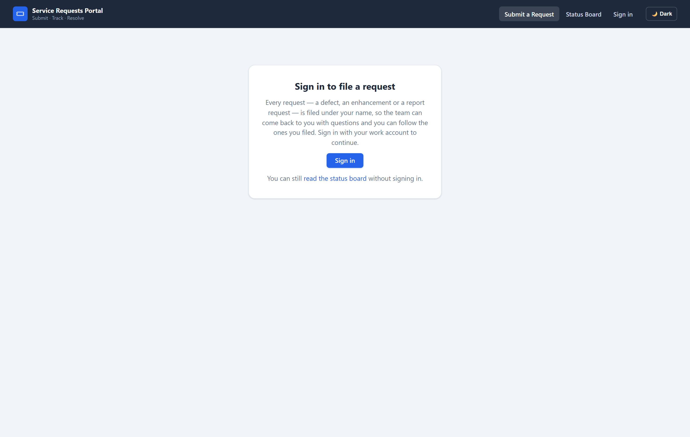

Every request is filed under your name, so the team can come back to you with
questions and you can follow the ones you filed. If you open the portal without
signing in, this is what you get — a **Sign in** button, and a reminder that the
Status Board is still readable without signing in.

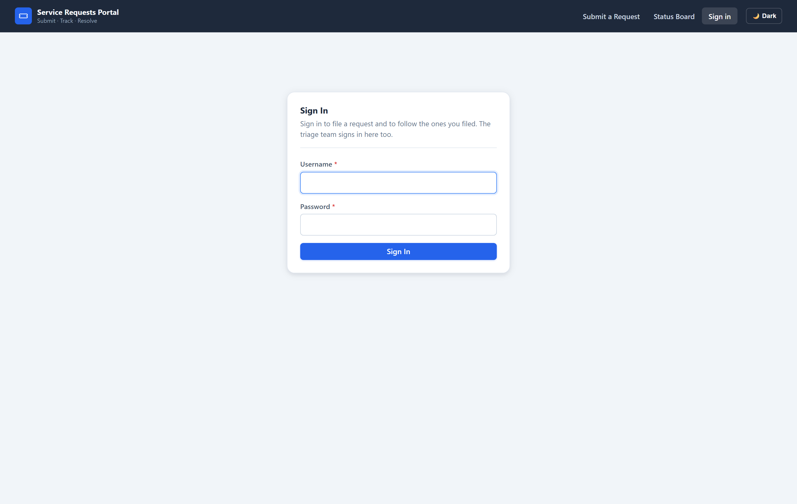

The same sign-in page serves everybody: requesters and the triage team both use it.
Where you land afterwards depends on your account — requesters go to the submit
form, the triage team goes to the queue.

> **Reading does not need a login.** The Status Board at `/public` is open to
> anyone. It is only *filing* that needs an account.

**If you were signed in and it stopped working**, you will see *"Your session has
expired. Sign in again and send this once more."* Your answers are kept — sign in
and send it again. Sessions last 8 hours.

## 1.2 What you can ask for

Three kinds of request, chosen at the top of the form. Picking one changes the
questions you are asked, because they are genuinely different things.

| Choose | When | You will be asked |
|---|---|---|
| **Defect** | Something is broken or behaving wrongly | Which screen, when it happened, what you saw, and how to make it happen again |
| **Enhancement** | Nothing is broken; you want something the system does not do | What you want and what it would save you |
| **Report request** | You need a report or a dashboard, new or changed | Whose data it comes from, what it is for, and either the measures you need or what should change about an existing report |

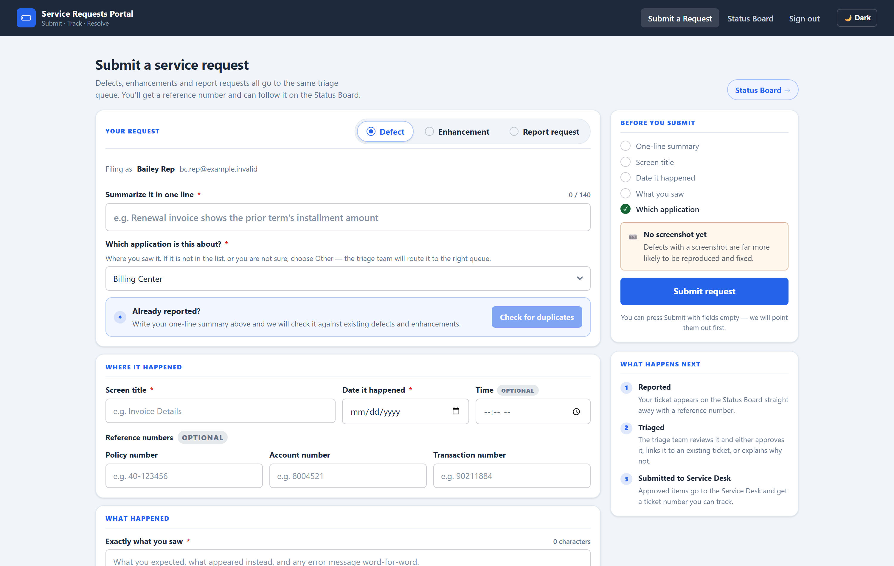

Two things on this page are worth knowing before you start:

- **"Filing as …"** at the top of the form is **who the request will belong to** —
  your name, and nothing else. It is not the application the request is about; that
  is the picker further down, and only you can answer it. (It used to read
  *"Filing as Bailey Rep (Billing Center)"*, which looked exactly like the answer to
  a question it was not answering. The team was never a property of the request.)
- **The rail on the right** — "Before you submit" — ticks items off as you type, and
  the **Submit** button lives there. You can press it with fields still empty: it
  will point them out rather than refusing to explain.

## 1.3 Filing a defect


Four sections, top to bottom.

**Your request** — your one-line summary. Keep it specific: *"Direct bill invoice
shows a zero balance while a payment is still pending"* is far more useful than
*"invoice wrong"*, and the duplicate check works better with it.

**Where it happened** — the screen title, and the date and time. Policy, account and
transaction numbers are optional but they are the fastest way for somebody to
reproduce what you saw.

**What happened** — what you expected, what appeared instead, and any error message
**word for word**. Then the steps that make it happen again.

**Do you need a workaround?** — tick this if you are **blocked on a live case right
now**. It is not the same as "please fix it": it tells the team somebody is waiting,
and it shows on the queue as a red banner until it is handled. Your request keeps
its place in the queue either way.

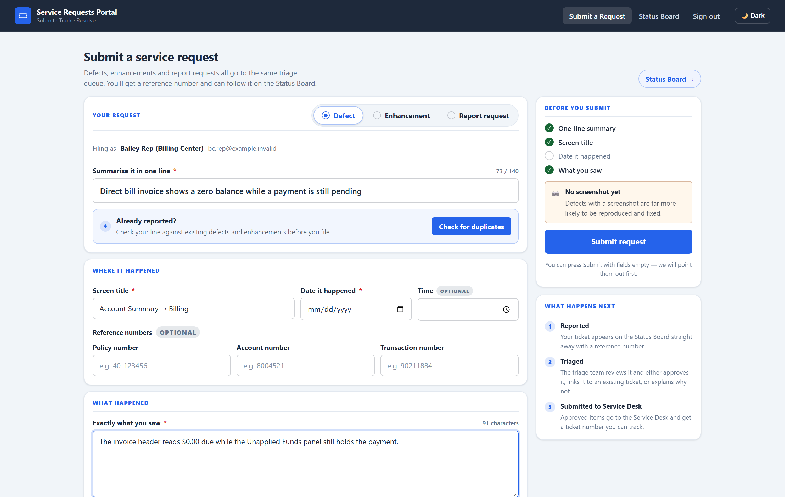

As you fill fields in, the rail ticks them off. Here four of five are done and the
"No screenshot yet" nudge is still showing — **defects with a screenshot are far
more likely to be reproduced and fixed.**

**If you press Submit with something missing:**

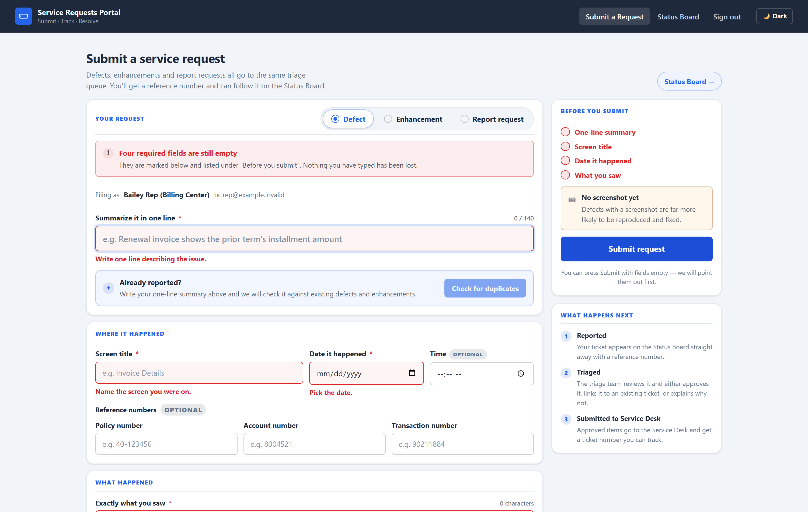

Every field that needs attention says so, in place, and the cursor jumps to the
first one. Nothing turns red while you are still typing.

## 1.4 Filing an enhancement

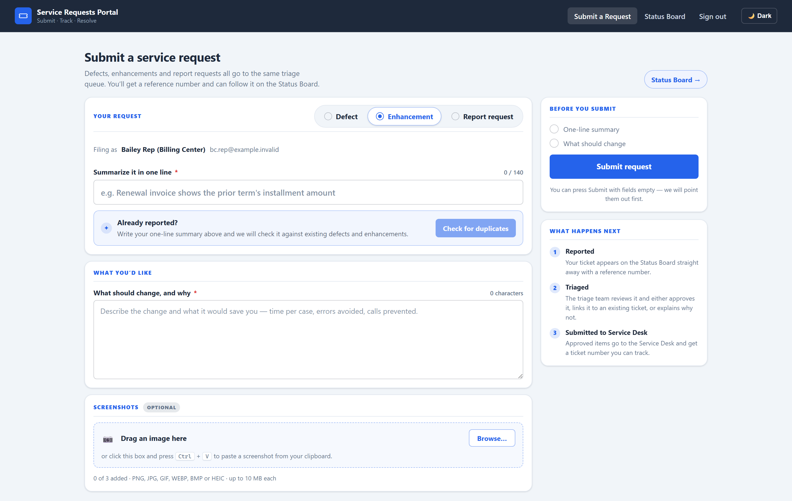

A shorter form, because there is nothing broken to describe. Say what you want and
**what it would save you** — time per case, errors avoided, calls prevented. That
sentence is what the request is prioritized on, so it is worth a minute.

## 1.5 Asking for a report or dashboard

Report requests go to the reporting analysts, not to the Service Desk. They are
built in-house, so the questions are about what you need rather than what is broken.

**First: whose data is it?**

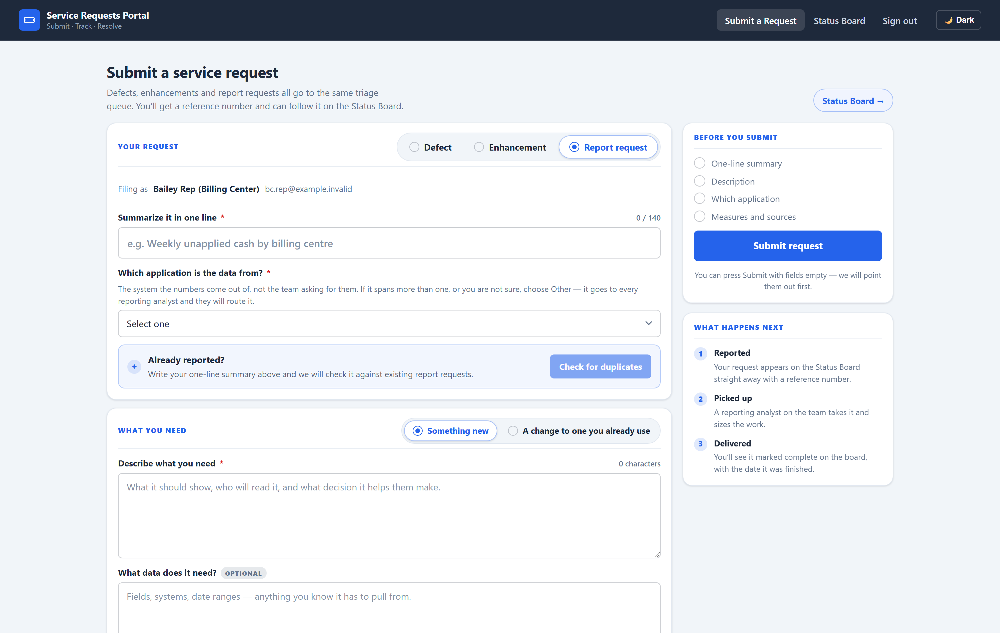

*"Which application is the data from?"* means **the system the numbers come out
of**, not the team asking for them. If it spans more than one, or you are not sure,
choose **Other** — it goes to every reporting analyst and they will route it.

**Then: something new, or a change to one you already use?**

| Something new | A change to one you already use |
|---|---|
|  | 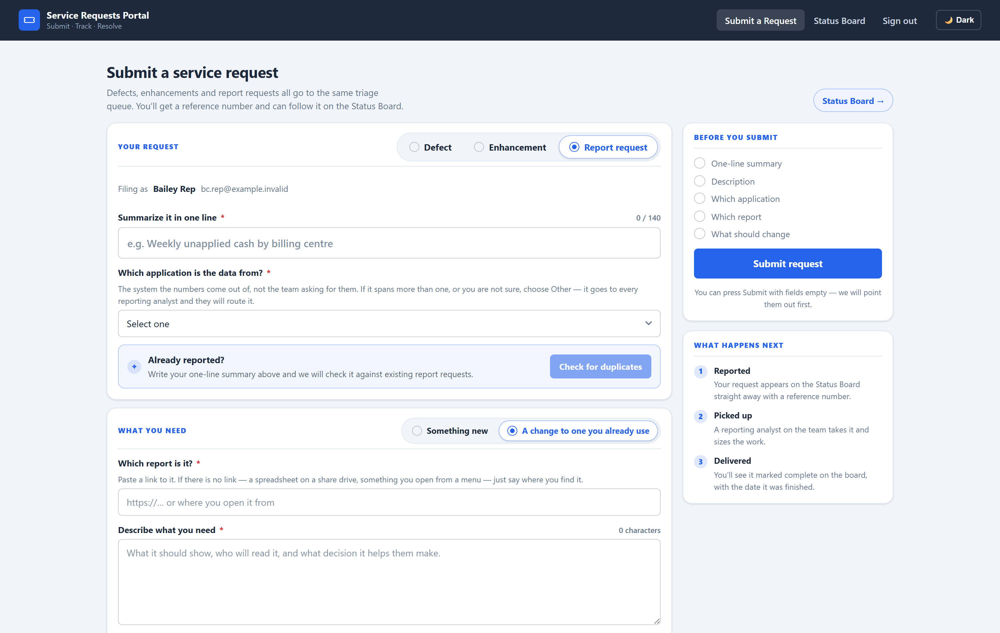 |

**Something new** asks for:

- **What you need** — what it should show, who will read it, and what decision it
  helps them make.
- **What data it needs** — fields, systems, date ranges. Anything you know.
- **The measures and where they come from** — one per line. *"Unapplied cash total —
  from the nightly billing extract"* is exactly the right level of detail. This is
  the field an analyst starts from.
- **Who to ask** — a name and email for the questions that will come up.

**A change** asks **which report first**, because nobody can change one they cannot
find. A link, a share-drive path, or *"the menu item I open it from"* are all valid
answers. Then what it gives you today and where that falls short, and what should
change — *"a new column, a different filter, a number that reads wrong, a different
cut of the same data."*

Both branches also ask **how often you will use it** (Daily / Weekly / Monthly /
Quarterly / Annually / One-off) and **your department**. Both help with sizing and
prioritization.

> **Report requests are private.** Only you can see one you filed — not the rest of
> the board. They name internal datasets, departments and often what somebody is
> trying to measure, so they are not public reading. A consequence worth knowing:
> the duplicate check on this branch only finds **your own** report requests, so it
> will not tell you that a colleague asked for the same dashboard.

## 1.6 Checking whether it has already been reported

**This is the most useful thing on the page.** Write your one-line summary, press
**Check for duplicates**, and see what already exists.

It searches **all time**, deliberately — a defect reported two years ago and since
fixed is exactly the answer you need. It also searches **only the kind of request
you are filing**, and says so, because a broken invoice screen has nothing to do
with a dashboard.

If nothing matches: *"None of these match what you saw? Carry on below — a second
report with fresh detail is more use to the team than none."* It describes what it
found; it never tells you not to file.

If you edit your summary afterwards, it offers a **re-check** rather than quietly
showing matches for the old wording.

## 1.7 Attaching a screenshot

Three ways, and the third is the one most people want:

1. **Drag** a file onto the drop zone.
2. **Browse** for it.
3. **PrintScreen, then Ctrl+V** anywhere on the page. You do not have to click the
   drop zone first.

Up to **3 images**, 10 MB each — PNG, JPG, GIF, WEBP, BMP or HEIC. Documents and
spreadsheets are not accepted here; put the detail in the description instead.

## 1.8 Following your request on the Status Board

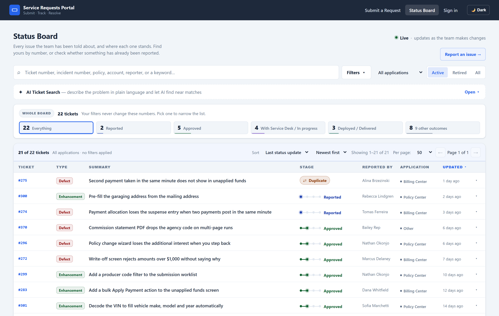

Every request the team has been told about, and where each one stands. It updates
live as the team works — no refresh needed.

**The tiles across the top describe the whole board**, and say so: *"Your filters
never change these numbers."* Clicking one filters the table to it; clicking it
again clears back to everything. **The band below the tiles describes the rows in
the table** and carries its own count.

**The four pips on each row are the position of your request**, which is easier to
read at a glance than a status word:

```
Reported ──── Approved ──── With Service Desk ──── Deployed
```

**Click a row to open it.**

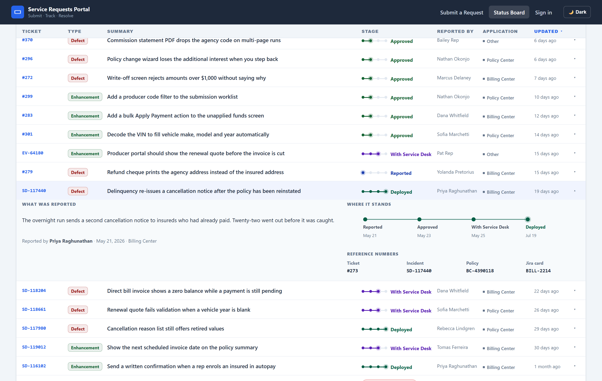

You get the description, the track with a **date under every stop it actually
reached** (and an em dash under the ones it has not), and — if it happened —
**"Moved between teams"**, showing that your request was handed to a different
queue, when, and between which two.

**Report requests travel a different track**, because they are never handed to the
Service Desk:

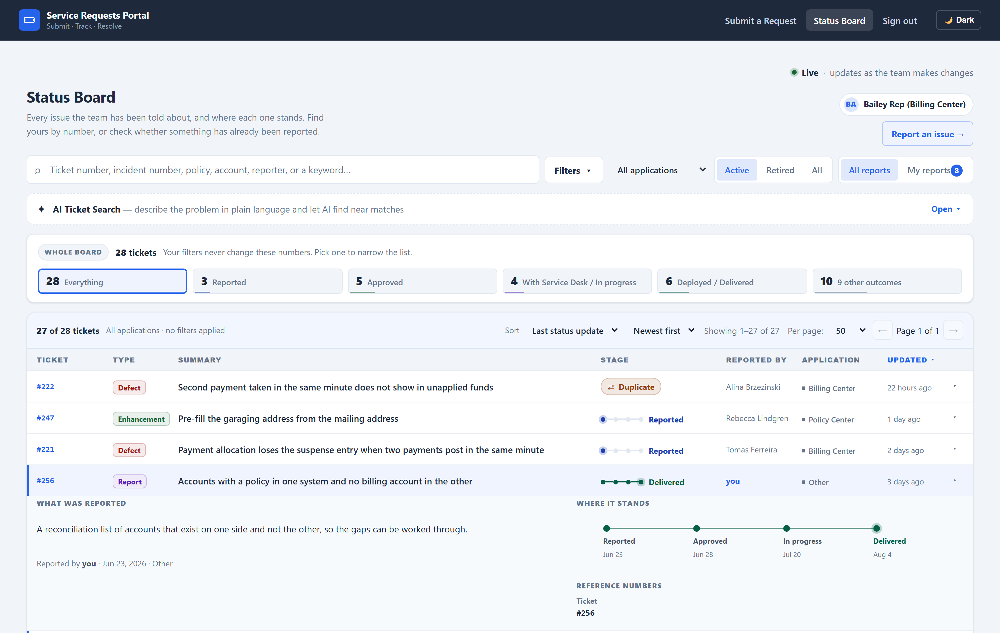

```
Reported ──── Approved ──── In progress ──── Delivered
```

**Some requests do not draw a track at all**, and that is deliberate:

- **Rejected · Duplicate · Retired** — these have ended. You get the outcome and a
  one-line explanation, because drawing a track would imply something more is
  coming.
- **On hold · Backlog · Future Consideration · Deferred** — these say *parked*
  rather than showing a stalled track.

**Filtering the board:**

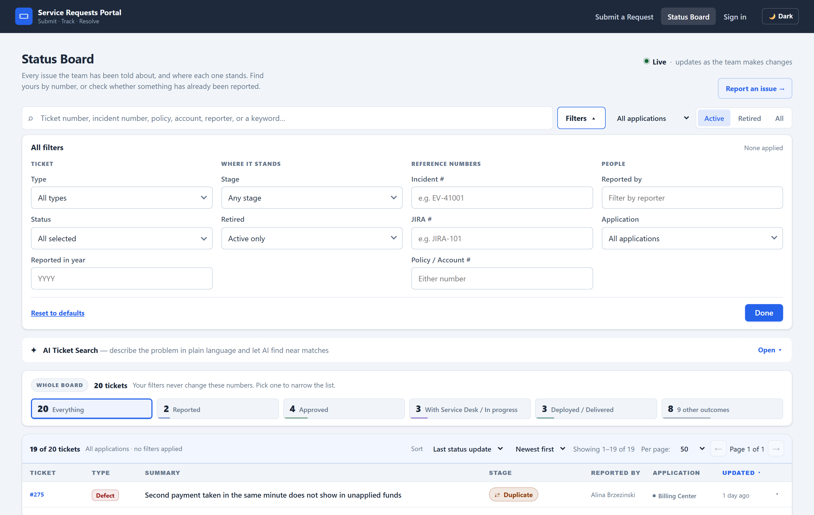

Search and the Active / Retired / All control are in the top row because they are
the most used. Everything else is behind **Filters**, which carries a count of how
many are applied. Applied filters show as chips you can remove one at a time.

**"My reports"** appears once you have some — it narrows the board to the requests
you filed.

## 1.9 Searching the board

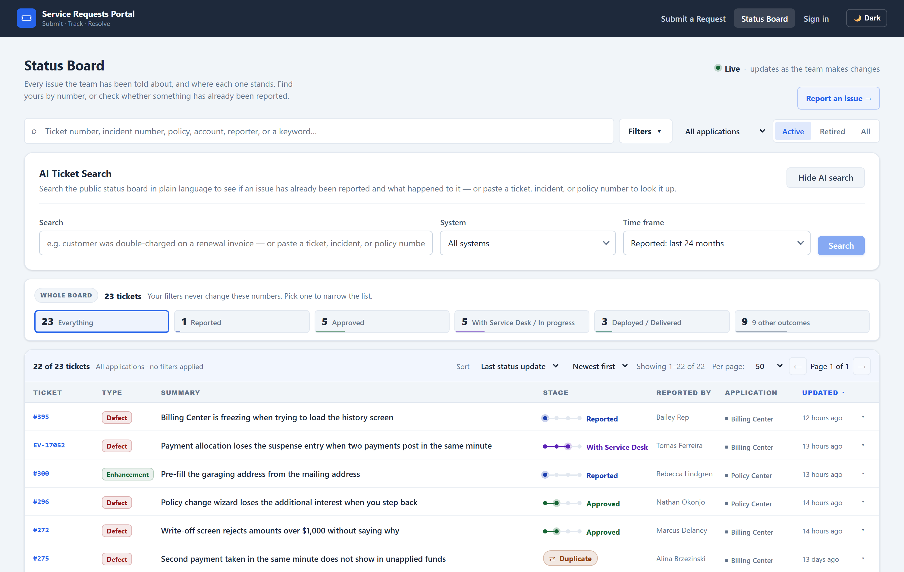

Describe an issue in plain language and see whether it has been reported and what
happened to it. Results come back in **two separate sections**, and the distinction
matters:

- **Closest matches** — requests that are *about the same thing*, whatever words
  they used.
- **Keyword matches** — requests whose **ID, incident number, Jira number, policy,
  account, reporter or text literally contains what you typed**. This is where a
  pasted incident number or policy number will be found.

The summary **describes what it found**. It will not tell you whether your issue is
a duplicate — that is a triage decision, and it says so rather than guessing.

## 1.10 Dark mode and phones

The **Dark / Light** button is in the header, top right. Your choice is remembered,
and the first time you visit it follows your operating system's setting.

| | |
|---|---|
| 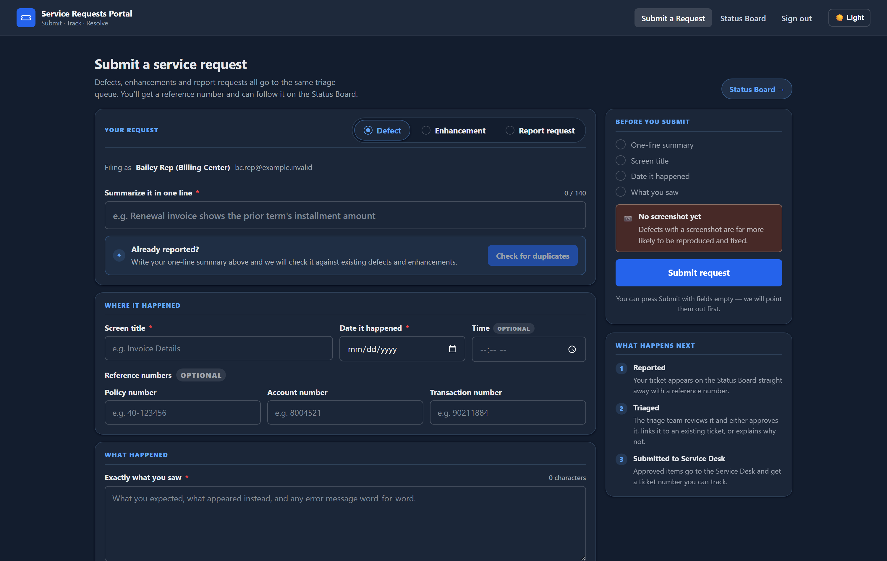 | 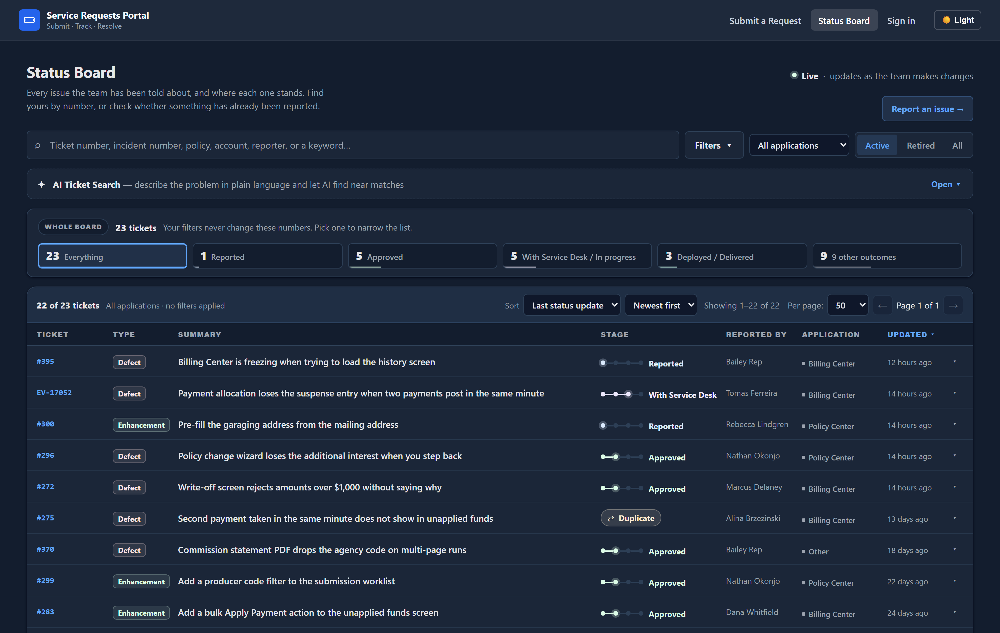 |

Every screen works on a phone.

| | | |
|---|---|---|
| 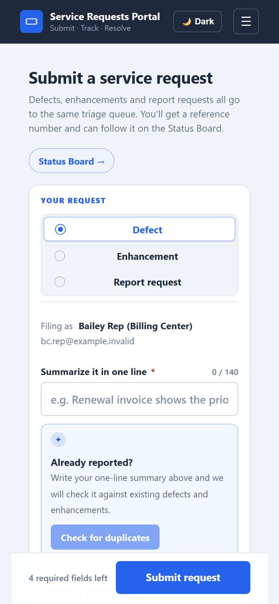 | 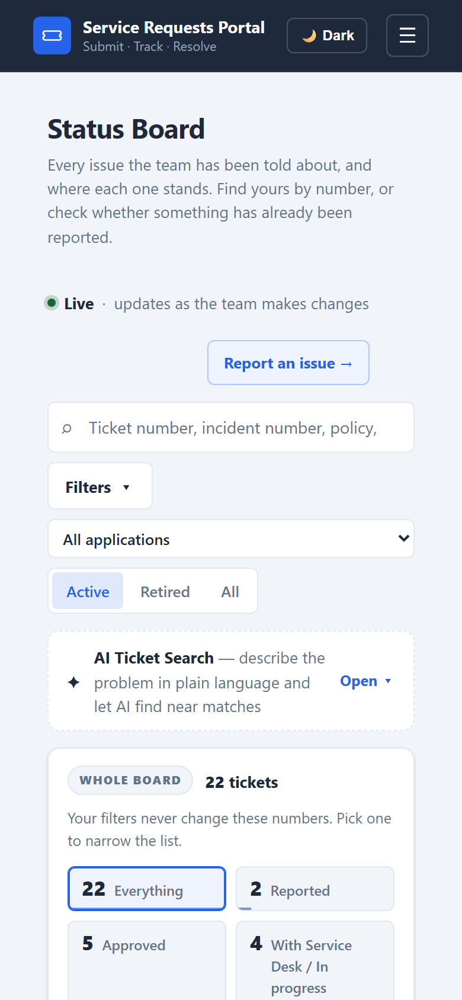 | 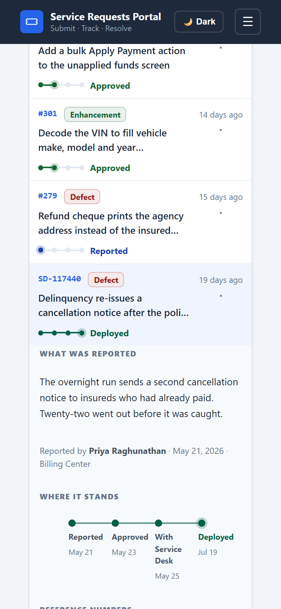 |

On a narrow screen the **Submit** button moves to a bar pinned to the bottom, so it
is always reachable.

---

# Part 2 — For the triage team

## 2.1 The queue


Your working surface. From the top:

1. **Alert banners.** *"N new form submissions are awaiting review"* and *"N
   reporters are waiting on a workaround to finish their cases"*. Each has a button
   that filters the table to exactly those. Taking one leaves a **"Back to …"** chip
   so you can return to where you were — answering "what's new?" should not cost you
   your place.
2. **The `WHOLE QUEUE` strip.** Filter-independent counts, one card per headline
   status, with the rest summed into an expandable "other statuses" card. *"Always
   the full picture — your filters never change these numbers. Click one to filter
   the table to it."*
3. **The command bar.** Search · Filters · ⚙ · the application queue · the kind of
   work · Active / Retired / All.
4. **Applied filter chips**, each removable on its own.
5. **Ticket search**, collapsed so the table stays above the fold.
6. **The `FILTERED VIEW` band.** Counts for the rows below, **plus** Policy Premium
   Impact, Direct Dollar Impact and Policies Impacted for the current view.
7. **The table.** Sortable, inline-editable, multi-select.

**Only `New` rows carry a colored stripe down the left.** Every status used to have
one, which meant the stripe distinguished nothing. The status is already in its own
column with its own badge; the stripe now marks the one thing that column cannot say
at a glance — *nobody has looked at this yet.*

**Four columns are editable in place**, without opening anything: status, cleanup
status, public visibility and type.

### The two kinds of work

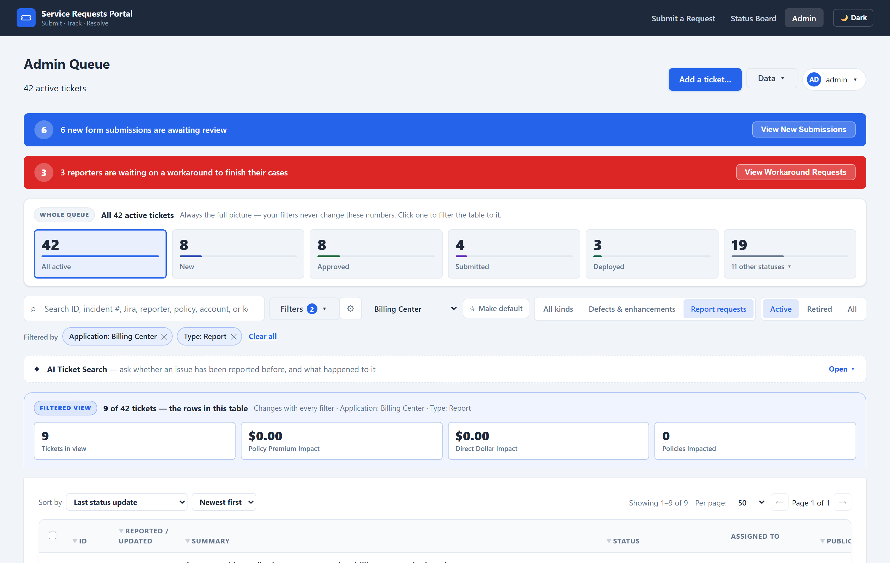

**All kinds · Defects & enhancements · Report requests** in the command row. This is
one click, and the report queue is genuinely a different view: its own columns (ID ·
Reported/Updated · Summary · Status · Assigned To · Public) and its own saved
layout. Switching does not lose your column choices for the other queue.

### The application queue


You see only the applications you have been granted. If that is more than one, the
select lets you switch between them, and **"Make default"** pins one as where you
land next time.

**Switching is a look; pinning is a decision.** They are separate clicks on purpose
— glancing at another team's queue should not silently change where you start
tomorrow.

### `Other` — the catch-all working list

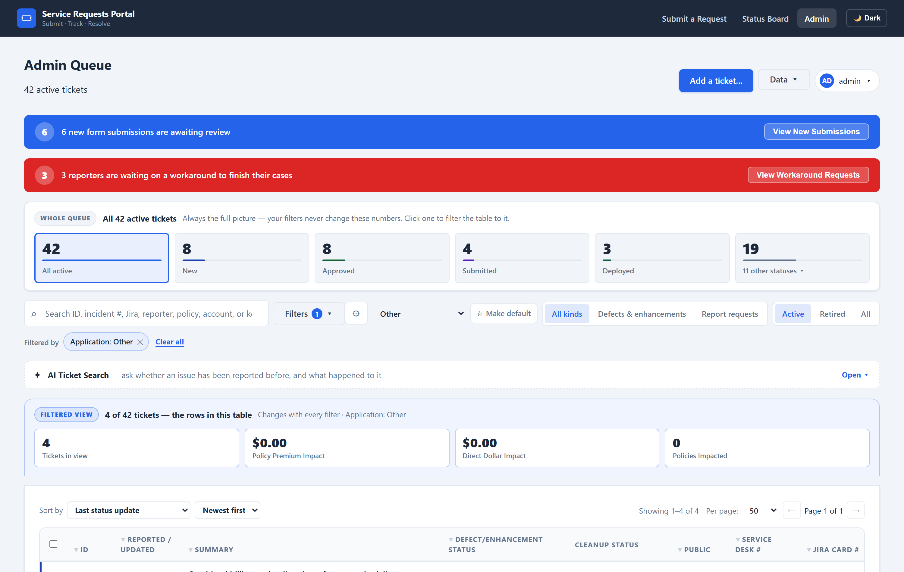

`Other` is a real queue, not a holding pen. Two quite different things land in it:

- **A system with no Service Desk connection.** There is no configured application
  to raise its tickets in, so the work is tracked here and the Service Desk ticket
  is raised **by hand** (§2.6).
- **A system nobody has identified yet.** Somebody reported a problem or asked for
  a report and it is not yet clear whose data it is about.

Either way the work still has to be tracked, so it is tracked here — think of it as
a task list. Reports get built out of it, defects and enhancements get worked out of
it, and it takes **every kind of request**.

**A ticket in `Other` can also appear in your own queue**, without leaving `Other`.
See §2.4 — *Also show it in*.

### What an analyst sees

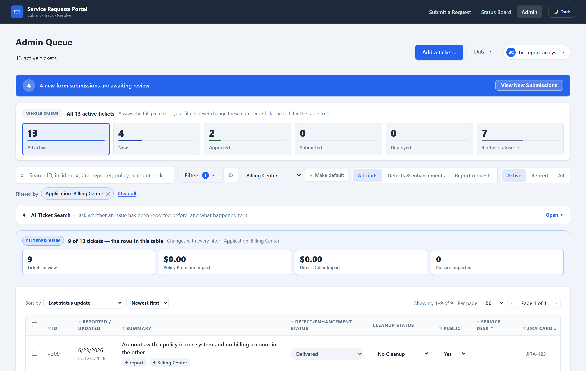

The same page as a reporting analyst whose grant covers report requests on one
application. **No defect is on this screen**, there is no application switcher
(there is nothing to switch to), and there is no *Manage metadata* in the menu. This
is not the queue with rows hidden — it is what the server sends.

> **Your grant covers an application *and* a request type, and both are enforced.**
> If you work report requests for Billing Center, that is what you get — switching
> to *All kinds* shows you no defects, because there are none to show you. The same
> applies to the banner: you are told about new requests and workarounds **in the
> work you actually do**, and nothing else.

## 2.2 Finding things

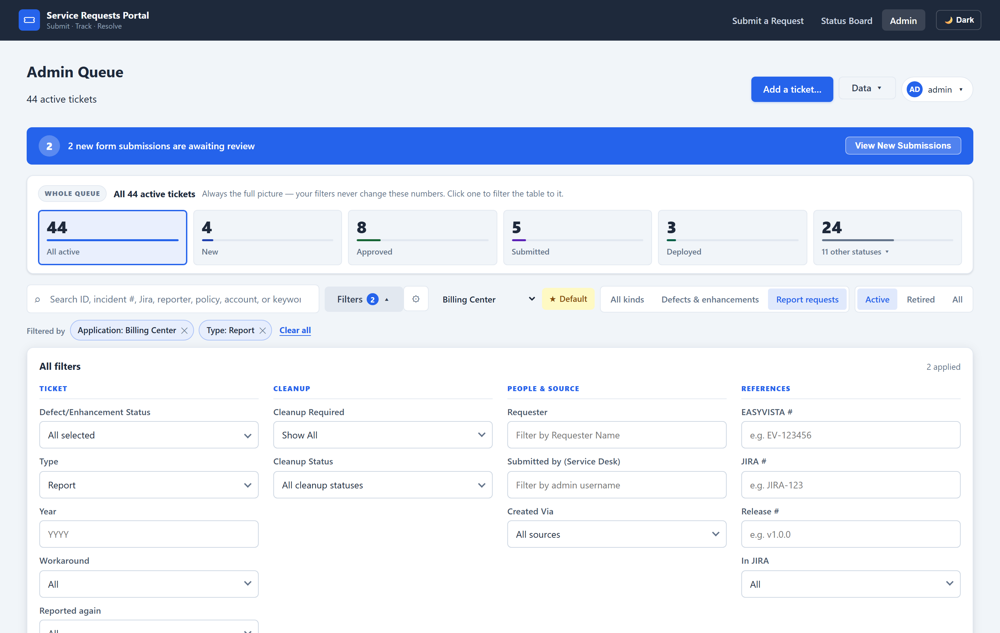

**Search** covers ID, incident number, Jira number, reporter, policy, account and
keywords. **Filters** holds the rest, in named groups so you can jump rather than
read all of them.

Two things worth knowing:

- **The workaround filter has three states, not two.** A ticket nobody flagged is
  neither *open* nor *handled*, so "handled" does not sweep it in.
- **Sorting is separate from which columns you show.** You can sort by a field whose
  column is hidden. Both the header click and the sort control do the same thing.

**Ticket search** works the same as on the public board, but over everything you can
see rather than only public rows.

## 2.3 Making the queue yours

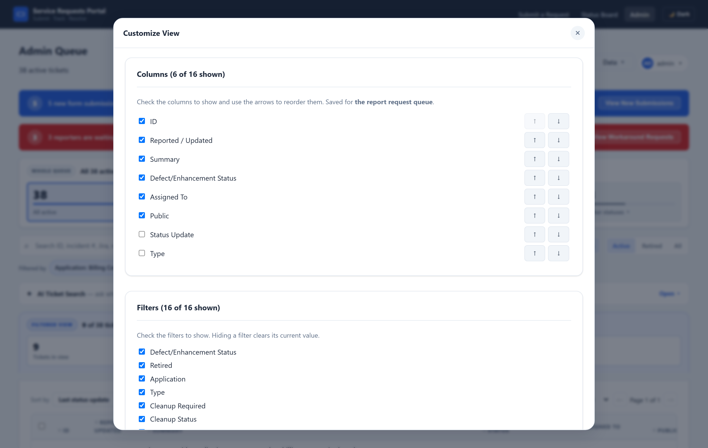

The **⚙** button. Choose which columns show and in what order, and which filters
show. **Saved to your account, not your browser**, so it follows you between
machines.

A filter you hide has its **value cleared**, so a filter you cannot see can never
quietly be constraining the table.

## 2.4 Working a ticket

Click any row. **Six tabs**, and the things that need your attention — the identity
band, the alerts and the action bar — sit **outside** them, so nothing important can
hide behind a tab you are not on.

### Triage — where it opens

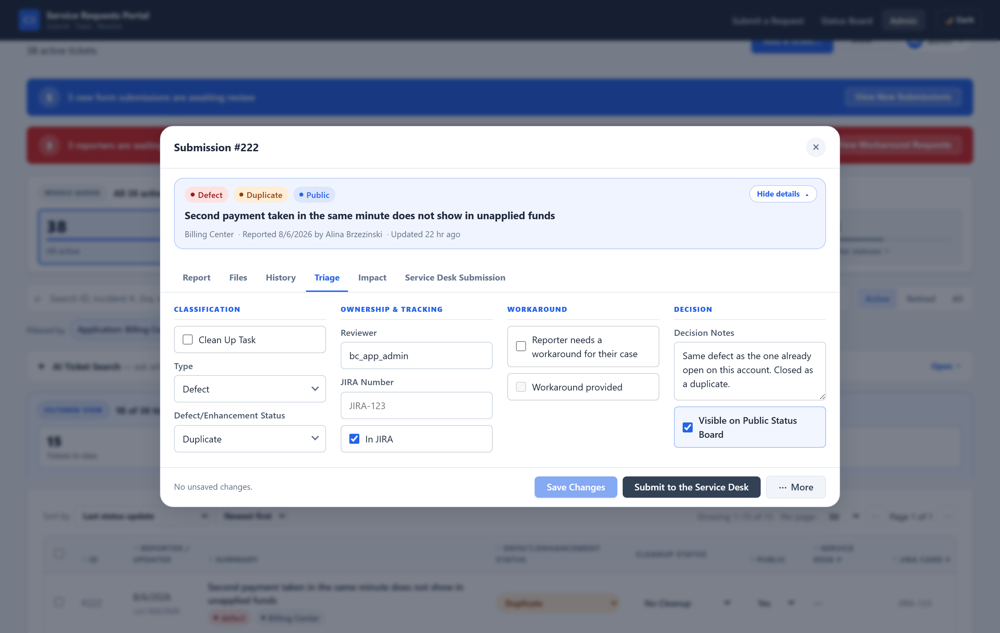

The decisions you make on nearly every ticket: **status**, priority, duplicate
reference, decision notes, Jira number, public visibility, retire, and who it is
assigned to.

**Reviewer fills in with your name when you save**, not when you open — otherwise
every ticket would look edited the moment somebody glanced at it.

**Which statuses you can choose depends on the type.** A report request offers its
nine; everything else offers the rest. See
[the appendix](#appendix-what-the-statuses-mean).

#### "Also show it in" — putting an `Other` ticket on your own list

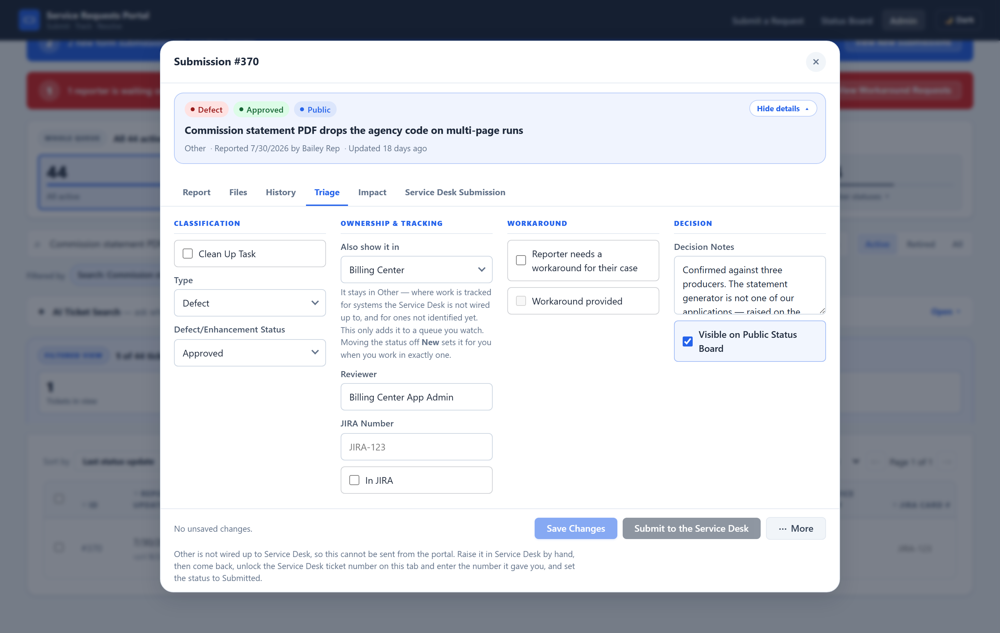

Two things in one picture: the picker under *Ownership & tracking*, and the footer
where **Submit to the Service Desk is greyed out** with the note telling you what to
do instead (§2.6).

**Only on a ticket in `Other`**, under *Ownership & tracking*, there is a picker
offering the queues you work in.

`Other` is where work is tracked for systems the Service Desk is not wired up to,
and for ones nobody has identified yet (§2.1) — so if you pick one up, you have had
two bad options: move it into a real application, which claims the system *is* that
one, or leave it where you never see it again.

This is the third. Pick a queue and the ticket **also appears there**, while
staying in `Other`:

- It does **not** move. `Other` is still its application, so the Service Desk
  hand-off stays correctly greyed out and the incident number stays something you
  type in (§2.6).
- It shows up in **both** lists — yours and `Other`.
- Only queues **you** work in are offered, so nobody can put work on another team's
  list.
- **Moving the status off `New` sets it for you** when you work in exactly one
  queue. With more than one, it waits for you to choose — guessing would put the
  ticket on a list you did not pick, which is harder to notice than it not
  appearing at all.

Choose *"Nowhere else"* to take it back off your list. If the ticket is later
redirected into a real application, the association is dropped: that queue has its
answer now.

### Report — what they actually wrote

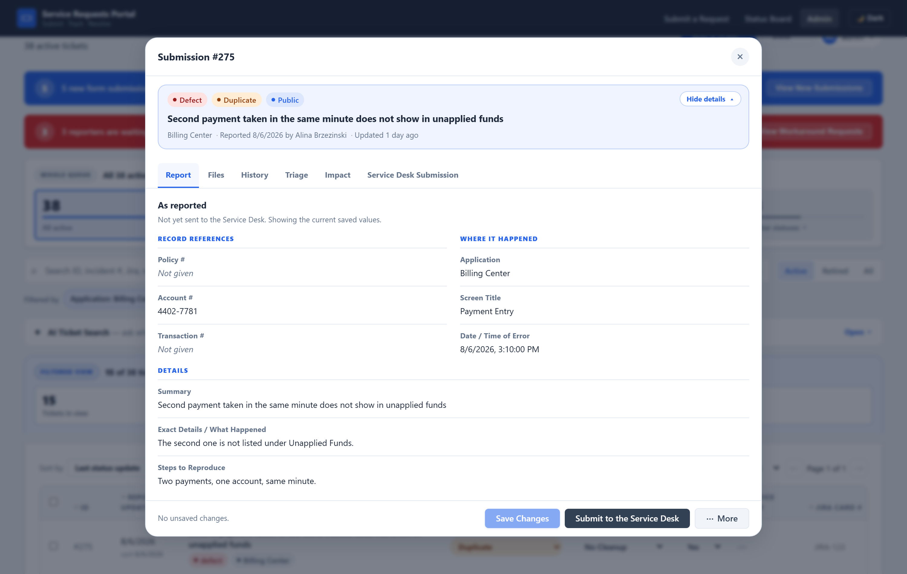

The request as it came in, **read-only**. This is a record, not a working copy — the
editable versions of these fields live on the Service Desk tab, which is the only
reason to change them.

### Impact

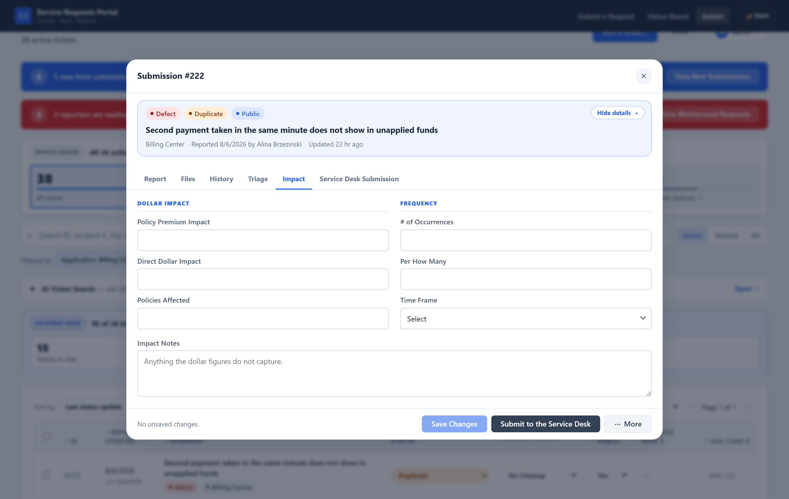

One judgement in one place: policy premium impact, direct dollar impact, policies
affected, how often it happens, and impact notes. The dollar figures feed the
totals in the `FILTERED VIEW` band.

### History

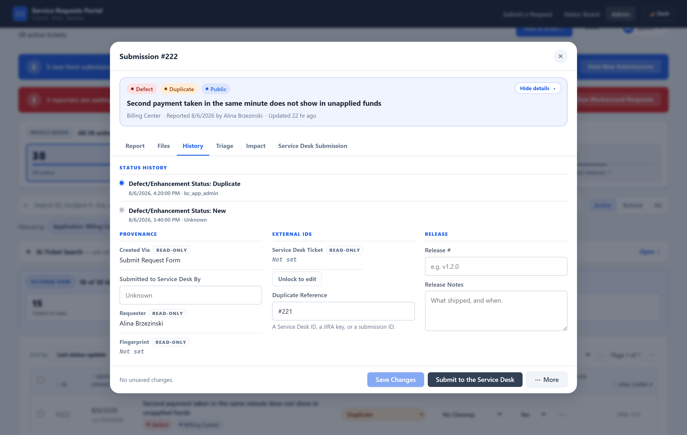

Every status change, newest first, with who made it and when — plus where the ticket
came from, its external identifiers and its release metadata.

### Files

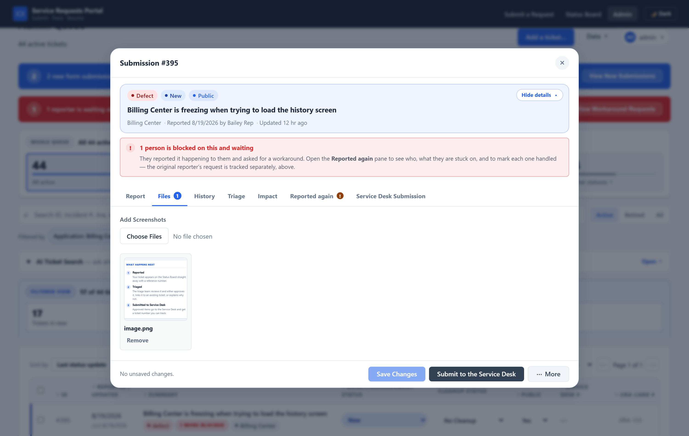

Screenshots and evidence. You can add and remove them here.

### Service Desk Submission

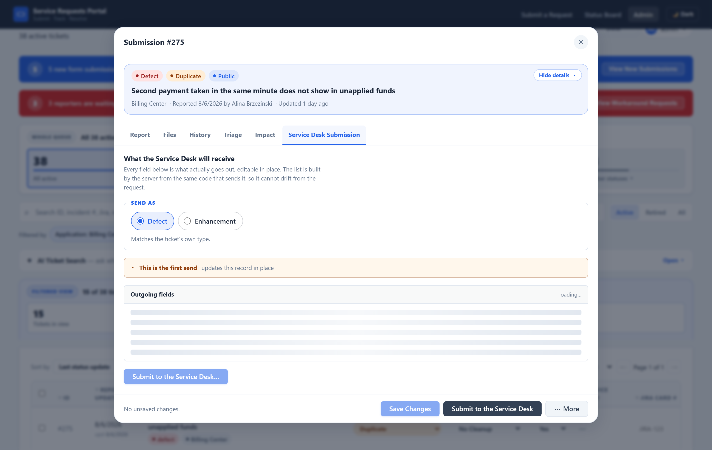

See [2.6](#26-sending-to-the-service-desk).

### The action bar, and More

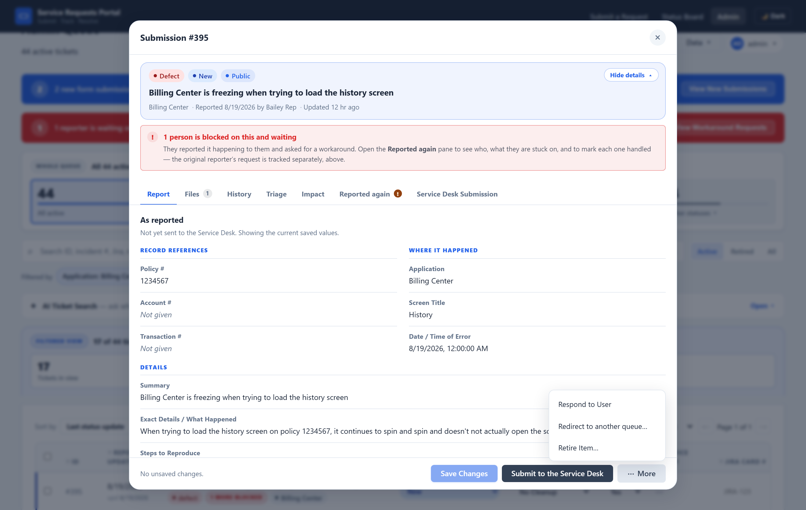

**Save Changes** is the one primary action. The outbound action sits beside it, and
the rarely-used ones — **Retire**, **Change visibility**, **Redirect** — are behind
**⋯ More**. Retiring asks first. Redirect is hidden when there is nowhere to send
it.

### Two things that will interrupt you, and what they mean

- **"Another admin has this ticket open."** Advisory — they may have walked away.
  You can **edit anyway**.
- **"This ticket lives in a queue you do not administer."** Not overridable. The
  server will refuse the save, so offering an override would only produce an error.

**If somebody else saves while you have edits open**, you get a **field-by-field
comparison**: what you changed, what they changed, and which to keep. If you had *no*
unsaved edits, it just refreshes quietly — there is nothing to lose.

## 2.5 Working a report request

A report request has the same six tabs, but two of them are different.

**Its Report tab has its own layout**, because a dashboard that does not exist yet
has no screen, no error message and no steps to reproduce:

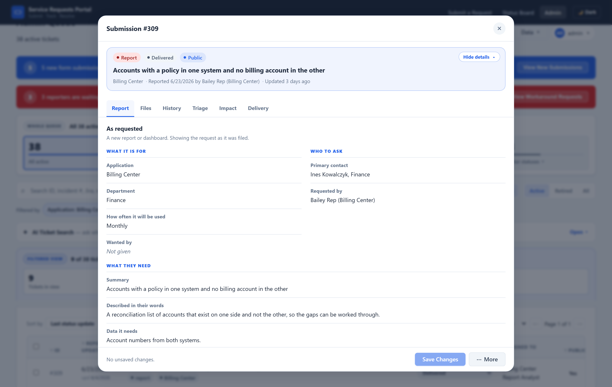

- **What it is for** — the application, the department, how often it will be used,
  and when they want it.
- **Who to ask** — the primary contact, and who requested it.
- **What they need** — the summary, their description, the data it needs, and either
  the measures and sources or which report and what should change.

**Its sixth tab is Delivery, not Service Desk** — nothing about a report request
goes to the Service Desk:

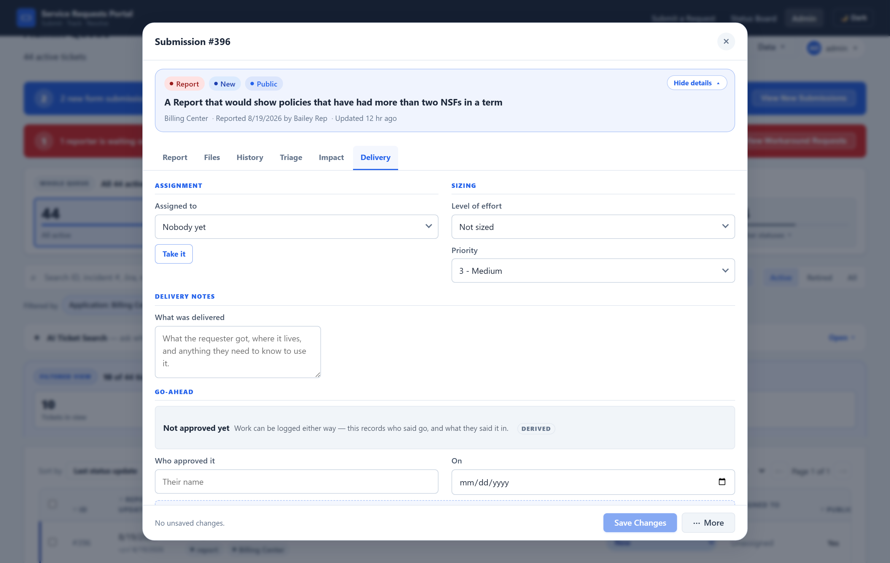

| Section | What it is for |
|---|---|
| **Go-ahead** | Who approved the **resources** to build this, and when. A manager or supervisor saying yes to the spend — which is a **different question** from triage saying the request is valid. You can attach the approval itself as evidence. Both a name and a date are needed before it counts as approved. |
| **Level of effort** | S (up to 2 days) · M (up to a week) · L (up to a month) · XL (more than a month) |
| **Hours** | One entry per sitting: who, how many hours, and **the day the work happened** — not the day you typed it in. Quarter-hour granularity. This is what the throughput page reports on. |
| **Assigned to, and the trail** | The current holder, plus every hand-over before them. Reassigning does not erase who held it. |
| **Delivery notes** | What you actually delivered, in your words — including the compromises. *"Agency grouping comes from the producer code, so accounts with no producer land in an Unassigned bucket — agreed with Renata as acceptable."* This is the field the requester's question gets answered from six months later. |

**Marking a report request `Delivered` records the completion date automatically**,
which is what the throughput page counts by.

**Also missing from a report request, on purpose:** Release # and Release Notes
(nothing ships), and the Workaround section on Triage (nothing is broken). Its
Impact tab is impact notes alone — dollar impact and policies affected are defect
measures.

## 2.6 Sending to the Service Desk

The Service Desk tab shows **exactly what will be transmitted**, editable in place,
what sending will do, and what is stopping it.

Three things to know:

1. **The preview cannot lie.** It is built by the same code as the real request.
2. **The Service Desk accepts a defect or an enhancement and nothing else.** A
   cleanup-only task must have a type chosen before it can go. Which fields *block*
   the send follows the type you choose, not the ticket's own.
3. **Re-sending does not update the existing incident.** It creates a **new** ticket
   here and a **new** incident there, linked both ways, and leaves the original
   alone.

**A report request cannot be sent at all**, and the button is not offered.

### When the application is not wired up to the Service Desk


Some systems have no Service Desk catalog configured, so the portal cannot raise a
ticket in them. **`Other` is the clearest example** — it is the queue for exactly
that case (§2.1).

For those, **Submit to the Service Desk is greyed out**, and the reason under the
buttons tells you what to do instead:

> *"Other is not wired up to Service Desk, so this cannot be sent from the portal.
> Raise it in Service Desk by hand, then come back, unlock the Service Desk ticket
> number on this tab and enter the number it gave you, and set the status to
> Submitted."*

So the procedure is:

1. Raise the ticket on the Service Desk site yourself.
2. Come back here, open the **Service Desk** tab and click **Unlock to edit** beside
   the ticket number.
3. Type in the number it gave you and save.
4. Set the status to **Submitted** on the Triage tab.

The ticket now carries the reference to the real incident, and the board reads the
same as one the portal sent itself.

**The incident number can be edited behind an unlock.** For a ticket the portal
sent, that number is its own record of what it did — so changing it is deliberate.
For an application whose tickets are raised by hand, this is where the number goes.

> **Transmission is off unless it has been deliberately switched on.** Having
> credentials configured is not enough. If sending is not live, the flow still works
> end to end for demonstration and says so.

## 2.7 Handing a ticket to another team

**⋯ More → Redirect.** Pick the receiving application and add a note.

**The ticket moves** — it is not copied. Three consequences:

1. **It lands as `New`** for the receiving team, who have not triaged it. Its history
   travels with it, so they can see it was `Approved` when it was sent.
2. **Your team keeps reading it and stops changing it**, immediately. You can still
   follow where your ticket went.
3. **Your note is internal.** The requester sees *that* their request moved, when,
   and between which teams — never what was said about it.

## 2.8 Doing things to many tickets at once

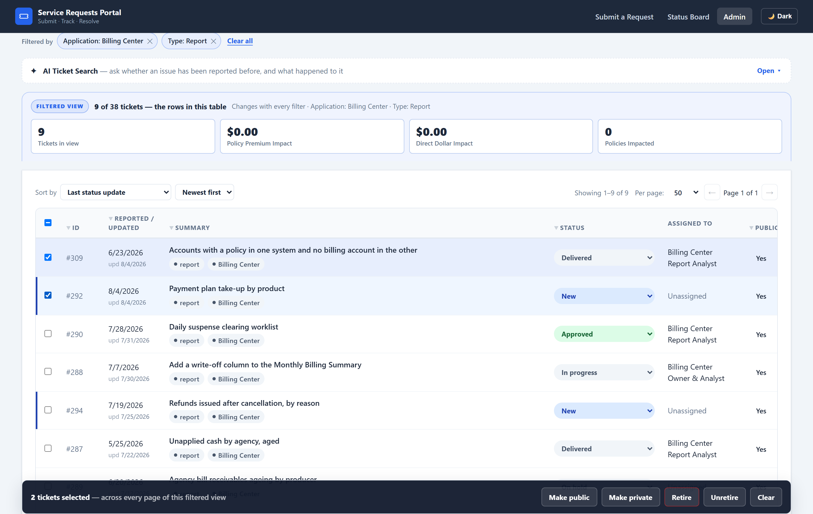

Tick rows to raise the bulk bar. You can **retire**, **unretire** and **change public
visibility** across a set.

> **Read the scope in the bar.** The header checkbox selects **the entire filtered
> set, across every page** — not just the rows you can see. The workflow is *filter
> first, then select all, then apply.*

Changing a filter clears your selection, on purpose: a selection must never straddle
two different filtered sets.

## 2.9 Adding a ticket by hand

**Add a ticket…** — for something reported by another channel, or recorded after the
fact. Two modes across four kinds of work.

**New ticket** files it as of now. **Historical ticket** is the backdated mode: it
asks for the real reported date and the status the ticket already had, and builds the
timeline from them.

| | |
|---|---|
| 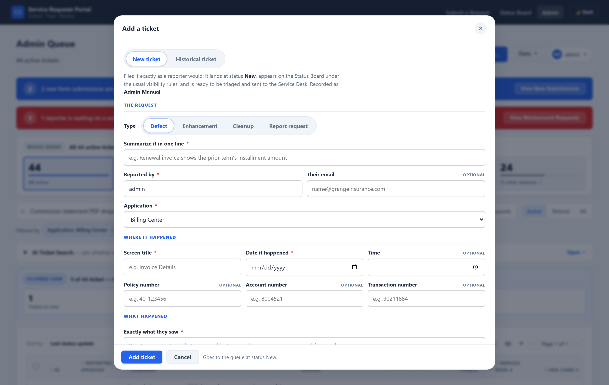 |  |
| **New ticket → Defect** | **Historical ticket → Defect** |
| 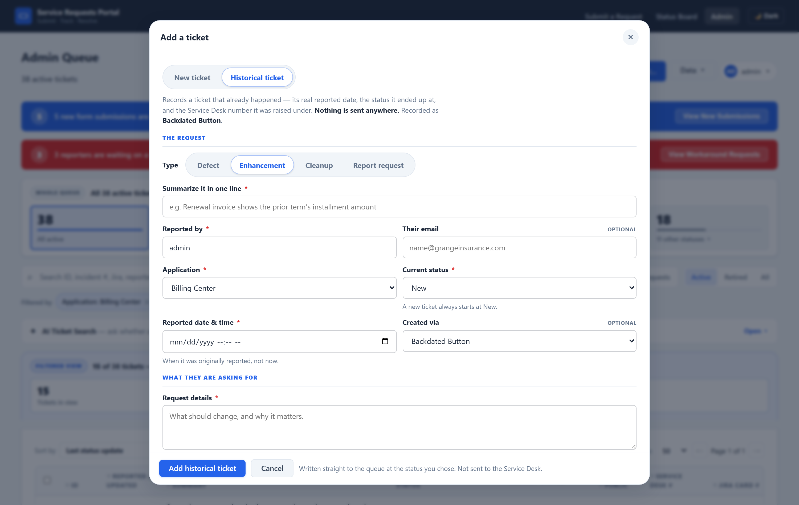 | 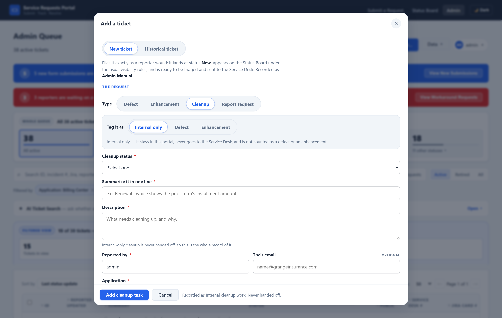 |
| **Historical ticket → Enhancement** | **Cleanup**, tagged Internal only |
| 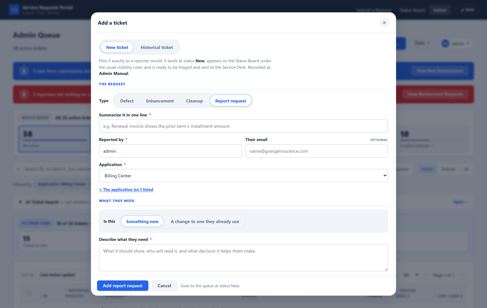 | 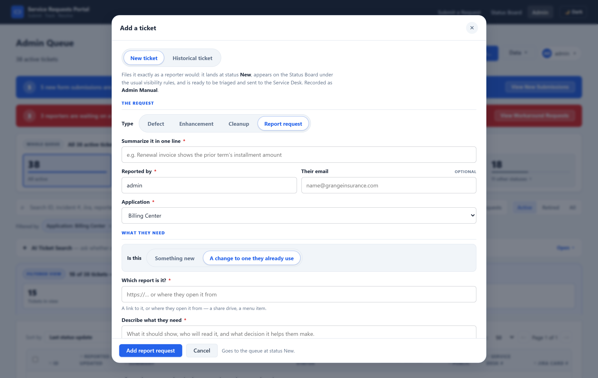 |
| **Report request → Something new** | **Report request → A change** |

**A cleanup task is internal work** — tidying, archiving, removing something unused.
It is not a request type of its own: it is a flag on a defect or an enhancement, and
the **Tag it as** row records which. **Internal only** means it was never anybody's
bug report, and it stays private by default.

> **A report request you add by hand has no requester attached**, so it will not
> appear on that person's board. Only a request filed through the form belongs to
> somebody. An admin recording somebody else's request cannot claim it for them.

## 2.10 Adding an application, when it isn't in the list

Reporting analysts build reports for systems the portal does not otherwise track.
Before this, every one of those had to go into `Other`, so the analyst's own record
lost **which system the data came from** — the one thing that field is for.

If you work report requests, you can add one by typing its name in. The control sits
in **two** places, and it is the same control:

1. **Add a ticket… → Report request**, under the Application picker — you are
   recording a request for a system that is not in the list.
2. **⋯ More → Redirect**, on a report request — you have realized an `Other` request
   is really Marketing Analytics'.

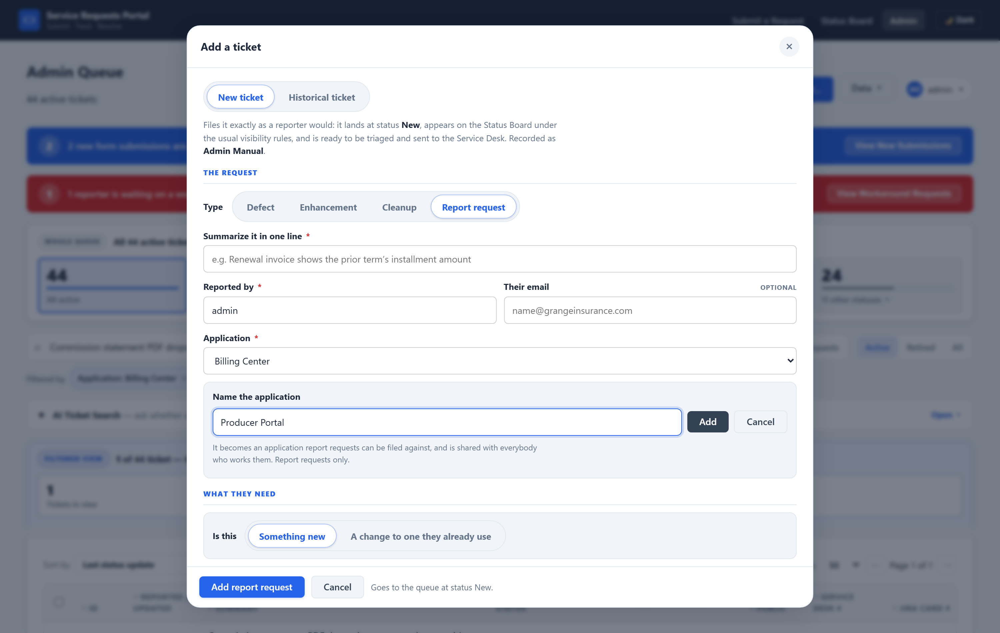

Click **“+ The application isn’t listed”**, type the name, press **Add** or Enter.

What happens then:

- It is created as a **reports-only** application. It accepts **report requests and
  nothing else** — so it is not offered when you are filing a defect or an
  enhancement, and it is not a redirect target for one.
- It is **shared immediately with everybody who works report requests**, anywhere.
  An application is a queue, and a new one nobody can see would be worse than no
  application at all.
- It appears in the picker you just used, **already selected**.

Refusals say why and keep what you typed:

| What you typed | What you get |
|---|---|
| A name already in the list | *"Billing Center is already in the list"* |
| A name that exists but is **switched off** | *"… exists but is switched off. A super user can switch it back on."* — you cannot see that row, which is why the message says so |
| Nothing, or over 60 characters | It tells you |

> **Renaming or retiring an application is still a super user's job**, on Manage
> metadata (§2.13). Creating one touches no existing ticket; renaming one renames it
> on **every ticket that holds it**, which is a different kind of act.

## 2.11 Excel, both directions

**Data → Export Excel** or **Import Excel**.

### Export

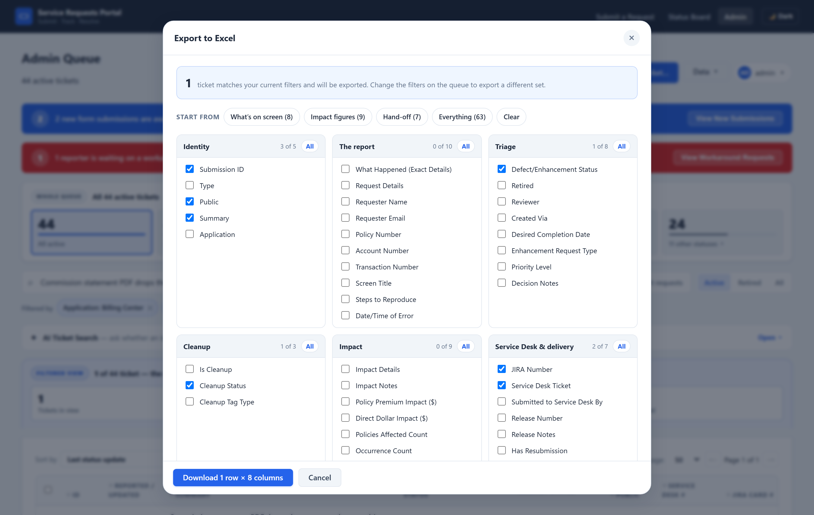

Pick your fields, grouped, with presets (**Everything** / **Clear**). It exports
**what your current filters show**, through the same access rules as the queue — so
you cannot download more than you can see.

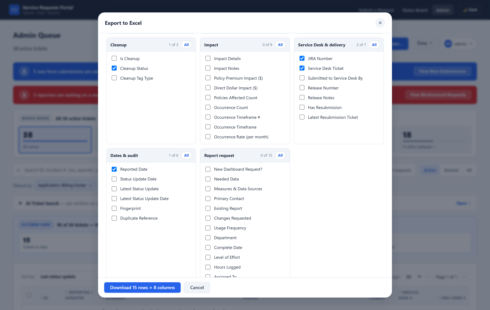

The **Report request** group carries the analyst's half: level of effort, assignee,
Approved By, Approved Date, Delivery Notes and **Hours Logged**, which is the total
of every hours entry.

### Import

**Step 1 — the file, and what kind of tickets it holds.**

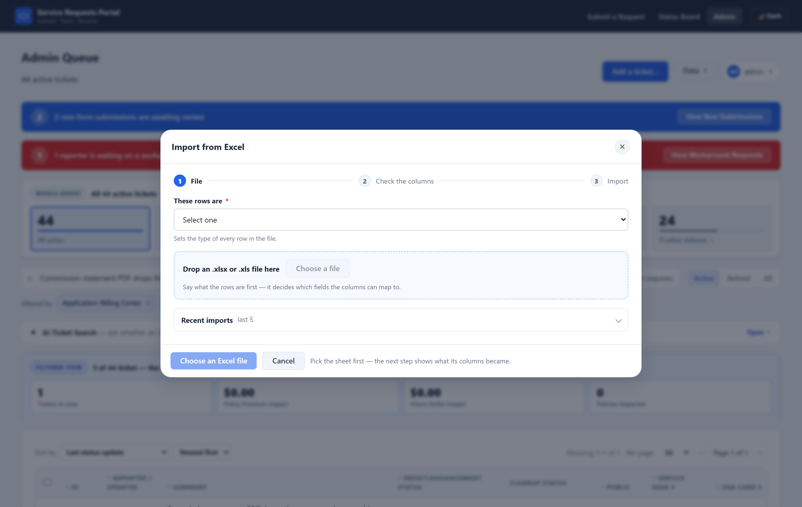

**"These rows are"** is not optional and not cosmetic: **it sets the type of every
row in the file.** A sheet of report requests imported as defects loses every report
column. One file, one kind.

**Step 2 — check the columns.**

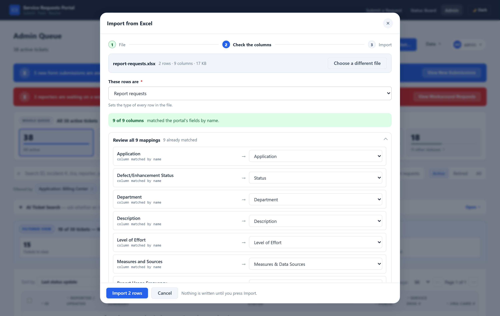

Most columns match themselves — the green banner says how many. The point of this
step is the ones that did not: expand **Review all N mappings** to see everything and
correct anything. You also get **the first rows as they will be imported**, before
anything is written.

Values the portal does not recognize — a status it does not have, a level of effort
that is not on the list — are surfaced here for a decision rather than silently
dropped.

**Step 3 — import.**

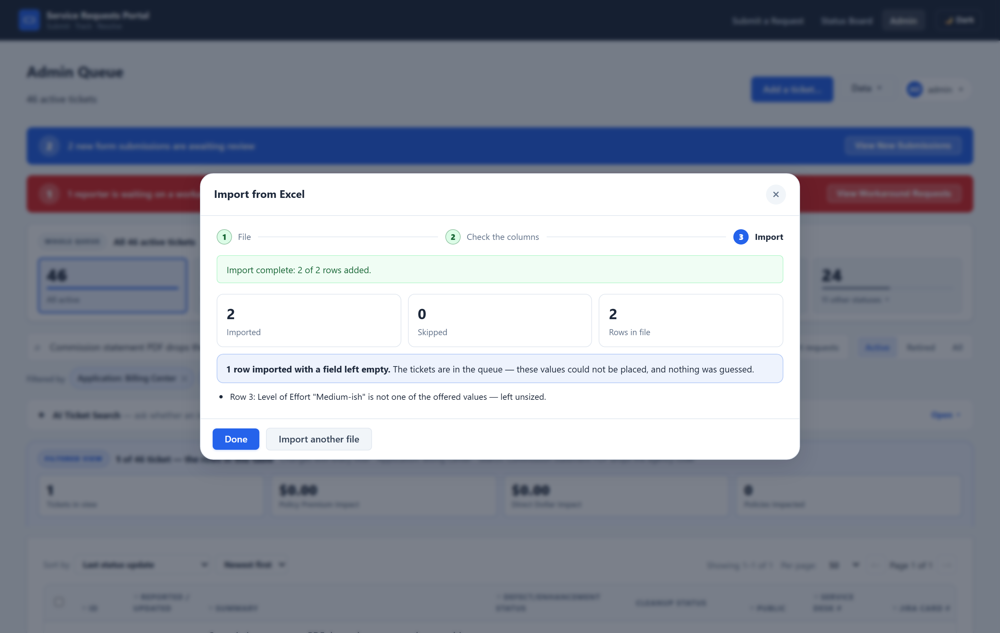

*"Nothing is written until you press Import."* Afterwards you get what landed, what
was skipped and why, and — separately, in a quieter banner — **warnings**: rows that
came in **minus a field**. Those two are different things and are never mixed.

A few rules worth knowing before you build a sheet:

- **`Assigned To` must be a person the portal can find** — a display name, username
  or email — **and they must have access to that row's application.** If it is
  ambiguous (two people, one spelling) or unknown, the row imports **unassigned** and
  says why. A name is never stored as free text.
- **`Duration` becomes one hours entry**, credited to that assignee on the day the
  request completed. With nobody to credit, the number stays out — throughput
  reporting that invents an owner is worse than one with a gap. A request two
  analysts shared has to be corrected on the Delivery pane afterwards.
- **A report-request sheet needs no policy or account column.**
- Every import run is recorded, with row counts and errors, under **Recent imports**.

## 2.12 Reporting throughput

**Account menu → Reporting throughput.** How much report-request work is being
delivered, and by whom.

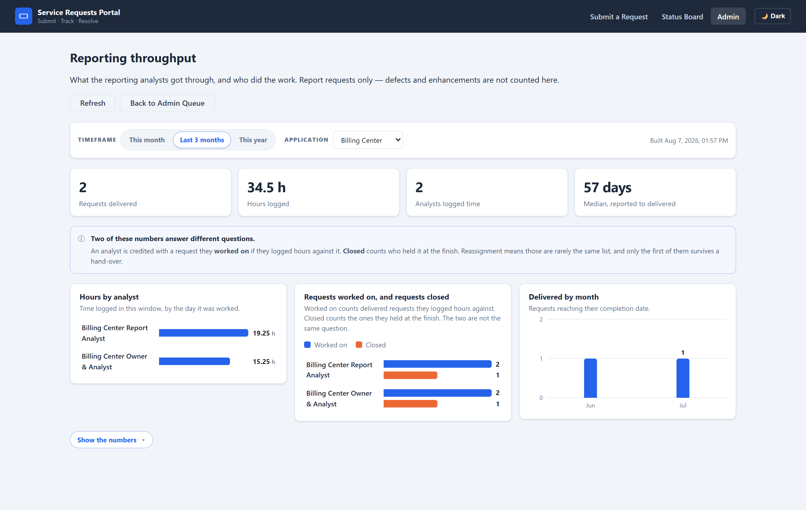

Pick **This month / Last 3 months / This year** and, if you can read more than one,
an application.

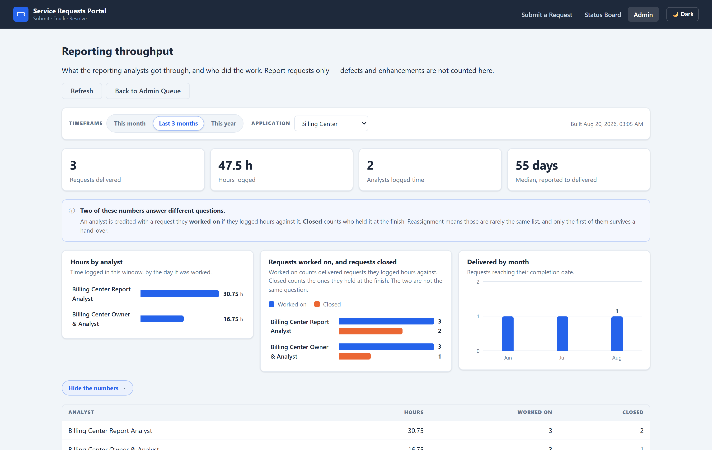

Three numbers that sound similar and are not:

| | Means |
|---|---|
| **Delivered** | Requests **completed** in the window |
| **Hours** | Hours whose **worked-on day** falls in the window |
| **Worked** | Requests delivered in the window that this person logged **any** hours against — whenever they logged them |

The last one is not windowed on purpose: **a request delivered in August was often
worked in July**, and counting only the hours inside the window would erase that
person's contribution.

**What you see depends on your rank.** Unless you have been made a manager of the
application, you see **your own** numbers and nobody else's:

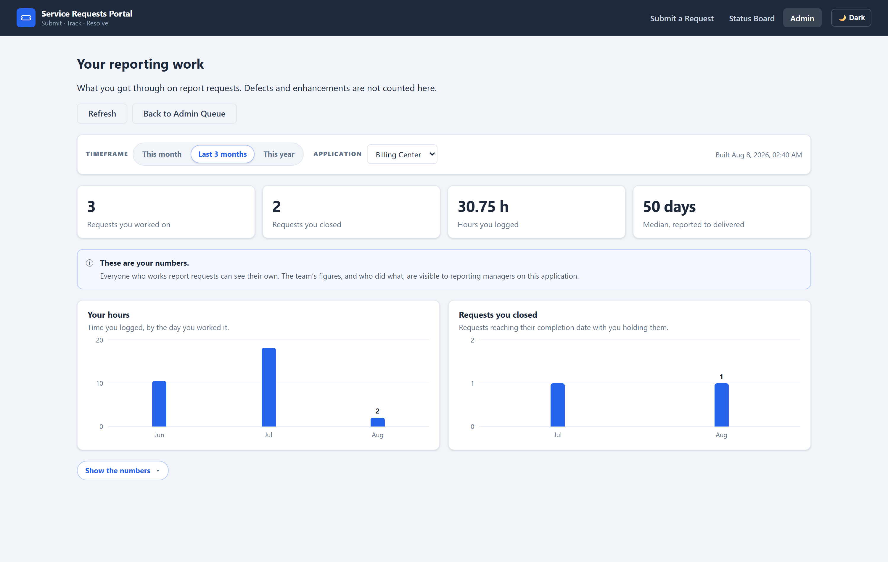

This is a different page, not the team page with rows hidden — there is no
per-colleague mark anywhere on it.

The page states when it was built, and does not update live.

## 2.13 Manage metadata

**Account menu → Manage metadata.** Super users only for changes; every admin can
read it.


Every dropdown in the portal is editable here: types, statuses, cleanup statuses,
cleanup tags, applications, enhancement request types, priority levels, submission
sources, occurrence timeframes and levels of effort.

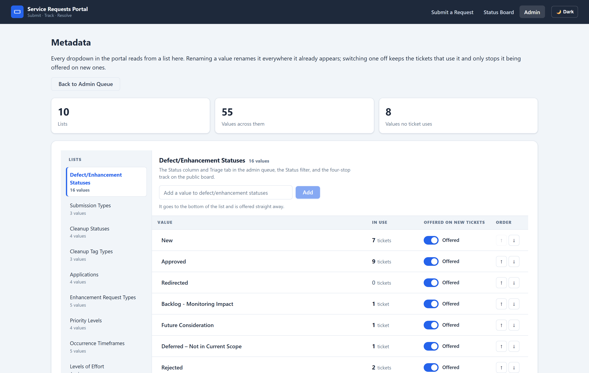

Three statuses are marked **Report requests only** — `In progress`, `Delivered` and
`On hold`. One list serves every type, so without the marking there would be no way
to know which dropdown a value appears in.


**The page tells you what an edit will do before it does it.** Renaming a value
renames it on every ticket that holds it, on the public board and in every export.
A value in use has its name locked.

**Values are switched off, never deleted** — existing tickets keep pointing at them.
The `Retired` status is protected outright.

## 2.14 Manage access

**Account menu → Manage access.** Super users only.

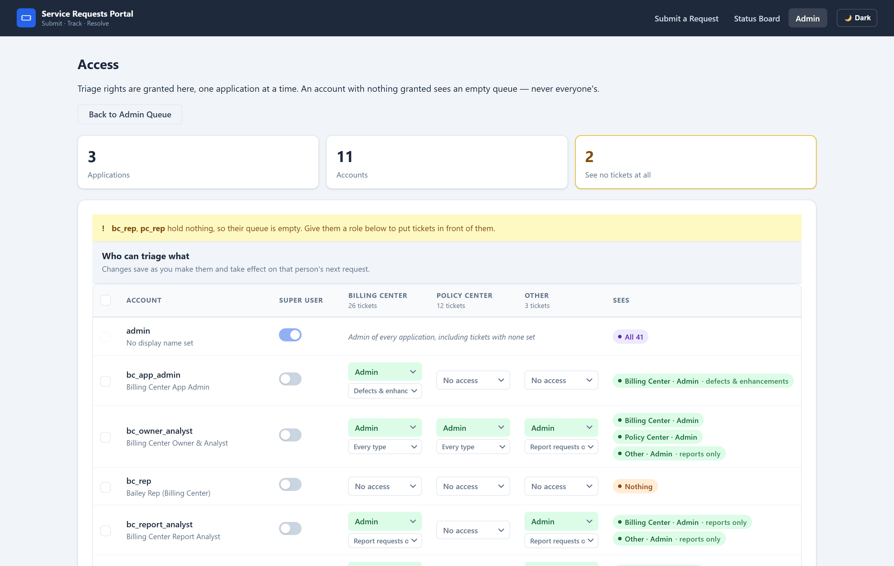

A grid of people against applications. Each cell holds **a role and a scope**:

| Role | Can |
|---|---|
| **No access** | Nothing. Not on their queue at all. |
| **Viewer** | Read that application's queue and export it. Change nothing. |
| **Admin** | Everything in that application. |
| **Manager** | Everything an admin can, **plus see other people's throughput numbers.** That is the only difference. |

| Scope | Covers |
|---|---|
| **Every type** | Defects, enhancements, cleanups and report requests |
| **Defects & enhancements** | Those two, and the cleanups tagged as them — **no report requests** |
| **Report requests only** | This is what makes somebody a reporting analyst |

A combination those three cannot describe shows as **Mixed** rather than being
rounded to the nearest one — rounding it would rewrite it on the next save.

**Each application shows its ticket count**, so removing somebody's access is a
decision made with the size of the queue in view.

Three safeguards:

- **Bulk grants are all-or-nothing.** A batch naming one bad application changes
  nobody — a partially applied access change is the hardest kind to notice.
- **The portal refuses to remove its last super user.** Without one, nobody could
  reach this page to grant anything back.
- **A change takes effect on that person's very next action**, not their next
  sign-in.

The page also lists **directory group → application** mappings. Those set somebody's
**default** application. **They grant nothing** — access is always deliberate.

## 2.15 Dark mode and phones, on the triage side

The **Dark / Light** button in the header applies everywhere, including the admin
pages and the ticket modal.

| | |
|---|---|
| 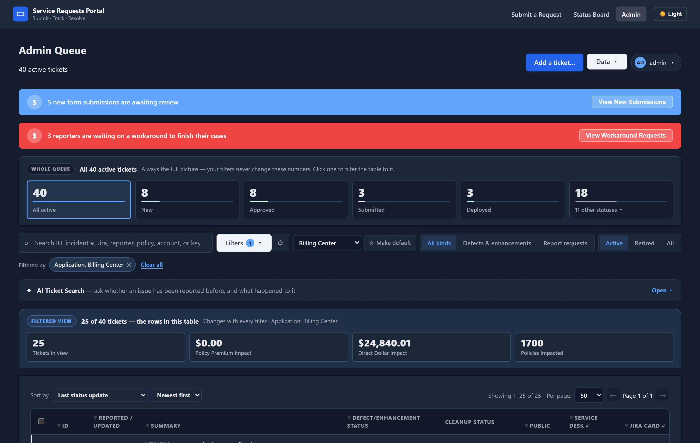 | 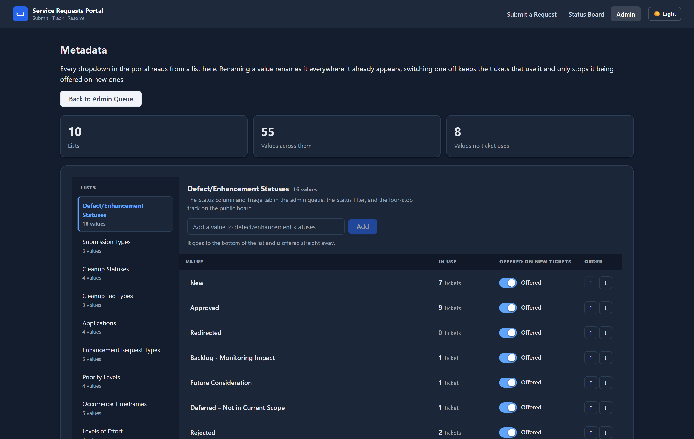 |
| The queue | Manage metadata |

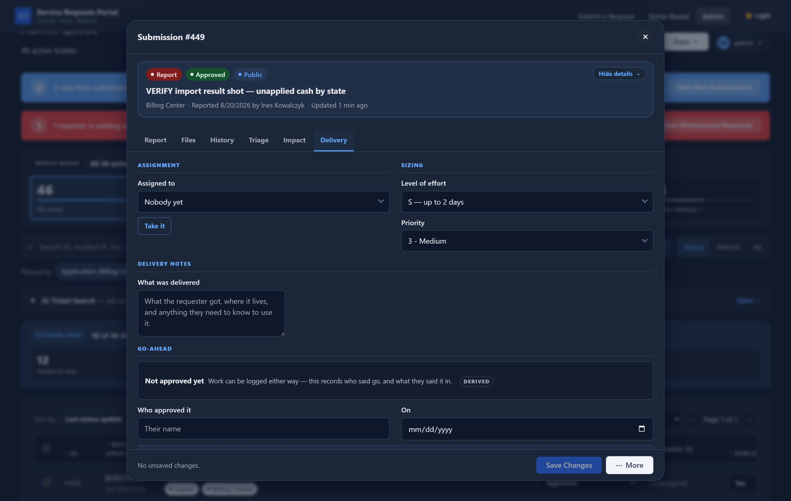

A report request's Delivery pane in dark mode. The two chart colors on the
throughput page have their own pair per theme, so neither is a light-mode color
dimmed.

**Every admin page works on a phone**, though the queue is the tightest fit — the
table degrades to stacked rows, which is usable for checking something on the move
rather than for a triage session.

| | | |
|---|---|---|
| 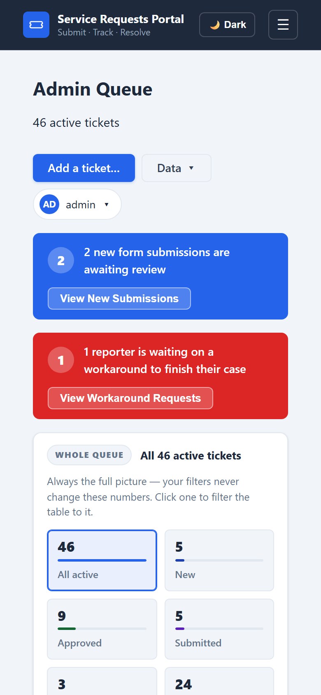 | 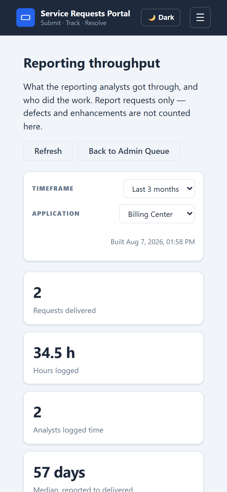 | 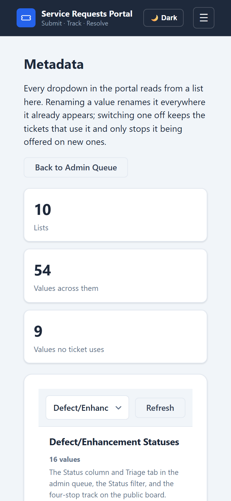 |
| The queue at 390px | Throughput | Manage metadata |

And the two states a requester meets on a phone — the sign-in wall, and the report
request branch:

| | |
|---|---|
| 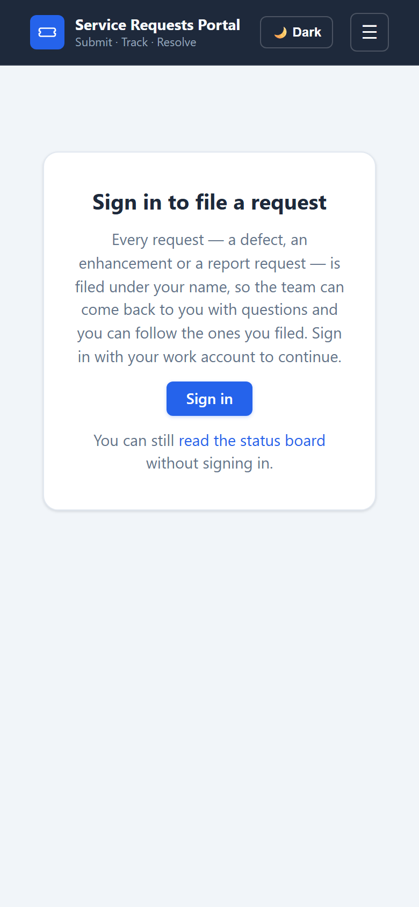 | 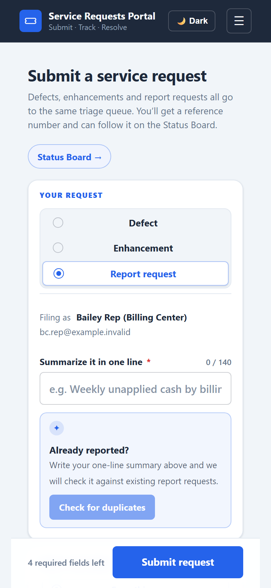 |

---

# Appendix: test accounts

Every account below uses the same password, the value of `SEED_ADMIN_PASSWORD` in
`server/.env` — **`admin123`** on the prototype.

> These are test accounts on test data. **Rotate the password before anybody real
> uses the portal.**

**To see what a requester sees**, sign in as **`bc_rep`**. It has filed most of the
report requests in the demonstration data, so the board's "my requests" state and the
report-request track both have something to show.

**To see everything**, sign in as **`admin`**.

| Username | Use it to see |
|---|---|
| **`bc_rep`** | A requester. Files requests, follows their own, no admin side at all. |
| `pc_rep` | The same, on the other application. |
| **`admin`** | Everything: every application, Manage access, the metadata writes, and the **team** throughput view. |
| `lead_admin` | An admin who is **not** a super user — Billing Center, every type. |
| `ops_admin` | The same, Policy Center. |
| `bc_app_admin` | An application admin for **defects and enhancements only** on Billing Center. No report requests on their queue. |
| `pc_app_admin` | The same, Policy Center. |
| **`bc_report_analyst`** | A **reporting analyst** — report requests only, Billing Center. No defects on screen, no metadata in the menu. |
| `pc_report_analyst` | The same, Policy Center. |
| `bc_owner_analyst` | Somebody who does **both** — every type on Billing Center and Policy Center. |
| `pc_owner_analyst` | Policy Center every type, plus report requests elsewhere. |

**Nobody holds `manager`**, so every account except `admin` sees the *personal*
throughput view. That is deliberate: it gates seeing colleagues' numbers, and it
should be granted on purpose rather than because an account sounds senior.

---

# Appendix: what the statuses mean

**Defects, enhancements and cleanup tasks:**

| Status | Means |
|---|---|
| `New` | Filed, nobody has looked at it yet |
| `Requires Additional Review` | Triage needs more information or another opinion before deciding |
| `Pending Management Approval` | Accepted in principle, waiting on somebody to authorize it |
| `Approved` | Accepted as valid work |
| `Submitted` | Handed to the Service Desk |
| `Deployed` | Released |
| `Backlog - Monitoring Impact` | Real, but held while the team counts how often it happens |
| `Future Consideration` | Worth doing, not now |
| `Deferred – Not in Current Scope` | Out of scope for the current plan |
| `Rejected` | Not being done, with a reason |
| `Duplicate` | The same as another ticket, which is linked |
| `Redirected` | Moved between application queues |
| `Retired` | Archived. Nothing in the portal is ever deleted. |

**Report requests** get nine, three of which are theirs alone:

| Status | Means |
|---|---|
| `New` | Filed, not yet picked up |
| `Approved` | Triage accepted it as valid work |
| **`In progress`** | An analyst is building it |
| **`Delivered`** | Built and handed over. Records the completion date. |
| **`On hold`** | Parked — waiting on something outside the work itself |
| `Rejected` · `Duplicate` · `Redirected` · `Retired` | As above |

They never reach `Submitted` or `Deployed`: both are Service Desk language, and a
report request is built in-house.

---

# Appendix: who can see what

| Surface | Signed out | A requester | An admin | A super user |
|---|---|---|---|---|
| Status Board — defects and enhancements | **Public ones** | Public ones | Public ones | Public ones |
| Status Board — report requests | **None** | **Only their own** | Only their own | Only their own |
| Filing a request | **Cannot** | Yes | Yes | Yes |
| The admin queue | No | **No** | Their granted applications, their granted types | Every application |
| A ticket in another team's queue | No | No | **Reads as not found** (unless their queue handed it on) | Yes |
| Reporting throughput | No | No | Their own numbers | The team's |
| Manage metadata | No | No | **Read only** | Read and change |
| Manage access | No | No | No | Yes |

Two rules behind that table:

- **No grant means no tickets** — never all of them. An admin with no grants sees an
  empty queue.
- **A ticket you may not see reads as *not found*, not *forbidden*** — so the queue
  cannot be explored by guessing ticket numbers.
