# BC Defects & Enhancements — Developer Rebuild Handoff

**Audience:** the engineering team who will rebuild this application on the
organisation's own stack and standards.

**What this is.** This portal is a working *prototype*. It is not the thing that
ships. It exists to settle the product questions — what the workflow is, what
each screen has to do, which rules are load-bearing, and where the sharp edges
are — so that the rebuild is an engineering exercise rather than a discovery
exercise.

**How to read it.** Every section answers two questions: *what it does* and
*why it is that way*. The "why" matters more than the "how" — the code is
disposable, the decisions are not. Where a decision was forced by a constraint
you may not share (SQLite quirks, a hosting proxy, an unfinished vendor
contract), it says so explicitly, so you can drop the workaround instead of
faithfully reproducing it.

**What is authoritative.**

| Question | Authority |
|---|---|
| What the product does | this document + the screenshots |
| Exact field/API shapes | the prototype source, cited by path throughout |
| What EasyVista accepts | **nobody yet** — see [Known gaps](#14-known-gaps-traps-and-open-questions) |
| Current data | the live Supabase DB — *not* this document |

> **Screenshots** were captured on 2026-08-05 against an isolated local instance
> with seeded sample data (13 submissions, 3 admin accounts). No production data
> appears anywhere in this document. See
> [Reproducing the screenshots](#20-reproducing-the-screenshots).

---

## Contents

1. [The problem being solved](#1-the-problem-being-solved)
2. [Who uses it](#2-who-uses-it)
3. [Architecture](#3-architecture)
4. [Domain vocabulary — read this first](#4-domain-vocabulary--read-this-first)
5. [The submission lifecycle](#5-the-submission-lifecycle)
6. [Screen by screen](#6-screen-by-screen)
7. [Identity and the viewer envelope](#7-identity-and-the-viewer-envelope)
8. [Access control](#8-access-control)
9. [Public data boundary](#9-public-data-boundary)
10. [Real-time, presence and concurrency](#10-real-time-presence-and-concurrency)
11. [AI semantic search](#11-ai-semantic-search)
12. [EasyVista integration](#12-easyvista-integration)
13. [Excel round-trip and file storage](#13-excel-round-trip-and-file-storage)
14. [Known gaps, traps and open questions](#14-known-gaps-traps-and-open-questions)
15. [Data model](#15-data-model)
16. [API surface](#16-api-surface)
17. [Configuration reference](#17-configuration-reference)
18. [Running the prototype](#18-running-the-prototype)
19. [Deployment topology and what it costs you](#19-deployment-topology-and-what-it-costs-you)
20. [Reproducing the screenshots](#20-reproducing-the-screenshots)
21. [Rebuild acceptance checklist](#21-rebuild-acceptance-checklist)

---

## 1. The problem being solved

The **Product Owners** team fields a constant stream of Billing Center defect
reports and enhancement requests from **field representatives**. They triage,
prioritise, and decide what gets escalated to **Tier 2 GTS**, who work the
actual tickets in **EasyVista**.

Before this portal there was no system of record:

- Defect reports lived in email threads, chat messages and spreadsheets — no
  audit trail, and duplicates were near-impossible to spot.
- Enhancement requests had no structured intake, so details arrived incomplete.
- Product Owners had no single queue to triage from.
- Historical records sat in Excel files that could not be searched or tracked.
- Escalating to EasyVista meant manual copy-paste.
- **Reps had no visibility.** They could not see whether an issue was already
  known, or what had happened to something they filed — so they filed it again.
  Duplicate intake was the single largest source of wasted triage effort.
- Nobody knew when new work arrived without checking.

The portal connects intake → triage → escalation end to end, and — critically —
gives reps a public status board so they stop re-reporting known issues.

**Design consequence worth carrying forward:** almost every non-obvious decision
in this app traces back to *reducing duplicate intake* and *making state legible
to the person who reported it*. When you hit a design choice that looks fussy,
that is usually why.

---

## 2. Who uses it

| Role | Signs in? | Can do |
|---|---|---|
| **Field representative** | Not today (anonymous). Under SSO, yes. | File a defect or enhancement; check for duplicates before filing; follow the public status board; see which tickets are theirs |
| **Product Owner / admin** | Yes (username + password) | Everything in the queues they are granted: triage, edit, status, attachments, redirect, EasyVista send, public visibility, retire, bulk actions, Excel round-trip, metadata |
| **Viewer** | Yes | Read one application's queue and export it. Changes nothing. |
| **Portal super user** | Yes | Everything above across **every** application, plus the Access page. The single privilege bypass in the system. |

Roles are **per application** (see [Access control](#8-access-control)). "Admin"
is not a global role — someone can be an admin of Billing Center and have no
access at all to Policy Center.

---

## 3. Architecture

```
┌──────────────────────┐   REST (JSON)    ┌────────────────────────┐
│   React SPA          │◄────────────────►│   Express API          │
│   Vite + React 19    │                  │   Node + Express 5     │
│   Vercel (prod)      │◄─── WebSocket ──►│   Render (prod)        │
└──────────────────────┘   (direct, not   └───────────┬────────────┘
                            via proxy)                │
                    ┌───────────────────┬─────────────┴──────────┐
              ┌─────▼──────┐  ┌─────────▼────────┐  ┌───────────▼────────┐
              │ PostgreSQL │  │  File storage    │  │  EasyVista REST    │
              │ (Supabase) │  │  Supabase Storage│  │  (external, gated) │
              │  — or —    │  │  — or local disk │  └────────────────────┘
              │ SQLite     │  └──────────────────┘
              │ (sql.js)   │        ┌──────────────────────────────┐
              └────────────┘        │ AI: Claude / OpenAI summary  │
                                    │ + embeddings (local/OpenAI)  │
                                    └──────────────────────────────┘
```

### Stack

| Layer | Prototype choice | Notes for the rebuild |
|---|---|---|
| Frontend | React 19.2, React Router 7.13, Vite 5.4 | — |
| UI system | **Custom** (`client/src/components/bite-size/BitsizeUI.jsx`, 243 lines) + vanilla CSS | No MUI, Tailwind or Bootstrap. Replace with your design system; the *behaviours* documented here are what must survive, not the CSS. |
| Backend | Express 5.2, Sequelize 6.37 | — |
| Database | PostgreSQL (`pg` 8.16) **or** SQLite via `sql.js` 1.13 | Dual-provider was a prototype convenience. See [the portability traps](#portability-traps-you-can-probably-delete). |
| Real-time | Socket.IO 4.8 | — |
| Auth | `express-session` + `bcrypt` | Placeholder. The real target is SSO/Active Directory. |
| Uploads | `multer` 2.0 | Image-only for attachments, deliberately. |
| Excel | `xlsx` (SheetJS) 0.18 | — |
| AI summary | `@anthropic-ai/sdk` 0.112 **or** OpenAI via `fetch` | Switchable by one env var. |
| AI embeddings | `@huggingface/transformers` 4.2 (in-process) / OpenAI / Voyage | Local option means no vendor and no per-call cost. |

### Repo layout

```
client/src/
  pages/          6 route components
  components/
    admin/        queue, command bar, modals, detail/ (13 sub-components)
    public/       status board, submit form pieces
    bite-size/    the design system + AppShell
    common/       AiSearchPanel, PaginationControls
  hooks/          13 hooks — one per feature area
  lib/            api.js (single request helper), socket.js
  utils/          filter/sort/format helpers, shared admin↔public
  constants/      the column/filter/sort registries

server/src/
  routes/         13 route modules — thin, validation at the boundary
  services/       8 services — all business logic
  helpers/        mappers (incl. the public allow-list), easyVistaPayload, lookups
  middleware/     cors, session, csrf, upload, rateLimit, errorHandler
  constants.js    role ladder, allow-lists, sentinels
server/db/
  models/index.js the whole schema + migration logic
  sequelize.js    provider selection
```

---

## 4. Domain vocabulary — read this first

Getting these words wrong will produce a subtly wrong rebuild. They are not
interchangeable.

| Term | Means |
|---|---|
| **Submission** | One report. Every row in `submissions`. Also called a *ticket*. |
| **Type** | `defect` or `enhancement`. Drives which fields are required and what EasyVista is told. |
| **Application** | A product queue — `Billing Center`, `Policy Center`. Owns triage rights. |
| **Cleanup task** | Internal work item (`is_cleanup = 1`). Tagged `defect`, `enhancement`, or **`cleanup_only`**. A `cleanup_only` task has *no* defect/enhancement type yet. |
| **Retire** | Soft archive (`is_retired`). **Never a delete.** Nothing in this app hard-deletes a submission. |
| **Public** | Appears on the public status board and in public AI search (`is_public`). |
| **Workaround request** | A rep saying *"I am blocked on a live case now"*. Two columns: `needs_workaround` (the ask) and `workaround_provided` (the team closing it). |
| **Redirect** | Handing a ticket to **another application's queue**. The ticket **moves** — it is not copied. |
| **Resubmission** | Re-sending to EasyVista after requirements changed. Creates a **new** submission and a **new** EasyVista ticket; the original is left alone. |
| **Viewer envelope** | The single server answer to *"who is this caller and what may they see"*. `GET /api/viewer`. |
| **Home application** | The application a person most likely wants preselected. A **prefill**, never a lock. |
| **Pinned application** | The queue an admin *decided* to land on. Distinct from "the last one I looked at". |

### Three distinctions that are easy to collapse and must not be

**1. Redirect moves; resubmission forks.**
A redirect changes `submissions.application_id` on the existing row and writes a
ledger entry. A resubmission inserts a *new* row. Conflating them produces
either two tickets for one problem, or one ticket two teams each think the other
owns.

> *"The ticket MOVES. It is not copied and not mirrored: a copy would give the
> reporter two tickets for one problem and leave two teams each assuming the
> other owned it."* — `server/src/services/redirectService.js`

**2. Read scope is wider than write scope.**
A team that hands a ticket on **keeps reading it** and **stops writing it**, the
instant it moves. Read comes from the routing ledger; write asks only about the
ticket's *current* application. This is not an accident — the sending team needs
to see where their ticket went.

**3. `needs_workaround` and `workaround_provided` are two columns, not one flag.**
Handling the request must not erase the fact that it was made. "Open request"
means the first without the second. A single tri-state column would lose the
timing, and the pair is what lets history show how long the rep waited.

---

## 5. The submission lifecycle

### Statuses

Eleven, seeded but **editable at runtime** via the Metadata page:

`New` · `Approved` · `Redirected` · `Backlog - Monitoring Impact` ·
`Future Consideration` · `Deferred – Not in Current Scope` · `Rejected` ·
`Duplicate` · `Submitted` · `Deployed` · `Retired`

Because statuses are data, **nothing may hardcode the full list**. Two places
deliberately *do* fix a subset, and both say why:

- The admin queue's headline scope cards (`SCOPE_STRIP_STATUSES`) are fixed so
  the cards never reorder between loads; everything else sums into an
  expandable "other statuses" card.
- The public board's four-stop track is fixed because it is a *pipeline*, and
  anything not on it is a closed outcome.

An unrecognised status must render as a neutral/"holding" badge, never unstyled.

### How reps see it: the four-stop track

The public board turns status into **position**:

```
Reported ──── Approved ──── In EasyVista ──── Deployed
```

Key rules (`client/src/components/public/StatusBoardRow.jsx`):

- **Position is driven by the CURRENT status, not by timestamps.** A redirect
  resets a ticket to `New` for the receiving team while the sending team's
  `Approved` timestamp stays in history. A "furthest timestamp wins" reading
  showed a freshly handed-over ticket as already approved — crediting the
  previous team's progress to the new team. This was a real bug; do not
  reintroduce it.
- A later stop being reached implies the earlier ones were. `Approved` is the
  only stop a ticket can skip (it can jump straight to `Submitted`).
- **Closed outcomes** (`Rejected`, `Duplicate`, …) get an outcome pill and a
  one-line explanation instead of a track — drawing a track would be a lie,
  because nothing further is coming.
- **Parked** statuses (`Backlog - Monitoring Impact`, `Future Consideration`,
  `Deferred`) say so rather than drawing a stalled track.

### Creation paths

Six, recorded in `submission_sources` and visible as "Created via":

| Source | Who | Public by default? |
|---|---|---|
| `rep_form` | Rep, via `/` | **Yes** |
| `admin_manual` | Admin, in-queue create | **Yes** |
| `admin_backdated` | Admin, for something reported before the portal existed | **Yes** |
| `admin_cleanup` | Admin, internal cleanup task | **No** if `cleanup_only` |
| `admin_excel_import` | Bulk historical load | **Yes** unless cleanup-only |
| `admin_easyvista_resubmission` | The fork of a resubmit | inherits |

**Public by default** is the rule. Real defect/enhancement tickets surface on the
board so reps can find them; internal cleanup-only tasks stay private. An
explicit choice from the caller always wins, so an admin can still create a
private ticket deliberately.

---

## 6. Screen by screen

Six routes (`client/src/App.jsx`):

| Route | Page | Gate |
|---|---|---|
| `/` | Submit a Request | none |
| `/public` | Status Board | none |
| `/admin/login` | Admin Sign In | none |
| `/admin` | Admin Queue | admin session |
| `/admin/metadata` | Metadata Manager | admin session |
| `/admin/access` | Access Management | admin session **+ super user** |

Client-side gates are **signposting only**. Every endpoint re-checks
server-side. `RequireSuperUser` waits for the real `GET /api/viewer` answer
rather than guessing from the session — it exists so a non-super-user does not
land on a page that could only show them errors.

---

### 6.1 Submit a Request (`/`)


One column of form, one rail of guidance. Sections top to bottom: **what are you
reporting** → **your request** → **where it happened** → **what happened** → **do
you need a workaround** → **screenshots**.

**Required fields differ by type.** A defect needs screen title, date it
happened, and what you saw. An enhancement needs its request and desired
completion date, and has no "steps to reproduce". The client mirrors the
server's per-type checks — and says so in a comment naming the exact server
lines to keep in step, because anything the server rejects that the client does
not catch reaches the rep as a bare 400 instead of an inline prompt.


#### The "Before you submit" rail

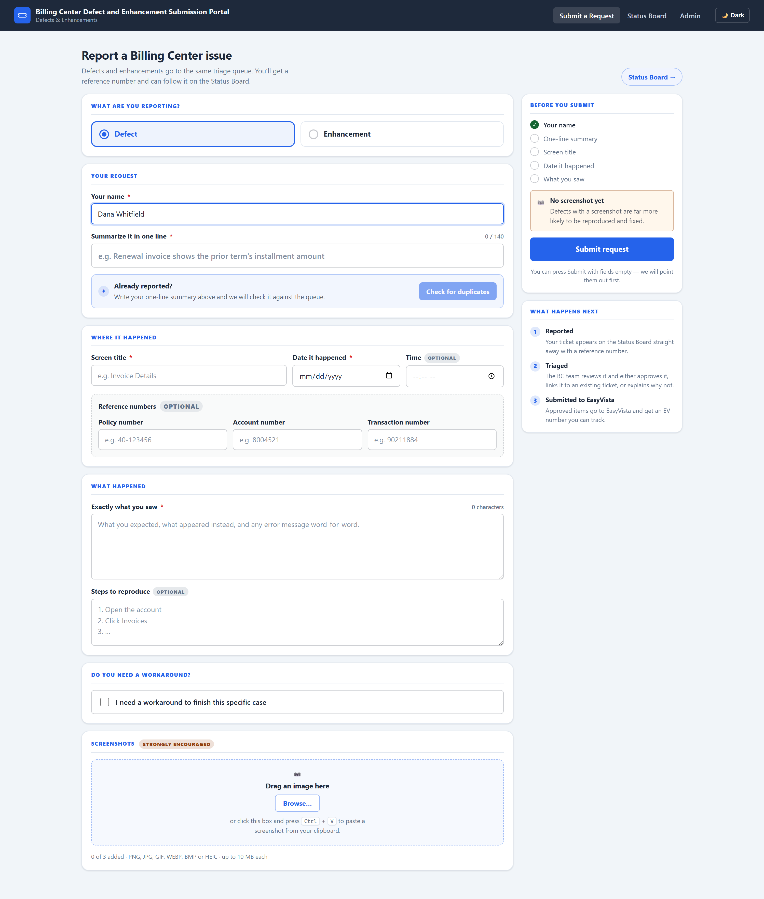

Requirements tick off **as the rep types**, and the rail owns the primary
action. The old form only told a rep what was missing *after* they pressed
Submit. The screenshot nudge sits next to the button that needs it — defects
with a screenshot are far more likely to be reproduced.

Note the copy under the button: *"You can press Submit with fields empty — we
will point them out first."* Validation is a guide, not a gate you have to
decode.

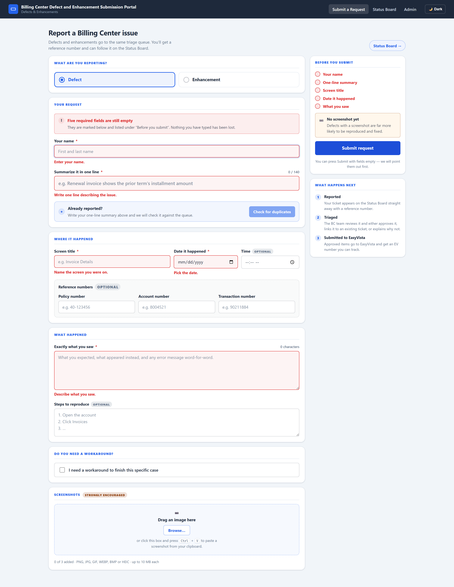

Errors only appear **once the rep has tried to submit** — nobody wants a form
that turns red while they are still filling in the first field. On failure,
focus is sent to the first field that needs attention, so keyboard and
screen-reader users are not left hunting for the red one.

#### Pre-submit duplicate check


The single highest-value feature on this page, and the direct answer to the
duplicate-intake problem.

The rep types a one-line summary, presses **Check for duplicates**, and gets
matching tickets inline — here, six of them — with an honest closing line:
*"None of these match what you saw? Carry on below — a second report with fresh
detail is more use to the team than none."*

Design notes (`client/src/components/public/DuplicateCheck.jsx`):

- **Deliberately not the `AiSearchPanel` component.** That one is a search
  *tool* — it owns a query box, a system scope and a time window. Here there is
  nothing to configure: the query *is* the summary the rep already typed, and
  the window is **all time**, because a defect reported two years ago and since
  deployed is exactly the answer this rep needs. Both go through the same
  `api.aiSearch`.
- Disabled until the summary is long enough to be searchable — `"invoice
  wrong"` would return half the queue.
- It remembers the exact text that produced the result, so editing the summary
  afterwards offers a **re-check** rather than silently showing matches for the
  old wording.
- **Self-disabling**: `/api/ai-search/status` reports `enabled: false` when no
  provider key is set, and the whole block renders nothing.

#### Screenshot attachment

Three ways in, because reps get screenshots three ways: drag from a folder,
Browse, or — the common one — **PrintScreen then Ctrl+V**.

The paste path has real subtleties worth carrying over
(`client/src/components/public/ScreenshotDropZone.jsx`):

- The paste listener is **window-level**, so a paste lands wherever the rep
  happens to be — they have just come back from another window and will not have
  clicked the zone first.
- Clicking the zone **focuses** it rather than opening the file picker, because
  Chrome does not dispatch paste events while an `input[type=file]` is focused.
  The input is a *sibling* of the zone, not a child, so its synthetic click
  cannot bubble back in.
- A clipboard screenshot usually arrives **with no filename**, which would fail
  the extension check — so one is derived from its MIME type.
- The client mirrors the server's allow-list so a file the API would reject is
  refused here, with a reason, instead of coming back as a 400 after the rep has
  filled in the whole form.

Cap: 3 files, PNG/JPG/GIF/WEBP/BMP/HEIC, 10 MB each.

#### Who the ticket is from

**The server decides, not the form.** A signed-in reporter's own name is used
and the submitted one **discarded**, so nobody can file under someone else's
name. When the server already knows who you are, the form stops asking — a name
box whose value is thrown away on arrival is worse than no box. The confirmation
echoes the name the server actually recorded.

See `server/src/services/reporterService.js`.

---

### 6.2 Status Board (`/public`)


*"Every issue the team has been told about, and where each one stands."*

Top-right shows a live indicator — the board updates over WebSocket as the team
works, with no refresh.

#### Two count scopes, kept deliberately apart

This is a pattern the rebuild should preserve, and it is repeated on the admin
queue.

- **`WHOLE BOARD`** — the tiles. Badged, and captioned *"Your filters never
  change these numbers."* They are a picture of the whole board.
- **The list band** — `10 of 10 tickets`, carrying its own denominator, and
  captioned with what is currently applied.

Two identical-looking rows of numbers that mean different things is a
readability trap. Three things keep them apart: a badge naming each scope, a
line stating whether filters affect it, and separate visual treatment with the
filtered band joined to the table it describes.

Tiles are also **toggles**: clicking the tile you are already on clears back to
everything, so a tile is never a one-way trip that needs the filter panel to
undo.

#### Rows expand in place

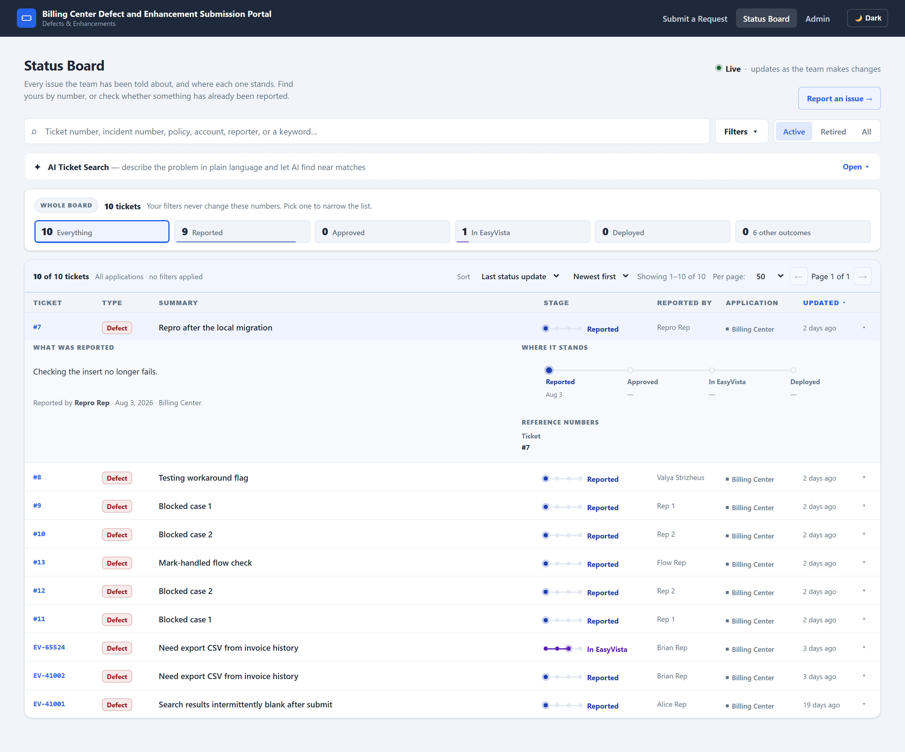

A row is a single scannable line — ticket ref, type, summary, four track pips,
reporter, application, updated. Expanding reveals the description, the dated
track, and (when it happened) **"Moved between teams"**.

The ticket reference shown is the **EasyVista incident number when there is
one, otherwise the internal `#id`** — kept in step with the reference the AI
search cites, so a reporter can match an AI result to a row without expanding it.

The row came down from a ~190px card to one line by moving the dated track into
the expansion.

#### Filters

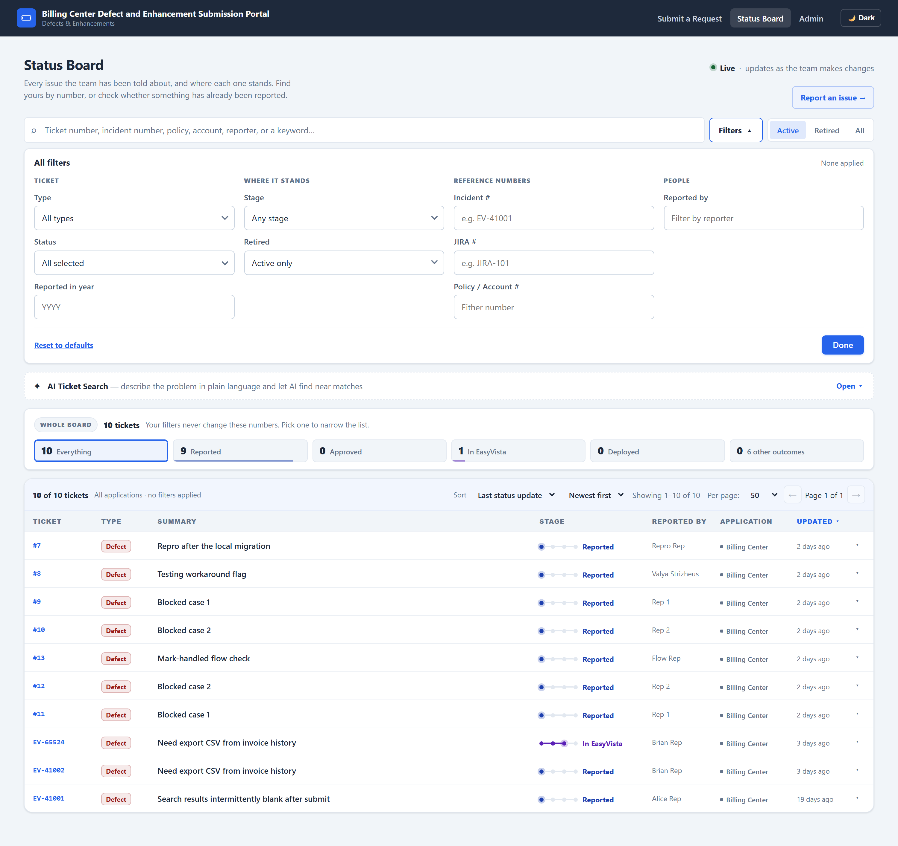

Drawn **closed**. A `Filters` button carries the applied count; applied filters
appear as individually removable chips.

Two controls are promoted out of the panel into the command row:

- **`search`** — the most-used.
- **`retiredFilter`** (Active / Retired / All) — because it is a **scope, not a
  filter**: it changes the meaning of every count on the page.

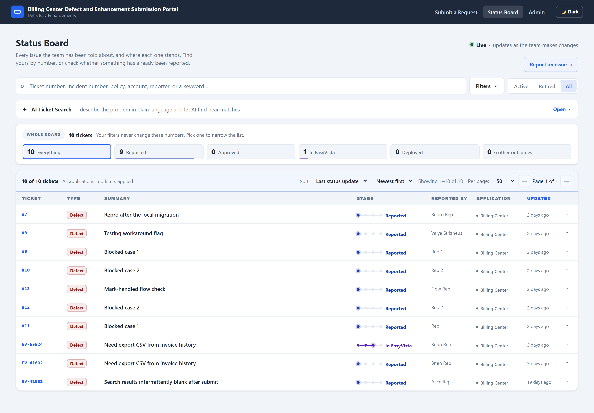

The chips, the `Filters` badge, the band's summary line and the no-matches state
are all derived from **one** `getActivePublicFilters` call — deriving it in more
than one place is exactly how those four drift apart.

Only fields the public payload actually carries are filterable. Nothing internal
is on this surface to filter.

**`Stage` is not state of its own.** The Stage select and the tiles are two ways
of writing `filters.statuses`, the same way column headers and the sort control
are two ways of writing `filters.sort`. Otherwise picking a tile and picking a
stage could disagree about what the board is showing.

#### The empty state

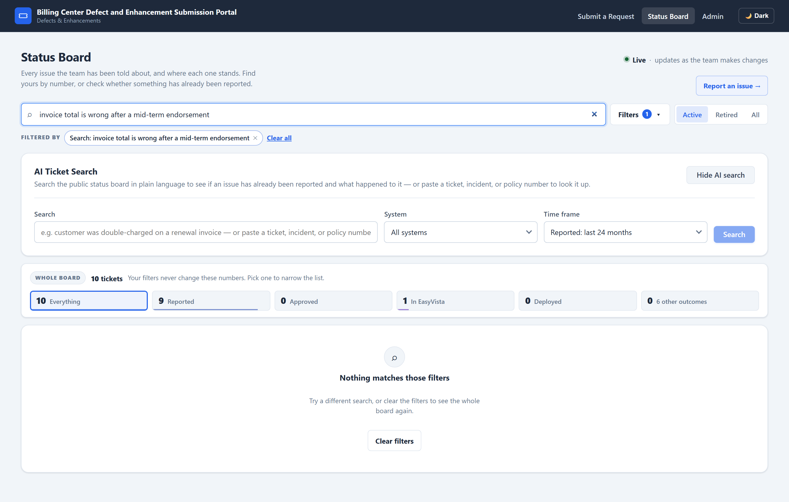

Names the problem and offers the one action that fixes it. An empty table must
never read as an empty queue — note the tiles above still show `10 tickets`.

All four data-surface states are implemented on both list surfaces
(skeleton / empty / error / data). The skeleton is **shaped like the real rows at
the real row height**, so nothing jumps when data lands, and it is hidden from
assistive tech.

> The admin queue's loading state has a specific history worth repeating: it
> used to be a `Loading…` line above the **stale** rows, leaving out-of-date
> tickets on screen presenting themselves as current — *"the worst of the
> loading failure modes"*.

#### "My reports"

An `All reports / My reports` switch appears **only when there is a "mine" to
show**. A toggle that can only ever return nothing is worse than no toggle.

Ownership has two sources and one decider (`client/src/hooks/useViewer.js`):

1. the server's `is_mine` for a signed-in reporter — **always wins**;
2. otherwise, ticket ids this browser remembers filing (localStorage).

The browser list is *the one acknowledged throwaway in the identity design*. It
exists only because nobody signs in yet. **In your rebuild with SSO, delete it**
— `is_mine` computed server-side against `reporter_user_id` is the real answer.

---

### 6.3 AI Ticket Search (both surfaces)

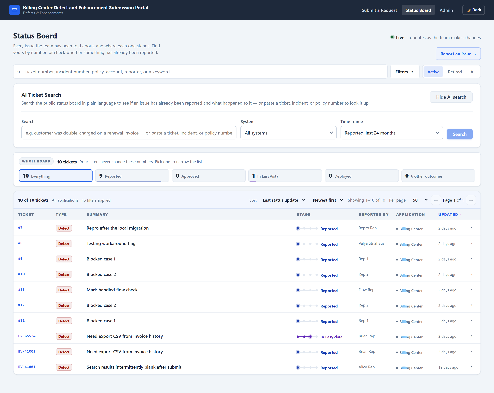

One reusable component (`client/src/components/common/AiSearchPanel.jsx`) on
both the public board and the admin queue. Query box, System scope, Time frame.

The time-frame control encodes **both the dimension and the window** — "reported
in the last 90 days" vs "resolved in the last 30 days" — because those are
different questions.

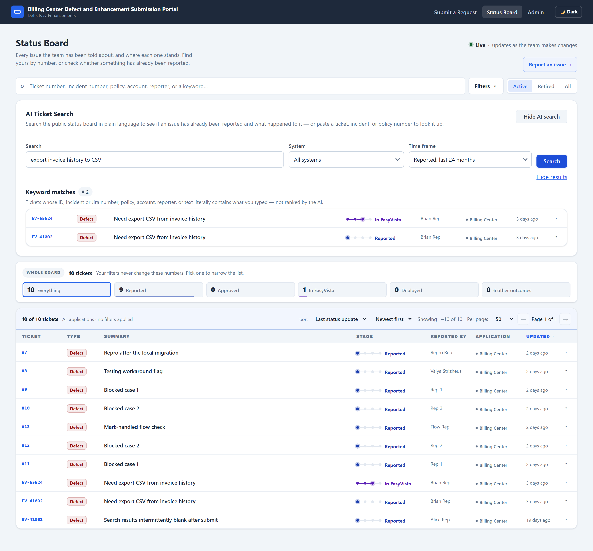

**Results come back in two labelled sections, and this is the important part:**

- **AI matches** — tickets the model endorsed, by relevance tier.
- **Keyword matches** — *"Tickets whose ID, incident or Jira number, policy,
  account, reporter, or text literally contains what you typed — not ranked by
  the AI."*

They answer different questions. Semantic search answers *"has anyone reported
this problem before"*. A pasted incident number, policy or reporter name is a
**lookup**, which cosine similarity is structurally bad at. Merging them into one
ranked list destroys the distinction between *"the AI thinks this is relevant"*
and *"this literally contains the number you pasted"*.

The screenshot above is a genuine run: the query `export invoice history to CSV`
produced **two keyword matches and no endorsed semantic matches**. That is the
system working — the safety net caught it.

A ticket appears in one section, never both.

On the admin queue the panel starts **collapsed**, so the ticket table stays
above the fold; on the public and rep surfaces — where searching *is* the task —
it stays open.

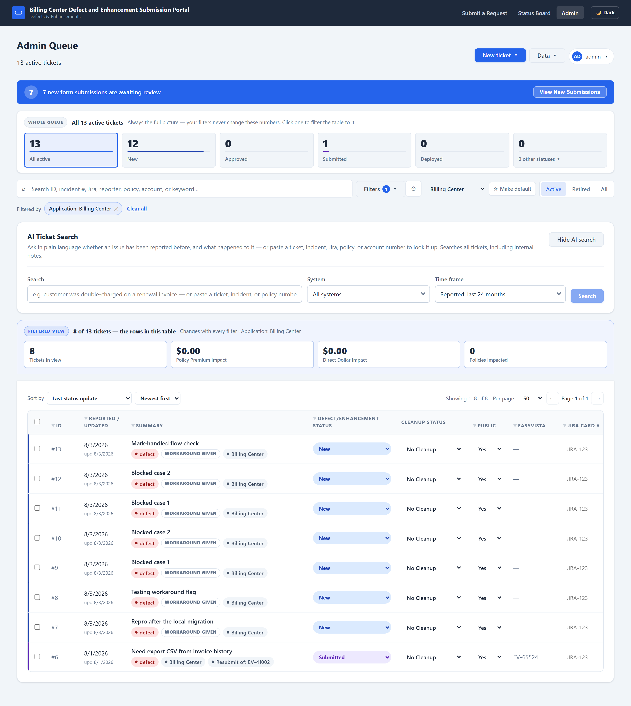

Full mechanics in [section 11](#11-ai-semantic-search).

---

### 6.4 Admin Sign In (`/admin/login`)

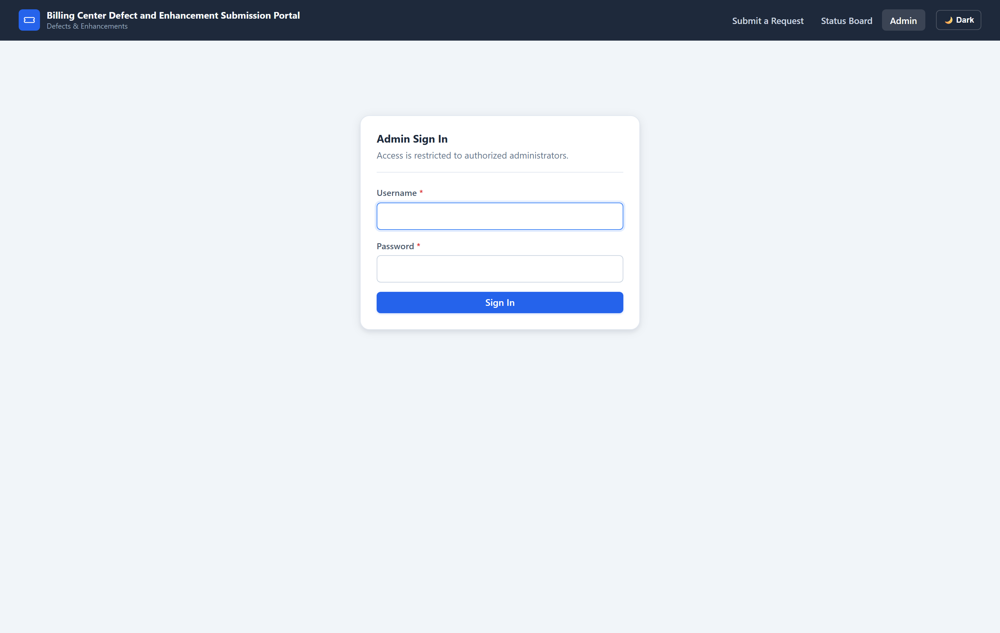

Deliberately plain. Username + password against `users`, `bcrypt`-hashed,
session cookie `bc_sid` (httpOnly).

**This is a placeholder.** The real target is SSO / Active Directory. The local
login is **admin-only** — a rep cannot sign in this way, which is precisely why
anonymous submission is still open (see
[Identity](#7-identity-and-the-viewer-envelope)).

On success the client calls `resetSocket()`. The server assigns socket rooms and
presence handlers **at connect time only**, so without a fresh handshake an
anonymous socket keeps missing admin events after login — and a logged-out admin
keeps receiving them.

---

### 6.5 Admin Queue (`/admin`)


The main working surface. Top to bottom:

1. **Header** — `Admin Queue`, active count, and three menus.
2. **Alert banners** — new submissions, open workaround requests.
3. **`WHOLE QUEUE` scope strip** — filter-independent counts, each card a quick filter.
4. **Command bar** — search, `Filters`, ⚙ customize, application scope + pin, Active/Retired/All.
5. **Applied filter chips.**
6. **Collapsed AI Ticket Search.**
7. **`FILTERED VIEW` band** — counts for the rows below, plus impact totals.
8. **The table** — sortable, inline-editable, multi-select.

#### Actions live behind three menus, not a flat row

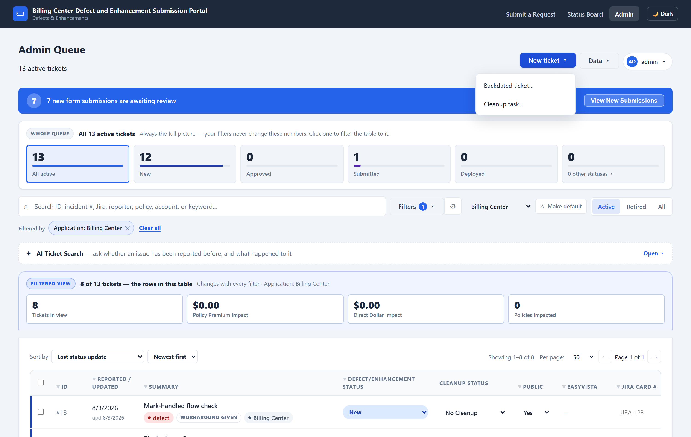

- **`New ticket`** (primary) → *Backdated ticket…* · *Cleanup task…*
- **`Data`** → *Import Excel (.xlsx)* · *Export Excel (.xlsx)*
- **`admin`** (account) → *Manage metadata* · *Manage access* (super users only) · *Sign out*

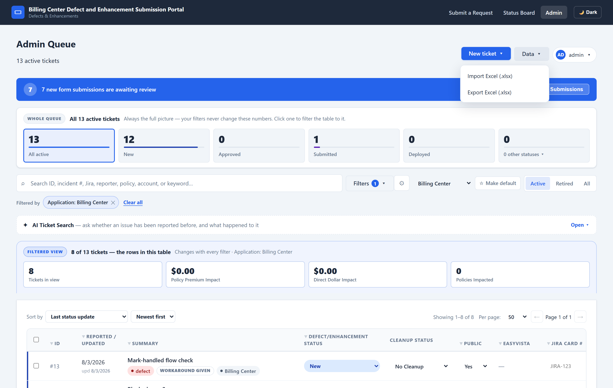

This replaced a flat six-button row. One primary action, the spreadsheet
round-trip grouped, administration under the signed-in user. Every action is
still reachable, one level down.

*Manage access* is **hidden** rather than shown-and-refused for non-super-users
— but the route and every endpoint behind it check again server-side.

The menus close on outside click and on Escape, and **return focus to the
trigger** so keyboard users do not lose their place.

#### Two count scopes again

- **`WHOLE QUEUE`** — *"Always the full picture — your filters never change
  these numbers. Click one to filter the table to it."* Headline statuses are
  fixed so cards never reorder; everything else sums into an expandable "other
  statuses" card. Previously those tickets were counted in Total but shown
  nowhere, so **Total did not equal the sum of the tiles**.
- **`FILTERED VIEW`** — *"8 of 13 tickets — the rows in this table. Changes with
  every filter."* Carries Policy Premium Impact, Direct Dollar Impact and
  Policies Impacted for the current view.

One subtlety: cleanup-only items are displayed under a `Cleanup Only`
pseudo-status rather than their underlying defect/enhancement status, and are
counted separately — without that, `total` would not equal the sum of the cards.

The "other statuses" card is deliberately **not** a quick filter: no existing
filter expresses "cleanup-only" exactly, so it reports the count rather than
pretending to filter by it.

#### Filters: 12 in a grouped panel, 2 promoted

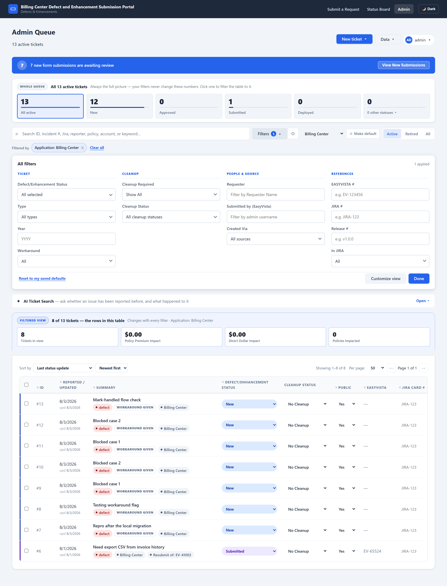

Same shape as the public board, by design. Fourteen flat labels forced an admin
to read all of them to find one; four named groups let them jump.

`search` and `retiredFilter` are promoted to the command row for the same
reasons as on the public board. `application` joins them when the caller can see
more than one application — for that person it is a **scope**, not a filter.

Both promoted controls still honour the admin's visible-filter set, because the
page **resets the value of any hidden filter**. Rendering a control that is
hidden would show a value being cleared behind the scenes; leaving a hidden
filter's value in place would let it silently constrain the table.

The workaround filter has **three** states, not two: a ticket nobody flagged is
neither open nor handled, so "handled" must not sweep it in.

#### Application scope and the pin

The scope select is a look. **Pinning is a decision.** They are separate clicks
on purpose — switching scope to glance at another team's queue should not
silently rewrite where you land tomorrow.

Which queue an admin lands on resolves once per session, in priority order:

1. the application they **pinned** — an explicit decision, so it always wins;
2. their **home application** — AD group, else most-filed (the server decides);
3. **every** application.

Two implementation notes that cost real debugging time:

- Seeding waits for **both** the saved preferences *and* the viewer envelope.
  Waiting only on preferences ran the seed while the envelope was still the
  anonymous placeholder — no applications, so no home application found, and the
  one chance to seed was spent landing on `All`.
- A pin on an application since renamed or retired resolves to nothing and falls
  through to the home application, rather than to an empty queue.

The scope select is hidden entirely for someone who administers exactly one
application — there is nothing to switch between.

#### Sorting is independent of visible columns

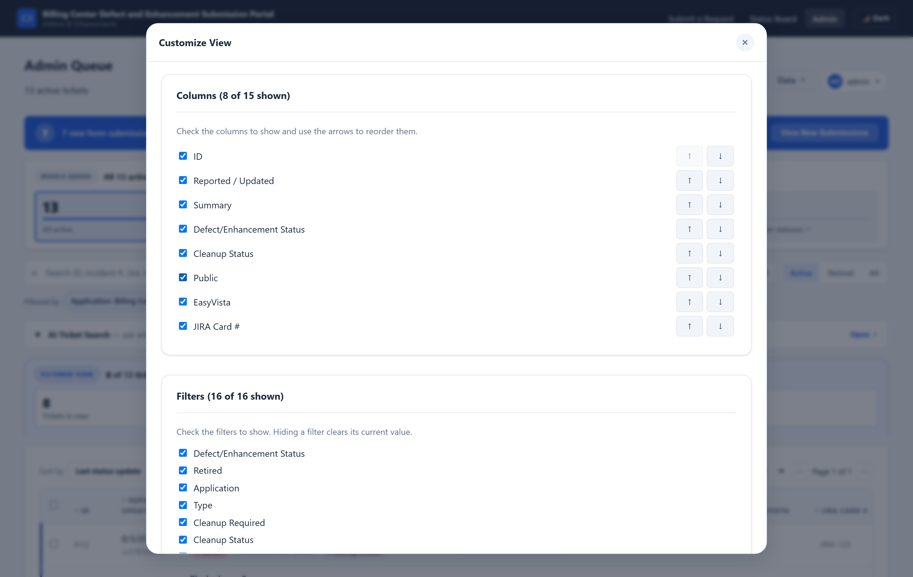

Sorting is reachable two ways that write the **same** `filters.sort` value: the
header sort control, and clicking a sortable column header.

They are decoupled because hiding a column used to hide its sort. Direction
wording follows the field's **type** — "Newest first" is meaningless for
Summary — and mirrors the comparator the server uses for that field.

**Customize View** lets each admin choose which columns show, reorder them, and
choose which filters show. Saved **server-side** per admin, so it follows them
across devices; localStorage is only a cache to avoid a flash before the server
answers.

Two rules that matter:

- The server allow-lists column and filter keys against
  `ADMIN_VIEW_COLUMN_KEYS` / `ADMIN_VIEW_FILTER_KEYS` and **drops unknown
  keys**, so client/server drift fails safe — a stale key simply does not render.
- Sanitisation runs against the **full** registries, not the default visible
  sets. The defaults are a subset, and a saved view may legitimately hold any
  registry key. Narrowing to defaults would silently strip an admin's kept
  columns on every load.

#### Inline editing

Four fields are editable directly in the table (status, cleanup status, public,
type). Editable cells **remount when the row value changes**, so live updates
from other admins actually appear — `defaultValue` only applies on mount.

#### Bulk actions

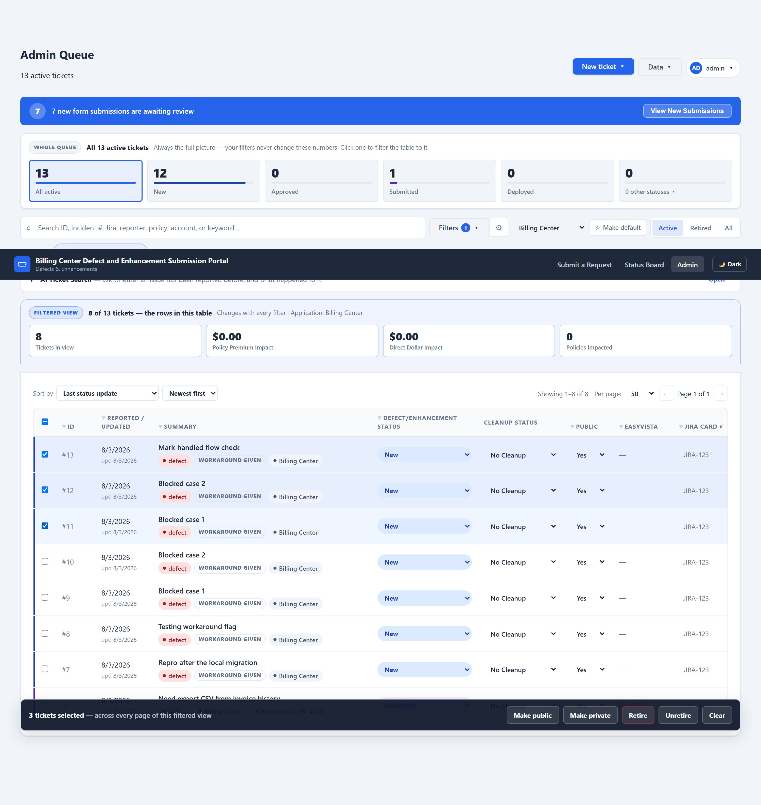

Selecting rows raises a bar pinned to the bottom of the viewport, so it stays
reachable while scrolling a long selection.

The dangerous part is the **scope**, and it is stated in words: the master
checkbox acts on the **entire filtered set across every page**, not just the
visible page. The flow is "filter, then select all, then apply", and that scope
was previously invisible.

Three guards:

1. Changing filters/search **clears** the selection — a selection must never
   straddle two different filtered sets. Keyed on `filters`, *not* on `rows`, so
   benign live refreshes leave it intact.
2. Opening the confirm modal takes a **snapshot** of the ids, so a background
   reload cannot empty the selection between opening and confirming.
3. On apply, the snapshot is **re-intersected with the current rows** — the hard
   guarantee that a bulk change never touches a ticket outside the current view.

Server side: capped ids per request, and the loop reuses the **per-row** update
path so socket emits, status-history logging and embedding refresh match the
single-ticket action exactly. A single failing id lands in `failed` and never
aborts the batch. The viewer rides along, so a batch cannot reach tickets the
same admin would be refused one at a time.

#### Creation modals

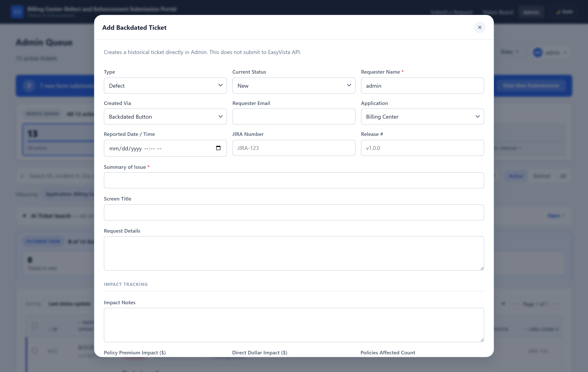

**Backdated ticket** — for something reported before the portal existed, or
reported by another channel. Lets the admin set the real reported date.

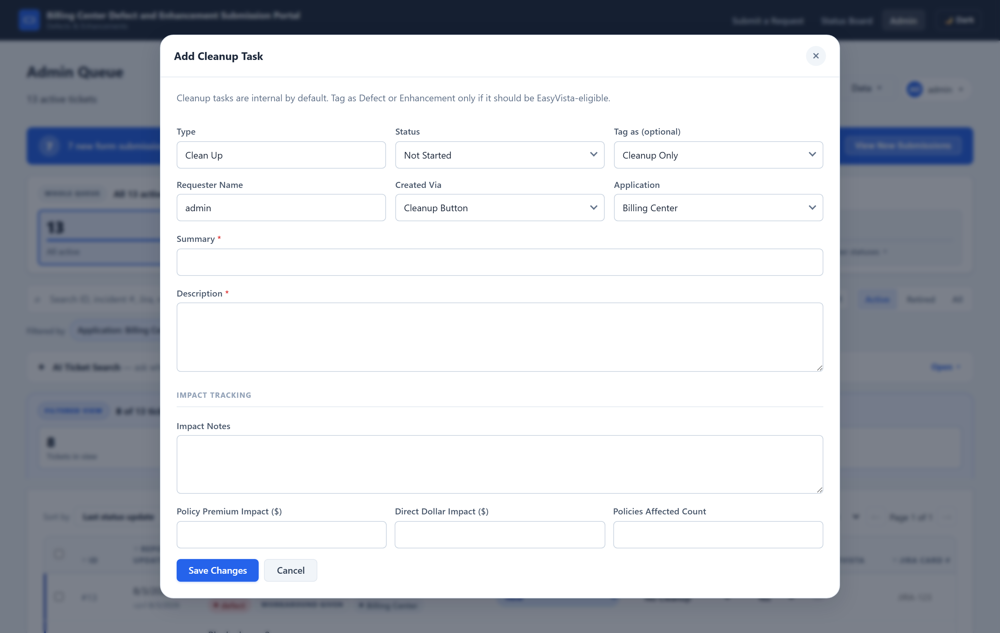

**Cleanup task** — internal work. Tagged `defect`, `enhancement` or
`cleanup_only`; `cleanup_only` stays private by default.

---

### 6.6 The Detail Modal


Where triage actually happens. **Six tabs**, and the structural rule is: identity,
alerts and the action bar live **outside** the tab strip, so nothing that needs
attention can hide behind an inactive tab — and a tab that *is* hiding something
required says so on its label.

Tab order follows the ticket's life: *what came in → its evidence → what has
happened to it → the internal call → the outbound hand-off last.*

#### Identity band

`Defect` · `New` · `Public`, the summary, then `Billing Center · Reported
8/3/2026 by Flow Rep · Updated 2 days ago`. Collapsible to one line.

Badges read from the **edit draft**, not the saved record, so they track the
dropdowns live. The band is the single place the EasyVista and JIRA ids appear.

A `Cleanup Only` task's **type badge is withheld** — showing "Defect" next to a
"choose a type" prompt reads as a contradiction.

Its collapsed state is deliberately **not** keyed to the open ticket: an admin
who wants the compact header wants it on every ticket, not to re-collapse it
each time.

#### Tab 1 — Report

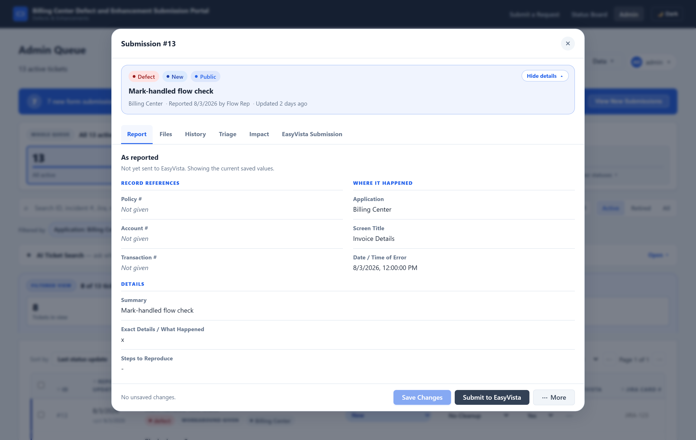

The form **as it came in**, read-only, grouped into *Record references*, *Where
it happened*, and *Details*.

It reads from `detail`, not the `edit` draft, because **this is a record, not a
working copy**. The editable versions of these fields live on the EasyVista tab,
which is the only reason to change them.

Read-only values render as text under a rule, never in an input box, so they
cannot be mistaken for something typeable. (Small detail with a real reason: the
rule sits *underneath* the value — a rule between label and value reads as
separating the value from the label above, making every value look like a
heading.)

> **Honest caveat, shown in the UI:** *"Not yet sent to EasyVista. Showing the
> current saved values."* True snapshots (`reported_snapshot`,
> `easyvista_snapshot`) do not exist yet. See
> [Known gaps](#14-known-gaps-traps-and-open-questions).

#### Tab 2 — Files

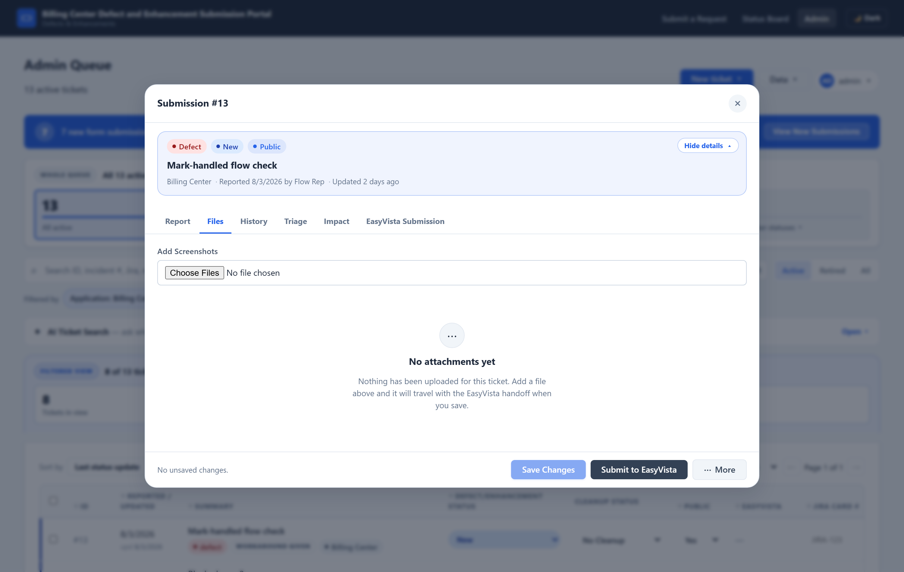

Evidence. The per-file remove action is a **quiet text button**, not a red
danger button — five attachments used to mean five red buttons competing with
the one real destructive action in the footer. The grid caps its own height so a
ticket with many files cannot stretch the pane.

#### Tab 3 — History

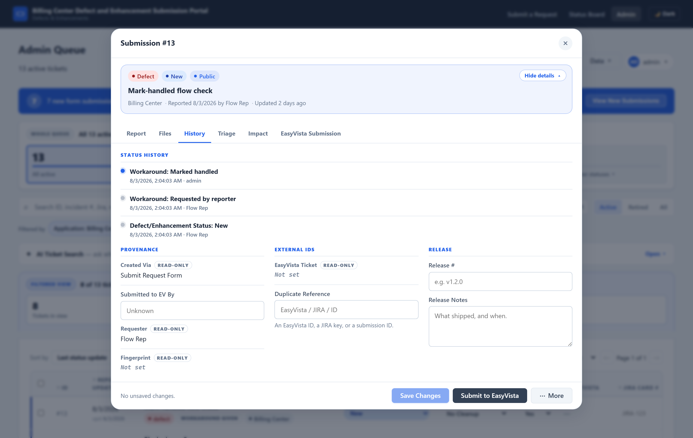

The status trail, newest first, in one list with its own scroll boundary — plus
provenance, external identifiers and release metadata.

Previously the latest event was always expanded with older ones behind a second
nested disclosure, so a long-lived ticket buried everything below it.

#### Tab 4 — Triage

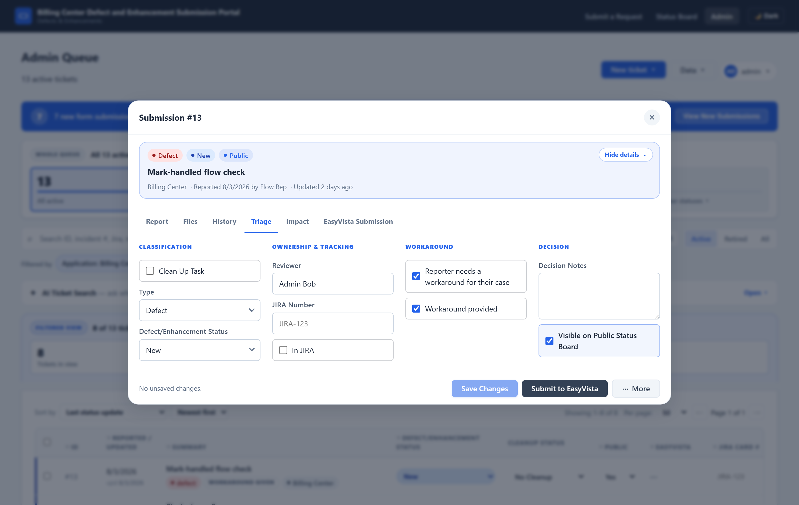

**The tab you land on** — the decisions an admin makes on nearly every ticket:
status, priority, duplicate reference, decision notes, JIRA number, public
visibility, retire.

#### Tab 5 — Impact

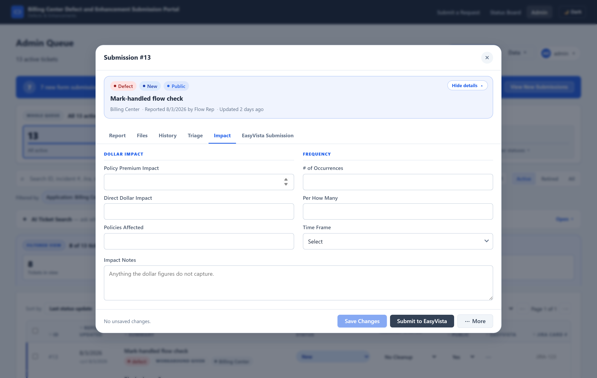

One judgement, one section: policy premium impact, direct dollar impact,
policies affected, frequency, impact notes. Dollar inputs carry a currency hint
under the raw number.

This was previously split across four boundaries for a single decision.

#### Tab 6 — EasyVista Submission

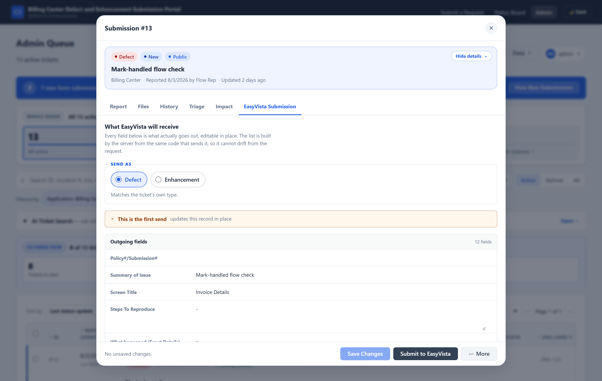

The most consequential tab, and it exists because **two things were invisible
before it**:

1. **Re-submitting does not update the existing EasyVista ticket.** It creates a
   new submission *and* a new EasyVista ticket and copies the attachments across,
   leaving the original untouched.
2. **Most of the modal's fields never reach EasyVista at all.**

It shows exactly what will be sent, editable in place, what sending will do, and
what is stopping it. Details in [section 12](#12-easyvista-integration).

#### Action bar

Pinned. **One primary** (`Save Changes`), the outbound action beside it
(`Submit to EasyVista`), and the two rarely-used actions behind a `⋯ More`
overflow.

These four used to sit inside the scroll region in one flat row — primary Save
eight pixels from a red Retire, with the irreversible EasyVista hand-off styled
more quietly than either. Expanding any section pushed all of them out of view,
which is why Save had to be duplicated into the header.

Retiring asks first. The overflow menu is a **DOM descendant of the modal, never
a portal** — a portal's clicks would land on the backdrop, whose close handler
discards staged attachments.

`Redirect` is hidden when there is nowhere to send it, rather than opening a
dialog with an empty picker.

#### Alerts

Every warning the modal can raise, in **one region ordered by severity**. Past
two alerts the region caps and scrolls, keeping the first section on screen no
matter how many fire.

Previously these were twelve independent slots stacked ahead of the first field,
so a retired + resubmitted + remotely-changed ticket opened on nothing but
banners.

**Two locks, deliberately not merged:**

| Lock | Overridable? | Why |
|---|---|---|
| **Presence** — another admin has this ticket open | **Yes** — "edit anyway" | Advisory. They may have walked away. |
| **Foreign application** — the ticket lives in a queue you do not administer | **No** | The server refuses the write. Offering an override would only produce a 403. |

The workaround alert is keyed off the **saved** record, not the draft, so ticking
"Handled" does not make the alert vanish before the change is saved — it changes
tone instead.

**`Mark handled` writes immediately** rather than staging. *"Mark handled" reads
as a verb*, so requiring a second trip to Save Changes meant admins ticked it,
closed the ticket, and the request stayed open. It is built from the **saved**
record, not the draft, so this one-click action never quietly commits unrelated
staged edits.

---

### 6.7 Metadata Manager (`/admin/metadata`)


Every dropdown in the app is data. Admins can add, rename, reorder and
deactivate options in: submission types, defect/enhancement statuses, cleanup
statuses, cleanup tag types, applications, enhancement request types, priority
levels, submission sources, occurrence timeframes.

Rules:

- **Deactivate, never delete.** Existing tickets keep pointing at retired
  lookups.
- `sort_order` drives display order everywhere.
- The `Retired` status is **protected** from deletion and reorder.
- **A retired status must not hide a live ticket.** When every selectable status
  is chosen — the default and reset state — the status whitelist is *dropped
  entirely* rather than applied. Both the admin queue and the public board do
  this, for the same reason.

---

### 6.8 Access Management (`/admin/access`) — super users only


A grid of people × applications, each cell a role dropdown. Plus per-application
ticket counts, so revoking someone is a decision made **with the size of the
queue in view** rather than blind.

Design notes:

- Cells are **tinted by state** — a wall of untinted dropdowns all reads alike,
  and finding who is missing access would mean reading each one.
- `no access` is an **option** in the dropdown, not the absence of one, so every
  cell answers the same question the same way.
- Rows are sorted deterministically, so the page renders the same order every
  load and *a diff of two screenshots means something*.
- Editing one person sends their **whole grant set as a replacement**, because
  the page edits a set of checkboxes — sending the whole set means two super
  users editing the same person cannot interleave into a state neither chose.
- Bulk grant/revoke across many people × many applications is **all-or-nothing,
  validated in full before anything is written**: a batch naming one bad
  application changes nobody, *because a partially applied access change is the
  hardest kind to notice*.
- Each mutation **applies the server response** rather than guessing, so a
  refused change leaves the table showing what is actually stored.
- **The portal refuses to remove its last super user.** Without one, nobody can
  reach this page to grant anything, and fail-closed scoping means every queue
  would be empty for everyone — a state no one could undo from inside the app.

It also lists **AD group → application** mappings. These set a **default
application**, not an entitlement. See [Access control](#8-access-control).

---

### 6.9 Theme and responsiveness

Light and dark, toggled in the header, stored in `localStorage` under
`bc-theme`, applied as `data-theme` on `<html>`. Initial value follows
`prefers-color-scheme`.

| | |
|---|---|
| 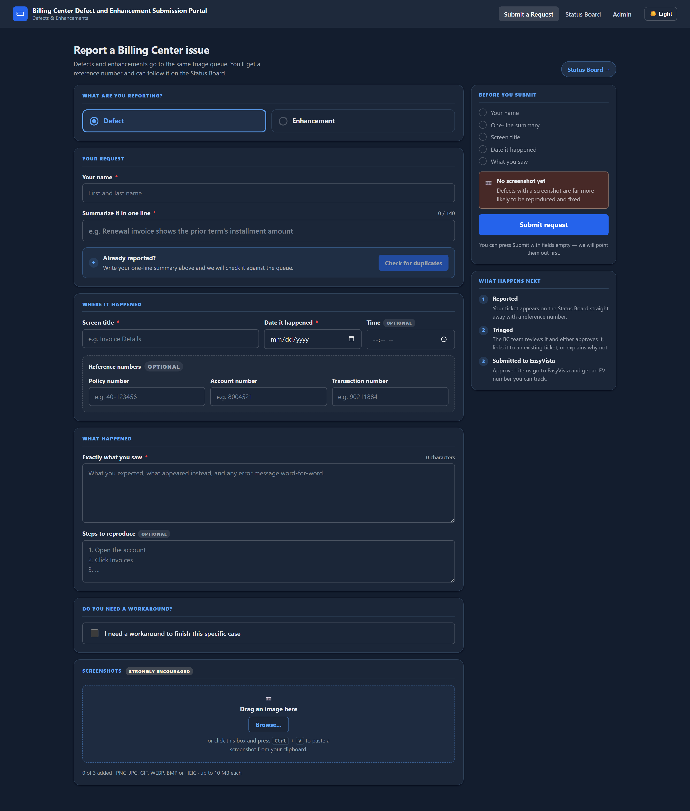 | 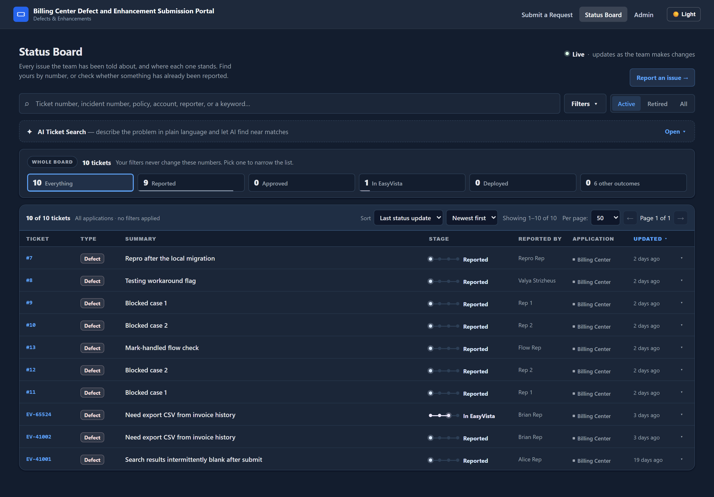 |

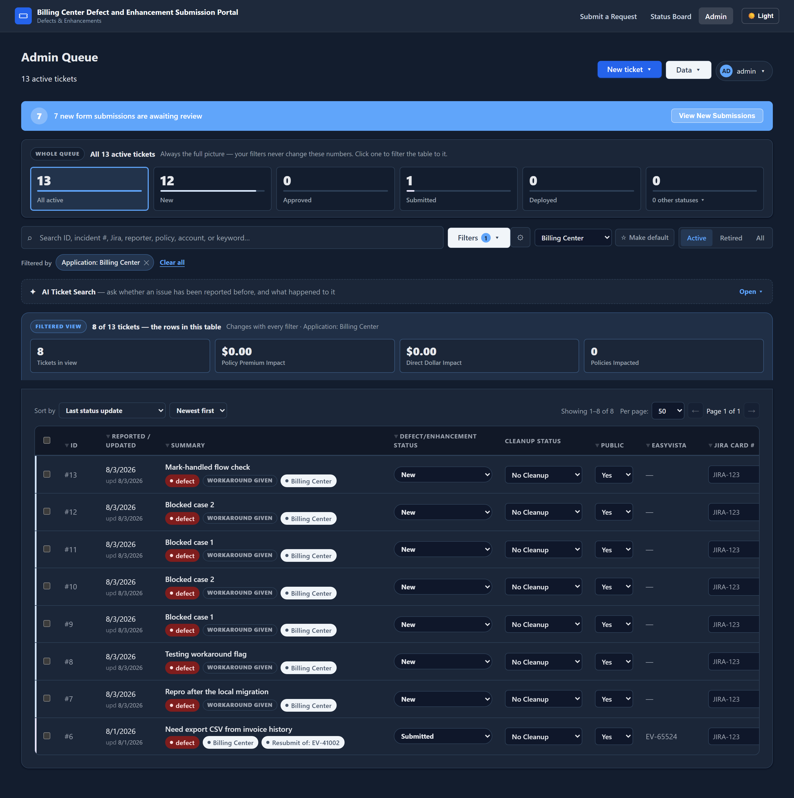

Every surface works at 390px.

| | |
|---|---|
| 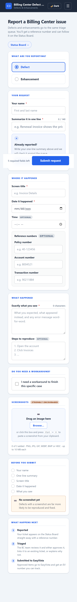 | 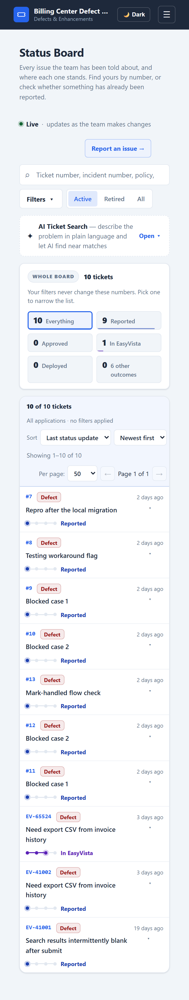 |

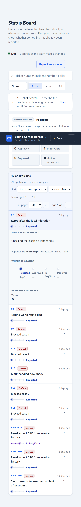

On narrow screens the submit form hides the rail's copy of the primary button
and shows a sticky bar instead. The detail modal's tab strip swaps for a
labelled `<select>` carrying the same badges as text — **CSS decides which is
visible, so both are always in the DOM and always in step**.


> The admin queue at 390px is the weakest surface in the prototype — the table
> degrades to stacked rows and is usable but cramped. Treat it as a known
> shortfall to design properly rather than a pattern to copy.

---

## 7. Identity and the viewer envelope

**The single most important architectural idea in this app.**

There is **one** server answer to *"who is this caller and what may they see"*,
and every surface reads it:

```
GET /api/viewer  →  {
  authenticated, user, isSuperUser, applicationRoles: { [appId]: 'viewer'|'admin' },
  memberApplicationIds, homeApplicationId, submitRequiresAuth, impersonating, ...
}
```

No page reads the session, a cookie, or localStorage to decide what a person may
see. They all read this. Consumed through one hook, `useViewer`.

Deliberately **not** behind `ensureAdmin`: the status board must work for a
caller with no session, and this is how the client learns there isn't one. The
anonymous envelope carries no user and no rights, so being unauthenticated is a
**shape**, not an error. It always returns 200.

### The SSO seam

`viewerService.resolveSessionIdentity` is the *one function* that reads the
session. Today it reads what the local login wrote. Under SSO it reads what the
provider asserted — including `groups`, which is **already honoured everywhere
downstream**. Group-driven home applications start working the moment the
assertion carries them, with no other change.

`reporterService` mirrors the same seam for submissions.

> This is the pattern to keep. Whatever your identity provider is, funnel it
> through one resolver and one envelope endpoint.

### Who may file

`SUBMIT_REQUIRES_AUTH` follows `AUTH_MODE` rather than being hardcoded on,
because **SSO is the only way a rep can sign in** — the local login is
admin-only. Forcing it on while `AUTH_MODE=local` would leave the submit form
reachable by nobody and take the portal's whole purpose offline. It arms itself
the moment SSO is switched on.

The client's copy defaults to `false` so a failed `/api/viewer` never locks the
form: the server refuses an unsigned submission on its own, and guessing
"locked" would take the form offline over a transient fetch error.

When filing *is* locked and there is no session, the page shows **an honest wall
instead of the form** — a form that cannot be submitted is worse than a clear
message.

### Dev impersonation

Per-application roles cannot be tested before SSO exists without a way to become
another user. `POST /api/dev/impersonate` is that way, and it is a
**password-free login by design** — so it is gated on **three independent
conditions**, and the route is **not even registered** unless all three hold:

1. `AUTH_MODE=local`
2. `NODE_ENV != production`
3. `DEV_IMPERSONATION=true`

Any one being false makes the path **404 rather than exist-and-refuse**, so a
single mis-set variable cannot open it. Every handler re-checks the flag anyway,
so requiring the module directly from a script cannot bypass the gate. It can
only assume an **existing** `users` row, so it cannot invent rights.

**Do not carry this into production.** Delete it once SSO lands, or reproduce the
three-gate pattern exactly.

---

## 8. Access control

### The model

| Mechanism | Grants | Where |
|---|---|---|
| `users.role` | Whether you can log in as an admin at all | legacy, kept so seeded accounts and live sessions don't break |
| `user_application_roles` | **Queue rights, per application** | the only source of triage rights |
| `users.is_super_user` | Every application's queue + the Access page | one column, one bypass |
| `application_ad_groups` | **A default application. No rights whatsoever.** | prefill only |

### The role ladder

Ordered weakest first, and **the order is load-bearing** — a role confers
everything the roles before it do, so "at least viewer" is an index comparison
rather than a list of exceptions.

- **`viewer`** — read the application's queue and its tickets; export. Changes nothing.
- **`admin`** — everything in that application: edit, status, attachments, redirect, EasyVista, public visibility, retire, bulk.

Deliberately a **code-level catalog, not a lookup table** — unlike statuses, a
role means nothing without the code paths that honour it, so a row someone added
by hand could only ever be a role that does nothing.

Unknown roles **fail closed**.

### The two rules that must survive the rebuild

**1. No row is no access.**

An admin with no grants sees **no tickets**, never all of them. This is enforced
*by construction*, not by a conditional:

```js
// viewerService.buildApplicationScopeWhere
// no grants  →  { application_id: [] }  →  SQL "IN (NULL)"  →  matches nothing
// super user →  {}                      →  the only bypass
```

> *"There is no code path where 'no roles' silently becomes 'no filter'."*

The service layer reinforces it: `scope` is a **required** parameter, and
omitting it returns nothing rather than everything, so a new caller that forgets
to resolve one fails closed instead of leaking another team's queue.

**2. Access scoping runs first and unconditionally.**

Everything after it is presentation filtering driven by the query string, and
**no query parameter may widen what a caller can see**. Choosing an application
you do not hold simply returns nothing.

### Read scope vs write scope

| | Source | Includes |
|---|---|---|
| **Read** (`resolveAdminReadScope`) | grants **+** the routing ledger | applications you hold, **plus** tickets your queue handed on |
| **Write** (`canMutateApplication`) | grants only, against the ticket's **current** application | `admin` role only — a viewer reads and nothing more |

A ticket outside the caller's read scope reads as **absent (404), not forbidden
(403)**, so the queue cannot be walked by id to learn what other teams handle.

Legacy tickets with **no** application stay visible to super users only, rather
than to everyone.

### Middleware division of labour

- `ensureAdmin` — *whether* the caller is an admin at all.
- `resolveViewer` → `req.viewer` — *what* they administer, resolved **once per
  request** so every handler in a chain scopes off the same answer. Resolution
  failure is an error, never an empty-but-successful viewer, so a route can
  never scope off a half-built envelope.
- `ensureSuperUser` — re-reads `is_super_user` **from the users row, not the
  session**, so a demotion takes effect on the demoted person's very next
  request — including one already in flight against the Access page.

### AD groups grant nothing

This is worth stating loudly because it is the natural mistake:

> *"An AD group says which applications a person **works in**, not what they may
> triage. Triage is granted deliberately, by a super user, one application at a
> time — so nobody acquires the ability to change other teams' tickets by being
> added to a distribution group."*

`resolveApplicationRoles` deliberately does **not** read AD groups.
`resolveMemberApplicationIds` and `resolveHomeApplicationId` do.

### Super user is granted out-of-band

By script (`node scripts/grantSuperUser.js <user> --apply`) or from the Access
page — **deliberately not by migration**. If a deploy-time migration promoted
every `role='admin'` user, demoting someone from the Access page would be
silently undone by the next deploy: the schema would keep overruling an
administrator's decision.

---

## 9. Public data boundary

Public API responses are **field-allow-listed** through one function:
`mapPublicSubmission` (`server/src/helpers/mappers.js`).

**Never leaves the server on a public surface:**

`created_by_email` · `reviewer` · `decision_notes` · `impact_details` ·
`impact_notes` · `policy_premium_impact` · `direct_dollar_impact` ·
`policies_affected_count` · `fingerprint` · `reporter_user_id` ·
`easyvista_submitted_by` · routing `note`

The allow-list is enforced in **five** places, and all five must hold:

1. Public REST list and detail endpoints.
2. **Socket broadcasts** to `public:update` — watchers include unauthenticated sockets.
3. **Public AI search results** — mapped through the same function.
4. **The text embedded for public semantic search** — a separate public-scope
   vector built from public-safe text only.
5. **The literal keyword/identifier lookup doc** for public scope.

Points 3–5 are the ones a rebuild will most easily miss. It is not enough to
filter the response — if the *embedding* or the *keyword doc* is built from
internal text, a public search can surface a ticket **because of** a decision
note, which leaks the fact of its content even when the note itself is not
returned.

Two fields are attached **after** mapping rather than inside it, because they are
facts about the *viewer*, not the row:

- `is_mine` — compared server-side against `reporter_user_id`, returned as a
  bare boolean. The socket broadcast reaches every watcher at once and so cannot
  carry it.
- `routings` — the hand-off trail, stripped by `mapPublicRouting`. The reporter
  sees **that** their ticket moved, when, and between which teams — never the
  note, which *"is triage talk between admins and can name colleagues or judge
  their work."*

A ticket that never moved carries **no `routings` key at all**, rather than an
empty array.

---

## 10. Real-time, presence and concurrency

### Why the socket connects directly to the backend

Not same-origin. Same-origin would route through the Vercel proxy, **which
cannot carry WebSocket upgrades** — so the connection degrades to perpetual HTTP
long-polling, billing a flood of Vercel requests. Going direct to Render gives a
real WebSocket: one persistent connection, ~zero ongoing requests.

That creates an auth problem: the frontend's session cookie is **not sent
cross-origin**. Solution (`server/src/helpers/realtimeToken.js`): the client
fetches a **short-lived HMAC-signed token** from a same-origin,
session-authenticated endpoint (`GET /api/realtime/token`) and passes it in the
socket handshake. It is only needed at connect time, so the TTL is intentionally
tiny. Public watchers get a 401 and connect anonymously.

> This whole mechanism is a **workaround for one hosting constraint**. If your
> deployment can carry WebSocket upgrades end to end, delete it and use the
> session.

### Events

| Event | Direction | Audience |
|---|---|---|
| `admin:notification` | server → client | admins room |
| `public:update` | server → client | everyone (allow-listed fields only) |
| `ticket:presence` | server → client | admins viewing a ticket |
| `submission:new` / `submission:updated` / `submission:redirected` | internal emit | fan out to the above |
| `attachment:added` / `attachment:removed` | internal emit | ” |
| `ticket:enter` / `ticket:leave` / `ticket:activity` | client → server | presence |

A redirect emits to **both** queues: the ticket leaves one board and appears on
the other, and neither admin should have to refresh to find out. The reporter
follows their own ticket across the hand-off — **and the note is not part of
that payload and must never become part of it.**

New-submission alerts fire only for tickets from the **public rep form**, not
admin-created entries.

### Presence — an advisory soft lock

`submissionId → Map<socketId, { username, openedAt, lastActivityAt }>`.

The **holder** is the earliest opener still connected (`Map` preserves insertion
order). State is **in-memory and ephemeral**: it auto-clears on disconnect,
which is exactly right for "they closed the tab / walked away".

The client re-announces on **every (re)connect**, because presence is tracked per
socket connection and wiped on disconnect — otherwise a network blip silently
drops the soft lock while the modal is still open. A throttled activity ping
keeps "last active" fresh.

It is **advisory**. The real protection is optimistic concurrency below.

### Optimistic concurrency

Two independent checks, and you need both:

1. **At save time**, the caller sends the row version (`updated_at`) it loaded.
   If the row has changed since → **409**.
2. **Inside the `UPDATE`'s `WHERE` clause**, repeated. Two admins who both
   passed the read-time check cannot both write: whichever update lands second
   matches **0 rows** and gets the same 409.

Check 1 alone is a race. Check 2 is what actually makes it safe.

The authorisation check runs **before** the conflict check, so an unauthorised
caller learns nothing about the row's edit history.

### Conflict resolution UI

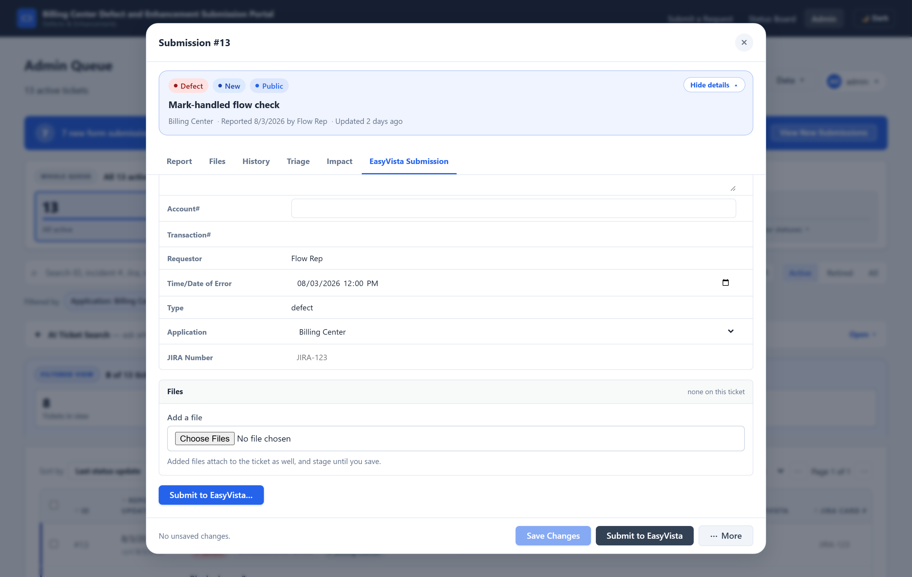

On a 409 the modal does not just complain. `ConflictReviewPanel` performs a
**three-way diff**: the base snapshot taken when the modal opened, the user's
draft, and the now-current server version. It lists only fields where the draft
differs from current, classifies each as *your change / their change / both*, and
lets the user take the current value or keep theirs.

Live-update handling is nuanced and worth copying:

- A `submission:updated` for the open ticket by **another** admin raises a banner
  **only if this viewer has unsaved edits to lose**.
- A **pure viewer** (no unsaved edits) gets a silent live refresh and the fresh
  version adopted as the new edit base. Keeping the stale snapshot would make the
  form show outdated values, and a follow-up Save would silently revert the other
  admin's change.
- In-progress drafts are persisted to localStorage (debounced), and persistence
  is **paused** while a recovered draft is being offered, so it is not wiped
  before the user decides.

---

## 11. AI semantic search

**Optional and self-disabling.** With no summary key set, `/api/ai-search/status`
reports `enabled: false` and every AI surface renders nothing. The app is fully
functional without it. Docs: `server/docs/ai-search.md`.

### Provider configuration

`AI_PROVIDER` is a **master switch** driving both the summary vendor and the
embeddings vendor, so one line picks the whole stack and never a mix:

| `AI_PROVIDER` | Summary | Embeddings | Third parties |
|---|---|---|---|
| `openai` | OpenAI Chat Completions | OpenAI embeddings | 1 |
| `anthropic` | Claude (`@anthropic-ai/sdk`) | **local**, in-process | **0** |

Claude has no embeddings API, hence the split. The `local` provider runs a small
open-source model in-process via `transformers.js` — no vendor, no key, no
per-call cost, and **ticket text never leaves the server**. First use downloads
~90MB of weights, then runs on CPU.

Granular `AI_SUMMARY_PROVIDER` / `EMBEDDINGS_PROVIDER` overrides still win if
set.

### The pipeline

```
1. Cheap DB pre-filter        → candidates (application, time window, scope)
2. Ensure candidate embeddings exist  (bounded self-heal)
3. Embed query, rank by cosine
4. LLM ranks + writes a grounded summary over the candidates
5. Return the summary + the REAL hydrated DB rows, in TWO sections
```

**Step 5 is a hard rule: ticket data always comes from the database row, never
from the model's text.** The model may only reference the tickets it was given —
it never invents a ticket, status, or date.

Two grounding guards in `aiSummary.js`:

- OpenAI **strict structured output**, so the model cannot emit a shape outside
  the schema.
- A **self-consistency check**: an explicit `has_relevant_match === false`
  forces `matches = []` no matter what the model listed — *it must not affirm
  tickets it just called irrelevant.*

A provider or parse failure **never breaks the request**. The route still returns
the similarity-ranked tickets; the summary is just empty.

### Ranking, and a bug worth not repeating

- **Top-K selection is by RAW cosine similarity** (after a similarity floor).
- The **recency-blended score only tiebreaks display order**.

`final = match + weight * recency`, where recency halves every
`AI_SEARCH_RECENCY_HALFLIFE_DAYS`.

They are separated because letting the blended score drive *selection* was
**evicting the best semantic match from the top-K**. The floor is applied to the
raw match too — recency must not rescue an irrelevant ticket past it.

### The literal-match safety net

Identifiers are matched **literally, and are deliberately never embedded**. Two
reasons:

1. **Identifier strings are semantic noise.** Embedding `I250101_0001` adds no
   meaning and dilutes the topical signal cosine ranking depends on.
2. **Any change to an embedded doc changes its `content_hash`**, which would
   re-embed the entire corpus — a CPU pass locally, a billable re-index hosted —
   and leave search degraded until the backfill finishes.

So there is a third, non-embedded, never-hashed **keyword doc** per ticket.

Matching is careful about false positives:

- Query terms: lowercased, punctuation stripped, stopwords and <3-char terms
  dropped, plus a trailing-`s`-trimmed variant so "invoices" hits "invoice".
- Identifier-shaped tokens (anything containing a digit) **skip** the stopword
  and length rules — a ticket really can be `#42` — because they match against
  identifier **fields**, not free text.
- A term may match *inside* an identifier only when distinctive enough not to
  collide: **5+ characters, or 3+ mixing letters and digits**. So a bare year
  like `2026` can only match a field that *is* `2026`, never a policy number
  that happens to contain it.
- The numeric ticket id is **equality-only**, so `42` finds `#42` and not `#1420`.

Literal matching runs over **every** window-surviving row, not just vectorised
ones, so a ticket created minutes ago is findable by its incident number before
the backfill reaches it.

### Storage and scoping

`submission_embeddings`: **one row per (submission, scope)**.

- `admin` — always; embedded from full internal text.
- `public` — only when `is_public = 1`; embedded from **public-safe text only**.

Vectors are stored as a **JSON float array in a TEXT column**, so this works
identically on SQLite and Postgres with **no pgvector dependency**.

> For a Postgres-only rebuild, use `pgvector`. The JSON-in-TEXT choice exists
> solely to keep the local SQLite path working, and it does the cosine ranking
> in application memory with a safety cap on candidate rows.

`content_hash` skips re-embedding when source text is unchanged, so steady-state
searches do zero embedding work. Unpublishing a ticket **deletes its public
vector** — no stale public embedding may survive.

**Public scope fails closed at every step**: `is_public = 1` is hard-forced,
retrieval uses the public vectors, the LLM cards are built from public-safe
fields only, keyword and identifier matching run against public-safe fields
only, and every result is mapped through `mapPublicSubmission`.

The public endpoint is **rate-limited per IP** (in-memory fixed window) to bound
anonymous cost and abuse.

Backfill: `npm run backfill:embeddings` — idempotent, batched.

---

## 12. EasyVista integration

Where the portal hands off to Tier 2 GTS. **The least finished part of the
system**, and the part most needing your attention.

### Two independent switches

| Variable | Default | Meaning |
|---|---|---|
| `EASYVISTA_ENABLED` | **off** | Whether a send actually leaves the app |
| `EASYVISTA_DEMO_MODE` | **on** | Whether an un-wired send is presented as though real |

`EASYVISTA_ENABLED` is off unless explicitly set, and **credentials alone are not
enough**:

> *"The payload shape, the endpoint path and the response parsing are all still
> unconfirmed, so an environment that happens to have a base URL and a key
> configured must not start transmitting on its own. Turning this on is the
> conscious act of saying the integration is ready."*

Demo mode is only ever consulted when the integration is **not** live, so it can
never quiet a warning about a real transmission. It exists so stakeholders can be
walked through the flow end to end — press send, get an incident number back,
watch the ticket move to `Submitted` — before EasyVista is switched on.

### The repurposed-fields problem

**Read this before designing the real integration.**

EasyVista's Billing Center catalog **does not have fields named after the things
we send**. Existing fields are **repurposed**:

| Our field | EasyVista field carrying it |
|---|---|
| Summary of issue | `E_KCL_CHECK_VOID_REASON` |
| What happened | `E_KCL_MKT_AUDIENCE` |
| … | … see `server/src/helpers/easyVistaPayload.js` |

This mapping lives in **exactly one place**, and the admin modal shows both names
side by side *"so the repurposing is visible rather than folklore."*

Because the repurposed fields are not surfaced anywhere readable in the EasyVista
UI, **everything is also rendered into `Description` as an HTML table**.

> ⚠️ **Known issue, EasyVista side:** EV **overwrites `Description`** with its
> own form-question results, which come through empty. Sending the table is what
> can be done from here; making it stick is an EV-side fix. **Raise this with the
> EasyVista team before rebuilding.**

`Urgency_ID` is derived from our priority level's leading digit (`"1 - Urgent"` →
`1`), falling back to Medium (3) when a ticket has no priority — the normal case
for defects.

The requestor/recipient EasyVista sees is **the admin who pressed send**, not the
person who reported the ticket. Because `users` has no email column yet, this
maps usernames through `EASYVISTA_ADMIN_MAILS` (`"username:mail,..."`) — and
prefers a real `user.email` the moment one exists, so adding the column later
needs no change here.

**Field order in the map is the wire format** for the HTML table. Reordering it
changes every future ticket.

### One payload builder, shared by preview and send

The preview and the real request are built by the **same function**, and the
dry-run endpoint **runs the real submit path and returns just before the API
call**:

> *"So the preview cannot disagree with the request."*

A preview built from a second, hand-maintained copy of the format drifts silently
and the admin trusts it anyway. This is the single most reusable idea in the
integration — keep it.

`POST` rather than `GET` for the preview, because it carries the admin's unsaved
draft. It writes nothing. A real first-time send ignores the draft (the client
saves the row first, then submits); a dry run happens *before* that save, so it
merges the draft itself — otherwise the preview would show stale values for
exactly the case the admin is checking.

The preview is debounced and only runs while the tab is mounted.

### Send-as type

EasyVista accepts a defect **or** an enhancement and nothing else. For an
ordinary ticket the choice is pre-filled with its own type. A **`Cleanup Only`
task has no sensible default**, so it must be chosen — which is also how a
cleanup task reaches EasyVista at all, without being reclassified first.

Which fields **block** a send follows the **chosen** type, not the ticket's type:
send a cleanup task as an enhancement and it must satisfy enhancement rules.

A blocked send **pulls the admin to the EasyVista tab**, where the offending
fields are editable, rather than leaving them to hunt for the right tab.

The action bar can send outright only when the send is unambiguous. Three cases
route to the tab first, because each needs a decision made there: a **resubmit**
(it forks the record), a **missing required field**, and a **`Cleanup Only`
task** with no type chosen.

### Attachments

At most **four** per submission — a genuine choice, not a list. Files added on
the EasyVista tab go through the normal attachment upload, so they land on the
ticket too; there is no second EasyVista-only pile. `null` selection means "all
of them, up to the cap", so an older client keeps working.

Selection is filtered against **the ticket's own rows**, which is what stops an
id from another submission being attached to this one.

> ⚠️ **This is the one piece still waiting on EasyVista.** Everything deciding
> *which* files go — the picker, the cap, validation, the confirm dialog — is
> built and tested. What remains, once the contract is known: the endpoint (same
> call, or a follow-up against the new ticket id?), multipart vs base64-in-JSON,
> the field name, whether several go per request, and the per-file size cap.
>
> The attachment send **deliberately never throws**: the ticket already exists by
> the time it runs, so failing must not turn a successful submission into an
> error. It warns and reports what it did.

### Resubmission

Creates a **new** submission, already set to `Submitted`, and a new EasyVista
ticket, copying attachments across. The original is **otherwise untouched** — it
keeps its own classification. Bookkeeping columns link them both ways
(`is_resubmission`, `resubmission_of_*`, `has_resubmission`,
`latest_resubmission_*`).

Every lookup is resolved and validated **before** inserting, so a missing lookup
can never leave an orphaned resubmission row with a null status. Likewise on
first send, the type lookup is resolved **before** the outbound call — a missing
lookup must not leave an EasyVista ticket created against a record we then
failed to tag.

`easyvista_application_id` snapshots what the incident was raised under at send
time. Deliberately **not** derived from `application_id`, because a redirect
after the send would then silently rewrite what was transmitted.

---

## 13. Excel round-trip and file storage

### Import

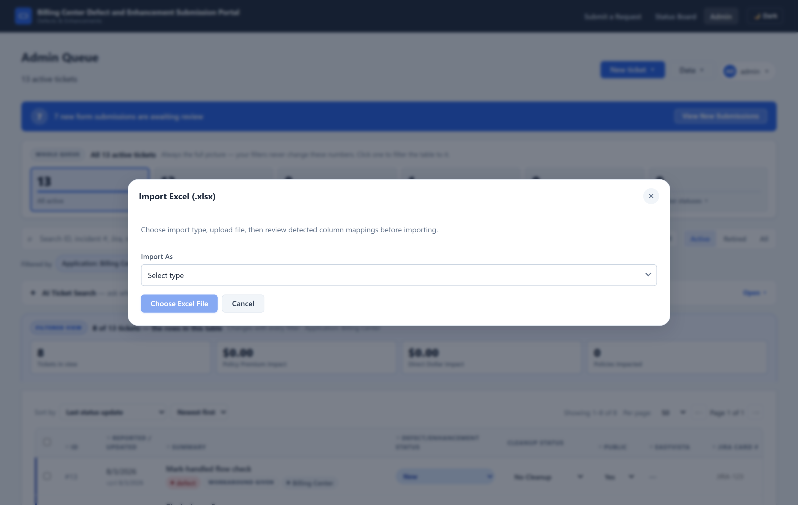

Two-phase: **analyze**, then **insert**.

`POST /api/admin/submissions/import-xlsx/analyze` parses the workbook, proposes
column mappings, and reports valid/invalid row counts **without writing
anything**. The admin confirms or adjusts, then `POST .../import-xlsx` commits.

Every run is recorded in `excel_import_runs` — file name, sheet, mode, row
counts, dry-run flag, status, and an errors blob — readable via
`.../import-xlsx/history`. Bulk historical loads are exactly the operation you
want an audit trail for.

Visibility mirrors the create path: honour an explicitly mapped `is_public`
column, but when unmapped or blank **default to public** — unless the row is a
cleanup-only task, which stays private.

Imported tickets are indexed for AI search in the **background, batched and
non-blocking** (lookup maps built once, not per row), and it is a no-op when AI
search is not configured.

### Export

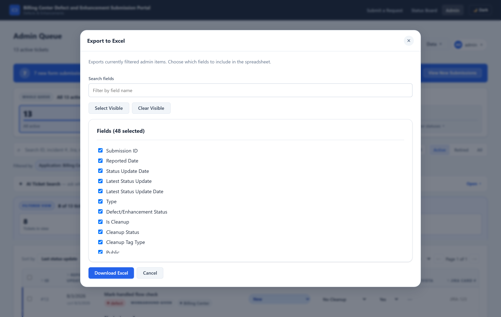

A field picker, then `GET /api/admin/submissions/export-xlsx`.

**The export reads through the same access scope as the queue**, so what an
admin can download is exactly what they can see on screen. This is the kind of
thing that quietly becomes a data-leak path in a rebuild if the export takes its
own query path.

### File storage

Attachments are images only — PNG, JPG, GIF, WEBP, BMP, HEIC, 10 MB each, 3 per
submission from the rep form. **Extension and MIME type are both checked**, so
arbitrary HTML/SVG cannot be stored and later served same-origin from
`/uploads`.

There are **two storage backends**, chosen at runtime
(`server/src/helpers/storage.js`):

| Condition | Backend | `attachments.file_path` holds |
|---|---|---|
| `SUPABASE_URL` + `SUPABASE_SERVICE_ROLE_KEY` + bucket all set | Supabase Storage | the **public URL** |
| otherwise | local filesystem, `server/uploads/<submissionId>/` | a repo-relative path |

Filenames are sanitised to `[a-zA-Z0-9._-]` and prefixed with a timestamp (plus a
random segment on the Supabase path) so two uploads of `screenshot.png` cannot
collide. The temp file is removed in a `finally` block whichever backend runs.

**Two consequences the rebuild must address:**

1. **On an ephemeral filesystem, the local backend loses every attachment on
   restart** — and leaves `attachments` rows pointing at files that no longer
   exist. This is exactly the Render case. See
   [section 19](#19-deployment-topology-and-what-it-costs-you).
2. **The Supabase bucket is public.** Uploads go to
   `/storage/v1/object/public/<bucket>/…`, so an attachment URL is reachable by
   anyone who has it — unguessable, but **not behind authorisation**. Since these
   are screenshots that may contain customer policy and account data, this is the
   weakest point in the app's data boundary. **Serve attachments through an
   authorising endpoint, or use signed expiring URLs.** Everything else on the
   public surface is carefully allow-listed; this route around it was not
   intended as a design, it is a prototype shortcut.

Deleting an attachment is authorised **against the parent ticket**, not the
attachment id — the file carries no application of its own, and a missing parent
is refused rather than treated as unowned.

---

## 14. Known gaps, traps and open questions

### Unfinished

| Gap | Detail |
|---|---|
| **EasyVista attachment transmission** | The only genuinely unimplemented feature. Contract unknown — see [section 12](#attachments). |
| **`Description` is overwritten by EasyVista** | EV-side bug. Needs raising with their team. |
| **No true snapshots** | `reported_snapshot` / `easyvista_snapshot` do not exist. The Report tab shows *current saved values* and says so. Once they exist, the tab shows the captured values and the original stays reachable after a submission. **Design these in from the start** — an audit surface that shows current values is a footgun. |
| **SSO not wired** | `AUTH_MODE=local`. Every seam is in place; nothing is connected. |
| **`users` has no email column** | EasyVista requestor mail comes from a `username:mail` env map as a stopgap. |
| **AD group names unknown** | `application_ad_groups` is empty. The app works without it. |

### Data-type defects

| Issue | Status |
|---|---|
| **Currency was single-precision float** | **FIXED.** `policy_premium_impact` / `direct_dollar_impact` are now `DECIMAL(14,2)`, coerced back to numbers at the mapper boundary, with an explicit migration (`npm run migrate:money-columns`, dry-run by default). Postgres `REAL` is `float4`, so `1234567.89` was stored as `1234567.875`. Full detail: [the money fix](#the-money-fix-applied). |
| **Timestamps stored as ISO strings in `TEXT`** | **NOT fixed — specified instead.** Deliberately: `updated_at` doubles as the optimistic-concurrency token *compared as a string*, so a naive type change makes every save return a spurious 409. Malformed legacy values also already exist. Read [the conversion notes](#timestamps-what-a-conversion-has-to-handle) before starting. |

### Security shortcuts to close

| Issue | Detail |
|---|---|
| **Attachment URLs are unauthenticated** | Supabase uploads go to a **public** bucket. Unguessable, but anyone with the URL can read it — and attachments are screenshots that may contain customer policy and account data. This is the one route around an otherwise carefully allow-listed public boundary. **Fix with an authorising endpoint or signed expiring URLs.** |
| **`sameSite: 'none'` in production** | More permissive than the proxy setup requires; `lax` would do. |
| **No session store** | Default `MemoryStore` — see below. Sessions are also not invalidated server-side on demotion (the *rights* re-read on every request, which is the important half, but the session itself persists). |

### Won't survive scale — deliberate prototype shortcuts

- **Sessions are in-memory.** `express-session` is configured with no store, so
  every deploy signs every admin out and the app cannot run more than one
  instance. **The single biggest operational shortcut in the codebase.**
- **Attachments on local disk are lost on ephemeral compute** unless Supabase
  Storage is configured — and the `attachments` rows survive, pointing at nothing.
- **Rate limiting is in-memory** (`server/src/middleware/rateLimit.js`) — single
  instance only. Needs a shared store behind more than one process.
- **Ticket presence is in-memory** — same constraint.
- **Cosine ranking happens in application memory** with a cap on candidate rows.
  Use `pgvector`.
- **The public board sorts in memory** — the list endpoint returns the whole
  board and the client sorts it. Fine at prototype volume; paginate and sort
  server-side.

### Portability traps you can probably delete

These exist **only** because the prototype supports SQLite alongside Postgres.
On a Postgres-only rebuild, delete them all — but read them first, because if you
*do* keep a dual-provider setup you will hit every one.

1. **Composite unique indexes cannot be declared on the model.** On SQLite,
   `sync({ alter: true })` rebuilds the table, reads the composite index back
   through `describeTable`, and **mis-derives it into standalone per-column
   `UNIQUE` constraints**. On `user_application_roles` that means
   `UNIQUE(user_id)` — silently capping every admin at **one application
   forever**. Affected tables also skip `alter` entirely and get a plain
   `CREATE TABLE IF NOT EXISTS`; their uniqueness is created as raw
   `CREATE UNIQUE INDEX IF NOT EXISTS`.
2. **SQLite rejects `ALTER TABLE ... ADD COLUMN ... UNIQUE`** outright. So
   `users.external_id` is declared plain and gets its unique index raw — declaring
   it on the model breaks migration locally while succeeding on Postgres.
3. **Vectors as JSON in a `TEXT` column** instead of `pgvector`.
4. **Raw SQL for one aggregate** in `resolveHomeApplicationId`, so ordering is
   identical on both dialects.
5. **`SELECT *` in `adminViewPreferenceService`** rather than naming
   `pinned_application`, so it keeps working against a DB where the boot-time
   sync has not added that column yet.

All of them are catalogued with reasons in
`server/db/models/index.js` (`RAW_UNIQUE_INDEXES`, `NO_ALTER_MODEL_NAMES`).

### Operational notes

- **Production self-migrates on boot** (`sync({ alter: true })` + `findOrCreate`
  seeds), guarded to `NODE_ENV=production` so local runs never auto-alter a DB
  they might be pointed at. Non-fatal: the server starts anyway and logs the
  failure. **Reconsider this.** Convenient for a prototype; for production,
  prefer explicit versioned migrations run as a deploy step.
- **`keepAlive.js`** pings the DB daily so a free-tier Supabase project is not
  paused for inactivity. Delete it on paid infrastructure. Note that
  `[keepAlive] Supabase heartbeat OK` in the log **does not** mean you are on
  Supabase data — it runs regardless of provider, which has misled people.

### ⚠️ The one thing to fix before anyone else opens this repo

`server/.env` currently has `DB_MODE=hosted` / `DB_PROVIDER=postgres` with a live
Supabase `DATABASE_URL`. **Any developer who clones this and runs `npm run dev`
is pointed at production data**, and several maintenance scripts
(`grantSuperUser`, `backfillPublicVisibility`, `dropLegacyTextColumns`) target
whatever the environment points at — they say so in their headers, but the
default should not be production.

`server/.env` is gitignored and untracked, so **no credential is in git history**
— but it also means each developer's default is whatever they happen to have
locally. For the rebuild: default to a local database, make production access an
explicit opt-in, and keep the Supabase password and provider API keys in a
secret manager rather than a dotfile.

---

## 15. Data model

20 tables. `submissions` is the aggregate root; everything else is lookups,
ledgers, or access.

### `submissions` — 56 columns

Grouped by purpose:

| Group | Columns |
|---|---|
| Identity | `id`, `created_at`, `updated_at`, `created_via_id` |
| Reporter | `created_by`, `created_by_email`, **`reporter_user_id`** |
| Classification | `type_id`, `application_id`, `status_id`, `priority_level_id`, `enhancement_request_type_id` |
| The report | `summary_of_issue`, `what_happened_exact_details`, `steps_to_reproduce`, `request`, `screen_title`, `date_time_of_error` |
| References | `policy_num`, `account_num`, `transaction_num`, `jira_number` |
| Triage | `reviewer`, `decision_notes`, `duplicate_reference`, `duplicate_of`, `fingerprint` |
| Impact | `impact_details`, `impact_notes`, `policy_premium_impact`, `direct_dollar_impact`, `policies_affected_count`, `occurrence_count`, `occurrence_timeframe_count`, `occurrence_timeframe_id`, `occurrence_rate` |
| Workaround | **`needs_workaround`**, **`workaround_provided`** |
| Cleanup | `is_cleanup`, `cleanup_status_id`, `cleanup_tag_type_id` |
| EasyVista | `easyvista_ticket_id`, `easyvista_submitted_by`, **`easyvista_application_id`** |
| Resubmission | `is_resubmission`, `resubmission_of_submission_id`, `resubmission_of_easyvista_ticket_id`, `has_resubmission`, `latest_resubmission_submission_id`, `latest_resubmission_easyvista_ticket_id` |
| Flags | `is_retired`, `is_public`, `logged_defect` |
| Release | `release_number`, `release_notes`, `desired_completion_date` |

**Lookups are FK-only.** The eight legacy text columns were dropped
(`scripts/dropLegacyTextColumns.js`); rows store only `*_id`, and text names are
hydrated at read time by `helpers/lookups.js`. **No redundant text columns** —
which means anything reading `row.status` directly gets `undefined`. This caused
a real bug: `redirectService` recorded every hand-off as `New` until it resolved
from `status_id` instead.

Two column choices with reasons worth carrying:

- **`reporter_user_id`, not `created_by`, answers "is this mine".** A rename or
  a typo would silently unlink someone's whole history, and two people share a
  name. Null on historic rows and anything filed without a session — *"those
  tickets belong to nobody, which is the truth rather than a guess."*
- **`easyvista_application_id` is a snapshot**, not derived, so a later redirect
  cannot rewrite what was transmitted.

#### Two column-type defects

**Money — FIXED in the prototype.** `policy_premium_impact` and
`direct_dollar_impact` are now `DECIMAL(14,2)`. They were `REAL`, which Sequelize
maps to single-precision `float4` on Postgres — so the **stored** value was wrong:

```
1234567.89  ->  1234567.875          (displays as $1,234,567.88)
  99999.99  ->  99999.9921875
      0.07  ->  0.07000000029802322
```

SQLite's `REAL` is a double, which is why this never reproduced locally and only
ever damaged the hosted data. The Excel export writes these out raw, so it showed
in spreadsheets too. See [the fix](#the-money-fix-applied).

**Timestamps — NOT fixed; specified for you instead.** Every model is
`timestamps: false`, and `created_at`, `updated_at`, `changed_at`, `routed_at`,
`uploaded_at` and `date_time_of_error` are all `TEXT` holding ISO strings. Use
native timestamp types — but read
[the conversion notes](#timestamps-what-a-conversion-has-to-handle) first, because
three things make this more than a type change.

### Lookups

All share `{ id, name, sort_order, is_active }`. Runtime-editable, deactivated
rather than deleted.

`submission_types` · `defect_enhancement_statuses` (+`is_retired`) ·
`cleanup_statuses` · `cleanup_tag_types` · `applications` ·
`enhancement_request_types` · `priority_levels` · `submission_sources` ·
`occurrence_timeframes` (+`days_equivalent`)

### Ledgers and children

| Table | Purpose |
|---|---|
| `submission_status_events` | Every status change: `submission_id`, `status`, `changed_at`, `changed_by`. Append-only. |
| `submission_routings` | **The custody chain.** One row per hand-off. `from_application_id` **null marks the original filing** rather than a hand-off, so the ledger reads as a complete chain instead of starting mid-story. `status_at_handoff` preserves what it was when it left, because the move resets the live status. `note` is **immutable and internal**. No unique constraint — many rows per submission is the point, and a ticket may legitimately come back (A → B → A). |
| `attachments` | `submission_id`, `filename`, `mime_type`, `file_path`, `uploaded_by_role` |
| `excel_import_runs` | Import audit trail |
| `submission_embeddings` | One row per `(submission_id, scope)`; `model`, `content_hash`, `vector` (JSON in TEXT) |

### Access and preferences

| Table | Purpose |
|---|---|
| `users` | `username`, `password_hash`, `role`, `is_super_user`, `external_id` (the IdP's stable key — objectGUID or UPN, so a person keeps their history through a name change), `display_name`, `email` |
| `user_application_roles` | **A grant.** `(user_id, application_id, role)`, `granted_at`, `granted_by` — audited. **No row is no access.** |
| `application_ad_groups` | `(application_id, group_name, role)`. Sets a default application. **Grants nothing.** The stored role is fixed rather than accepted from the caller, so a mapping cannot be created that looks like it grants something. |
| `admin_view_preferences` | Per admin: `columns_json`, `filters_json`, `pinned_application` |

A **hard delete** is used for AD-group mappings, deliberately: an unmapped group
is *the absence of a default*, not a state worth keeping history of, and inactive
rows would make the list read as though the mapping still meant something.

---

## 16. API surface

All under `/api`. Admin routes require a session; `/api/admin/*` mutations also
require the CSRF header.

### Auth, identity, health

| Method | Path | Notes |
|---|---|---|
| `POST` | `/api/auth/login` | |
| `POST` | `/api/auth/logout` | |
| `GET` | `/api/auth/me` | |
| `GET` | `/api/viewer` | **The envelope.** Always 200; anonymous shape when unauthenticated. |
| `GET` | `/api/realtime/token` | Short-lived socket token. 401 for non-admins. |
| `GET` | `/api/health`, `/health` | |

### Metadata

| Method | Path |
|---|---|
| `GET` | `/api/meta/options` (public) |
| `GET` | `/api/admin/meta/options` |
| `POST` | `/api/admin/meta/:category` |
| `PUT` | `/api/admin/meta/:category/:id` |
| `POST` | `/api/admin/meta/:category/reorder` |

### Submissions — public / rep

| Method | Path | Notes |
|---|---|---|
| `POST` | `/api/submissions` | Rep filing. Reporter resolved server-side. |
| `GET` | `/api/public/submissions` | Allow-listed. `is_public` gated. |
| `GET` | `/api/public/submissions/:id` | ” |

### Submissions — admin

| Method | Path | Notes |
|---|---|---|
| `GET` | `/api/admin/submissions` | Scoped |
| `GET` | `/api/admin/submissions/:id` | Out-of-scope → **404, not 403** |
| `POST` | `/api/admin/submissions` | |
| `PUT` | `/api/admin/submissions/:id` | Optimistic concurrency → 409 |
| `POST` | `/api/admin/submissions/bulk-visibility` | |
| `POST` | `/api/admin/submissions/bulk-retire` | |
| `POST` | `/api/admin/submissions/:id/redirect` | Moves the ticket |
| `POST` | `/api/admin/submissions/:id/easyvista-preview` | Dry run; writes nothing |
| `POST` | `/api/admin/submissions/:id/submit-easyvista` | |
| `POST` | `/api/admin/submissions/ai-search` | |
| `GET` | `/api/admin/submissions/export-fields` | |
| `GET` | `/api/admin/submissions/export-xlsx` | Same scope as the queue |
| `POST` | `/api/admin/submissions/import-xlsx/analyze` | |
| `POST` | `/api/admin/submissions/import-xlsx` | |
| `GET` | `/api/admin/submissions/import-xlsx/history` | |

> Static paths (`bulk-visibility`, `export-xlsx`, …) are registered **before** the
> `PUT /:id` param route. Different methods, so they cannot be captured either
> way, but the ordering is intentional and commented.

### Attachments, access, preferences, AI

| Method | Path | Notes |
|---|---|---|
| `POST` | `/api/admin/attachments` *(via attachmentRoutes)* | Image-only |
| `DELETE` | `/api/admin/attachments/:id` | Authorised against the **parent ticket**, not the attachment id — the file carries no application of its own. A missing parent is refused, not treated as unowned. |
| `GET` | `/api/admin/access` | **Super user** |
| `PUT` | `/api/admin/access/users/:id/grants` | ” Whole set replaced |
| `POST` | `/api/admin/access/bulk` | ” All-or-nothing |
| `PUT` | `/api/admin/access/users/:id/super-user` | ” Refuses to remove the last |
| `POST` | `/api/admin/access/ad-groups` | ” |
| `DELETE` | `/api/admin/access/ad-groups/:id` | ” |
| `GET` | `/api/admin/view-preferences` | |
| `PUT` | `/api/admin/view-preferences` | Replaces the whole row — send all three fields |
| `DELETE` | `/api/admin/view-preferences` | Reset to defaults |
| `GET` | `/api/ai-search/status`, `/api/admin/ai-search/status` | `{ enabled, summaryEnabled }` |
| `POST` | `/api/ai-search` | Public. **Rate-limited per IP.** |

### Dev only — never in production

`GET /api/dev/impersonate/users` · `POST /api/dev/impersonate` ·
`POST /api/dev/impersonate/stop` — triple-gated; the route is **not registered**
unless all three conditions hold.

### Error contract

4xx may surface their message; **5xx stay generic in production** so DB and
internal details never reach a client.

### Security headers and CSRF

- `helmet` — with `contentSecurityPolicy: false` (this is an API server; the SPA
  host owns its own CSP) and `crossOriginResourcePolicy: 'cross-origin'` so the
  separate frontend origin can load `/uploads` images.
- **CSRF: double-submit cookie**, no external dependency. A non-httpOnly
  `bc_csrf` cookie is issued to every client; state-changing requests to
  `/api/admin/*` must echo it in `X-CSRF-Token`. The client does this centrally
  in `lib/api.js`'s shared `request()` helper — **keep it centralised**.
- `/uploads` is served with `X-Content-Type-Options: nosniff` to stop browsers
  MIME-sniffing stored files into executable content.
- **Two upload configurations, deliberately:** a generic temp upload for
  trusted, separately-validated files (the admin Excel import), and an
  **image-only** upload for attachments and screenshots, *"so that arbitrary
  (e.g. HTML/SVG) content cannot be stored and later served same-origin from
  `/uploads`."* Extension **and** MIME type are both checked.

---

## 17. Configuration reference

`server/.env`. **No secret values appear in this document** — names only.

### Core

| Variable | Default | Notes |
|---|---|---|
| `PORT` | `4000` | |
| `CLIENT_ORIGIN` | `http://localhost:5173` | CORS + cookie scope |
| `SESSION_SECRET` | — | **Required.** The server **refuses to start** in production if this is the dev default or <32 chars. Keep in a secret manager. |
| `SESSION_COOKIE_SAME_SITE` | `none` (prod) / `lax` (dev) | See [section 19](#19-deployment-topology-and-what-it-costs-you) — `none` is more permissive than needed |
| `SESSION_COOKIE_SECURE` | `true` (prod) / `false` (dev) | |
| `SESSION_COOKIE_DOMAIN` | — | For cross-origin cookie setups |
| `NODE_ENV` | — | `production` enables boot self-migrate + trust proxy + generic 5xx + secure cookies |

### File storage

| Variable | Notes |
|---|---|
| `SUPABASE_URL` | All three present → Supabase Storage; otherwise local disk |
| `SUPABASE_SERVICE_ROLE_KEY` | ” |
| `SUPABASE_STORAGE_BUCKET` | default `attachments`; **the bucket is public** |

### Database

| Variable | Notes |
|---|---|
| `DB_MODE` | `local` (sql.js file) \| `hosted` (Postgres) |
| `DB_PROVIDER` | Explicit override: `sqljs` \| `postgres` |
| `DATABASE_URL` | **Required** when provider is `postgres`; the app throws without it |
| `SQLJS_PATH` / `SQLITE_PATH` | Local file, default `./data/dev.sqlite` |

Provider resolution: `DB_PROVIDER || (DB_MODE === 'hosted' ? 'postgres' : 'sqljs')`.

### Identity

| Variable | Notes |
|---|---|
| `AUTH_MODE` | `local` \| `sso` |
| `SUBMIT_REQUIRES_AUTH` | Follows `AUTH_MODE` unless forced |
| `ADMIN_LOGINS` | Comma-separated admin usernames |
| `SEED_ADMIN_USERNAME` / `SEED_ADMIN_PASSWORD` | Seeding only. **Never real credentials.** |
| `DEV_IMPERSONATION` | Dev only; one of three required gates |

### EasyVista

| Variable | Default | Notes |
|---|---|---|
| `EASYVISTA_ENABLED` | **off** | Master switch |
| `EASYVISTA_DEMO_MODE` | **on** | Present a stub send as real |
| `EASYVISTA_BASE_URL` / `EASYVISTA_API_KEY` | — | Not sufficient to enable |
| `EASYVISTA_REQUESTS_PATH` | `/requests` | Override the (unconfirmed) endpoint path without a code change |
| `EASYVISTA_ADMIN_MAILS` | — | `username:mail,...` stopgap |

### AI search — all optional

| Variable | Notes |
|---|---|
| `AI_PROVIDER` | **Master switch:** `openai` \| `anthropic` |
| `ANTHROPIC_API_KEY` / `OPENAI_API_KEY` / `VOYAGE_API_KEY` | Whichever the provider needs |
| `AI_SUMMARY_PROVIDER` / `EMBEDDINGS_PROVIDER` | Granular overrides; win if set |
| `AI_MODEL` / `OPENAI_SUMMARY_MODEL` / `EMBEDDINGS_MODEL` | Model pins |
| `AI_SEARCH_ENABLED` / `AI_SEARCH_PUBLIC_ENABLED` | |
| `AI_SEARCH_TOP_K` | |
| `AI_SEARCH_RECENCY_WEIGHT` / `AI_SEARCH_RECENCY_HALFLIFE_DAYS` | Ranking blend |
| `AI_SEARCH_MAX_QUERY_LENGTH` / `AI_SEARCH_MAX_INLINE_EMBED` | Bounds |
| `AI_SEARCH_PUBLIC_RATE_LIMIT` / `AI_SEARCH_PUBLIC_RATE_WINDOW_MS` | |

Client: `VITE_SOCKET_URL` overrides the socket target.

---

## 18. Running the prototype

```bash
# Server
cd server && npm install
cp .env.example .env        # then edit — see section 17
npm run migrate             # creates tables + seeds lookups
npm run seed:admin          # creates the admin account(s)
npm run seed:sample         # optional sample submissions
npm run backfill:embeddings # optional, only if AI search is configured
npm run dev                 # :4000

# Client
cd client && npm install
npm run dev                 # :5173, proxies /api /uploads /socket.io to :4000
```

**Check `server/.env` before running anything.** With `DB_PROVIDER=postgres` you
are on the live Supabase database. To force a sandboxed local run without
editing the file — `dotenv` does not override real environment variables, so
these win:

```bash
DB_MODE=local DB_PROVIDER=sqljs DATABASE_URL= npm run dev
```

### Verification gates

```bash
cd client && npm run lint   # ESLint incl. react-compiler rules — must stay green
cd server && npm test       # node:test
```

### Scripts

| Command | Purpose |
|---|---|
| `npm run migrate` | Sync schema + seed lookups |
| `npm run seed:admin` | Create admin users |
| `npm run seed:sample` | Sample submissions (skips if the table is non-empty) |
| `npm run backfill:embeddings` | Index existing tickets for AI search; idempotent |
| `npm run backfill:public-visibility` | One-time: make existing non-cleanup tickets public. **Dry-run by default**; `-- --apply` to write |
| `npm run migrate:money-columns` | One-time: convert the two money columns `REAL` → `DECIMAL(14,2)`. **Dry-run by default**; `-- --apply` to write. No-ops on SQLite. |
| `npm run grant:super-user` | Grant/revoke super user. **Dry-run by default**; `--apply` to write |

Note the pattern: **every destructive maintenance script is dry-run by default**
and reports what it would do. `backfillPublicVisibility` even persists the exact
set of ids it flipped, *"so the change can be reverted precisely — after the flip
these ids are indistinguishable from always-public tickets."* Worth copying.

---

## 19. Deployment topology and what it costs you

> **The internal deployment will be on company servers and a company database —
> not Vercel, Render or Supabase.** So read this section as *"here is what the
> prototype's hosting forced, and here is what you can therefore delete"*, not as
> a topology to reproduce.
>
> Note that **Vite stays**: it is the build tool that produces the static bundle,
> not a host. `npm run build` still produces `client/dist/`; you serve that from
> your own web server instead of Vercel.
>
> Two things are **not yet decided** and are called out as explicit decisions
> below: the [database engine](#decision-1-the-database-engine) and the
> [hosting shape](#decision-2-hosting-shape-and-what-the-reverse-proxy-must-do).

### How the prototype is deployed today — context, not the target

| Component | Host | Notes |
|---|---|---|
| Client (React SPA) | **Vercel** | Static build from `client/`, SPA fallback rewrite |
| Server (Express API) | **Render** | Node web service, **no build step** |
| Database | **Supabase PostgreSQL** | `DATABASE_URL`, SSL required, `rejectUnauthorized: false` |
| File storage | **Supabase Storage** (public bucket) | Falls back to local disk when unset |
| EasyVista | External | Off unless explicitly enabled |

### Client

```bash
cd client && npm run build      # → client/dist/
```

`client/vercel.json` rewrites `/api/(.*)` to the Render host, and `/(.*)` to
`/index.html` for the SPA.

> **There is no `/socket.io` rewrite, and its absence is load-bearing.** An
> earlier version of the project README claimed there was one; there is not, and
> adding one would break the design. See below.

Build-time variables: `VITE_API_BASE` (default `''` = same-origin, i.e. use the
Vercel rewrite) and `VITE_SOCKET_URL`.

**The API host is hardcoded in two places** — `client/vercel.json` and
`client/src/lib/socket.js`'s production fallback. In a rebuild, drive both from
configuration.

### Server

```bash
cd server && node src/index.js
```

`NODE_ENV=production` turns on four behaviours at once, which is worth knowing
because it means production and local differ in more than logging:

1. `trust proxy 1` — Render terminates TLS upstream.
2. **Schema self-sync on boot** — `sync({ alter: true })` plus `findOrCreate`
   lookup seeds, so a deploy that adds a column needs no manual migrate step.
   Non-fatal: the server starts anyway and logs the failure. Deliberately gated to
   production so a local run — which may be pointed at the live DB — never
   auto-alters it.
3. Generic 5xx bodies.
4. `secure: true`, `sameSite: none` session cookies.

The server **refuses to start** in production if `SESSION_SECRET` is the
development default or shorter than 32 characters. That fail-closed check is
worth keeping.

### What you can delete on your own infrastructure

Four things in this codebase exist **only** because of the prototype's hosting.
None of them is a product decision. On company servers, all four go away.

**1. The direct WebSocket connection and the whole realtime-token mechanism.**

Vercel rewrites cannot carry WebSocket upgrades. A same-origin socket therefore
degraded to perpetual HTTP long-polling, *"billing a flood of Vercel requests."*
So the client connects **straight to the API host**, bypassing the proxy.

That broke cookie auth — the session cookie is not sent cross-origin — so admins
authenticate the socket with a **short-lived HMAC-signed token** fetched from a
same-origin, session-authenticated endpoint (`GET /api/realtime/token`).

> **Delete `server/src/helpers/realtimeToken.js`, `GET /api/realtime/token`, and
> the token fetch in `client/src/lib/socket.js`.** On your own reverse proxy,
> configure it to carry WebSocket upgrades (see
> [Decision 2](#decision-2-hosting-shape-and-what-the-reverse-proxy-must-do)),
> keep the socket same-origin, and authenticate it with the session cookie the way
> everything else is authenticated. This removes an entire auth path and its
> signing secret.

**2. `sameSite: 'none'`.** Same-origin serving means `lax` is correct. Tighten it.

**3. `keepAlive.js`.** A daily `SELECT 1` so a free-tier Supabase project is not
paused after ~7 days idle. Meaningless on your own database — delete it. (Note its
log line appears **regardless of database provider** and does *not* mean you are
connected to Supabase. This has misled people, including during this handoff.)

**4. The Supabase Storage backend, and the public-bucket problem with it.** See
[the storage requirement](#what-the-internal-deployment-must-provide) below — on
your own infrastructure this becomes a file share or object store behind an
authorising endpoint, which is what it should have been.

Also delete, once SSO lands: the dev impersonation route, and the browser-remembered
"my reports" ids in `useViewer` (the server's `is_mine` supersedes them).

---

### What the internal deployment must provide

Platform-neutral requirements. These are what the app actually needs, independent
of how you host it.

| # | Requirement | Why | If you skip it |
|---|---|---|---|
| 1 | **Persistent, backed-up storage for attachments**, served through an **authorising** endpoint or signed expiring URLs | Attachments are screenshots that may contain customer policy and account data | On ephemeral compute they vanish on restart and leave `attachments` rows pointing at nothing. On a public URL scheme they are readable by anyone with the link. |
| 2 | **A shared session store** (database or Redis), or SSO with stateless tokens | `express-session` currently has **no store**, so it uses in-memory `MemoryStore` | Every restart signs every admin out, and you cannot run more than one instance |
| 3 | **A reverse proxy that carries WebSocket upgrades** | Lets the socket stay same-origin and use the session cookie | You are stuck reproducing the cross-origin token workaround for no reason |
| 4 | **TLS terminating in front of the app**, with `trust proxy` configured to match | `secure: true` cookies require HTTPS; `req.ip` for rate limiting must be the real client IP | Cookies silently fail to set, or every client shares one rate-limit bucket |
| 5 | **A secret store** for `SESSION_SECRET`, the DB connection string, and AI provider keys | They are currently in a gitignored `.env` | Credentials spread through deploy configs and developer machines |
| 6 | **A reviewable migration step** in the deploy pipeline | Production currently self-syncs with `sync({ alter: true })` on boot | Schema changes are unreviewable and irreversible |
| 7 | **Outbound HTTPS egress** to the approved AI vendor, and to EasyVista | See [AI egress](#ai-egress-approved-vendor-calls) below | AI search self-disables (gracefully); EasyVista sends fail |
| 8 | **A scheduled job runner** if you keep the embedding backfill | `npm run backfill:embeddings` is currently manual | New tickets self-heal inline (bounded), so this is a nice-to-have, not a blocker |

Requirements 2, 3 and 5 are the ones that most change the shape of the rebuild.

---

### Decision 1: the database engine

Not yet decided. The good news is that the dialect-sensitive surface is **small
and inventoried**. Here is every piece of it.

#### Dialect-sensitive code — the complete list

| Location | What it does | Portability |
|---|---|---|
| `db/sequelize.js` | Provider selection; Postgres SSL options | Rewrite for your engine |
| `db/index.js` → `withReturningIdForInsert` | Appends `RETURNING id` to inserts **on Postgres only**, to recover the new id | Postgres/SQLite idiom. SQL Server uses `OUTPUT INSERTED.id`/`SCOPE_IDENTITY()`. **Or drop the raw-insert path entirely and use the Sequelize model's `create()`, which handles this per dialect.** |
| `db/models/index.js` → `RAW_UNIQUE_INDEXES`, `NO_ALTER_MODEL_NAMES` | Raw `CREATE UNIQUE INDEX IF NOT EXISTS` for constraints that cannot be declared on the model | **Entirely a SQLite workaround.** On any real engine, declare composite uniqueness on the model normally and delete all of this. Note `IF NOT EXISTS` on an index is not valid T-SQL. |
| `services/viewerService.js:81` | `SELECT application_id, COUNT(*) … GROUP BY … ORDER BY n DESC, application_id ASC LIMIT 1` | ANSI apart from `LIMIT 1` → `TOP 1` / `OFFSET…FETCH` on SQL Server |
| `services/accessService.js:49` | `SELECT application_id, COUNT(*) … GROUP BY application_id` | Fully portable |
| `keepAlive.js` | `SELECT 1` | Being deleted anyway |
| `submission_embeddings.vector` | Vectors as a **JSON float array in a TEXT column**, ranked by cosine **in application memory** | Only to avoid a pgvector dependency on the SQLite path. See below. |
| `services/adminViewPreferenceService.js` | `SELECT *` rather than naming `pinned_application`, so it survives a DB where the boot sync has not added that column | A consequence of boot-time sync; unnecessary with real migrations |

That is the whole list. **Everything else goes through Sequelize models**, so a
dialect change is a configuration change plus the rows above.

#### What each option implies

| Option | Vector search | Schema workarounds | Notes |
|---|---|---|---|
| **PostgreSQL** | **Use `pgvector`.** Replace the JSON-in-TEXT column with a real `vector` type and do ranking in the database — removes the in-memory candidate cap and the safety limit on rows loaded for cosine ranking. | Delete all of them | Smoothest path; same dialect as today, so the code already runs on it |
| **SQL Server** | No pgvector. Options: SQL Server 2025 native vector type if available to you; otherwise keep vectors in a column and rank in the app (what the prototype does), or push AI search to a separate service | Delete the SQLite ones; add `TOP`/`OFFSET-FETCH` and identity-retrieval changes | Sequelize supports the `mssql` dialect. Budget time for the two raw queries, the insert-id path, and index DDL. |
| **Oracle / DB2 / other** | Same as SQL Server — rank in the app unless the engine has native vector support | As above | Verify Sequelize dialect support and maturity first; this is the highest-risk option |

#### The money fix (applied)

The money columns **have been fixed in the prototype**, so you inherit the correct
shape. What was wrong and how it was fixed, because the same trap is easy to
re-introduce:

`DataTypes.REAL` maps to **single-precision `float4`** on Postgres — about seven
significant digits. The stored value was therefore wrong:

```
1234567.89  ->  1234567.875          (displays as $1,234,567.88 — a cent adrift)
  99999.99  ->  99999.9921875
      0.07  ->  0.07000000029802322
```

SQLite's `REAL` is a double, so **this only ever damaged the hosted data and never
reproduced locally** — worth remembering as a class of bug when you keep two
dialects around. The Excel export writes these values out raw, so it was visible
in spreadsheets as well as on screen.

The fix, in three parts:

| Change | Where | Note |
|---|---|---|
| `REAL` → `DECIMAL(14, 2)` | `db/models/index.js` | — |
| Coerce back to a number | `helpers/mappers.js` → `toMoneyNumber`, called in `mapSubmission` | **Required.** `pg` returns `numeric` as a **string** and Sequelize's Postgres `DECIMAL.parse` passes it through to preserve precision. Without this, the API contract silently changes from `1250` to `"1250.00"`. Every submission response and socket payload goes through that one mapper, so it is the only place needed. |
| Exact integer-cents summation | `AdminDashboardPage.jsx` → `impactTotals` | **Defensive, not a visible fix.** Measured: float64 accumulation stays below half a cent even at 50,000 rows, so `formatCurrency`'s 2dp rounding already hid it. Done because the totals are read as authoritative and should not depend on rounding to be right. |

`toMoneyNumber` keeps null as **null, not 0** — "nobody costed this ticket" and
"zero dollars of impact" are different answers, and the totals must not conflate
them.

An explicit migration ships with it — `npm run migrate:money-columns`, dry-run by
default — rather than letting the production boot-sync perform the `ALTER`
unreviewed. **It cannot recover precision float4 already destroyed**; the dry run
reports how many rows carry the damage signature so the scale is known. Recovering
those means re-entering the figures from source.

> **Note for a Postgres rebuild:** consider `numeric` throughout, or integer minor
> units if you want to keep arithmetic in the application. Either is fine; `REAL`
> is not.

#### Timestamps: what a conversion has to handle

**Not fixed** — deliberately left for the rebuild, because it is not a type change,
it is a cross-cutting one. Every model is `timestamps: false`, and `created_at`,
`updated_at`, `changed_at`, `routed_at`, `uploaded_at` and `date_time_of_error` are
all `TEXT` holding ISO strings.

Use native `timestamptz` / `datetime2`. Four things will break if you only change
the column type:

**1. `updated_at` is the optimistic-concurrency token, and it is compared as a
string.** This is the one that will bite hardest.

```js
// submissionService.js:765 — read-time check
if (body.base_updated_at && String(rawExisting.updated_at || '') !== String(body.base_updated_at)) { … }

// submissionService.js:1015 — the same value again, inside the UPDATE's WHERE
const updateWhere = { id: Number(id), updated_at: rawExisting.updated_at };
```

The client loads a row, keeps `updated_at` verbatim, and echoes it back on save.
With a native timestamp column that round-trip has to survive **JSON
serialisation and back with identical precision** — and it will not: Postgres
`timestamptz` carries microseconds, a JS `Date` carries milliseconds. The string
compare then fails on every save and **every edit returns a spurious 409
conflict**. Fix it by versioning explicitly — an integer `version` column, or a
`xmin`/rowversion equivalent — rather than by comparing timestamps.

**2. Sorting depends on ISO strings comparing lexicographically.** Correct for
well-formed ISO-8601, and it is what the server's `compareText` comparators rely
on for the date fields. Native types sort properly, so this gets *better* — but
verify the comparator mapping in `submissionService.js` rather than assuming.

**3. The AI search time-window filter runs in JavaScript on purpose.** The comment
says it must be *"robust to legacy non-ISO date strings"* — which is direct
evidence that **malformed values already exist in the data**. A native-type
migration will reject them. Plan a parse-and-report pass before the conversion,
and decide per row: repair, null out, or quarantine.

**4. Timezone is unstated.** Server-written values come from
`new Date().toISOString()` (UTC, with `Z`). `date_time_of_error` comes from a
browser form and may carry local time with no offset. Decide on `timestamptz` with
an explicit inbound normalisation, and be aware that historical values may not be
recoverable to a true instant.

`derived timestamps` on the public board (`approved_status_at`, etc.) are computed
from `submission_status_events`, so they follow whatever you do to `changed_at`.

---

### Decision 2: hosting shape, and what the reverse proxy must do

Not yet decided. Rather than prescribing a platform, here is what any of them has
to accomplish.

#### The two processes

1. **Static client.** `npm run build` → `client/dist/`. Plain static files: HTML,
   JS, CSS, assets. Any web server can serve them.
2. **Node API.** `node src/index.js`, listening on `PORT`. No build step. Needs to
   be supervised and restarted on failure (Windows service, systemd unit, app-pool
   equivalent, or a container orchestrator).

#### What the proxy in front of them must do

| Requirement | Notes |
|---|---|
| **Serve `client/dist` as the document root** | — |
| **SPA fallback** — any unmatched path returns `/index.html` | This is what `vercel.json`'s `/(.*)` rewrite does today. Without it, deep links like `/admin/metadata` 404 on refresh. IIS: URL Rewrite rule. nginx: `try_files $uri /index.html`. |
| **Reverse-proxy `/api/*` to the Node process** | Keeps the API same-origin, so the session cookie just works |
| **Reverse-proxy `/socket.io/*` with WebSocket upgrade support** | The piece Vercel could not do. IIS: enable the WebSocket Protocol feature and use ARR. nginx: `proxy_set_header Upgrade $http_upgrade; proxy_set_header Connection "upgrade";`. **Getting this right is what lets you delete the realtime-token mechanism.** |
| **Reverse-proxy `/uploads/*`, or replace it** | Only if you keep local-disk attachments. Preferably replace with an authorising endpoint — see requirement 1 above. |
| **Terminate TLS, and forward the real client IP** | `X-Forwarded-For` / `X-Forwarded-Proto`, with `trust proxy` set to match the number of hops |
| **Send `X-Content-Type-Options: nosniff` on any file-serving path** | The app sets this on `/uploads`; do not lose it at the proxy |

#### If you containerise

Then requirements 1, 2 and the in-memory state are not optional — they are the
blockers. As written, **the app cannot run more than one replica**: sessions,
ticket presence, and rate-limit counters are all plain in-memory maps. Presence
degrading is cosmetic; sessions and rate limiting are not.

#### Windows-specific note

This project was developed on Windows Server, and file paths are handled
accordingly (`path.relative(...).replaceAll('\\', '/')` when storing attachment
paths). If you deploy on Linux, that normalisation is harmless, but audit any
path handling you add.

---

### AI egress: approved vendor calls

Third-party AI calls are permitted, so the current design carries over unchanged.
What the deployment needs:

| Item | Detail |
|---|---|
| **Outbound HTTPS** to the chosen vendor | `api.anthropic.com` or `api.openai.com`. If egress goes through a corporate proxy, note that `embeddings.js` and the OpenAI path use **native `fetch`**, which honours `HTTPS_PROXY` only if you configure an agent or run Node with proxy support — verify this early, it is a common first-deploy failure. |
| **Keys in the secret store** | `ANTHROPIC_API_KEY` / `OPENAI_API_KEY`. Never in a dotfile. Rotate the key currently sitting in `server/.env`. |
| **A cost bound** | `AI_SEARCH_TOP_K` (default 20) caps candidates per summary call; `AI_SEARCH_MAX_INLINE_EMBED` (25) caps inline embedding work per search; `AI_SEARCH_PUBLIC_RATE_LIMIT` (20/min per IP) bounds the anonymous surface. Set these deliberately. |
| **A decision on where embeddings run** | `AI_PROVIDER=anthropic` gives you Claude summaries with **local, in-process embeddings** — no embeddings vendor, no per-call embedding cost, and ticket text never leaves your servers. `AI_PROVIDER=openai` sends both to OpenAI. Given internal hosting, the first is worth considering: it reduces what leaves the network to just the summary call. |
| **First-run behaviour of local embeddings** | Downloads ~90MB of model weights to the transformers.js cache on first use. In a locked-down or offline environment, pre-seed that cache into the image or a mounted volume. |
| **The feature self-disables** | With no summary key configured, `/api/ai-search/status` reports `enabled: false` and every AI surface renders nothing. So a blocked or delayed egress approval does not block the deployment. |

Note that the **public** AI search endpoint is unauthenticated and rate-limited
in memory. If the portal is internet-facing, review that limit; if it is
intranet-only, it matters less.

### Deployment gotchas — the ones that bite silently

Found on the prototype's hosting. The "carries over?" column says whether it is
still a live concern on internal infrastructure.

| # | Problem | Why it happens | Carries over? |
|---|---|---|---|
| 1 | **Attachments vanish on every deploy** | Ephemeral filesystem plus local-disk storage. `attachments` rows survive, pointing at nothing. | **Yes, if containerised** or on any non-persistent disk. Requirement 1. |
| 2 | **Every admin is signed out on every deploy** | `express-session` has **no store**, so it uses in-memory `MemoryStore`. Cannot be shared across instances either. | **Yes, always.** Requirement 2 — the single biggest one. |
| 3 | **Presence and rate limiting are single-instance** | Plain in-memory maps. | **Yes, if you run more than one replica.** Presence degrading is cosmetic; rate limiting is not. |
| 4 | **Attachment URLs are publicly reachable** | Supabase uploads go to a **public** bucket — unguessable but unauthenticated. | **Only if you copy the scheme.** Don't. See [section 13](#file-storage). |
| 5 | **Cold starts** | Free-tier compute spins down when idle; `GET /health` exists for external ping services. | **No** — irrelevant on your own servers. Keep `/health` for load-balancer probes though. |
| 6 | **Boot-time `alter: true` is not a migration strategy** | Convenient for a fast-moving prototype; makes schema changes unreviewable and irreversible. | **Yes.** Requirement 6. |
| 7 | **Dev impersonation must stay unreachable** | Triple-gated and unregistered in production. | **Yes** until it is deleted. Verify `DEV_IMPERSONATION` is unset and `NODE_ENV=production` everywhere. |

### Go-live checklist — internal deployment

**Configuration**
- [ ] `NODE_ENV=production`
- [ ] `SESSION_SECRET` ≥32 chars, from the secret store (the server refuses to start otherwise)
- [ ] Database connection configured for the chosen engine; `DB_PROVIDER` set explicitly
- [ ] `CLIENT_ORIGIN` lists exactly the real portal origin(s)
- [ ] AI provider key from the secret store; the key currently in `server/.env` **rotated**
- [ ] `EASYVISTA_ENABLED` set deliberately — off until the contract is confirmed
- [ ] `DEV_IMPERSONATION` unset

**Infrastructure**
- [ ] Persistent, backed-up attachment storage, behind authorisation
- [ ] A shared session store (or SSO with stateless tokens)
- [ ] Reverse proxy: static root, SPA fallback, `/api` proxy, **`/socket.io` with WebSocket upgrade**
- [ ] TLS terminating in front, `trust proxy` matching the hop count
- [ ] Outbound HTTPS egress to the AI vendor verified **through the corporate proxy**
- [ ] Process supervision and restart-on-failure
- [ ] Backup and restore tested for both the database and attachments

**Data**
- [ ] Migrations run as a reviewable deploy step, not on boot
- [ ] Admin account(s) seeded and the seeded password rotated
- [ ] At least one super user granted
- [ ] `npm run backfill:embeddings` run if AI search is configured
- [ ] `npm run migrate:money-columns -- --apply` run against the target database (before the boot sync gets there)
- [ ] Timestamp columns converted to native types, with the existing ISO strings parsed and validated

**Deleted before go-live**
- [ ] `realtimeToken.js`, `GET /api/realtime/token`, and the socket token fetch
- [ ] `keepAlive.js`
- [ ] `sameSite: 'none'` → `lax`
- [ ] The Supabase Storage backend (replaced, not merely unconfigured)
- [ ] SQLite portability workarounds (`RAW_UNIQUE_INDEXES`, `NO_ALTER_MODEL_NAMES`, the `sqljs` provider path)
- [ ] Dev impersonation route
- [ ] The browser-remembered "my reports" ids in `useViewer`, once SSO lands

---

## 20. Reproducing the screenshots

The 41 images in [`screenshots/`](screenshots/) were captured with Playwright
against an **isolated local instance**, deliberately kept off the
production-pointed servers:

| | Isolated capture instance | Whatever `.env` points at |
|---|---|---|
| API | `:4001`, forced `DB_MODE=local DB_PROVIDER=sqljs` | `:4000` |
| Client | `:5175`, temp Vite config proxying to `:4001` | `:5173` |
| Data | Seeded sample data — 13 submissions, 3 admin accounts | production |

Capture settings: Chromium, 1500×950 (390×844 for mobile), `deviceScaleFactor: 2`,
`reducedMotion: 'reduce'`, theme forced via `localStorage['bc-theme']`.

`screenshot-manifest.json` in this folder lists every file with a one-line note.

To re-capture: stand up a local-mode server on a spare port, point a temporary
Vite config at it, and drive it with Playwright. The admin account is
`admin` / the value of `SEED_ADMIN_PASSWORD`; `/admin/access` additionally needs
`node scripts/grantSuperUser.js admin --apply`.

---

## 21. Rebuild acceptance checklist

Behaviours that are **load-bearing**. Each one either encodes a domain rule or
fixes a bug that was actually hit. If the rebuild breaks one, it is a regression,
not a design difference.

### Access and identity
- [ ] An admin with **no grants** sees **no tickets** — not all of them.
- [ ] Scoping runs **before** any query-string filtering; **no parameter can widen** visibility.
- [ ] A ticket outside read scope returns **404, not 403**.
- [ ] Past owners **keep read** and **lose write** the instant a ticket is redirected.
- [ ] A **viewer** can read and export, and change nothing.
- [ ] Removing the **last super user** is refused.
- [ ] AD group membership grants **no triage rights**.
- [ ] Super-user and role changes take effect on the **next request**, not the next login.
- [ ] Exactly **one** identity envelope endpoint; no page reads the session directly.
- [ ] A **signed-in** reporter cannot file under someone else's name.
- [ ] Dev impersonation, if kept, is gated on **three** independent conditions and its route is **not registered** otherwise.

### Data boundary
- [ ] No internal field reaches a public REST response, **a socket broadcast**, **an AI summary**, **a public embedding**, or **a public keyword doc**.
- [ ] The routing `note` never reaches a reporter.
- [ ] `is_mine` is computed server-side against `reporter_user_id`.

### Concurrency
- [ ] Optimistic concurrency is enforced **both** at save time **and** inside the `UPDATE ... WHERE`.
- [ ] A conflict offers a **field-by-field three-way diff**, not just an error.
- [ ] A pure viewer's open modal **silently re-bases** on a remote change; someone with unsaved edits is **warned**.
- [ ] Authorisation is checked **before** the conflict check.

### Bulk
- [ ] The selection scope (**all pages of the filtered set**) is stated in words.
- [ ] Changing filters clears the selection; benign live refreshes do not.
- [ ] The confirmed id set is **snapshotted** at click and **re-intersected** with current rows at apply.
- [ ] Bulk reuses the per-row path so history, sockets and embeddings match exactly.
- [ ] One failing id does not abort the batch.

### Lifecycle
- [ ] Nothing hard-deletes a submission.
- [ ] Statuses are **data**; nothing hardcodes the full list.
- [ ] A **retired status does not hide a live ticket** (drop the whitelist when all are selected).
- [ ] Board position derives from **current status**, never furthest timestamp.
- [ ] Closed outcomes and parked statuses do **not** draw a pipeline track.
- [ ] Redirect **moves**; resubmission **forks**.
- [ ] `needs_workaround` and `workaround_provided` stay **two** columns; the filter has **three** states.
- [ ] Real defect/enhancement tickets are **public by default**; cleanup-only is private.
- [ ] A `cleanup_only` task must have a type **chosen** before it can go to EasyVista.

### AI search
- [ ] Ticket data in results always comes from the **DB row**, never model text.
- [ ] Top-K is selected by **raw** similarity; recency only tiebreaks display.
- [ ] `has_relevant_match === false` forces an empty match list.
- [ ] Identifiers are matched **literally** and are **not embedded**.
- [ ] Semantic and literal matches stay in **separate labelled sections**.
- [ ] A provider failure degrades to literal matches; it never fails the search.
- [ ] The whole feature **self-disables** with no key configured.
- [ ] The public endpoint is rate-limited.

### EasyVista
- [ ] Preview and send are built by the **same** code path.
- [ ] Transmission requires an **explicit** enable — credentials alone are not enough.
- [ ] The repurposed-field mapping lives in **one** place and is **visible in the UI**.
- [ ] `easyvista_application_id` is a **snapshot**.
- [ ] Attachment send failures never fail an already-created ticket.
- [ ] Which fields block a send follows the **chosen** type.

### UI behaviours
- [ ] Both list surfaces implement **all four** data states; the skeleton matches real row height and never leaves stale rows presenting as current.
- [ ] "Whole queue" and "filtered view" counts are **visibly distinguished** and each says whether filters affect it; totals equal the sum of their cards.
- [ ] Applied filters render as **individually removable** chips, derived **once** and shared by badge, chips, summary line and empty state.
- [ ] Hidden filters have their **values reset** so they cannot silently constrain.
- [ ] Sorting is reachable independently of which columns are visible, both paths writing one value.
- [ ] Per-admin view preferences persist **server-side**, allow-listed, sanitised against the **full** registry.
- [ ] A **pin** is distinct from "the last thing I looked at".
- [ ] Validation appears only **after** a submit attempt, and focus moves to the first problem.
- [ ] The duplicate check runs **before** submit, over **all time**, and offers a re-check when the summary changes.
- [ ] Screenshots can be **pasted** from the clipboard anywhere on the page.
- [ ] Custom dialogs and notices throughout — **no native `alert()` / `confirm()`**.
- [ ] Every surface works at **390px**.
- [ ] Light and dark both fully styled.

### Data types
- [ ] Currency is `DECIMAL` or integer minor units — **never** `REAL`/`float4`, which cannot hold a six-figure dollar amount to the cent.
- [ ] If money comes back from the driver as a string, it is coerced to a number at **one** boundary, so the API contract does not depend on the dialect.
- [ ] A money column with no value reads as **null, not 0**.
- [ ] Timestamps are native timestamp columns, and inbound values are normalised to a single timezone convention.
- [ ] Optimistic concurrency uses an **explicit version column**, not a timestamp string compare — a timestamp cannot survive the JSON round-trip at full precision.
- [ ] Malformed legacy date values are found and resolved **before** the type conversion, not discovered by it.

### Storage, sessions and deployment
- [ ] Attachments survive a restart/redeploy — object storage or a persistent disk, never ephemeral local disk.
- [ ] Attachment reads are **authorised**, not merely unguessable.
- [ ] Uploads validate **extension and MIME type**, and are served with `nosniff`.
- [ ] Sessions survive a restart and are shareable across instances — real store or stateless SSO tokens.
- [ ] Schema changes go through **reviewable versioned migrations**, not boot-time `alter: true`.
- [ ] The API host is **configuration**, not hardcoded in two files.
- [ ] The server **refuses to start** with a weak or default session secret in production.
- [ ] Rate limiting and presence work correctly with more than one instance (or single-instance is an accepted, documented constraint).
- [ ] Dev impersonation is deleted, or provably unreachable in every deployed environment.

---

## Where to look in the prototype

When this document is not specific enough, these are the files that carry the
most decision-density:

| Concern | File |
|---|---|
| Identity, scoping, the SSO seam | `server/src/services/viewerService.js` |
| Who filed a ticket | `server/src/services/reporterService.js` |
| Access grants | `server/src/services/accessService.js` |
| Redirect semantics | `server/src/services/redirectService.js` |
| The bulk of triage logic | `server/src/services/submissionService.js` |
| **The public allow-list** | `server/src/helpers/mappers.js` |
| Attachment storage (both backends) | `server/src/helpers/storage.js` |
| Session cookie + the missing store | `server/src/middleware/session.js` |
| Everything env-driven, with reasons | `server/src/config.js` |
| EasyVista payload + repurposed fields | `server/src/helpers/easyVistaPayload.js` |
| AI pipeline | `server/src/services/aiSearchService.js` |
| Embedding scopes + keyword doc | `server/src/services/embeddingIndexService.js` |
| Schema, and every portability trap | `server/db/models/index.js` |
| Role ladder, allow-lists, sentinels | `server/src/constants.js` |
| Detail modal orchestration | `client/src/hooks/useDetailModal.js` |
| Column/filter/sort registries | `client/src/constants/adminConstants.js` |
| Board track semantics | `client/src/components/public/StatusBoardRow.jsx` |
| Ownership resolution | `client/src/hooks/useViewer.js` |

The prototype's inline comments are unusually dense with *why*, and they are the
best available record of the decisions behind this document. When in doubt, read
the comment above the code rather than inferring intent from the code.
